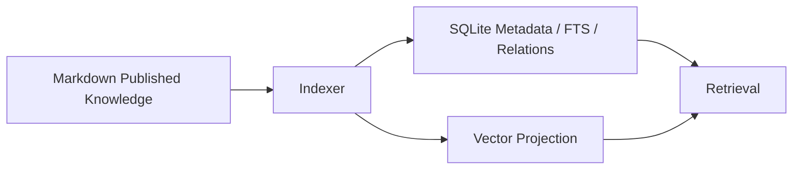

# ADR-0002：Markdown 权威知识源与 SQLite 可重建投影

**状态**：Proposed  
**日期**：2026-08-01

## 背景

纯向量知识库对人不可见；纯 Markdown 无法高效支持关系、生命周期、检索审计和召回评估；SQLite 唯一存储则依赖额外 UI 才能治理。

## 决策

已发布知识正文和元数据以 Markdown 为权威源。SQLite 保存事件账本、候选知识、知识投影、FTS5、关系、证据、向量 Chunk 元数据和检索审计。知识投影必须可以从 Markdown 完整重建；事件账本和候选数据不可丢弃重建。

## 替代方案

### SQLite 唯一权威源

事务和查询好，但人类治理、Git Diff 和脱离程序查看较差。首版拒绝。

### 纯 Markdown

可读性好，但状态过滤、关系、审计和性能不足。拒绝作为完整方案。

### 纯向量库

语义召回简单，但精确性、可解释性和版本治理不足。拒绝。

## 后果

- Markdown Front Matter 必须有严格 Schema。
- Indexer 必须通过 contentHash 和 indexVersion 保证一致性。
- 手工修改 Markdown 是合法更新入口。
- 向量不可用时系统仍可通过 FTS5 和 Scope 工作。
- 本地知识默认位于 `~/.ckl`，写入项目仓库需要显式启用 Publisher。

## 成功指标

- 删除投影数据库后可 100% 重建已发布知识。
- Markdown 更新到可检索的 P95 小于 5 秒。
- `doctor` 能检测 100% 的内容 hash 不一致。

