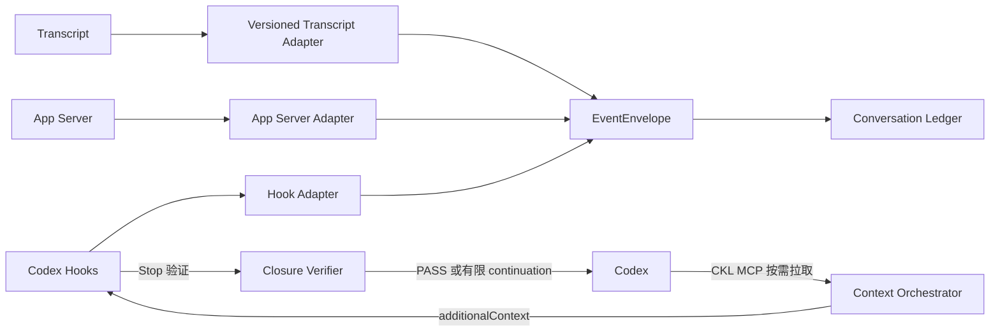

# ADR-0003：Hooks 优先、App Server 演进的 Codex 接入

**状态**：Proposed  
**日期**：2026-08-01

## 背景

CKL 必须覆盖用户现有的 Codex CLI、IDE 和 App 使用方式，同时避免绑定 CCM 或不稳定 transcript 格式。Codex 提供 Hooks 和 App Server 两类可用接入面。

## 决策

首版通过 Codex Hooks 捕获 `UserPromptSubmit`、`PostToolUse`、`Stop` 和 `SessionEnd`。其中：

- `UserPromptSubmit` 在快速检索后通过 `additionalContext` 主动注入最小充分的 `ContextEnvelope`。
- `PostToolUse` 和 `SessionEnd` 只做标准化与事件入队。
- `Stop` 执行有限闭环验证；仅在需要补充知识、纠正门禁或询问关键歧义时返回一次 continuation，默认放行。

Transcript 由独立版本化适配器增量解析。后续实现 App Server Adapter，用于结构化 thread/turn/item 事件、自有客户端和历史线程回填。Codex 运行中需要展开知识时，通过 CKL MCP 的 `ckl.search`、`ckl.get`、`ckl.related` 和 `ckl.check` 主动拉取。

所有来源统一输出 `EventEnvelope`，领域层不知道来源类型。

## 替代方案

### 通过 CCM 获取对话

可以复用现有能力，但会让 CKL 的核心数据入口依赖 CCM 版本和实现。拒绝作为事实源，可保留为包装适配器。

### 只解析 Transcript

覆盖面广，但格式不是稳定接口。仅作为 Hooks 当前配套适配器，不允许成为领域协议。

### 立即完全接管 App Server

事件最结构化，但不能自然覆盖所有用户现有客户端中的实时任务。后续用于自有入口和历史回填。

## 后果

- Hook 失败必须开放，不阻塞 Codex。
- `PostToolUse` 和 `SessionEnd` Hook 中禁止模型调用和代码扫描；`UserPromptSubmit` 只允许有超时上限的本地检索。
- `Stop` 闭环优先使用已存在的 Diff、测试和结构化证据；语义验证必须有严格超时，超时即放行。
- 自动 continuation 默认最多一次，高风险策略最多两次，并使用 `stop_hook_active` 或本地计数器防止循环。
- Transcript 变化必须通过 Fixture 和 adapterVersion 管理。
- App Server 与 Hooks 必须运行对等契约测试。
- CCM 插件只负责安装、启动和 Hook 合并。

## 成功指标

- 捕获类 Hook P95 小于 100 ms；`UserPromptSubmit` 本地检索与编排 P95 小于 300 ms。
- 相同来源事件重放不重复入库。
- Hooks 和 App Server 的等价 Fixture 产生语义一致的标准事件。
- 自动闭环循环次数为 0；绝大多数任务不需要 continuation。

## 官方接口

- [Codex Hooks](https://learn.chatgpt.com/docs/hooks)
- [Codex App Server](https://learn.chatgpt.com/docs/app-server)
