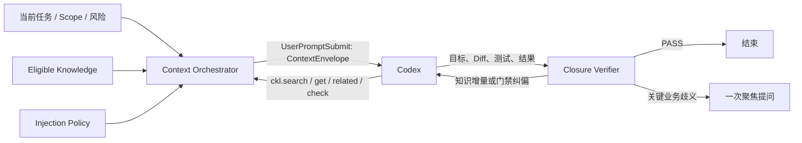

# ADR-0004：可控复杂度知识注入与有限闭环验证

**状态**：Proposed  
**日期**：2026-08-01

## 背景

CKL 既要复用历史对话形成的知识，又不能让知识注入持续膨胀上下文。底层模型能力增强后，很多任务只需要知道边界、门禁、当前已有能力和少量高相关结论，模型即可自主完成工作；但注入过少又可能导致模型遗漏已有方案、重复试错或误解任务。

仅在任务开始时做一次 RAG 无法覆盖运行中才暴露的类名、错误码、依赖关系和实现细节。仅依赖任务结束时的模型自检，也可能把同一个误解重复确认。CKL 因此需要把“知识召回与注入”和“任务契约与闭环验证”作为相互协作、但可以独立演进的能力。

## 决策

引入 `Context Orchestrator`，将当前任务、作用域、风险、模型能力、上下文预算和检索结果编排为版本化 `ContextEnvelope`。默认使用 L2 紧凑注入，允许 Codex 在运行中通过 CKL MCP 定向拉取更深知识；任务结束时由 `Closure Verifier` 对原始目标、门禁和证据做有限闭环验证。

CKL 的产品边界仍然包括知识采集、治理、召回、编排和注入。`TaskContract` 是 `ContextEnvelope` 中的可选区块，`ClosureVerifier` 是消费知识与任务证据的应用模块，两者都不替代知识层本身。

### 注入复杂度

复杂度由四个正交维度控制：

- **广度**：涉及多少知识资产、模块和关系。
- **深度**：只给指针、摘要、正文，还是具体证据。
- **权威性**：区分强制边界、已验证事实、已接受决策、建议和候选内容。
- **证据粒度**：是否携带来源、代码符号、测试结果和失效条件。

系统使用以下等级作为默认策略，而不是固定模板：

| 等级 | 内容 | 典型用途 | 自动使用规则 |
|---|---|---|---|
| L0 `NONE` | 不注入知识 | 无命中或普通闲聊 | 允许 |
| L1 `POINTER` | 能力目录、知识 ID、展开方式 | 低风险、模型已具备充分能力 | 允许 |
| L2 `COMPACT` | 边界、门禁、已有能力、相关结论摘要和指针 | 普通工程任务 | 默认 |
| L3 `EVIDENCED` | L2 加关键证据、适用条件和冲突说明 | 高风险、强约束或知识冲突 | 按策略允许 |
| L4 `EPISODE` | 原始对话片段或完整知识正文 | 诊断知识来源、处理严重歧义 | 禁止自动整包注入，只能定向拉取 |

等级决定上限，不要求填满预算。一次 `ContextEnvelope` 可以同时包含 L1 指针和少量 L3 门禁，但必须记录每一项的权威等级、来源和注入原因。

### Push 与 Pull

- **Push**：`UserPromptSubmit` 只注入开始任务所需的最小充分上下文，默认 L2，目标预算不超过 800 tokens；CKL 内部 deadline 为 500 ms，超时不注入并开放失败。
- **Pull**：Codex 运行中通过 `ckl.search`、`ckl.get`、`ckl.related`、`ckl.check` 按知识 ID、符号或问题展开。
- Pull 结果必须继续遵守当前项目、用户和全局 Scope，不能绕过状态与权限过滤。
- 重复拉取同一知识时返回引用或差量，避免正文反复进入上下文。

### 有限闭环

`ClosureVerifier` 按以下优先级判定：

1. 确定性的作用域、边界和完成门禁。
2. 代码、Diff、配置、测试及工具执行证据。
3. 独立语义验证，用于发现目标偏移或证据覆盖不足。

验证结果只有四种：

| 结果 | 行为 |
|---|---|
| `PASS` | 允许当前 Turn 结束 |
| `RETRY_WITH_CONTEXT` | 仅补充缺失知识或证据指针后继续 |
| `RETRY_WITH_CORRECTION` | 仅返回未满足门禁和纠偏要求后继续 |
| `ASK_USER` | 无法通过代码或现有交互判定时，提出一个聚焦问题 |

默认最多一次自动 continuation，高风险任务最多两次。必须读取 Codex `stop_hook_active` 或使用本地 continuation counter。Continuation 只包含相对上一版 `ContextEnvelope` 的增量，禁止重复注入全部知识，也不得生成原始任务之外的新需求。确定性验证内部 deadline 为 500 ms，可选语义验证硬超时为 3 秒，且两者都不得超过外层 Hook timeout；超时、验证器故障或 Hook 不可用时开放失败，记录 `UNKNOWN` 后正常结束。

## 替代方案

### 每次注入所有相关知识

实现简单，表面上降低遗漏概率，但会挤占任务上下文、混淆知识权威性，并让过期或低价值内容影响模型。拒绝。

### CKL 只生成 Task Contract

边界和验收条件清晰，但无法承载已有方案、实现经验、证据关系和运行中动态发现的知识需求，也会把 CKL 从知识层错误收窄为工作流校验器。拒绝。

### 只做开场 RAG，不提供运行中 Pull

Hook 实现较少，但任务开始时无法预测全部信息需求，容易导致首次注入过多或后续知识缺失。拒绝。

### 不做独立闭环，由执行模型自行检查

成本低，但同一上下文中的错误假设可能被重复确认。可保留执行模型的自检，但不能作为高风险门禁的唯一证据。拒绝作为完整方案。

## 后果

- 必须定义版本化 `ContextEnvelope`、`VerificationResult` 和注入/闭环策略 Schema。
- 检索排名与注入选择分离：高排名候选不等于一定注入。
- 知识资产必须携带权威级别、适用范围、状态、来源和展开入口。
- Codex 集成同时需要 Hook Push 与 MCP Pull，两者必须使用相同的资格过滤规则。
- 必须保存检索、编排、拉取和闭环 Trace，才能评估“少注入是否足够”。
- 自动闭环增加延迟和模型成本，因此只在确定性证据不足时使用语义验证。

## 风险与缓解

| 风险 | 缓解措施 |
|---|---|
| 注入过多导致上下文膨胀 | L2 默认、token 预算、去重、差量 continuation、禁止自动 L4 |
| 注入过少导致遗漏 | 提供知识指针和 MCP Pull；闭环发现缺口后只补充相关项 |
| 把建议误当硬门禁 | 每项显式标记 authority，渲染时分区展示 |
| 验证器复制执行模型的误解 | 优先确定性证据，语义验证使用独立提示和最小上下文 |
| Stop Hook 无限续跑 | `stop_hook_active`/计数器、硬上限、超时开放失败 |
| Scope 串用 | Push 与 Pull 共用 Eligibility Policy，并记录排除原因 |

## 成功指标

- 普通工程任务默认 `ContextEnvelope` 不超过 800 tokens。
- 自动整包注入 L4 的次数为 0。
- 100% 注入项可说明来源、权威等级和选择原因。
- 100% Pull 结果通过 Scope 与状态资格过滤。
- 自动 continuation 平均次数不高于 0.2，循环次数为 0。
- 已声明硬门禁被遗漏的比例低于 1%。
- 可通过离线评估比较 L1-L3 对任务成功率、召回覆盖率和 token 成本的影响。

## 官方接口依据

- [Codex Hooks](https://learn.chatgpt.com/docs/hooks)
- [Codex App Server](https://learn.chatgpt.com/docs/app-server)
