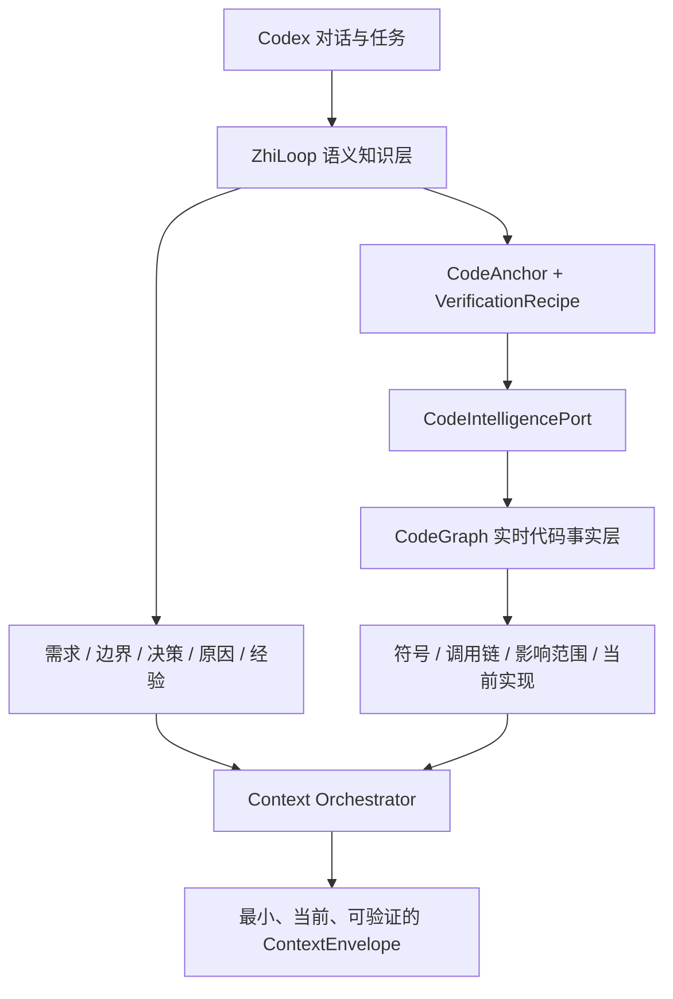
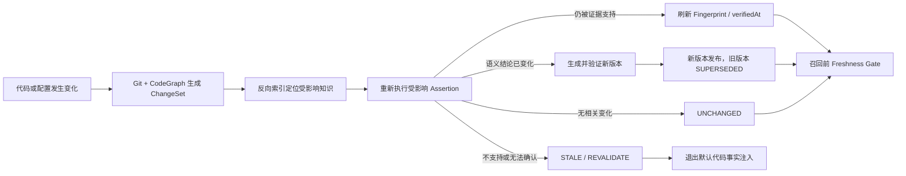

# ADR-0005：使用 CodeGraph 作为实时代码事实层

**状态**：Proposed  
**日期**：2026-08-07  
**最近更新**：2026-08-07  
**关联设计**：[CodeGraph 集成与知识保鲜技术设计](../design/codegraph-integration-and-knowledge-freshness-tdd.md)

## 背景

ZhiLoop 需要在后续任务中复用对话产生的需求、边界、决策、方案原因和实现经验，也需要判断这些结论是否仍符合当前代码。成熟的 CodeGraph 能从当前源码结构化回答符号定义、调用关系、影响范围和调用路径；这些事实比复制到 Markdown 或向量索引中的代码描述更及时、更准确。

如果 ZhiLoop 自己长期保存“方法 A 调用方法 B”之类可从代码确定性重建的事实，就会与 CodeGraph 重复建设，并产生两份事实漂移的问题。另一方面，CodeGraph 无法单独回答用户为什么确认某个方案、哪些业务边界不能破坏、某个实现是临时兼容还是长期决策，也不负责知识版本、作用域、注入策略和任务闭环。

## 决策

CodeGraph 作为 ZhiLoop 的**实时代码事实层**；ZhiLoop 收敛为**语义记忆、知识治理、上下文编排与闭环验证层**。两者通过 `CodeIntelligencePort` 解耦，ZhiLoop 不依赖 CodeGraph 的进程、数据库或私有 Schema。

这不是“CodeGraph 或 ZhiLoop”的二选一。CodeGraph 负责提供当前代码证据，ZhiLoop 仍然保留知识采集、分层存储、召回、渐进式注入和闭环验证能力。不可违反的边界是：

> 能从当前代码确定性重建的内容，以 CodeGraph 查询结果为准；不能从代码直接恢复的意图、边界、原因和历史，由 ZhiLoop 保存并治理。



具体边界如下：

- 可从当前代码低成本、确定性重建的结构事实不发布为长期知识正文。
- ZhiLoop 只保存语义结论、来源、作用域、权威等级、`CodeAnchor` 和 `VerificationRecipe`。
- 调用链、符号定义和影响范围的权威仍是当前 CodeGraph；ZhiLoop 可保存有界、规范化、带 Git/graph revision 的 `CodeGraphArtifact` 供同版本复用和审计，但不复制完整原始图，也不允许旧 artifact 覆盖实时结果。
- 代码变化由 CodeGraph/Git Adapter 形成结构化 `KnowledgeChangeSet`，现有失效引擎继续负责 `UNCHANGED`、`REFRESH_FINGERPRINT`、`REVALIDATE` 和 `MARK_STALE` 决策。
- 知识准备注入 Codex 前执行一次有界的新鲜度门禁；无法确认的代码相关知识不得作为当前事实注入。
- CodeGraph 不可用时，ZhiLoop 降级到 Git/path/config/dependency Verifier；无法复验的知识保持可见但退出默认注入。

## 知识分类规则

| 内容 | 权威来源 | ZhiLoop 行为 |
|---|---|---|
| 符号位置、签名、调用链、影响范围 | CodeGraph + 当前代码 | 不复制为长期正文，保存查询锚点 |
| 需求、业务边界、用户承诺 | 对话与明确表态 | 保存并版本化 |
| 方案选择、替代方案、决策原因 | 对话、ADR、任务证据 | 保存并关联代码锚点 |
| 当前实现是否符合历史决策 | ZhiLoop + CodeGraph + 测试 | 动态验证，不仅依赖历史正文 |
| 运行时行为 | 测试、日志和受控工具证据 | CodeGraph 只作结构证据，不单独判定 |

## 来源优先级与组合规则

不同来源不争夺同一个权威位置，而是回答不同问题：

| 问题 | 优先来源 | 冲突时的处理 |
|---|---|---|
| 当前符号、签名和静态关系是什么 | 当前代码 + CodeGraph | 历史快照不得覆盖当前查询结果 |
| 当前运行行为是否成立 | 测试、配置、受控命令和运行证据 | CodeGraph 只能提供结构支持，不能单独推翻运行证据 |
| 应该满足什么业务边界 | 用户明确承诺、需求和已接受决策 | 代码与边界不一致时标记实现偏离，不能用“代码就是这样”改写需求 |
| 为什么采用当前方案 | ZhiLoop 中的决策、替代方案和来源会话 | CodeGraph 用于验证实现是否仍匹配，不生成历史原因 |
| 哪些内容进入 Codex 上下文 | ZhiLoop Context Orchestrator | 同时展示语义知识、实时代码事实和一致性判断 |

一次注入中的内容必须标记来源类型：

- `KNOWLEDGE`：需求、边界、决策、原因和经验，携带知识 ID、版本和来源。
- `LIVE_CODE_FACT`：CodeGraph 在当前 code/graph revision 上得到的代码事实，携带查询类型和观察时间。
- `CONSISTENCY_RESULT`：ZhiLoop 根据 Verification Recipe 判断二者一致、冲突或无法确认的结果。

禁止把三类内容拼成一段没有来源的“综合事实”。

## 知识更新与保鲜策略

知识更新采用**变化驱动复验 + 召回前强校验 + 周期兜底扫描**。代码发生变化并不等于知识正文必须重写；多数无语义变化场景只刷新指纹。

### 更新触发

1. **变化驱动**：Codex 修改文件、Git commit/merge/pull/checkout、文件 watcher 去抖事件触发 `KnowledgeChangeSet`。
2. **召回前校验**：代码相关知识准备进入 `ContextEnvelope` 前，使用同一 CodeGraph revision 批量复验最终候选。
3. **周期兜底**：低频扫描补偿 watcher 丢失、外部脚本修改和长时间未被召回的知识。

变化驱动负责快速更新，召回前校验负责正确性兜底。周期扫描不能替代前两者。

### 精确定位

每条代码相关知识保存 `CodeAnchor` 与 `VerificationRecipe`，SQLite 维护以下反向索引：

```text
repository / path / symbol / config / dependency / query recipe
                              ↓
                    knowledgeId@version
```

Git Diff 提供 changed paths、配置和依赖变化；CodeGraph 将变化解析到 changed symbols、调用关系和影响范围。系统只复验反向索引命中的知识，不扫描全部 Markdown，也不重新提取全部历史会话。

### 更新流程



### 更新决策矩阵

| 场景 | 是否调用模型 | 知识处理 | 默认召回/注入 |
|---|---:|---|---|
| 变化未命中任何 Anchor | 否 | `UNCHANGED` | 保持不变 |
| 文件变化但目标符号/断言仍成立 | 否 | `REFRESH_FINGERPRINT`，更新 code/graph revision 和 `lastVerifiedAt` | 允许 |
| 重命名后可确定性重绑定 Anchor，语义不变 | 否 | Anchor 身份变化则创建新版本；仅 digest 变化则只刷新指纹，均保留重命名证据 | 允许 |
| 实现变化导致语义正文需要调整 | 是，仅生成受影响知识草稿 | 发布新版本，旧版本 `SUPERSEDED` | 仅新版本允许 |
| Assertion 被明确否定 | 否；修复草稿可按需调用 | `IMPLEMENTED/VERIFIED → STALE`，保留正文和证据 | 排除 |
| `PROPOSED/ACCEPTED` 无法完成复验 | 否 | 保持生命周期状态并进入 `REVALIDATE` 运维阶段 | 不作为当前代码事实 |
| CodeGraph 超时、未初始化或证据冲突 | 否 | `UNKNOWN`，记录失败原因；高价值知识进入有界重试 | 历史决策可带警告展示，代码事实排除 |
| 高影响语义冲突且确定性证据不足 | 可调用一次独立语义验证 | 生成影响预览；仍不能判断时请求一次聚焦确认 | 确认前排除冲突事实 |

模型只处理“语义是否需要改写”，不得参与无语义变化的指纹刷新，也不得自行决定把不确定结果提升为 `VERIFIED`。

### 版本和历史

- 知识正文不可原地覆盖。内容、Scope、Authority、Anchor 或 Verification Recipe 的语义变化必须创建新版本。
- 旧版本通过 `SUPERSEDES`、`CONTRADICTS` 或 `DERIVED_FROM` 保留关系；不得因代码变化物理删除。
- CodeGraph 查询结果只保存有界 `CodeGraphArtifact`、知识绑定和 revision，不写入 Markdown 正文，不无限保留完整调用图；项目、代码或图 revision 不兼容时立即转为 `SUSPECT` 并重新查询。
- 需求原因仍成立而实现已变化时，只替代实现相关版本；原始需求、决策原因和来源会话继续有效。
- 全局知识不会因单一项目代码变化自动失效，除非该全局知识明确绑定了该项目的 CodeAnchor。

### 分支与并发边界

- 新鲜度身份至少包含 `projectId + repositoryId + worktree + branch + codeRevision`。
- 特性分支变化只更新该分支视图；合并到目标分支后重新验证，不能直接复用源分支结论。
- 同一知识同时被人工修改和后台刷新时使用 `expectedVersion`；后台任务发现 revision 冲突后重新读取，不覆盖用户新版本。
- 一批候选的召回前校验必须绑定同一 CodeGraph revision，避免同一次注入混入两个代码状态。

### 召回前强校验

只有最终准备注入的代码相关候选执行强校验，避免对所有召回候选重复查询 CodeGraph：

1. Retrieval Engine 先召回 ZhiLoop 语义知识。
2. Freshness Gate 批量解析最终候选的 CodeAnchor。
3. CodeGraph 在当前 revision 返回实时事实。
4. Verification Recipe 生成 `CONSISTENT / CONFLICT / UNKNOWN`。
5. 仅 `CONSISTENT` 的代码相关结论进入默认注入。
6. `CONFLICT` 触发失效/修复任务；`UNKNOWN` 排除当前代码事实，但可以保留明确标记为历史背景的语义决策。

该门禁保证：即使后台 watcher 或 ChangeSet Worker 漏掉变化，已知旧代码事实也不会被当成当前事实注入。

### 非代码知识的保鲜

CodeGraph 只能验证代码相关事实，其他知识按来源使用不同更新策略：

| 知识类型 | 保鲜信号 | 更新规则 |
|---|---|---|
| 用户需求、承诺和业务边界 | 用户后续明确表态、需求文档版本 | 不因时间自动过期；新表态创建新版本并 `SUPERSEDES/CONTRADICTS` 旧版本 |
| 技术决策及原因 | 新 ADR、用户确认、实现与门禁证据 | 原因作为历史保留；实现不再匹配时标记偏离，不反向改写原决策 |
| 配置、依赖和环境事实 | 配置/manifest digest、部署 revision | 变化驱动重新验证；无法读取当前来源时不得继续标为当前事实 |
| 外部时效信息 | 来源 Adapter、`expiresAt`、重新抓取时间 | 到期后退出默认事实注入，重新获取并生成新版本；CodeGraph 不参与确认 |
| 实践经验 | 代码 Anchor、后续任务反馈、失败/成功证据 | 代码前提消失时降低适用性或标记过期；仍有跨版本价值的原因和教训保留 |
| 全局规则 | 用户明确表态或多个项目独立证据 | 单项目变化不能直接改写全局规则；达到跨项目门槛后才更新或降级 |

因此，“知识保鲜”不是给所有知识设置统一 TTL，而是依据其权威来源选择变化信号和验证器。

## 当前实施边界

截至 2026-08-19，CodeGraph Adapter、CodeAnchor 反向索引、Git ChangeSet、去抖/兜底调度、ChangeSet Worker、召回前 Freshness Gate、上下文预热和控制台保鲜视图均已接入 Sidecar 生产组合。UserPrompt 建立项目 baseline，Stop Hook 在后台触发变化扫描；Worker 成功后才推进 durable baseline，崩溃重放保持幂等。

当前 CodeGraph 生产复验优先覆盖 `SYMBOL_EXISTS`，路径、配置和依赖变化通过 Anchor path 反向索引定位；更丰富的结构化 Assertion Probe 仍应按 Golden 数据集指标逐类扩展。CodeGraph 未初始化或不可用时不会自动执行 `init`，相关知识转为 `UNKNOWN/REVALIDATE` 并退出代码事实注入，但 Codex 主流程保持开放。

## 替代方案

### 方案 A：ZhiLoop 自建完整代码图谱

可以完全控制数据模型，但会重复成熟能力，维护语言解析、增量索引和调用关系的成本高，也更容易产生错误。拒绝。

### 方案 B：把 CodeGraph 查询结果完整写入知识正文

首次召回简单，但代码变化后快照迅速过期，并造成“代码事实”和“知识副本”双重权威。拒绝；仅允许有界、可失效、带 revision 的 `CodeGraphArtifact` 投影。

### 方案 C：只使用 CodeGraph，不保留 ZhiLoop

适合纯代码导航，但无法保存对话承诺、业务边界、决策原因、跨会话历史、知识治理和注入/闭环策略。拒绝作为完整方案；纯代码问题可以直接走 CodeGraph 快速路径。

### 方案 D：CodeGraph 事实层 + ZhiLoop 语义层

代码事实实时重建，语义知识长期治理，通过锚点和验证规则连接。采用。

## 后果

- `IMPLEMENTATION` 知识不再默认等同于代码结构快照；只有无法从代码直接重建的实现语义、约束和经验才进入正文。
- Retrieval Engine 需要区分 `KNOWLEDGE` 与 `LIVE_CODE_FACT` 两类来源，分别记录排名、版本和验证状态。
- CodeGraph Adapter 只实现端口；未来可以替换为 LSP、SCIP 或其他代码图谱实现。
- 旧知识不会被批量覆盖，需要通过迁移任务补充锚点、重新验证并按风险决定保留、更新或标记过期。
- 多分支和多 worktree 必须按项目身份、仓库、分支和代码基线隔离，不能用一个分支的变化使其他分支知识失效。

## 风险与缓解

| 风险 | 严重度 | 缓解措施 |
|---|---:|---|
| CodeGraph 不可用导致注入延迟或失败 | 高 | 有界超时、断路器、确定性 Verifier 降级；无法复验时不把历史代码事实当成当前事实 |
| 符号重命名导致锚点失配 | 中 | path + signature + relation query 组合锚点；使用 Git rename 和候选重绑定 |
| 静态图无法代表运行时行为 | 高 | CodeGraph 只作为结构证据，动态结论必须结合测试、配置或运行证据 |
| 每次召回都查询图谱增加延迟 | 中 | 批量查询、短期 revision cache、只验证最终候选，不缓存为长期知识 |
| 旧实现知识包含大量可重建代码事实 | 中 | 非破坏迁移，先进入 `REVALIDATE` 运维阶段，生成差异后再发布新版本 |
| CodeGraph 供应商或 Schema 变化 | 中 | `CodeIntelligencePort`、契约 Fixture、版本能力协商 |
| 大规模重构触发知识修复任务风暴 | 中 | ChangeSet 去抖合并、按模块分片、队列上限；优先处理即将注入的候选 |
| 多分支或多 worktree 相互误失效 | 高 | project/repository/worktree/branch/revision 组合身份，合并后重新验证 |
| 模型被用于所有更新导致成本和结果不可控 | 高 | 无语义变化禁止调用模型；模型只生成受影响知识草稿，Evidence Policy 决定生效 |

## 成功指标

| 指标 | 目标 | 测量方式 |
|---|---:|---|
| 最终注入的代码相关知识新鲜度校验覆盖率 | 100% | Injection Trace 检查 |
| 已知过期代码事实作为当前事实注入次数 | 0 | Golden change cases + 审计 |
| CodeGraph 结构事实复制为长期知识正文的新增比例 | 0% | Candidate 分类审计 |
| 相关代码变化定位到受影响知识的 Recall | >= 95% | ChangeSet Golden Dataset |
| 不相关代码变化造成知识失效的比例 | < 1% | 负样本 Fixture |
| CodeGraph 可用时新鲜度门禁 P95 | < 200 ms | Retrieval/Injection 指标 |
| CodeGraph 故障导致 Codex 主流程阻塞次数 | 0 | 故障注入测试 |
| 无语义变化场景调用模型的比例 | < 5% | Freshness Worker 审计 |
| 更新后旧版本和来源可追溯率 | 100% | Registry/Relation 一致性检查 |
| 同一注入混用不同 CodeGraph revision 的次数 | 0 | Retrieval Trace 约束检查 |
