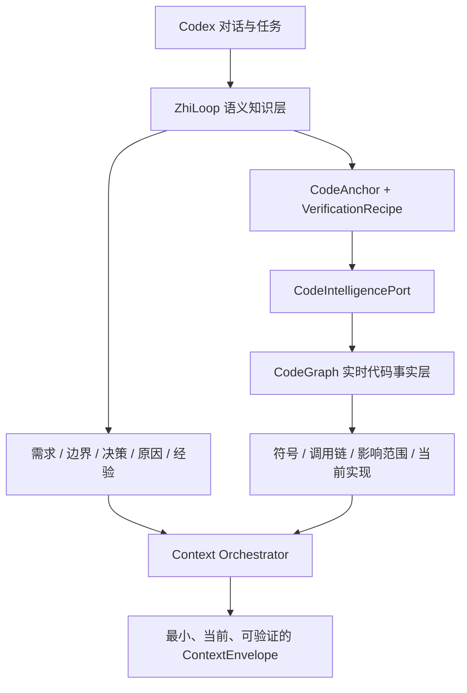

# ADR-0005：使用 CodeGraph 作为实时代码事实层

**状态**：Proposed  
**日期**：2026-08-07  
**关联设计**：[CodeGraph 集成与知识保鲜技术设计](../design/codegraph-integration-and-knowledge-freshness-tdd.md)

## 背景

ZhiLoop 需要在后续任务中复用对话产生的需求、边界、决策、方案原因和实现经验，也需要判断这些结论是否仍符合当前代码。成熟的 CodeGraph 能从当前源码结构化回答符号定义、调用关系、影响范围和调用路径；这些事实比复制到 Markdown 或向量索引中的代码描述更及时、更准确。

如果 ZhiLoop 自己长期保存“方法 A 调用方法 B”之类可从代码确定性重建的事实，就会与 CodeGraph 重复建设，并产生两份事实漂移的问题。另一方面，CodeGraph 无法单独回答用户为什么确认某个方案、哪些业务边界不能破坏、某个实现是临时兼容还是长期决策，也不负责知识版本、作用域、注入策略和任务闭环。

## 决策

CodeGraph 作为 ZhiLoop 的**实时代码事实层**；ZhiLoop 收敛为**语义记忆、知识治理、上下文编排与闭环验证层**。两者通过 `CodeIntelligencePort` 解耦，ZhiLoop 不依赖 CodeGraph 的进程、数据库或私有 Schema。

具体边界如下：

- 可从当前代码低成本、确定性重建的结构事实不发布为长期知识正文。
- ZhiLoop 只保存语义结论、来源、作用域、权威等级、`CodeAnchor` 和 `VerificationRecipe`。
- 调用链、符号定义和影响范围在召回或验证时通过 CodeGraph 实时获得；快照只用于审计和短期诊断，不作为权威知识。
- 代码变化由 CodeGraph/Git Adapter 形成结构化 `KnowledgeChangeSet`，现有失效引擎继续负责 `UNCHANGED`、`REFRESH_FINGERPRINT`、`REVALIDATE` 和 `MARK_STALE` 决策。
- 知识准备注入 Codex 前执行一次有界的新鲜度门禁；无法确认的代码相关知识不得作为当前事实注入。
- CodeGraph 不可用时，ZhiLoop 降级到 Git/path/config/dependency Verifier；无法复验的知识保持可见但退出默认注入。

## 知识分类规则

| 内容 | 权威来源 | ZhiLoop 行为 |
|---|---|---|
| 符号位置、签名、调用链、影响范围 | CodeGraph + 当前代码 | 不复制为长期正文，保存查询锚点 |
| 需求、业务边界、用户承诺 | 对话与明确表态 | 保存并版本化 |
| 方案选择、替代方案、决策原因 | 对话、ADR、任务证据 | 保存并关联代码锚点 |
| 当前实现是否符合历史决策 | ZhiLoop + CodeGraph + 测试 | 动态验证，不仅依赖历史正文 |
| 运行时行为 | 测试、日志和受控工具证据 | CodeGraph 只作结构证据，不单独判定 |

## 替代方案

### 方案 A：ZhiLoop 自建完整代码图谱

可以完全控制数据模型，但会重复成熟能力，维护语言解析、增量索引和调用关系的成本高，也更容易产生错误。拒绝。

### 方案 B：把 CodeGraph 查询结果完整写入知识库

首次召回简单，但代码变化后快照迅速过期，并造成“代码事实”和“知识副本”双重权威。拒绝；仅允许有保留期限的审计快照。

### 方案 C：只使用 CodeGraph，不保留 ZhiLoop

适合纯代码导航，但无法保存对话承诺、业务边界、决策原因、跨会话历史、知识治理和注入/闭环策略。拒绝作为完整方案；纯代码问题可以直接走 CodeGraph 快速路径。

### 方案 D：CodeGraph 事实层 + ZhiLoop 语义层

代码事实实时重建，语义知识长期治理，通过锚点和验证规则连接。采用。

## 后果

- `IMPLEMENTATION` 知识不再默认等同于代码结构快照；只有无法从代码直接重建的实现语义、约束和经验才进入正文。
- Retrieval Engine 需要区分 `KNOWLEDGE` 与 `LIVE_CODE_FACT` 两类来源，分别记录排名、版本和验证状态。
- CodeGraph Adapter 只实现端口；未来可以替换为 LSP、SCIP 或其他代码图谱实现。
- 旧知识不会被批量覆盖，需要通过迁移任务补充锚点、重新验证并按风险决定保留、更新或标记过期。
- 多分支和多 worktree 必须按项目身份、仓库、分支和代码基线隔离，不能用一个分支的变化使其他分支知识失效。

## 风险与缓解

| 风险 | 严重度 | 缓解措施 |
|---|---:|---|
| CodeGraph 不可用导致注入延迟或失败 | 高 | 有界超时、断路器、确定性 Verifier 降级；无法复验时不把历史代码事实当成当前事实 |
| 符号重命名导致锚点失配 | 中 | path + signature + relation query 组合锚点；使用 Git rename 和候选重绑定 |
| 静态图无法代表运行时行为 | 高 | CodeGraph 只作为结构证据，动态结论必须结合测试、配置或运行证据 |
| 每次召回都查询图谱增加延迟 | 中 | 批量查询、短期 revision cache、只验证最终候选，不缓存为长期知识 |
| 旧实现知识包含大量可重建代码事实 | 中 | 非破坏迁移，先标 `REVALIDATE_REQUIRED`，生成差异后再发布新版本 |
| CodeGraph 供应商或 Schema 变化 | 中 | `CodeIntelligencePort`、契约 Fixture、版本能力协商 |

## 成功指标

| 指标 | 目标 | 测量方式 |
|---|---:|---|
| 最终注入的代码相关知识新鲜度校验覆盖率 | 100% | Injection Trace 检查 |
| 已知过期代码事实作为当前事实注入次数 | 0 | Golden change cases + 审计 |
| CodeGraph 结构事实复制为长期知识正文的新增比例 | 0% | Candidate 分类审计 |
| 相关代码变化定位到受影响知识的 Recall | >= 95% | ChangeSet Golden Dataset |
| 不相关代码变化造成知识失效的比例 | < 1% | 负样本 Fixture |
| CodeGraph 可用时新鲜度门禁 P95 | < 200 ms | Retrieval/Injection 指标 |
| CodeGraph 故障导致 Codex 主流程阻塞次数 | 0 | 故障注入测试 |

