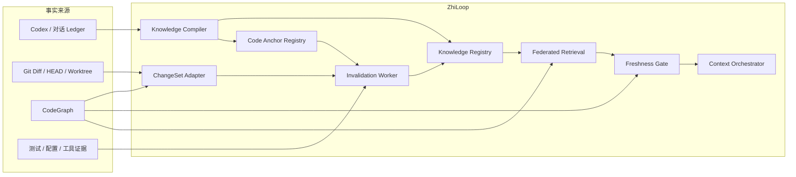
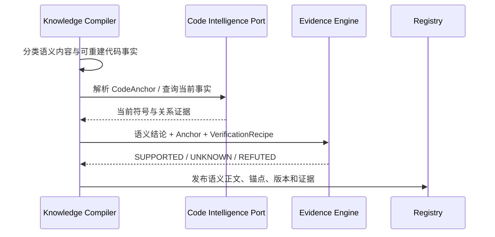
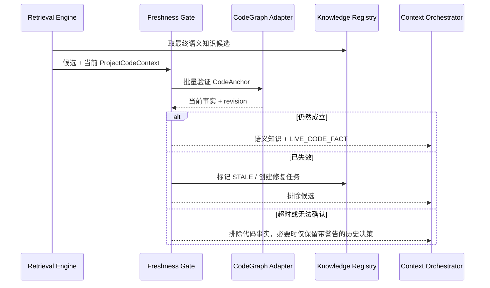

# CodeGraph 集成与知识保鲜技术设计

**状态**：Proposed  
**版本**：0.1  
**创建日期**：2026-08-07  
**目标读者**：ZhiLoop 实现者、维护者和技术评审者  
**关联决策**：[ADR-0005：使用 CodeGraph 作为实时代码事实层](../adr/0005-codegraph-as-live-code-fact-layer.md)

## 1. 问题

当前 ZhiLoop 已具备代码指纹与失效决策、知识版本、`STALE/SUPERSEDED` 生命周期和默认召回过滤，但尚未把代码变化发现、CodeGraph 结构查询、反向依赖索引、自动复验和召回前新鲜度门禁接成生产链路。

长期复制符号、调用链和影响范围会与当前代码产生漂移；完全依赖 CodeGraph 又会丢失需求、边界、决策原因和跨会话历史。设计需要同时保证：代码事实来自当前代码，语义知识可长期治理，两者在注入前重新对齐。

## 2. 目标与非目标

### 2.1 目标

1. 使用 CodeGraph 提供符号、调用链、影响范围和结构化变化事实。
2. 只为知识保存稳定的语义结论、代码锚点和验证配方，不复制可重建代码事实。
3. 代码变化后只定位和复验受影响知识，不扫描或重提取全部知识库。
4. 在召回前提供强制新鲜度门禁，避免后台遗漏导致旧事实注入。
5. 保留旧版本、证据和替代关系，支持查看代码变化前后的知识差异。
6. CodeGraph 故障时不阻塞 Codex，并且不把无法复验的历史代码事实冒充当前事实。

### 2.2 非目标

- 不在 ZhiLoop 内重新实现语言解析器或完整代码图谱。
- 不把 CodeGraph 静态分析结果当成运行时行为的唯一证据。
- 不因任意文件保存立即调用模型；先使用确定性复验和批量去抖。
- 不自动覆盖旧知识正文或删除历史版本。
- 不将特性分支的局部变化直接提升为项目主线或全局事实。

## 3. 事实边界

| 类型 | 示例 | 保存策略 |
|---|---|---|
| 可重建代码事实 | 方法位置、签名、调用者、调用路径 | CodeGraph 实时查询；仅保存锚点与短期审计快照 |
| 语义知识 | 业务边界、方案原因、兼容策略 | ZhiLoop 正文、版本和来源关系 |
| 组合结论 | “当前实现仍满足 fail-close 决策” | 保存决策；每次根据 CodeGraph + 测试重新验证 |
| 运行时事实 | 测试结果、命令输出、线上行为 | 使用受控 Evidence Adapter，不由 CodeGraph 单独确认 |

判定规则：**能够从当前代码低成本、确定性重建的内容，不得成为新的长期知识正文。**

## 4. 架构



### 4.1 端口边界

```typescript
interface CodeIntelligencePort {
  capabilities(): Promise<CodeIntelligenceCapabilities>;
  resolveAnchors(input: ResolveCodeAnchorRequest): Promise<ResolvedCodeAnchor[]>;
  queryFacts(input: CodeFactQuery): Promise<CodeFactResult>;
  impact(input: CodeImpactQuery): Promise<CodeImpactResult>;
  changes(input: CodeBaselineRange): Promise<KnowledgeChangeSet>;
  revision(input: ProjectCodeContext): Promise<CodeRevision>;
}
```

领域层只消费规范化结果，不读取 CodeGraph 数据库，也不依赖其节点 ID 的稳定性。Adapter 必须记录能力、版本、项目身份、代码基线、查询类型、耗时和结果摘要。

## 5. 数据模型

### 5.1 CodeAnchor

```typescript
interface CodeAnchor {
  anchorId: string;
  knowledgeId: string;
  knowledgeVersion: number;
  projectId: string;
  repositoryId: string;
  path?: string;
  symbol?: string;
  signatureHint?: string;
  queryKind: "DEFINITION" | "CALLERS" | "CALLEES" | "TRACE" | "IMPACT";
  verificationRecipeId: string;
}
```

锚点使用 `repositoryId + path + symbol + signatureHint + queryKind` 组合定位。CodeGraph 节点标识可以作为缓存提示，但不能成为跨版本唯一身份。

### 5.2 VerificationRecipe

验证配方描述“怎样确认语义结论仍被代码支持”，而不是保存上次查询答案。首版支持：

- 符号存在、路径包含、配置相等、依赖存在；
- 从符号 A 到 B 的调用路径存在或不存在；
- 指定符号的影响集合包含关键边界；
- CodeGraph 结构证据与测试/配置 Evidence 的组合门禁。

### 5.3 新鲜度记录

每次验证记录 `codeRevision`、`graphRevision`、`observedAt`、受影响 Assertion、结果、reason codes 和短期结果摘要。它属于审计数据，不进入知识正文；完整调用图不得无限保留。

## 6. 核心流程

### 6.1 知识发布



如果 Candidate 只描述可重建代码结构，Compiler 应输出 `CODE_FACT_POINTER` 或直接跳过长期发布；如果包含“为什么、边界、异常、取舍”，则保存语义部分并关联锚点。

### 6.2 变化驱动的保鲜

1. Git commit/merge/pull/checkout、Codex 文件修改和去抖文件事件产生代码基线变化。
2. Adapter 使用 Git Diff 与 CodeGraph 生成 path、symbol、config、dependency 级 `KnowledgeChangeSet`。
3. 反向索引只返回命中 Anchor 的知识版本。
4. 确定性 Verifier 重新执行受影响 Assertion。
5. 全部仍成立：`REFRESH_FINGERPRINT`，不调用模型、不改正文。
6. 结论明确失效：`MARK_STALE` 并退出默认召回。
7. 语义可能变化：创建有界修复任务，用旧结论、Diff、当前代码证据生成新版本草稿。
8. 低风险且证据完备时自动发布新版本；高影响冲突才请求一次聚焦确认。

### 6.3 召回前新鲜度门禁

后台检测是快速路径，召回前门禁是正确性兜底：



只有最终准备进入 `ContextEnvelope` 的代码相关候选需要强校验。门禁必须批量执行、设置硬超时，并共享同一 CodeGraph revision，避免候选之间读取到不同代码状态。

## 7. 多分支与作用域

- 新鲜度至少按 `projectId + repositoryId + worktree + branch + codeRevision` 隔离。
- 特性分支上的修复只更新该分支视图；合并后由目标分支重新验证并形成正式版本。
- 项目知识的代码变化不得自动使全局知识过期；全局语义规则只有在其明确依赖该项目 Anchor 时进入复验。
- checkout 或 rebase 造成 revision 回退时执行重新同步，不把时间更新误判为知识更新。

## 8. 故障与降级

| 场景 | 行为 |
|---|---|
| CodeGraph 未初始化 | 能安全初始化时提示；后台不擅自修改业务仓库，使用 Git/path Verifier 降级 |
| CodeGraph 查询超时 | 打开断路器；不注入无法确认的代码事实；Codex 主流程继续 |
| Anchor 无法解析 | 尝试 Git rename/signatureHint 重绑定；失败则 `REVALIDATE` 或 `STALE` |
| CodeGraph 与编译/测试证据冲突 | 保留冲突，优先确定性运行证据，禁止自动发布强结论 |
| ChangeSet 过大 | 按模块分片、限流；召回前门禁仍生效 |
| 知识版本并发更新 | 使用 expectedVersion 和幂等 operation，冲突后重新读取当前版本 |

## 9. 迁移现有知识

迁移必须非破坏、可暂停、可回滚：

1. 盘点 `IMPLEMENTATION/DESIGN/DECISION` 资产中的 symbol、path 和 Assertion。
2. 分类为“纯代码事实”“语义知识”“混合知识”。
3. 为语义和混合知识生成 Anchor 与 VerificationRecipe；纯代码事实转换为指针候选。
4. 使用当前 CodeGraph 批量复验，产出影响预览。
5. 自动刷新仍成立的指纹；需要改写的生成新版本；不确定的标记待复验。
6. 旧正文和 Evidence 始终保留，不做物理删除。

## 10. 实施拆分

| 任务 | 交付物 | 可并行关系 |
|---|---|---|
| CKL-801 | `CodeIntelligencePort`、CodeGraph Adapter、契约 Fixture | 与 CKL-802 接口冻结后并行 |
| CKL-802 | CodeAnchor、VerificationRecipe、SQLite 反向索引与迁移预览 | 与 CKL-801 并行 |
| CKL-803 | Git/CodeGraph ChangeSet Adapter、去抖 Worker、失效持久化 | 依赖 801/802 |
| CKL-804 | 联邦召回、实时代码事实来源、召回前 Freshness Gate | 依赖 801/802 |
| CKL-805 | 控制台新鲜度、影响范围、失败原因、版本 Diff 与修复任务 | 依赖 803/804 API |
| CKL-806 | Golden Dataset、性能、故障降级和真实仓库验收 | 依赖 803-805 |

## 11. 替代方案

### 自建代码图谱

控制能力强，但与成熟工具重复，语言覆盖、增量解析和关系正确性成本过高。拒绝。

### 定期让模型重读全部代码和知识

实现表面简单，但成本不可控、结果不确定，也无法保证召回前的新鲜度。拒绝。

### 只在 Git commit 后刷新

开销小，但未提交 worktree、外部脚本修改和 watcher 遗漏会产生窗口期。仅作为触发源之一，不作为唯一门禁。

### 变化驱动刷新 + 召回前强校验

后台快速更新，大多数命中只刷新指纹；召回前再次兜底。采用。

## 12. 风险与缓解

| 风险 | 严重度 | 可能性 | 缓解措施 |
|---|---:|---:|---|
| 结构事实与业务语义被错误分类 | 高 | 中 | Candidate 分类 Fixture、审计抽样、混合知识默认保留语义正文 |
| CodeGraph 静态关系存在盲区 | 高 | 中 | 允许 UNKNOWN；结合测试、配置和运行证据，不自动提升强结论 |
| 反向索引漏掉受影响知识 | 高 | 中 | 多锚点、impact 扩展、Golden ChangeSet、召回前硬校验 |
| 查询延迟放大注入 Hook | 高 | 中 | 批量查询、revision cache、200 ms P95 目标、超时开放主流程 |
| 大规模重构产生修复任务风暴 | 中 | 中 | 去抖、合并、模块分片、队列上限和优先处理可注入候选 |
| 分支串扰造成误失效 | 高 | 低 | repository/worktree/branch/revision 四层身份约束 |

## 13. 成功指标

| 指标 | 当前 | 目标 | 测量方式 |
|---|---:|---:|---|
| CodeGraph 生产适配器 | 未接通 | 已接通且可降级 | Capability/doctor Gate |
| 注入候选新鲜度校验覆盖率 | 0% | 100% | Injection Trace |
| 已知过期代码事实误注入 | 未建立指标 | 0 | Golden change cases |
| 相关变化定位 Recall | 未建立指标 | >= 95% | ChangeSet Golden Dataset |
| 不相关变化误失效率 | 已有引擎 Fixture | < 1% | 负样本回放 |
| 无语义变化时模型调用比例 | 未建立指标 | < 5% | Freshness Worker 审计 |
| Freshness Gate P95 | 未建立指标 | < 200 ms | Hook/检索计时 |
| CodeGraph 故障导致 Codex 阻塞 | 0 | 0 | 故障注入 |

## 14. 当前实施状态

截至 2026-08-07，`invalidation-engine`、知识生命周期、版本治理和召回资格过滤已经实现；CodeGraph Adapter、反向 Anchor 索引、变化 Worker、召回前门禁和控制台保鲜视图均为 **Proposed / 未实施**。任何文档和界面不得将 P8 描述为当前已具备能力。

