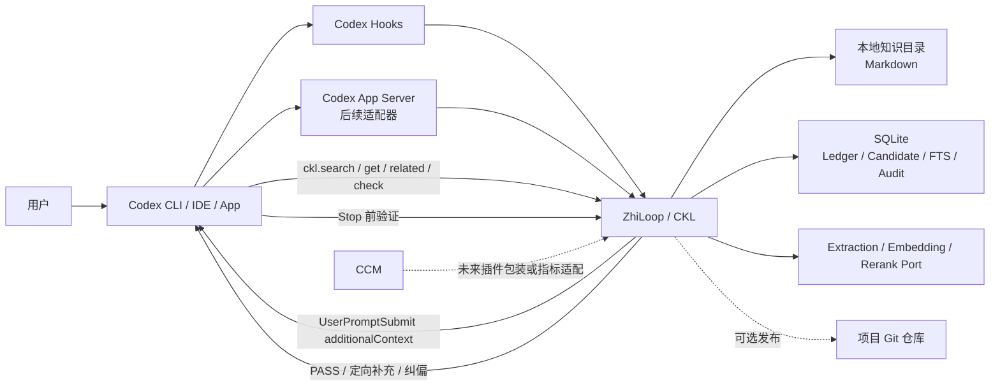
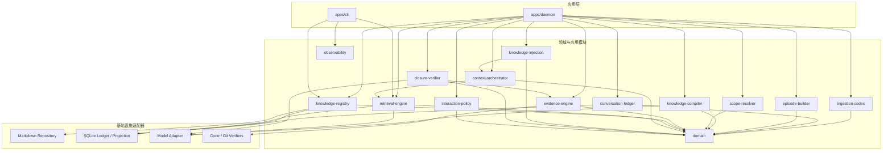
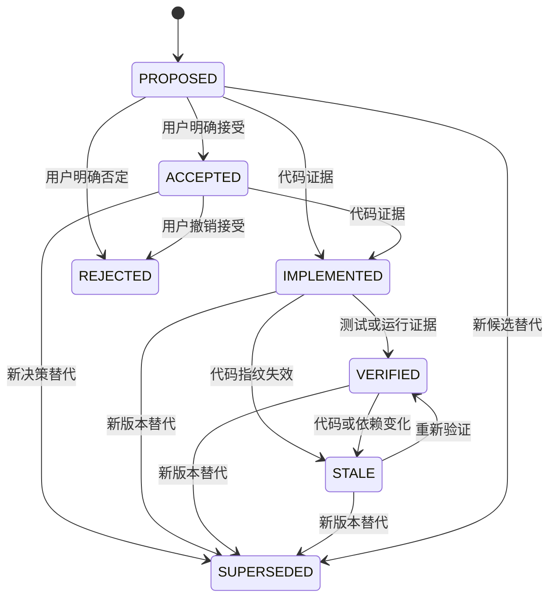
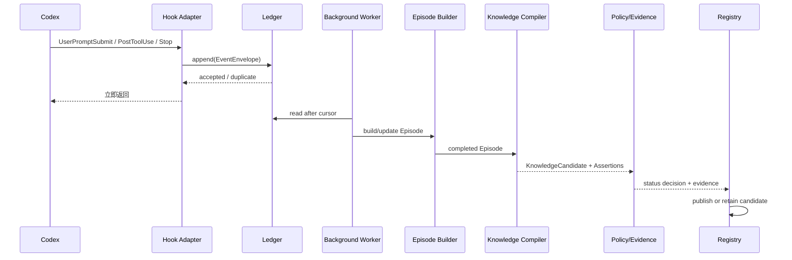
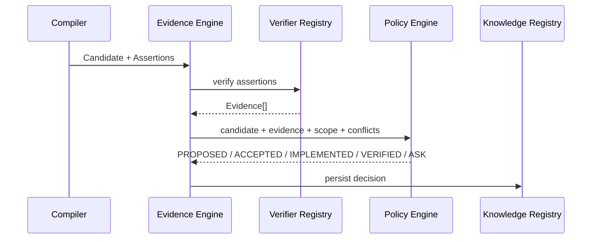
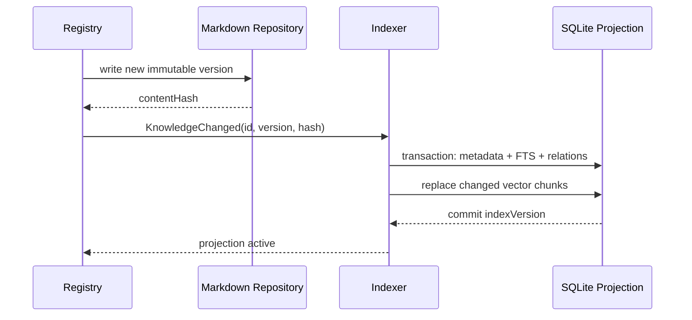
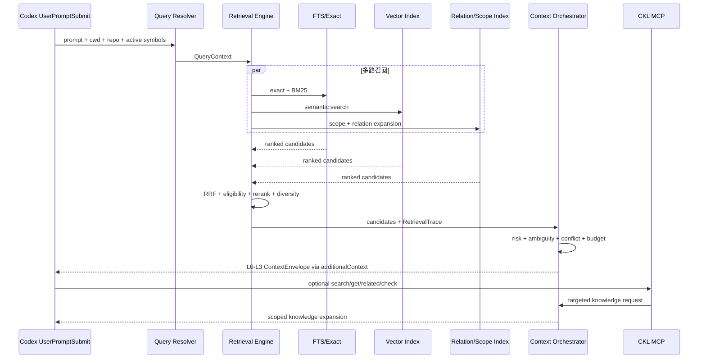
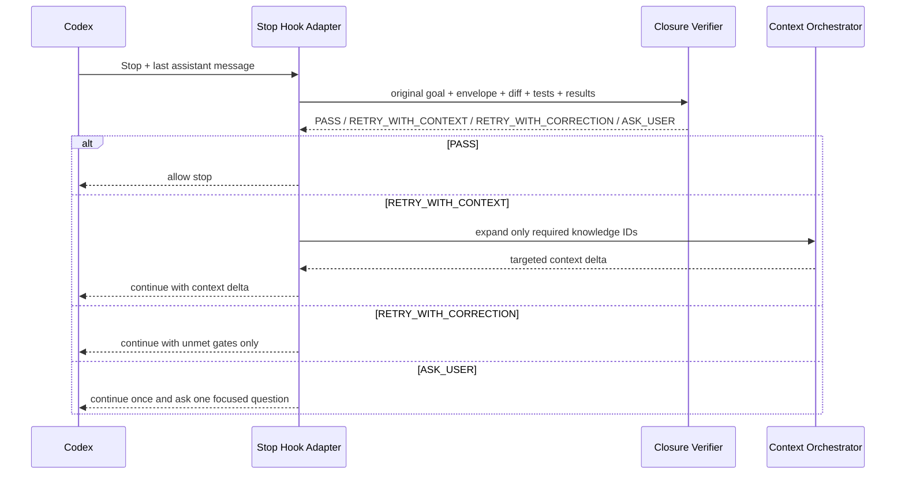

# ZhiLoop（Codex Knowledge Layer）技术设计

**状态**：Proposed  
**版本**：0.2  
**创建日期**：2026-08-01  
**目标读者**：实现者、维护者、技术评审者  
**关联文档**：

- [实施计划](../implementation/implementation-plan.md)
- [ADR-0001：模块化单体与端口适配器](../adr/0001-modular-monolith.md)
- [ADR-0002：Markdown 权威源与 SQLite 投影](../adr/0002-markdown-sqlite-storage.md)
- [ADR-0003：Codex 接入策略](../adr/0003-codex-integration.md)
- [ADR-0004：可控复杂度知识注入与闭环验证](../adr/0004-context-orchestration-and-closure.md)

## 1. 摘要

ZhiLoop（知环）的核心架构 Codex Knowledge Layer（下文简称 CKL）是一个与 CCM 并行运行、未来可封装为 Codex/CCM 及其他 AI 编程代理插件的本地知识采集、治理、检索、编排和注入系统。它从 Codex 对话和可观察工具事件中提取可复用知识，并通过代码、配置、测试和用户明确表态自动验证知识。系统默认不要求人工审核；只有高影响、存在冲突且无法通过证据判定时，才利用当前 Codex 对话进行一次微确认。

CKL 沉淀的不只是“使用经验”，还包括需求、事实、技术方案、架构决策、实现记录、失败路径、规则、偏好和未解决问题。知识按任务、符号、模块、项目、用户、团队和全局作用域分层。

CKL 不以“尽可能多地注入知识”为目标。它根据当前任务、模型能力、风险、歧义、知识状态和上下文预算，控制注入内容的广度、深度、权威性和证据粒度。默认只提供少量边界、门禁、已有能力摘要和知识指针，让底层模型自主决策；需要时再通过 `ckl.search`、`ckl.get` 和闭环验证定向展开知识。

核心技术决策：

1. 使用模块化单体，所有领域能力通过稳定端口解耦。
2. 使用 Codex Hooks 接入现有 Codex 客户端；后续增加 App Server 结构化适配器。
3. 使用 Markdown 作为已发布知识的权威内容；SQLite 保存事件账本、候选知识、关系、FTS 索引和检索审计。
4. 将“保存知识”和“知识生效”分离。候选知识可以无感保存，只有满足证据策略的知识才能进入默认召回集合。
5. 使用精确匹配、FTS5、语义向量、作用域和关系扩展组成混合召回；由 Context Orchestrator 将结果编排为可控复杂度的 `ContextEnvelope`。
6. 使用 `UserPromptSubmit` 完成回合前主动注入，使用本地 MCP 工具完成运行中按需拉取。
7. 在 `Stop` 阶段执行闭环验证；仅在信息不足或违反门禁时定向补充知识或纠偏，禁止重复注入完整历史。

## 2. 问题与目标

### 2.1 当前问题

Codex 对话会产生大量高价值信息，但目前通常存在以下问题：

- 对话结束后，需求、方案、决策和实现依据难以复用。
- 仅保存对话摘要会丢失纠正过程、失败路径和验证证据。
- 纯 RAG 对人不透明，无法判断为什么某条知识被召回。
- 频繁依赖人工审核会形成积压，最终导致知识库失真。
- 纯向量检索对类名、错误码、配置项和精确术语召回不稳定。
- 项目知识、个人偏好和全局经验容易串用。
- 代码变化后，历史知识不会自动过期。

### 2.2 目标

CKL 必须实现：

1. 无感捕获 Codex 的可观察对话、工具、文件变更和验证结果。
2. 将会话组织为可追溯的 Turn 和 Episode。
3. 从一个 Episode 中提取多个类型化知识资产。
4. 自动解析知识作用域，并严格隔离项目知识与全局知识。
5. 根据代码和证据自动推进知识生命周期。
6. 在不阻塞用户任务的前提下处理歧义。
7. 让人能直接查看、编辑、比较和追踪已发布知识。
8. 提供高召回、低误召回且可解释的上下文检索。
9. 保持 Codex、CCM、存储和模型供应方可替换。
10. 根据任务动态控制注入复杂度，并允许 Codex 运行中自主获取更深知识。
11. 在任务结束前以确定性门禁和独立语义检查形成有限次数的自闭环。

### 2.3 非目标

首版不包含：

- 企业级多人实时协作和中心化权限系统。
- 将所有项目知识自动提交到 Git 仓库。
- 自动运行任意未经当前 Codex 会话授权的命令。
- 保存或依赖隐藏推理、思维链等不可稳定获得的数据。
- 将候选方案自动提升为全局规则。
- 替代 Codex 原生 Memories；CKL 与其并存但不依赖其内部格式。

## 3. 术语

| 术语 | 定义 |
|---|---|
| Event | 从 Codex Hook、App Server 或文件监控获得的不可变观察记录 |
| Turn | 一次用户输入到 Codex 停止之间的工作单元 |
| Episode | 围绕同一目标、可能跨多个 Turn 的问题解决过程 |
| Knowledge Candidate | 从 Episode 中提取、尚未生效的候选知识 |
| Knowledge Asset | 具有类型、作用域、状态、版本和证据的知识资产 |
| Evidence | 支持或否定知识结论的代码、测试、用户表态或运行记录 |
| Assertion | Evidence Engine 可以自动检查的结构化断言 |
| Published Knowledge | 已写入 Markdown 权威源并允许按策略参与召回的知识 |
| Retrieval Trace | 描述候选来源、命中字段、作用域、状态和排序原因的审计记录 |
| Context Envelope | 一次注入的结构化上下文，包含任务、边界、门禁、已有能力、动态知识和扩展入口 |
| Injection Complexity | 注入的广度、深度、权威性和证据粒度，分为 L0-L4 |
| Task Contract | Context Envelope 中可选的任务目标、Scope、边界和完成门禁区块，不是 CKL 的唯一产物 |
| Closure Verification | 任务结束前基于目标、上下文、Diff 和证据执行的独立验证过程 |

## 4. 设计原则

1. **证据优先**：模型负责提取，程序和可观察证据负责确认。
2. **默认不打扰**：无法确认的低影响知识保留为 `PROPOSED`，不请求人工处理。
3. **最小生效范围**：无法确定 Scope 时使用更窄范围，禁止默认全局。
4. **不可变历史**：事件和知识版本只追加；更新通过新版本和关系表达。
5. **可重建索引**：FTS 和向量是派生数据，必须能从权威知识重建。
6. **可解释召回**：任何注入 Codex 的知识都必须能说明来源和排名原因。
7. **适配器隔离**：领域层不得依赖 Codex transcript、CCM、SQLite 或具体模型 SDK。
8. **安全降级**：模型、向量索引或后台编译不可用时，不影响 Codex 正常工作。
9. **最小充分注入**：默认注入最小充分内容，而不是完整知识正文。
10. **按需展开**：运行中发现新问题时按知识 ID 定向拉取，不整体扩大上下文。
11. **模型自主**：边界和门禁内的方案选择、执行顺序与工具选择交给底层模型。
12. **闭环有限**：自动续跑默认最多一次，高风险任务最多两次，避免自验证死循环。

## 5. 系统上下文



### 5.1 外部边界

| 外部系统 | CKL 使用方式 | 约束 |
|---|---|---|
| Codex Hooks | 捕获事件、前置注入和 Stop 闭环续跑 | Hook 必须快速返回；失败不得阻塞 Codex；自动续跑必须有限次 |
| Codex Transcript | 通过版本化适配器增量读取 | 格式不是稳定公共接口，不得泄漏到领域层 |
| Codex App Server | 后续用于结构化事件、历史线程读取和自有客户端 | 与 Hooks 使用同一规范化事件协议 |
| CCM | 不作为知识事实源 | 可提供安装包装、指标或插件入口 |
| 项目代码 | 只读分析、指纹和证据验证 | 未经授权不得后台执行任意命令 |
| Git 仓库 | 提供项目身份、Diff、版本和可选发布目标 | 自动知识生效不等于自动 Git 提交 |
| CKL MCP | 运行中按需查询、展开和检查知识 | 只返回当前 Scope 内有资格的知识；所有结果可追溯 |

Codex 接口依据：[Hooks](https://learn.chatgpt.com/docs/hooks)、[App Server](https://learn.chatgpt.com/docs/app-server)。

## 6. 容器与模块架构

首版是一个本地守护进程和一个 CLI，内部按包隔离。



### 6.1 模块职责

| 模块 | 唯一职责 | 输入 | 输出 | 禁止依赖 |
|---|---|---|---|---|
| `domain` | 领域实体、枚举、端口和状态规则 | 无 | 类型和纯函数 | Codex、SQLite、文件系统、模型 SDK |
| `ingestion-codex` | 将 Codex 来源转换为标准事件 | Hook/App Server/Transcript | `EventEnvelope` | Knowledge Store、检索算法 |
| `conversation-ledger` | 幂等追加事件、游标和原始数据保留 | `EventEnvelope` | 可查询事件流 | 编译器、Codex 具体格式 |
| `episode-builder` | 将 Turn 聚合成 Episode | 标准事件流 | `Episode` | 模型、SQLite 细节 |
| `knowledge-compiler` | 从 Episode 生成类型化候选知识与断言 | `Episode` | `KnowledgeCandidate[]` | Markdown、Codex Hook |
| `scope-resolver` | 识别项目和知识作用域 | 候选知识、RepoContext | `ResolvedScope` | 检索排序、模型供应商 |
| `evidence-engine` | 执行验证器并决定状态迁移 | 候选、断言、证据 | 新状态、置信度、证据 | Codex transcript、发布格式 |
| `knowledge-registry` | 版本、关系、发布、失效和投影协调 | 已决策资产 | Markdown 和索引变更 | Codex Hook |
| `retrieval-engine` | 多路召回、融合、重排和解释 | `QueryContext` | `RetrievedKnowledge[]`、`RetrievalTrace` | 直接读取 transcript、决定注入格式 |
| `context-orchestrator` | 按复杂度策略编排任务、边界、门禁、能力和知识 | 查询结果、风险、预算、任务状态 | `ContextEnvelope` | Codex Hook 线协议、直接修改知识状态 |
| `knowledge-injection` | 将 Context Envelope 推送或按需返回给 Codex | `ContextEnvelope`、MCP 请求 | `additionalContext`、MCP 结果 | 检索排序、知识编译 |
| `closure-verifier` | 在任务停止前检查目标对齐、Scope 和门禁，决定闭环动作 | Context Envelope、Diff、测试、最终结论 | `PASS`、`RETRY_WITH_CONTEXT`、`RETRY_WITH_CORRECTION`、`ASK_USER` | 扩大原始需求、无限续跑 |
| `interaction-policy` | 判断是否需要微确认并生成最小问题 | 冲突、影响、置信度 | `Noop` 或 `ConfirmationRequest` | 直接发布知识 |
| `observability` | 指标、审计、诊断和检索回放 | 各模块事件 | 日志、指标、报告 | 改变领域状态 |

### 6.2 允许的依赖方向

```text
apps
  -> application modules
      -> domain ports/types
          <- infrastructure adapters
```

任何跨模块调用必须通过公开接口或领域事件。禁止从一个模块直接访问另一个模块的数据表。

## 7. 推荐目录结构

```text
zhiloop/
├── apps/
│   ├── daemon/
│   └── cli/
├── packages/
│   ├── domain/
│   ├── ingestion-codex/
│   ├── conversation-ledger/
│   ├── episode-builder/
│   ├── knowledge-compiler/
│   ├── scope-resolver/
│   ├── evidence-engine/
│   ├── knowledge-registry/
│   ├── retrieval-engine/
│   ├── context-orchestrator/
│   ├── knowledge-injection/
│   ├── closure-verifier/
│   ├── interaction-policy/
│   └── observability/
├── config/
│   ├── verification-policy.yaml
│   ├── retrieval-policy.yaml
│   ├── injection-policy.yaml
│   ├── closure-policy.yaml
│   ├── scope-policy.yaml
│   └── retention-policy.yaml
├── schemas/
│   ├── event.schema.json
│   ├── knowledge-candidate.schema.json
│   ├── knowledge-asset.schema.json
│   ├── context-envelope.schema.json
│   └── closure-verification-result.schema.json
├── docs/
└── test-fixtures/
    ├── codex-hooks/
    ├── transcripts/
    ├── episodes/
    └── knowledge/
```

策略参数必须进入配置文件，业务语义和状态约束必须留在领域代码中。配置不得绕过不变量，例如“未经证据或明确确认不得晋升 GLOBAL”。

## 8. 核心领域模型

### 8.1 标准事件

```ts
interface EventEnvelope<TPayload = unknown> {
  schemaVersion: 1;
  eventId: string;
  source: "codex-hook" | "codex-app-server" | "codex-transcript" | "filesystem" | "git";
  sourceVersion?: string;
  eventType:
    | "session.started"
    | "user.prompted"
    | "tool.completed"
    | "file.changed"
    | "turn.stopped"
    | "session.ended";
  sessionId: string;
  turnId?: string;
  occurredAt: string;
  cwd?: string;
  projectHint?: string;
  contentHash: string;
  payload: TPayload;
}
```

`eventId` 必须可幂等重算。推荐：

```text
sha256(source + sessionId + turnId + eventType + sourceItemId + contentHash)
```

Schema 前向兼容只允许顶层未知字段，并将其保存在独立 `extensions` 中；传入 Domain 的对象只投影 Schema 已知顶层字段。嵌套对象默认 `additionalProperties=false`，只有 `payload`、Assertion `parameters` 等明确声明的扩展容器可以携带自由结构，避免未知字段绕过领域边界。

### 8.2 Episode

```ts
interface Episode {
  episodeId: string;
  builderVersion: string;
  sessionIds: string[];
  turnIds: string[];
  projectContext: ProjectContext;
  goal: string;
  goalRef: string;
  subgoals: EpisodeSubgoal[];
  userStatements: EpisodeUserStatement[];
  userCorrections: Correction[];
  actions: ActionRecord[];
  artifacts: ArtifactRef[];
  outcomes: Outcome[];
  evidenceRefs: string[];
  status: "OPEN" | "COMPLETED" | "ABANDONED";
}
```

`EpisodeUserStatement` 为每条用户原话保留 `turnId + sourceEventId + kind + statement + occurredAt`，供本地承诺检测使用。`Correction` 必须同时保存 `originalRef + originalStatement` 与 `correctedRef + correctedStatement`，不能用新内容覆盖被纠正内容。`builderVersion` 参与 Episode 身份计算，使聚合规则升级可以确定性重建和并行比对。

首版 Episode 以单 Session 内的连续 Turn 为边界；只有当后续 Session 明确引用同一知识主题或任务标识时才跨 Session 合并。

### 8.3 知识类型

完整类型：

```text
FACT | REQUIREMENT | DESIGN | DECISION | IMPLEMENTATION |
EXPERIENCE | RULE | PREFERENCE | OPEN_QUESTION
```

MVP 必须实现：

```text
REQUIREMENT | DESIGN | DECISION | IMPLEMENTATION | EXPERIENCE
```

### 8.3.1 Knowledge Extraction Port

模型适配器只接收 Episode 的最小语义投影，不接收 Session/Turn 元数据、本地仓库根路径或无关边界事件。主目标必须有 `goalRef`；模型返回的 Assertion/Evidence 引用只能使用输入提供的 eventId。

适配器输出为版本化 `KnowledgeExtractionOutput` 草稿批次。Runner 必须先对整批执行 JSON Schema 和 Grounding 校验，再统一写入 candidate/assertion ID、`compilerVersion`、`sourceEpisodes`、时间和 correlationId；任一草稿非法时不得产生部分 Candidate。

编译批次身份必须包含：

```text
episodeId + builderVersion + inputHash + compilerVersion + promptVersion
```

其中 `inputHash` 来自最小语义输入的规范化内容，避免开放 Episode 增长后复用旧批次。超时、模型不可用和可重试格式错误只返回零 Candidate 的 `RETRYABLE` 结果，Episode 继续由上游保留。

### 8.4 作用域

```ts
type ScopeLevel =
  | "TASK"
  | "SYMBOL"
  | "MODULE"
  | "PROJECT"
  | "USER"
  | "TEAM"
  | "GLOBAL";

interface KnowledgeScope {
  level: ScopeLevel;
  taskId?: string;
  projectId?: string;
  repositoryRemote?: string;
  modulePaths?: string[];
  symbols?: string[];
  userId?: string;
  teamId?: string;
}
```

项目标识计算：

```text
有网络 Remote：sha256("portable-git" + normalizedGitRemote)
无 Remote 的 Git：sha256("local-git" + realGitCommonDir)
无 Git：sha256("filesystem-local" + realRepositoryRoot + rootMarker)
```

网络 Remote 身份标记 `portable=true`，不包含 worktree root 或 branch。无 Git Remote 时，使用共享 common-dir；无 Git 时使用规范化仓库根路径和根目录标识文件生成本地项目 ID，并标记 `portable=false`。

### 8.5 知识资产

```ts
interface KnowledgeAsset {
  schemaVersion: 1;
  id: string;
  subjectKey: string;
  kind: KnowledgeKind;
  scope: KnowledgeScope;
  version: number;
  status: KnowledgeStatus;
  title: string;
  summary: string;
  body: string;
  aliases: string[];
  keywords: string[];
  applicability: string[];
  nonApplicability: string[];
  symbols: string[];
  relations: KnowledgeRelation[];
  evidence: EvidenceRef[];
  confidence: number;
  sourceEpisodes: string[];
  contentHash: string;
  codeFingerprint?: string;
  createdAt: string;
  updatedAt: string;
}
```

`subjectKey` 是更新、合并和冲突检测的主要键。格式：

```text
<kind-lowercase>.<domain-or-module>.<stable-topic>
```

示例：`decision.codex.primary-source`。

`KnowledgeCandidate` 必须显式携带 `status: "PROPOSED"`。模型输出草稿不包含状态字段，由 Compiler Runner 统一落印；任何建议、方案或模型置信度都不能直接产生 `ACCEPTED`、`IMPLEMENTED` 或 `VERIFIED`。

### 8.6 状态机



允许参与默认召回的状态：

| 状态 | 默认召回策略 |
|---|---|
| `VERIFIED` | 默认允许 |
| `IMPLEMENTED` | 允许，必须标注未完全验证 |
| `ACCEPTED` | 相关时允许 |
| `PROPOSED` | 仅在探索、比较方案时允许 |
| `REJECTED` | 仅作为失败方案或替代方案 |
| `STALE` | 默认禁止，仅历史追溯 |
| `SUPERSEDED` | 默认禁止，跟随新版本 |

### 8.7 Context Envelope 与注入复杂度

```ts
type InjectionLevel =
  | "L0_NONE"
  | "L1_POINTER"
  | "L2_COMPACT"
  | "L3_EVIDENCED"
  | "L4_EPISODE";

type ContextAuthority =
  | "BINDING_RULE"
  | "ACCEPTED_DECISION"
  | "VERIFIED_FACT"
  | "REFERENCE";

interface ContextItem {
  knowledgeId: string;
  version: number;
  title: string;
  summary: string;
  authority: ContextAuthority;
  status: KnowledgeStatus;
  scope: KnowledgeScope;
  sourceRefs: string[];
  reasonCodes: string[];
  evidenceSummary?: string;
  expandable: boolean;
}

interface GateSpec {
  gateId: string;
  description: string;
  required: boolean;
  acceptedEvidenceTypes: string[];
}

interface ContextEnvelope {
  envelopeId: string;
  queryContext: QueryContext;
  task?: {
    goal: string;
    scope: KnowledgeScope;
  };
  boundaries: ContextItem[];
  completionGates: GateSpec[];
  existingCapabilities: ContextItem[];
  relevantKnowledge: ContextItem[];
  availableKnowledgeActions: string[];
  injectionPolicy: {
    level: InjectionLevel;
    breadth: number;
    depth: "POINTER" | "COMPACT" | "EVIDENCED" | "EPISODE";
    authorityMix: ContextAuthority[];
    evidence: "NONE" | "POINTER" | "SUMMARY" | "FULL";
    tokenBudget: number;
    disclosedItems: number;
    omittedItems: number;
    expandable: boolean;
  };
  retrievalTraceId: string;
}
```

复杂度等级：

| 等级 | 内容 | 默认用途 |
|---|---|---|
| `L0_NONE` | 不注入知识 | 通用简单问题 |
| `L1_POINTER` | ID、一句话摘要、动态能力索引 | 默认参考知识目录 |
| `L2_COMPACT` | 结论、适用边界、状态和关键门禁 | 首次 Binding Rule 或按需边界展开 |
| `L3_EVIDENCED` | 方案、失败路径、代码位置和证据摘要 | 显式按需展开或有限闭环补充 |
| `L4_EPISODE` | 原始对话片段和完整演进过程 | 追溯、审计和复杂歧义，禁止自动默认使用 |

Task Contract 是 `task + boundaries + completionGates` 的组合视图；它是 Context Envelope 的可选区块，不能替代动态知识注入。

### 8.8 闭环验证结果

```ts
type VerificationDecision =
  | "PASS"
  | "RETRY_WITH_CONTEXT"
  | "RETRY_WITH_CORRECTION"
  | "ASK_USER";

interface ClosureVerificationResult {
  decision: VerificationDecision;
  intentAligned: boolean;
  scopeCompliant: boolean;
  gates: GateResult[];
  requiredKnowledge?: Array<{
    knowledgeId: string;
    depth: InjectionLevel;
  }>;
  correction?: string[];
  question?: string;
  reasonCodes: string[];
}
```

验证器只读取原始目标、Context Envelope、可观察 Diff、工具结果、测试和最终结论，不读取或保存隐藏推理。

## 9. 关键流程

### 9.1 对话捕获和后台编译



本流程中的捕获路径只负责标准化和入队，不得执行模型编译、索引重建或代码扫描。`UserPromptSubmit` 的本地检索/注入和 `Stop` 的闭环验证是独立快路径，共用同一 Daemon，但不进入后台知识编译链路；任何快路径超时都必须开放失败。

### 9.2 自动证据验证



首版断言：

| Assertion | 说明 | 自动状态上限 |
|---|---|---|
| `USER_ACCEPTED` | 用户明确接受目标结论 | `ACCEPTED` |
| `USER_REJECTED` | 用户明确否定目标结论 | `REJECTED` |
| `SYMBOL_EXISTS` | 类、方法或函数存在 | `IMPLEMENTED` |
| `FILE_CONTAINS` | 文件存在结构化或精确内容 | `IMPLEMENTED` |
| `DEPENDENCY_PRESENT` | 构建文件包含依赖和版本约束 | `IMPLEMENTED` |
| `CONFIG_EQUALS` | 配置满足预期 | `IMPLEMENTED` |
| `COMMAND_SUCCEEDED` | 当前 Turn 中目标命令成功 | 作为辅助证据 |
| `TEST_PASSED` | 与结论关联的测试成功 | `VERIFIED` |
| `CROSS_PROJECT_VERIFIED` | 多项目中存在独立验证 | 允许申请 `GLOBAL` |

禁止仅凭 Embedding 相似度将知识标为 `IMPLEMENTED` 或 `VERIFIED`。

### 9.3 微确认策略

只有满足以下任一条件才允许生成 `ConfirmationRequest`：

1. 两条 `VERIFIED` 或 `ACCEPTED` 知识冲突。
2. 准备晋升为 `GLOBAL`，但跨项目证据不足。
3. 技术方案是否正式采用无法由代码和对话承诺判断。
4. Scope 歧义会造成跨项目污染。
5. 新知识将覆盖 `RULE` 或已发布 `DECISION`。

交互约束：

- 每个 Turn 最多一个知识确认问题。
- 不阻塞当前开发任务。
- 必须提供安全默认选项。
- 用户不回答时保持 `PROPOSED` 或更窄 Scope。
- 禁止生成独立待审核积压作为主工作流。

### 9.4 知识发布与索引更新



知识删除使用 tombstone。物理清理由保留策略单独执行。

### 9.5 可控复杂度检索与 Codex 注入



检索与编排阶段：

1. 构建 `QueryContext`：prompt、projectId、cwd、branch、文件、符号、错误码。
2. 按 Scope 和状态先做资格过滤。
3. 并行执行精确、FTS5、向量和关系召回。
4. 使用 Reciprocal Rank Fusion 合并不同量纲的排名。
5. 对前 30 条执行可替换的 Rerank。
6. 使用多样性规则去除同一 subject 的重复版本。
7. Context Orchestrator 根据任务风险、歧义、知识冲突、项目特异性、上下文压力和模型可用能力选择 `L0-L4`。
8. 默认生成混合 Envelope：Binding Rule 以 `L2_COMPACT` 主动注入，其他候选以 `L1_POINTER` 简介注入；不自动批量注入正文。
9. 运行中通过 `ckl.search/related` 发现更多 L1 指针，通过 `ckl.get` 定向展开到 L2 或 L3，并用 `ckl.check` 复核当前版本。
10. 预分配 Trace ID，使用共享 Renderer 按完整 `additionalContext` 核算预算；记录 disclosed/omitted 数量，截断时提供 `ckl.search` 下一步动作。
11. 输出 `ContextEnvelope` 和完整 Retrieval Trace。

向量服务不可用时，系统必须使用精确匹配、FTS5、Scope 和关系索引降级。

复杂度由四个正交维度控制：

- **Breadth**：注入多少条知识，默认 3～5 条，高风险最多 8 条。
- **Depth**：指针、摘要、证据摘要或原始 Episode。
- **Authority**：参考信息、已接受决策或强制规则。
- **Evidence**：不提供、只给引用、给摘要或给完整证据。

任何复杂度提升都必须定向发生。例如缺少 Eureka 注册时序知识时，只展开目标知识 ID，不重新注入全部项目知识。

### 9.6 Stop 闭环验证



验证顺序：

```text
确定性边界和门禁
  > 代码、Diff、配置和测试证据
  > 独立语义验证
```

闭环约束：

- 默认只允许一次自动续跑；高风险策略最多两次。
- 必须读取 `stop_hook_active` 或本地 continuation counter 防止循环。
- Continuation 只包含新增知识或未满足门禁，不重复完整 Context Envelope。
- 验证器不得生成原始目标之外的新需求。
- 无法自主解决的业务歧义才进入 `ASK_USER`。
- Stop Hook 不可用或验证超时时允许正常结束，并将验证状态标记为 `UNKNOWN`。

Codex `Stop` Hook 返回 `decision: "block"` 时会创建 continuation prompt 让当前 Turn 继续，该语义用于实现有限闭环，而不是阻止或回滚已完成操作。

## 10. 存储设计

### 10.1 本地目录

```text
~/.ckl/
├── config.yaml
├── ledger.db
├── registry.db
├── knowledge/
│   ├── global/
│   ├── user/
│   └── projects/
│       └── <project-id>/
├── indexes/
├── logs/
└── run/
```

项目仓库发布是可选 Publisher：

```text
<repo>/.codex/knowledge/
<repo>/docs/architecture/adr/
<repo>/docs/design/
```

默认只发布到 `~/.ckl/knowledge/projects/<project-id>`，避免后台系统擅自修改业务仓库。

### 10.2 Markdown 格式

```markdown
---
id: decision.codex.primary-source
subject_key: decision.codex.primary-source
kind: DECISION
scope: PROJECT
project_id: abc123
version: 2
status: ACCEPTED
aliases:
  - Codex 对话接入
keywords:
  - hooks
  - app-server
symbols: []
source_episodes:
  - episode_001
supersedes:
  - decision.codex.primary-source@1
updated_at: 2026-08-01T00:00:00+08:00
---

# Codex 作为主要对话事实源

## 结论

现有客户端通过 Hooks 接入；未来自有客户端使用 App Server。

## 适用条件

- 需要捕获 Codex 对话及可观察工具证据。

## 不适用条件

- 仅需要通用个人偏好时，可使用 Codex Memories。

## 证据

- 用户明确确认：session/turn 引用。

## 替代方案

- 通过 CCM 转发 transcript。
```

### 10.3 SQLite 逻辑表

| 表 | 用途 |
|---|---|
| `events` | 不可变标准事件元数据与可清理 payload；payload 到期后保留 eventId、序号、hash 和 `payload_purged` tombstone |
| `consumer_cursors` | 后台消费者的单调提交游标；保留清理不得越过最慢消费者 |
| `source_cursors` | transcript/App Server 增量游标 |
| `episodes` | Episode 头信息和状态 |
| `episode_events` | Episode 与 Event 关系 |
| `candidate_compilations` | extractionKey、Compiler/Prompt 版本、claim 租约、重试与批次状态 |
| `knowledge_candidates` | 尚未发布的候选知识 |
| `knowledge_assets` | Markdown 资产投影 |
| `knowledge_versions` | 版本、hash 和 tombstone |
| `knowledge_relations` | contradicts、supersedes、implements 等 |
| `evidence` | 证据和验证结果 |
| `assertions` | 可执行断言及其状态 |
| `knowledge_fts` | FTS5 索引 |
| `vector_chunks` | 稳定 chunkId、embedding 和 contentHash |
| `retrieval_runs` | 查询级召回审计 |
| `retrieval_candidates` | 候选分数和命中原因 |
| `feedback` | relevant、irrelevant、pin、suppress 等反馈 |

SQLite Migration 必须向前兼容；索引表允许重建，事件和候选表不允许通过重建丢失。Raw Event 保留到期时只清除已被所有注册消费者处理的 payload，禁止删除事件身份元数据，否则重放会破坏 `eventId` 幂等。

## 11. 更新、合并与冲突规则

### 11.1 相同知识判断

按以下顺序匹配：

1. 完全相同 `id`。
2. 相同 `subjectKey + kind + scope identity`。
3. 候选合并模型建议，但必须通过确定性字段复核。

Embedding 相似只能产生“可能重复”关系，不得直接覆盖。

### 11.2 更新类型

| 类型 | 行为 |
|---|---|
| 内容补充 | 创建新版本并 `supersedes` 旧版本 |
| 结论改变 | 创建新资产或新版本，并保留 `contradicts`/`supersedes` |
| Scope 缩小 | 新版本生效，旧 Scope 版本失效 |
| Scope 晋升 | 创建目标 Scope 版本，保留来源关系 |
| 代码失效 | 状态变为 `STALE`，不删除正文 |
| 用户否定 | 状态变为 `REJECTED`，保留失败历史 |

### 11.3 全局晋升

满足以下任一条件才允许自动晋升：

- 至少两个不同 `projectId` 中达到 `VERIFIED`，且内容无项目专有标识。
- 用户在对话中明确表示“作为全局规则/偏好”。

`RULE` 和 `PREFERENCE` 不允许仅凭跨项目证据自动晋升，必须有用户明确表态。

其余情况必须保持项目级或进入一次微确认。

## 12. 可解释性与治理接口

CLI 首版必须支持：

```text
ckl knowledge list --scope project --status verified
ckl knowledge show <id>
ckl knowledge diff <id> --from <version> --to <version>
ckl knowledge trace <id>
ckl retrieval explain --query "..." --cwd <repo>
ckl knowledge mark-stale <id> --reason "..."
ckl knowledge suppress <id> --scope <scope>
ckl index rebuild
ckl doctor
```

`retrieval explain` 至少展示：

- Query 解析出的项目、符号、关键词和意图。
- 每路召回的原始排名。
- Scope、状态和证据过滤原因。
- RRF 和 Rerank 后的最终排名。
- 为什么某条知识被注入或被排除。

## 13. 配置边界

`~/.ckl/config.yaml` 只接受一个版本化的根对象。以下各节均为该根对象的片段，字段名与 TypeScript API 统一使用 camelCase；未知字段、重复 YAML Key、Alias 和不安全对象键一律拒绝。缺失策略使用安全默认值补齐。

### 13.1 Verification Policy

```yaml
version: 1
verification:
  autoPublish:
    IMPLEMENTATION:
      requiredAssertions: [SYMBOL_EXISTS]
      maxStatus: IMPLEMENTED
    EXPERIENCE:
      requiredAssertions: [TEST_PASSED]
      maxStatus: VERIFIED
  globalPromotion:
    minVerifiedProjects: 2
  interaction:
    maxQuestionsPerTurn: 1
    defaultScope: PROJECT
```

### 13.2 Retrieval Policy

```yaml
version: 1
retrieval:
  topK:
    exact: 30
    fts: 30
    vector: 30
    relation: 20
  fusion:
    algorithm: rrf
    rrfK: 60
  rerank:
    candidates: 30
  output:
    minItems: 0
    maxItems: 8
  eligibility:
    default: [VERIFIED, IMPLEMENTED, ACCEPTED]
```

### 13.3 Injection Policy

```yaml
version: 1
injection:
  defaultLevel: L1_POINTER
  defaultMaxTokens: 800
  userPromptDeadlineMs: 500
  failOpenOnTimeout: true
  levels:
    L1_POINTER:
      maxItems: 8
      evidence: NONE
    L2_COMPACT:
      maxItems: 8
      evidence: POINTER
    L3_EVIDENCED:
      maxItems: 8
      evidence: SUMMARY
    L4_EPISODE:
      automatic: false
  authorityOrder: [BINDING_RULE, ACCEPTED_DECISION, VERIFIED_FACT, REFERENCE]
  expansion:
    enabled: true
    tools: [ckl.search, ckl.get, ckl.related, ckl.check]
```

### 13.4 Closure Policy

```yaml
version: 1
closure:
  enabled: true
  defaultMaxContinuations: 1
  highRiskMaxContinuations: 2
  deterministicDeadlineMs: 500
  semanticVerificationDeadlineMs: 3000
  decisions: [PASS, RETRY_WITH_CONTEXT, RETRY_WITH_CORRECTION, ASK_USER]
  failOpenOnTimeout: true
  forbidRequirementExpansion: true
```

### 13.5 Scope Policy

```yaml
version: 1
scope:
  defaultLevel: PROJECT
  allowCrossProjectFallback: false
  repositoryPublisherEnabled: false
```

### 13.6 Retention Policy

```yaml
version: 1
retention:
  rawEventDays: 30
  logDays: 14
  tombstoneDays: 365
  storeTranscriptBody: false
```

配置修改后必须通过 Schema 校验；无效配置保留上一有效版本并产生诊断事件。

## 14. 可靠性、安全与隐私

### 14.1 可靠性

- Hook 入队失败不得影响 Codex；写入本地降级 spool 并异步重试。
- 所有事件消费使用幂等键和持久游标。
- 后台 Worker 崩溃后从最后提交游标恢复。
- Markdown 写入使用临时文件加原子替换。
- SQLite 更新使用事务，索引版本完成后再切换 Active。

### 14.2 隐私

- 入库前执行敏感字段和常见密钥模式清理。
- 不保存隐藏推理；只保存用户可见消息、最终输出和可观察工具事件。
- 原始 transcript 只保存引用、hash 和必要增量；默认不长期复制全部内容。
- Raw Event 默认保留 30 天，可配置为更短或禁用正文保存。
- 日志不得输出完整 prompt、文件内容、环境变量或工具返回正文。

### 14.3 权限

- 代码验证默认只读。
- 后台运行测试必须经过单独的命令白名单和 Codex 已授权上下文。
- 项目仓库 Publisher 默认关闭。
- 知识删除使用可恢复 tombstone。

## 15. 替代方案

### 15.1 纯向量 RAG

**优点**：开发快，语义召回容易。  
**缺点**：人不可治理、精确术语不稳定、Scope 和冲突难表达。  
**决策**：拒绝作为主架构，仅保留向量作为一条召回通道。

### 15.2 SQLite 作为唯一权威源

**优点**：事务、查询和版本管理容易。  
**缺点**：没有 UI 时人难以查看和编辑，Git 协作不自然。  
**决策**：首版拒绝。多人服务化阶段可重新评估。

### 15.3 纯 Markdown 和 grep

**优点**：简单、可读、Git 友好。  
**缺点**：关系、审计、状态过滤、召回评估和性能不足。  
**决策**：Markdown 保留为权威内容，但必须配套 SQLite 投影。

### 15.4 微服务拆分

**优点**：独立扩缩容和部署。  
**缺点**：本地系统运维成本高，事务和调试复杂。  
**决策**：首版拒绝，采用模块化单体并保留稳定端口。

### 15.5 所有知识人工审核

**优点**：理论上人工可控。  
**缺点**：审核积压、遗漏和使用疲劳不可避免。  
**决策**：拒绝，采用证据自动晋级和少量交互确认。

### 15.6 固定全量注入或只注入任务契约

**固定全量注入优点**：实现简单，模型总能看到完整知识。  
**固定全量注入缺点**：上下文膨胀、知识冲突和注意力稀释。  
**只注入任务契约优点**：上下文小，边界清晰。  
**只注入任务契约缺点**：会丢失项目事实、历史决策和可复用经验，错误地缩窄 CKL 职责。  
**决策**：两者均不采用。使用可控复杂度 Context Envelope，保留知识注入主能力，并提供按需展开与闭环验证。

## 16. 风险与缓解

| 风险 | 严重度 | 可能性 | 缓解措施 |
|---|---:|---:|---|
| Transcript 格式变化 | 高 | 中 | 版本化适配器、Fixture 回归、领域层只接收标准事件 |
| 模型把建议识别为事实 | 高 | 中 | 生命周期隔离，代码/测试/用户承诺决定生效状态 |
| 项目知识串入全局 | 高 | 中 | 最小 Scope、跨项目证据门槛、全局晋升策略 |
| 测试通过但未覆盖结论 | 高 | 中 | Assertion 与具体 symbol/path/test 绑定，显示证据范围 |
| 索引与 Markdown 不一致 | 中 | 中 | contentHash、indexVersion、可重建投影和 doctor 检查 |
| Hook 影响 Codex 响应 | 高 | 低 | 捕获路径只入队；注入/闭环设置独立 deadline；全部失败开放 |
| 知识持续增长导致噪声 | 中 | 高 | subject 合并、状态过滤、版本去重、召回评估 |
| 过量知识注入导致上下文膨胀 | 高 | 中 | 默认 L1 目录、Binding L2 保留、最终渲染 Token Budget、运行中定向 L2/L3 展开 |
| 目录截断导致已召回知识不可发现 | 高 | 中 | disclosed/omitted 计数、结构化 `ckl.search` nextAction、真实链路模拟 |
| 过少注入导致模型误解项目事实 | 高 | 中 | 闭环返回 `RETRY_WITH_CONTEXT`，按知识 ID 提升深度 |
| 知识内容被误当成强制指令 | 高 | 中 | Authority 分层，REFERENCE 与 BINDING_RULE 分区编码 |
| 闭环验证自我强化原有误判 | 高 | 中 | 确定性门禁优先、隔离验证上下文、独立 reason codes |
| Stop 自动续跑形成循环 | 高 | 低 | continuation counter、`stop_hook_active`、默认一次上限 |
| 敏感代码或凭证泄漏 | 高 | 中 | 本地优先、脱敏、最小保留、禁止日志正文 |
| 用户被频繁确认打断 | 中 | 中 | 每 Turn 上限、仅高影响冲突、默认不阻塞 |
| 模型或向量服务不可用 | 中 | 中 | 可插拔端口，FTS/Scope 降级，不影响 Codex 主流程 |

## 17. 成功指标

| 指标 | MVP 目标 | 测量方式 |
|---|---:|---|
| 捕获类 Hook P95 处理时间 | < 100 ms | `PostToolUse`/`SessionEnd` Hook 计时指标 |
| 主动注入 P95 处理时间 | < 300 ms | `UserPromptSubmit` 本地检索与编排计时 |
| Stop 确定性验证 P95 | < 300 ms | 不含可选语义验证的 Stop 计时 |
| Stop 语义验证硬超时 | <= 3 s | Closure deadline 与超时开放记录 |
| 事件重复写入率 | 0 | 幂等回归测试 |
| 无人工处理知识比例 | >= 90% | Candidate 决策统计 |
| 每 20 个 Turn 的知识确认问题 | <= 1 | Interaction 计数 |
| 错误 `VERIFIED` 比例 | < 1% | 标注样本审计 |
| 项目知识跨项目误注入 | < 1% | Retrieval benchmark |
| Recall@5 | >= 90% | Golden query 集合 |
| Precision@5 | >= 80% | Golden query 集合 |
| 召回解释覆盖率 | 100% | Retrieval Trace 完整性检查 |
| 默认 Context Envelope P95 大小 | <= 800 tokens | Injection 指标 |
| L4 自动注入次数 | 0 | Injection Policy 审计 |
| 运行中定向展开命中率 | >= 80% | MCP 调用后使用反馈 |
| 闭环首次 PASS 比例 | >= 85% | Closure 决策统计 |
| 自动续跑平均次数 | <= 0.2/Turn | Stop continuation 统计 |
| 闭环死循环 | 0 | continuation counter 告警 |
| 违反已声明门禁后仍返回成功 | < 1% | Closure Golden Cases |
| Markdown 到索引生效 P95 | < 5 s | Indexer 指标 |
| 代码变化后失效识别率 | >= 85% | Fingerprint fixture 测试 |
| `VERIFIED` 知识证据可追溯率 | 100% | Registry 一致性检查 |

## 18. 测试策略

### 18.1 单元测试

- 状态机所有允许和拒绝迁移。
- Project ID 和 Scope 解析。
- subjectKey 合并规则。
- RRF、状态过滤和 Scope 排序。
- Verification Policy 决策表。
- Injection Complexity 决策矩阵和 Token Budget。
- Closure Verifier 四种决策及 continuation 上限。
- 脱敏规则和保留策略。

### 18.2 契约测试

- 每种 Codex Hook Fixture 到 `EventEnvelope`。
- Transcript 版本 Fixture 到标准事件。
- App Server Item 到标准事件。
- Markdown Schema 往返一致性。
- Model Adapter 输出必须通过 JSON Schema。
- Context Envelope 和 Closure Verification Result Schema 往返一致。

### 18.3 集成测试

- 模拟 Session：用户方案、修改代码、测试通过，最终知识达到 `VERIFIED`。
- 用户否定原方案后，旧资产变为 `REJECTED` 或 `SUPERSEDED`。
- 代码变化导致知识自动变为 `STALE`。
- 修改 Markdown 后 SQLite、FTS 和向量投影一致。
- 向量服务失败时仍能通过 FTS 和 Scope 召回。
- L1/L2/L3 注入能按同一知识 ID 逐层展开且不重复正文。
- Stop 检测到缺失知识时只注入目标知识增量并续跑一次。
- Stop 检测到门禁失败时只返回纠偏信息，不扩大需求。
- continuation 已激活时不会再次无限续跑。
- Hook/Daemon 重启后不丢事件、不重复编译。

### 18.4 召回评估

建立版本化 Golden Dataset：

```yaml
- query: 多实例下订单如何防止重复创建
  context:
    project_id: order-service
    symbols: [OrderService]
  relevant:
    - experience.order.database-idempotency
  forbidden:
    - decision.other-project.redis-lock
```

任何检索算法、分词、Embedding 或排序配置变更都必须运行该评估。

## 19. 可观测性

必须记录但不泄漏正文：

- 事件入队成功、重复和失败数。
- Episode 构建时延和合并原因。
- Candidate 类型、Scope 和状态分布。
- Verifier 成功、失败和未知数量。
- 微确认触发原因。
- 各路召回数量、延迟和最终采用率。
- Context Envelope 的等级、Token 数、Authority 和展开原因。
- Closure 决策、未满足门禁、续跑次数和最终状态。
- Index lag、contentHash 不一致和重建次数。
- 后台 Worker 队列深度和失败重试。

所有状态变化必须带 `correlationId`，能够从 Knowledge Asset 追溯到 Episode、Turn、Event 和 Evidence。

## 20. 发布阶段

### Phase 0：设计和骨架

完成领域模型、模块边界、配置 Schema、测试 Fixture 约定和本地开发骨架。

### Phase 1：只观察闭环

Hooks 入队、Ledger、Episode、候选知识和 CLI 查看。知识不注入 Codex，所有自动决策运行在 Shadow Mode。

### Phase 2：证据和知识发布

实现 Scope、Verifier、生命周期、Markdown Publisher 和 SQLite/FTS 投影。只发布 `IMPLEMENTED/VERIFIED` 项目知识。

### Phase 3：检索、上下文编排和动态注入

启用 FTS/精确/Scope 召回、Retrieval Trace、L0-L4 Context Orchestrator 和 `additionalContext`；提供 `ckl.search/get/related/check` 运行中按需拉取。向量与 Rerank 通过端口逐步打开。

### Phase 4：闭环验证、交互、全局知识和失效

启用 Stop Closure Verifier、有限自动续跑、微确认、全局晋升、代码指纹失效和反馈闭环。

### Phase 5：App Server 与插件包装

增加结构化事件和历史回填，提供 Codex/CCM 插件包装，但保持领域核心不变。

详细任务和验收标准见[实施计划](../implementation/implementation-plan.md)。

## 21. 未决问题与默认决定

| 问题 | MVP 默认决定 | 重新评估条件 |
|---|---|---|
| Extraction 使用哪个模型 | 默认 `codex exec --output-schema` 只读适配器；通过 `KnowledgeExtractionPort` 隔离 | 成本、时延或认证不能满足目标 |
| Vector 使用哪个引擎 | P0-P4 默认关闭生产向量服务；定义 `VectorIndexPort` 和测试实现 | Golden Dataset 证明 FTS 召回不足或资产规模增长 |
| 是否自动写项目仓库 | 默认关闭，只写 `~/.ckl` | 用户为项目显式开启 Publisher |
| 是否自动后台运行测试 | 默认不运行，只消费会话已有结果 | 建立命令白名单和授权模型后 |
| 是否读取 Codex Memories | 不读取内部格式 | 官方提供稳定接口后 |
| 是否中心化同步 | 不做，本地优先 | 出现明确团队共享需求后 |

## 22. Definition of Done

MVP 只有同时满足以下条件才算完成：

- 从 Codex Fixture 到 `EventEnvelope` 的契约测试通过。
- 同一 Event 重放不会重复产生 Episode 或 Knowledge Asset。
- 一段包含代码修改和测试的模拟对话能自动生成 `VERIFIED` 项目知识。
- 未验证方案保持 `PROPOSED`，不会作为事实注入。
- 代码指纹变化能将相关知识标记为 `STALE`。
- Markdown 修改能在 5 秒内更新 SQLite/FTS 投影。
- `retrieval explain` 能展示每条候选的完整排名原因。
- 默认生成 Binding L2 与 Reference L1 混合 Context Envelope，且可以按知识 ID 从 L1 定向展开到 L2/L3。
- `ContextEnvelope` 明确区分参考知识、已接受决策和强制规则。
- Codex 可以通过 CKL MCP 在运行中查询知识，而无需预先注入完整正文。
- Stop 阶段可以在门禁缺失时续跑一次，并且不会形成无限循环。
- 闭环验证信息不足时使用 `RETRY_WITH_CONTEXT`，执行偏离时使用 `RETRY_WITH_CORRECTION`。
- 项目 A 的知识不会在项目 B 的默认查询中出现。
- 向量和模型服务关闭时，Codex 主流程及关键词召回仍可用。
- 所有模块满足本设计规定的依赖边界。
