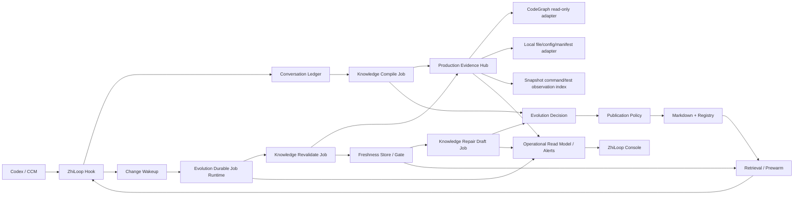
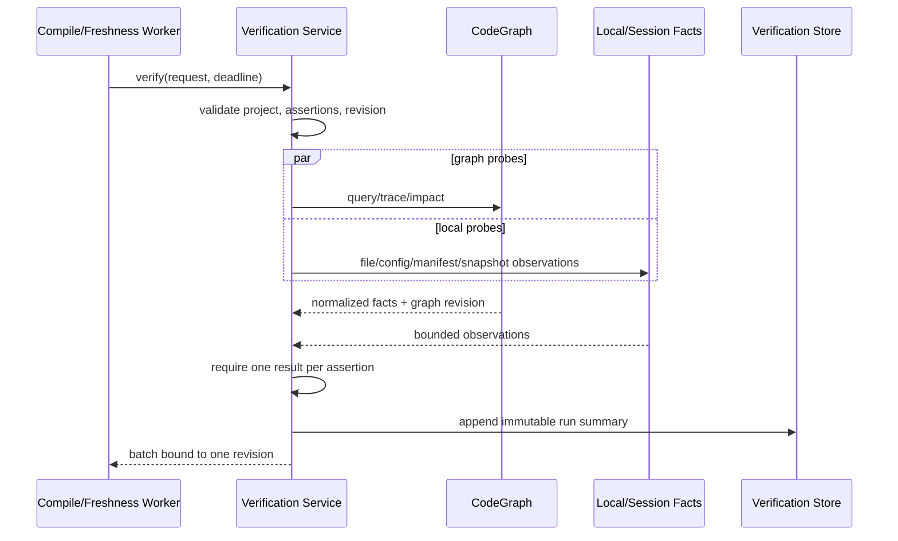
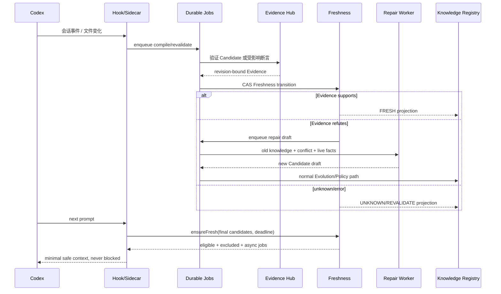

# ZhiLoop 持续知识演进生产闭环技术方案

**状态**：Proposed  
**基线版本**：ZhiLoop 0.4.0  
**创建时间**：2026-08-19  
**适用范围**：本地 Sidecar、Codex/CCM Hook、控制台、知识编译与注入链路  
**上位设计**：[持续知识演进总体设计](./continuous-knowledge-evolution-tdd.md)

## 1. 摘要

ZhiLoop 0.4.0 已经具备自动生成 Candidate、用户承诺识别、确定性演进决策、CodeGraph 只读适配、Freshness 投影、注入前排除、会话预热、控制台基础视图和配置 v2。现阶段的主要问题不是“没有模块”，而是若干领域能力尚未组成完整的生产闭环：

1. 初次 Candidate 验证对非用户断言仍返回 `UNKNOWN`，真实 CodeGraph 和本地证据没有接入生产编译链路。
2. Freshness 只真实复验 `SYMBOL_EXISTS`，且由进程内调度器驱动，崩溃后没有 Durable Job 的租约、重试和尝试记录。
3. `CONFLICT` 能阻止注入，但没有形成可审查、可追溯的修复草稿。
4. 语义演进开关和告警策略已进入配置，生产 consumer 尚未组合。
5. 旧代码知识没有 Verification Recipe/Freshness 的可控迁移流程。
6. 控制台可看基础状态，但缺少初始化 CodeGraph、主动复验、修复预览、迁移影响和统一告警等操作闭环。
7. 方案中的 Golden 指标尚未成为发布门禁，因此安全自动发布必须继续保持 `NOT_CONFIGURED`。

本方案把这些差距拆成 7 个可独立实施、可独立回滚的模块，不改变三条既有边界：Ledger 是不可变对话事实，CodeGraph 是当前代码事实层，正式知识只能通过 Evidence、Evolution 和 Publication Policy 进入新版本。

## 2. 背景与外部参考

TencentDB Agent Memory 的公开实现提供了四类有参考价值的工程模式：异步分层提取、资产化治理、按需工具发现、代码图谱异步构建。其当前公开说明也强调 Chat Memory、Skill、Wiki、CodeGraph 是不同资产，并通过工具调用按需进入上下文，而不是把所有内容塞入全局 Prompt。

ZhiLoop 采用这些模式，但不复制其产品边界：

| 维度 | TencentDB Agent Memory 可借鉴点 | ZhiLoop 决策 |
|---|---|---|
| 自动沉淀 | 对话异步提炼，多层资产化 | 保留 Episode → Candidate → Knowledge 的可追溯链路 |
| 按需注入 | 先暴露工具/资产目录，需要时展开 | 保留 L1 Pointer → L2 Compact → L3 Evidenced → L4 Episode |
| 代码知识 | CodeGraph 作为独立资产和工具 | CodeGraph 只证明当前结构事实，不替代需求、原因和决策 |
| 更新机制 | Wiki/CodeGraph 异步更新 | 代码变化必须反向命中知识并触发 Freshness Gate |
| 接入方式 | Proxy/服务化、团队资产装配 | 本地 Sidecar + Hook 优先，保持 Codex 失败开放 |
| 冲突处理 | 可由记忆管线做合并/更新判断 | 判断不充分时必须 Pending，不能默认新增或覆盖正式知识 |
| 隐私 | 团队/用户/Agent 权限 | 第一阶段保持 local-first，项目/用户/全局 Scope 严格隔离 |

参考：

- [TencentDB Agent Memory](https://github.com/TencentCloud/TencentDB-Agent-Memory)
- [本项目此前评审所用固定提交](https://github.com/TencentCloud/TencentDB-Agent-Memory/tree/4dca55c41bf11cb19b49728dbe495c8e05d25abb)

## 3. 目标、非目标与完成定义

### 3.1 目标

- Candidate 初次验证和后续复验使用同一套真实、只读、可审计的 Evidence Hub。
- 代码变化、复验和修复草稿使用 Durable Job，进程重启后可恢复且不重复副作用。
- 任何准备作为“当前代码事实”注入的知识，都能证明绑定同一代码 revision 和图谱 revision。
- 冲突知识自动退出当前事实注入，并生成不改变正式知识的修复草稿。
- 配置项必须有真实 consumer；未组合的能力明确显示 `NOT_CONFIGURED`。
- 历史知识迁移有 dry-run、影响预览、checkpoint、回滚和一致性报告。
- 控制台可以解释“为什么产生、为什么生效、为什么失效、下一步怎么处理”。
- Golden Dataset 达标前，自动发布保持关闭。

### 3.2 非目标

- 不把 CodeGraph 内容复制成另一套代码全文知识库。
- 不允许后台自主执行任意测试或命令。
- 不在本阶段引入远程团队同步、复杂 ACL 或中心化向量服务。
- 不原地改写 Markdown 正文或历史知识版本。
- 不把模型相似度作为发布授权，也不让语义模型放大 Scope/Authority。
- 不因为后台故障阻塞 Codex 主对话。

### 3.3 完成定义

只有同时满足以下条件，才能把“生产闭环”标记为完成：

1. 7 个模块均有实现、专项测试、失败测试和 Review 记录。
2. 真实 Codex 会话回放能产生 Candidate、真实 Evidence、正式版本和双向来源链。
3. 在真实临时 Git 仓库中修改代码后，受影响知识在下一次注入前退出当前事实区；复验成功后恢复。
4. Sidecar 在任务执行中被终止并重启，任务能够从 Durable Job/Checkpoint 恢复且不重复发布。
5. 控制台完成初始化、复验、修复预览、迁移预览和告警查看的浏览器验收。
6. Golden 指标达到第 15 节目标；否则自动发布仍保持禁用，但其余模块可独立交付。

## 4. 0.4.0 能力审计

| 原模块 | 0.4.0 状态 | 已有能力 | 本方案补齐项 |
|---|---|---|---|
| M1 自动编译 | 已接通 | 会话触发、游标、Preview-only、自动扫描 | 只迁移编排入口到统一 Durable Job，不重写触发规则 |
| M2 执行模式 | 部分接通 | OFF/SHADOW/ACTIVE、P2 Durable Job | Freshness/Repair 的统一任务类型、租约和尝试记录 |
| M3 用户承诺 | 已接通 | 接受、拒绝、纠正、歧义保护 | 无结构性新增，仅复用到修复草稿 |
| M4 演进决策 | 部分接通 | 确定性六类决策、Pending、版本保护 | 可选语义裁决 consumer 和真实配置语义 |
| M5 CodeGraph/Evidence | 部分接通 | 只读 CodeGraph Adapter、Symbol Probe | 初次生产 Evidence、全 Probe、trace/impact、初始化操作 |
| M6 Freshness | 部分接通 | Anchor、状态投影、反查、Git 扫描 | Durable Job、事件唤醒、全 Probe、同步门禁、修复草稿 |
| M7 预热/注入门禁 | 已接通 | 稳定目录缓存、手动 refresh、Freshness 排除 | Gate miss 时触发有界同步复验/异步补偿 |
| M8 存储/来源 | 部分接通 | Freshness 状态与事件、不可变版本 | Recipe、Verification Run、Repair Draft、迁移状态 |
| M9 控制台 | 部分接通 | Candidate、承诺、演进、Freshness、刷新 | 任务/证据/修复/迁移/CodeGraph 操作和告警中心 |
| M10 配置/灰度 | 部分接通 | v2 迁移、字段展示、回滚 | 配置 consumer 对账、capability 状态、Golden 发布门禁 |

## 5. 总体架构



### 5.1 依赖方向

```text
domain
  ↑
evidence-engine / knowledge-evolution / invalidation-engine
  ↑
code-intelligence / local-evidence / session-evidence
  ↑
knowledge-verification / knowledge-freshness / repair-draft
  ↑
sidecar composition / control-api / console-web
```

领域包不能依赖 Sidecar、Codex SDK、SQLite 具体实现或 CodeGraph 私有 DTO。Adapter 只能向上实现端口，不得让 CodeGraph node ID、数据库 Schema、原始 stdout/stderr 进入 Knowledge 或控制台 API。

### 5.2 共享不变量

1. **只读证据**：Evidence Probe 不执行写命令；命令/测试只读取当前 Snapshot 已发生的工具结果。
2. **同 revision**：一次复验批次绑定同一 `projectId + codeRevision + graphRevision + observedAt`。
3. **失败关闭发布、失败开放对话**：无法证明时不发布/不注入当前事实，但 Codex 继续运行。
4. **版本不可变**：修复、补充、替代必须创建新 Candidate/Knowledge Version。
5. **配置真实**：字段没有 consumer 时 capability 为 `NOT_CONFIGURED`，不能只显示“已启用”。
6. **最小上下文**：控制台可展示完整审计；Prompt 默认只注入必要边界、门禁、能力目录和少量相关知识。

## 6. 模块 A：Production Evidence Hub

### 6.1 职责

把 Candidate 初次验证与 Freshness 复验统一到同一 `KnowledgeVerificationService`。它负责选择 Probe、绑定 revision、生成 Evidence、持久化 Verification Run；不负责状态晋升、演进关系或发布。

### 6.2 领域契约

```ts
interface KnowledgeVerificationRequest {
  requestId: string;
  purpose: "CANDIDATE" | "FRESHNESS" | "PRE_INJECTION";
  project: ProjectContext;
  candidate: KnowledgeCandidate;
  assertionIds?: string[];
  snapshotRef?: { sessionId: string; fromSequence: number; toSequence: number };
  expectedCodeRevision?: string;
  deadlineMs: number;
}

interface KnowledgeVerificationBatch {
  runId: string;
  projectId: string;
  codeRevision: string;
  graphRevision?: string;
  observedAt: string;
  results: VerificationResult[];
  capability: "READY" | "DEGRADED" | "NOT_CONFIGURED";
}
```

`CodeIntelligencePort` 同步扩展 `trace(from, to, maxDepth)` 和稳定的 `indexRevision`；现有 `findSymbols/callers/impact` 保持兼容。Adapter 继续使用非 shell argv 调用，若当前 CodeGraph 版本不支持 trace，则 capability 明确返回不支持，相关断言只能是 `UNKNOWN`。

新增断言：

```ts
type CallPathExists = {
  kind: "CALL_PATH_EXISTS";
  parameters: { projectId: string; from: string; to: string; maxDepth?: number };
};

type ImpactContains = {
  kind: "IMPACT_CONTAINS";
  parameters: { projectId: string; symbol: string; impactedSymbol: string };
};
```

### 6.3 Probe 实现

| Assertion | 实现 | 约束 | CodeGraph 降级 |
|---|---|---|---|
| `USER_ACCEPTED/USER_REJECTED` | `LedgerStatementProbe` | 必须定位同 Snapshot 用户原话 | 可独立工作 |
| `SYMBOL_EXISTS` | `CodeGraphSymbolProbe` | 精确 symbol + 可选 path | `UNKNOWN` |
| `CALL_PATH_EXISTS` | `CodeGraphTraceProbe` | 限深、限制节点数 | `UNKNOWN` |
| `IMPACT_CONTAINS` | `CodeGraphImpactProbe` | 精确目标匹配、限制结果数 | `UNKNOWN` |
| `FILE_CONTAINS` | `LocalFileProbe` | 仓库内相对路径、文件大小上限；REGEX 使用有界 RE2，STRUCTURAL 只支持已注册 parser | 可独立工作 |
| `DEPENDENCY_PRESENT` | `ManifestProbe` | package.json/pom/gradle/Cargo/go.mod 的确定性 parser | 可独立工作 |
| `CONFIG_EQUALS` | `ConfigProbe` | JSON/YAML/properties/TOML 的有界 key path | 可独立工作 |
| `TEST_PASSED` | `SessionObservationProbe` | 必须命中同 Snapshot 已记录的 test hash/exit code | 不重跑测试 |
| `COMMAND_SUCCEEDED` | `SessionObservationProbe` | 必须命中同 Snapshot 已记录的 command hash | 不执行命令 |
| `CROSS_PROJECT_VERIFIED` | `CrossProjectVerificationProbe` | 只统计不同 project 的当前、SUPPORTED、未过期 Verification Run | 与 CodeGraph 无关 |

`CROSS_PROJECT_VERIFIED` 是现有领域断言，不属于 CodeGraph，但必须在 Production Evidence Hub 中有明确实现，不能继续依赖未注册 verifier。它只读取已完成的独立项目验证结果；数量不足为 `REFUTED`，存储不可用或任一计数项 freshness 不明为 `UNKNOWN`。

### 6.4 数据模型

在 Sidecar-owned `knowledge-verification.sqlite` 中新增：

```sql
verification_recipes(
  asset_id, asset_version, recipe_version,
  assertions_json, assertions_hash, created_at,
  PRIMARY KEY(asset_id, asset_version, recipe_version)
)

code_verification_runs(
  run_id PRIMARY KEY, request_id UNIQUE, purpose,
  project_id, asset_id, asset_version,
  code_revision, graph_revision, status,
  result_summary_json, result_hash,
  started_at, completed_at
)
```

完整 Evidence 仍保存在 Candidate/Knowledge 版本来源链；运行表只保存有界摘要、reason code 和 hash，避免复制正文。

### 6.5 运行流程



### 6.6 失败语义

- 单 Probe 超时：该断言 `UNKNOWN`，reason=`PROBE_TIMEOUT`；批次可以完成。
- 输出缺失、重复、跨项目或 revision 不一致：整个批次失败并重试，不能伪装成 `REFUTED`。
- 文件路径越界或符号参数无效：`ERROR`，不可重试。
- CodeGraph 未初始化：图谱断言 `UNKNOWN`；文件/配置/依赖仍继续。
- Snapshot 中找不到匹配命令：`UNKNOWN`，绝不主动执行命令。
- REGEX/STRUCTURAL 模式缺少安全 evaluator/parser：`UNKNOWN`，不得退化为 JavaScript 无界正则或普通文本匹配。
- 跨项目验证不能把 worktree/branch 伪装成独立项目，项目身份必须来自 `project-identity`。

### 6.7 验收标准

- 11 个 Assertion Kind 均有注册 verifier，并覆盖适用的 SUPPORTED/REFUTED/UNKNOWN/ERROR 分支。
- Candidate 生产组合不再使用 `snapshot-bounded-v1` 为全部非用户断言返回 UNKNOWN。
- 同一 Candidate 的初次验证与保鲜复验使用相同 verifier/probe identity。
- 真实临时仓库通过 query/trace/impact 集成测试；CodeGraph 不可用故障测试通过。
- 文件读取路径穿越、超大文件、软链接逃逸和损坏 manifest 均失败关闭。

## 7. 模块 B：Evolution Durable Job Runtime 与 Change Intake

### 7.1 职责

为知识持续演进提供统一的持久化编排层，管理以下任务：

```text
KNOWLEDGE_COMPILE
KNOWLEDGE_REVALIDATE
KNOWLEDGE_REPAIR_DRAFT
CODEGRAPH_INITIALIZE
LEGACY_KNOWLEDGE_MIGRATION
```

现有 P2 stage checkpoint 继续保存细粒度流水线进度；Evolution Job 保存“何时执行、执行哪类工作、重试了几次、是否永久失败”。两层使用稳定幂等键，不形成重复发布。

### 7.2 Change Intake

```ts
interface KnowledgeChangeSignal {
  projectId: string;
  repositoryRoot: string;
  source: "CODEX_FILE_CHANGED" | "WORKTREE_WATCHER" | "GIT_LIFECYCLE" | "FALLBACK_SCAN" | "PRE_INJECTION";
  observedAt: string;
  pathsHint?: string[];
}
```

所有信号只用于“唤醒”。`GitChangeSetAdapter` 仍以 HEAD、dirty digest、rename 和规范化相对路径生成权威 `KnowledgeChangeSet`。这样不依赖 `fs.watch` 的完整性，也不会把一次保存误当成最终 revision。

### 7.3 幂等与租约

| Job | 幂等键 |
|---|---|
| Compile | `sessionId + sourceRange + pipelineHash` |
| Revalidate | `projectId + sourceRef + affectedBatchHash` |
| Repair Draft | `assetId + assetVersion + conflictRunId` |
| CodeGraph Init | `projectId + repositoryIdentity + adapterVersion` |
| Migration | `migrationVersion + projectId + pageCursor` |

每个 handler 必须在写副作用前校验 fencing token；租约过期后可被其他 Worker 领取。任务成功前不得 ACK Git baseline；多批次变化只有最后一批成功后才推进 baseline。

### 7.4 调度规则

- `CODEX_FILE_CHANGED`/watcher：1 秒去抖后入队。
- Git commit/checkout/pull/rebase：发现 HEAD 变化立即入队。
- fallback scan：默认 1 小时，只处理已观察项目。
- pre-injection：最多等待 `gateTimeoutMs`；未完成则排除当前事实并留下高优先级异步任务。
- 单进程并发默认 1；同项目同 Job Type 单飞，不同项目可以后续灰度并发。

### 7.5 恢复与降级

- Sidecar 重启：回收过期租约，从最后成功 effect/checkpoint 继续。
- Job 数据库损坏：能力标记 `DEGRADED`，Codex 失败开放，当前代码知识 fail-closed 不注入。
- watcher 丢事件：fallback scan 修复；Git baseline 不依赖 watcher。
- force-push 找不到旧对象：对 tracked files 做有界全量扫描，不推进 baseline 直到完成。
- 超过 10,000 路径：拆分页任务；禁止静默截断。

### 7.6 验收标准

- kill -9/重启回放不重复 Candidate、Evidence Run、Freshness Event 或 Repair Draft。
- 同一 ChangeSet 并发触发只保留一个 active Job。
- 控制台能看到 queued/running/retry/permanent failure、attempt 和 nextAttemptAt。
- watcher 丢事件、force-push、dirty worktree、rename 和多 worktree Fixture 全部通过。
- 后台任务故障不增加 Codex Hook P95，也不阻塞 Hook 返回。

## 8. 模块 C：Freshness 同步门禁与修复草稿

### 8.1 职责

扩展现有 Freshness Worker，使其消费模块 A 的完整 Evidence；在冲突时生成修复草稿，在注入前根据预算决定“同步复验或异步补偿”。

### 8.2 状态与动作

Freshness 继续独立于知识生命周期：

```text
FRESH       当前 revision 已证明一致
REVALIDATE  已受影响，等待复验
CONFLICT    当前事实被明确反驳
UNKNOWN     无法证明或能力不可用
```

对应动作：

| 状态 | 注入当前事实 | 历史背景 | 后续动作 |
|---|---|---|---|
| FRESH | 允许 | 允许 | 无 |
| REVALIDATE | 禁止 | 可带警告 | 入队复验 |
| CONFLICT | 禁止 | 可带冲突说明 | 创建 Repair Draft |
| UNKNOWN | 禁止 | 可带能力说明 | 重试/人工诊断 |

### 8.3 Pre-injection `ensureFresh`

```ts
interface FreshnessGatePort {
  ensureFresh(input: {
    project: ProjectContext;
    candidates: KnowledgeVersionRef[];
    deadlineMs: number;
  }): Promise<{
    eligible: KnowledgeVersionRef[];
    excluded: Array<{ ref: KnowledgeVersionRef; reason: string }>;
    revalidationJobIds: string[];
  }>;
}
```

- 已有同 revision `FRESH`：直接允许。
- state 为 `REVALIDATE` 且预算足够：只复验最终候选涉及的断言。
- 超时或能力不可用：排除代码事实，创建/复用 Durable Job。
- 非代码知识按既有规则进入历史背景，不被 CodeGraph 故障整体屏蔽。

### 8.4 Repair Draft

```ts
interface KnowledgeRepairDraft {
  draftId: string;
  sourceKnowledge: { id: string; version: number };
  conflictRunId: string;
  status: "PENDING" | "READY" | "DISMISSED" | "PROMOTED" | "FAILED";
  proposedCandidateId?: string;
  changedAssertions: string[];
  reasonCodes: string[];
  createdAt: string;
}
```

Repair Worker 只生成新的 Candidate：输入为旧知识摘要、被反驳的断言、规范化实时事实和相关来源引用；不得修改原知识正文或生命周期。生成结果重新经过 Grounding、Evolution、Evidence 和 Publication Policy。`PROMOTED` 只表示进入正常候选流程，不代表已发布。

### 8.5 验收标准

- 修改符号、调用关系、配置、依赖和文件内容时，相关知识在下一次注入前退出当前事实区。
- 不相关文件变化导致的错误失效率低于 1%。
- `CONFLICT` 恰好生成一个幂等 Repair Draft，旧知识内容 hash 不变。
- 修复草稿不能继承旧版本的 VERIFIED/IMPLEMENTED 授权。
- Gate 超时在 200ms 内返回，Codex 继续运行且留下可追踪异步任务。

## 9. 模块 D：语义演进裁决与告警

### 9.1 语义裁决职责

确定性 Evolution Engine 仍是主决策器。只有候选集合不为空且规则无法区分 `SUPPLEMENT/SUPERSEDE/CONTRADICT/SCOPE_SPLIT/SKIP` 时，调用一次 `SemanticEvolutionJudgePort`。

```ts
interface SemanticEvolutionJudgePort {
  judge(input: {
    candidate: KnowledgeCandidate;
    targets: EvolutionTargetSummary[]; // 最多 5 条
    allowedActions: EvolutionAction[];
    deadlineMs: number;
  }): Promise<{
    action: EvolutionAction;
    targetIds: string[];
    reason: string;
    confidence: number;
  }>;
}
```

Adapter 使用 Codex 结构化输出，只传摘要、Scope、subject、断言和来源 ID，不传完整会话。领域层重新验证 action、target、Scope 和 authority；模型不能选择输入集合外的目标，也不能把 Pending 提升为自动发布。

### 9.2 配置语义

- `semanticJudgeEnabled=false`：不组合 Adapter，歧义保持 Pending。
- `semanticJudgeEnabled=true` 且 Adapter READY：允许一次受限调用。
- `semanticJudgeEnabled=true` 但 Adapter 不可用：capability=`DEGRADED`，歧义保持 Pending，控制台显示原因。
- 默认值在 consumer 接通前改为 `false`；接通后是否改回 `true` 由成本与 Golden 指标决定。

### 9.3 告警端口

```ts
interface OperationalAlertSink {
  emit(alert: {
    dedupKey: string;
    severity: "INFO" | "WARNING" | "CRITICAL";
    type: "PERMANENT_JOB_FAILURE" | "CODEGRAPH_UNAVAILABLE" | "STALE_KNOWLEDGE" | "MIGRATION_FAILED";
    projectId?: string;
    entityRef?: string;
    reasonCodes: string[];
  }): Promise<void>;
}
```

首版必须实现本地 `operational_alerts` 存储和控制台告警中心。外部通知是可选 Adapter；没有配置外部 provider 时显示 `LOCAL_ONLY`，不能声称“已通知”。同一 dedupKey 在冷却窗口内聚合计数，不重复轰炸。

### 9.4 验收标准

- 语义 Adapter 超时、错误 JSON、越界 target、Scope 放大都保持 Pending。
- 配置开关与实际 capability 一致，配置审计能指出 `READY/DEGRADED/NOT_CONFIGURED`。
- 三类现有告警开关均有真实 producer 和本地 sink。
- 告警不保存对话正文、完整知识正文、命令环境或 CodeGraph 原始输出。

## 10. 模块 E：历史代码知识迁移

### 10.1 迁移范围

扫描当前 Registry 中代码相关且缺少当前版本 Verification Recipe/Freshness Projection 的知识：

- `IMPLEMENTATION` 类型；
- 带 `SYMBOL_EXISTS/FILE_CONTAINS/DEPENDENCY_PRESENT/CONFIG_EQUALS/CALL_PATH_EXISTS/IMPACT_CONTAINS` 断言；
- 带 symbol/path/config/dependency Anchor 的其他类型。

迁移不修改 Markdown 正文、Scope、Authority 或 lifecycle，只补充可重建投影、Recipe 和迁移审计。

### 10.2 两阶段流程

```text
DRY_RUN
  扫描 → 分类 → 生成影响预览 → 记录不可迁移原因

COMMIT
  校验 preview revision → 分页 Durable Job → 写 Recipe/Projection
  → 运行初次复验 → 输出一致性报告
```

无法从已有 Candidate/Assertion 确定生成 Recipe 的知识标记 `UNKNOWN + RECIPE_MISSING`，不能由模型猜测断言。用户可以从知识详情创建修复/补充 Candidate。

### 10.3 迁移状态

```sql
knowledge_migrations(
  migration_id PRIMARY KEY, migration_version, project_id,
  mode, source_registry_revision, status,
  scanned_count, migratable_count, skipped_count, failed_count,
  cursor, summary_hash, created_at, updated_at
)
```

### 10.4 回滚

迁移只增加派生记录，因此回滚按 `migration_id` 删除 Recipe/Projection/Run 摘要并重建索引；正式知识不回滚。若迁移后已有新 Freshness Event，则该资产不自动删除，进入人工冲突清单。

### 10.5 验收标准

- dry-run 不产生 Recipe/Freshness 写入。
- commit 支持中断恢复、revision 冲突、分页上限和重复提交幂等。
- 迁移前后 Markdown 和 Registry 正式知识内容 hash 完全一致。
- 可迁移、缺断言、项目不明、损坏记录和并发新版本均有 Fixture。

## 11. 模块 F：CodeGraph 生命周期与控制台操作面

### 11.1 CodeGraph 显式初始化

自动编译和后台扫描不得擅自写 `.codegraph/`。控制台提供两步操作：

1. `POST /code-intelligence/initializations/preview`：返回规范化 repositoryRoot、预计写入目录、版本、当前 capability 和风险提示。
2. `POST /code-intelligence/initializations`：携带 preview revision、CSRF 和幂等键，创建 `CODEGRAPH_INITIALIZE` Durable Job。

目标路径必须来自已观察项目目录，禁止任意路径、Home 根目录、文件系统根目录和符号链接逃逸。初始化成功后立即做 status/version/query smoke test，再发布 capability revision。

### 11.2 页面划分

| 页面 | 必须展示 | 可执行操作 |
|---|---|---|
| 运行总览 | Compile/Revalidate/Repair 队列、CodeGraph、Freshness、告警 | 触发扫描、进入诊断 |
| 会话详情 | Snapshot、Candidate、Evidence、承诺、演进、来源链 | 手动提取、刷新候选 |
| 知识详情 | 历史版本、Recipe、Verification Run、Anchor、Freshness、Repair Draft | 复验、修复预览、Suppress/修改/移除 |
| 注入详情 | 预热、召回、门禁、三分区、排除原因 | 刷新会话知识 |
| CodeGraph | 项目 capability、版本、revision、最近任务 | 初始化、重试、重新检测 |
| 迁移中心 | dry-run 影响、分页进度、跳过/失败原因 | 生成预览、确认迁移、重试 |
| 告警中心 | severity、聚合次数、关联实体、建议操作 | 确认、静默、跳转 |

所有枚举必须中文展示并保留英文原始码的 title/诊断字段。失败必须同时展示：用户可理解原因、稳定 reason code、retryable、attempt/maxAttempts、nextAttemptAt 和建议操作。

### 11.3 Read Model 一致性

- 页面状态来自 Job Store、Checkpoint、Verification Store、Freshness Store 和 Runtime Audit，不在浏览器推测。
- 每个命令携带 `expectedRevision + idempotencyKey`。
- stale/conflict 自动刷新一次 revision 并重新生成 preview；不能静默重放有副作用的 commit。
- 长任务使用有界轮询或 SSE；页面卸载后取消轮询，避免此前出现的刷新风暴。

### 11.4 验收标准

- 上述 7 个页面/区域均有正常、空、加载、降级、失败和 revision conflict 测试。
- 浏览器关键链路：初始化 CodeGraph → 复验 → 查看 Evidence → 制造冲突 → 查看修复草稿 → 迁移预览。
- CSRF、跨项目 ID、过期 revision、重复点击和超大响应均有端到端测试。
- 控制台只读查看不会创建 Ledger、Candidate、Job 或知识版本。

## 12. 模块 G：Golden Evaluation 与发布门禁

### 12.1 Dataset

```text
fixtures/evolution/
  candidate-evolution-golden.jsonl
fixtures/evidence/
  probe-supported-refuted-unknown.jsonl
fixtures/freshness/
  changed-path-symbol-config-dependency.jsonl
fixtures/migration/
  legacy-knowledge-cases.jsonl
fixtures/replay/
  codex-session-to-repair-loop.jsonl
```

每条 Fixture 包含 schemaVersion、输入 revision、期望 Candidate/Assertion/Evolution/Freshness、允许 reason code 和禁止结果。Golden 更新必须单独 Review，不能由实现测试自动覆盖期望文件。

### 12.2 指标与 Gate

| 指标 | 目标 | 失败动作 |
|---|---:|---|
| 自动 Candidate 覆盖率 | >= 95% | 保持 Preview-only |
| 同一范围重复编译 | 0 | 阻断发布 |
| 来源链完整率 | 100% | 阻断发布 |
| UNKNOWN 自动发布 | 0 | 阻断发布 |
| 冲突判断失败后新增正式知识 | 0 | 阻断发布 |
| ChangeSet 相关知识 Recall | >= 95% | 保持自动发布关闭 |
| 不相关变化错误失效 | < 1% | 保持自动发布关闭 |
| 已知过期代码事实注入 | 0 | 阻断发布 |
| Freshness Gate P95 | < 200ms | 退化异步排除模式 |
| UserPromptSubmit P95 | < 300ms | 回退 SHADOW |
| 默认注入 P95 | <= 800 tokens | 降低目录/条目预算 |
| 后台故障阻塞 Codex | 0 | 阻断发布 |

### 12.3 发布控制

`PublicationGatePort` 读取版本化的 Evaluation Report；只有报告通过、配置显式 opt-in、项目/知识类型在 allowlist、Candidate Evidence/Freshness 全部满足时，才可能启用低风险自动发布。第一阶段仍保持 consumer=`NOT_CONFIGURED`，完成本方案不等于自动开启发布。

### 12.4 验收标准

- CI 生成机器可读 Evaluation Report 和人类摘要。
- 报告绑定代码 commit、配置 hash、模型/Prompt version、CodeGraph version 和 Fixture revision。
- 任一关键指标缺失视为未通过，而不是 0。
- 发布 consumer 拒绝过期报告、其他项目报告和被人工修改的报告。

## 13. 关键端到端链路



## 14. 替代方案

### 方案 A：按本方案增量补齐生产闭环（推荐）

**优点**：复用 0.4.0 既有领域包和不可变数据；每个模块可独立上线/回滚；保持 local-first 和 Codex 失败开放。  
**缺点**：需要维护 Ledger、Knowledge、Freshness、Verification、Job 多种投影之间的一致性；实施周期长于单点修补。  
**结论**：采用。

### 方案 B：直接引入 TencentDB Agent Memory 作为底层 Memory Hub

**优点**：已有团队资产、Proxy、Wiki/CodeGraph 和管理面；减少部分基础设施建设。  
**缺点**：与 ZhiLoop 的不可变 Knowledge、Evidence Policy、Freshness 语义和本地 Hook 边界不一致；迁移成本和运行依赖显著增加。  
**结论**：不采用整体替换；只借鉴调度、资产目录、按需工具和迁移模式。

### 方案 C：保留 0.4.0，只用定时 Git 扫描与 Symbol Probe

**优点**：改动最小，短期风险低。  
**缺点**：实现/配置/依赖/调用关系知识长期为 UNKNOWN；任务崩溃不可审计；冲突只能被排除，无法修复；配置与真实能力不一致。  
**结论**：只能作为降级模式，不能作为生产完成态。

### 方案 D：每次注入都让模型重新阅读代码

**优点**：无需持久化 Recipe/Freshness。  
**缺点**：延迟、Token 和结果稳定性不可控；无法建立 revision 一致性和可审计证据；重复解决 CodeGraph 已擅长的问题。  
**结论**：拒绝。

## 15. 风险与缓解

| 风险 | 严重度 | 可能性 | 缓解 |
|---|---|---|---|
| Probe 错误支持导致错误晋升 | 高 | 中 | 精确匹配、同 revision、状态上限、Golden 负样本、发布门禁 |
| watcher/Git 漏变化 | 高 | 中 | watcher 只唤醒，Git canonical ChangeSet，fallback scan，pre-injection Gate |
| Durable Job 重放重复副作用 | 高 | 中 | 幂等键、fencing token、effect checkpoint、崩溃回放测试 |
| Repair Draft 被误当正式修复 | 高 | 低 | 独立状态、重新经过完整 Candidate/Policy 流程、UI 明确标记草稿 |
| 语义模型覆盖确定性规则 | 高 | 低 | 受限 action/target、领域二次校验、Scope/Authority 不放大 |
| 迁移污染历史知识 | 高 | 低 | dry-run、只写派生表、内容 hash 对账、按 migrationId 回滚 |
| CodeGraph 初始化写错目录 | 高 | 低 | 两阶段 preview、已观察项目白名单、路径/软链检查、CSRF/revision |
| SQLite 多库状态不一致 | 中 | 中 | 单 Sidecar owner、事务内 CAS、correlationId、周期一致性审计 |
| 同步 Gate 增加 Hook 延迟 | 中 | 中 | 最终候选小批量、200ms deadline、超时排除并异步补偿 |
| 告警轰炸或泄漏正文 | 中 | 中 | dedup/cooldown、有界结构化字段、禁止正文和原始工具输出 |
| 配置开关名义生效实际无 consumer | 中 | 中 | capability 对账、启动时配置审计、控制台显示 NOT_CONFIGURED |

## 16. 实施顺序与 Spec 边界

后续 OpenSpec 建议按以下顺序创建；每个 Change 必须引用本文件对应模块，不得在 Spec 中重新解释安全边界。

| 顺序 | 建议 Change | 覆盖模块 | 前置依赖 | 可独立交付 |
|---:|---|---|---|---|
| 1 | `compose-production-evidence-hub` | A | 无 | 是 |
| 2 | `durabilize-knowledge-revalidation` | B + C 的 Job/Gate | A | 是 |
| 3 | `generate-knowledge-repair-drafts` | C Repair | A、B | 是 |
| 4 | `wire-semantic-evolution-and-alerts` | D | B | 是 |
| 5 | `migrate-legacy-code-knowledge` | E | A、B、C | 是 |
| 6 | `complete-evolution-operations-console` | F | A～E Read Model | 是 |
| 7 | `gate-knowledge-publication-with-golden-evaluation` | G | A～F | 是；默认仍关闭发布 |

每个 Change 的完成流程固定为：技术细化 → Spec/Design/Tasks → 实现 → 模块测试 → code review → 修复 → 全量回归 → 文档/能力矩阵更新。前一个 Change 未通过自身 Gate，不进入依赖它的下一个 Change。

## 17. 模块 Review Gate

| 模块 | 必须专项检查 |
|---|---|
| A Evidence | 路径越界、结果缺失/重复、revision 串用、CodeGraph DTO 泄漏、命令越权 |
| B Jobs | 租约恢复、fencing、幂等、timer 泄漏、基线推进、队列上限 |
| C Freshness/Repair | 错误失效、历史正文修改、授权继承、Gate 超时、重复草稿 |
| D Semantic/Alerts | target 越界、Scope 放大、Prompt 注入、告警正文泄漏、dedup |
| E Migration | dry-run 副作用、并发版本、分页恢复、hash 不一致、回滚边界 |
| F Console | CSRF、revision 冲突、刷新循环、跨项目访问、失败原因完整性 |
| G Evaluation | 数据集污染、指标缺失当零、报告伪造、过期报告、错误开启发布 |

全量 Gate 继续包括 Workspace/import policy、ESLint、TypeScript、所有单元/集成测试、P0–P7、真实 Codex replay、真实 CodeGraph 仓库变化、故障注入、浏览器验收、性能和 SQLite 一致性。

## 18. 待 Spec 固化但不阻塞方案的问题

以下问题可以在对应 OpenSpec 中按推荐默认值固化，不需要产品层人工选择：

1. `knowledge-verification.sqlite` 是否与 Freshness Store 合库：推荐独立库，降低职责耦合；使用 correlationId 做逻辑一致性。
2. 外部告警 provider：首版只做本地告警中心和 Port，不默认发送网络请求。
3. 语义裁决默认开关：consumer 接通前迁移为 `false`；接通后仍按项目灰度。
4. watcher 技术：使用平台 `fs.watch` 作为 wakeup，Git 扫描为权威；不依赖 watcher 事件完整性。
5. 历史知识缺少断言：保持 `UNKNOWN + RECIPE_MISSING`，通过修复 Candidate 补齐，禁止模型静默猜测。

## 19. 评审清单

- [ ] 认同 0.4.0 是“模块存在但生产闭环部分未接通”，而不是整体推倒重来。
- [ ] 认同 Evidence Hub 为 Candidate 与 Freshness 共用的唯一验证入口。
- [ ] 认同 CodeGraph 只读且初始化必须显式确认。
- [ ] 认同命令/测试证据只读取当前会话既有结果，不后台重跑。
- [ ] 认同 Freshness 与 Knowledge lifecycle 独立。
- [ ] 认同冲突先排除再生成 Repair Draft，不原地改知识。
- [ ] 认同配置必须显示真实 capability。
- [ ] 认同迁移先 dry-run，且不修改历史正文。
- [ ] 认同 Golden 指标达标前自动发布继续关闭。
