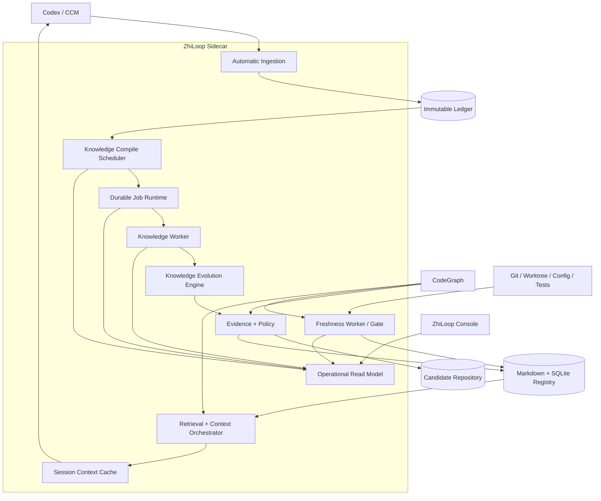
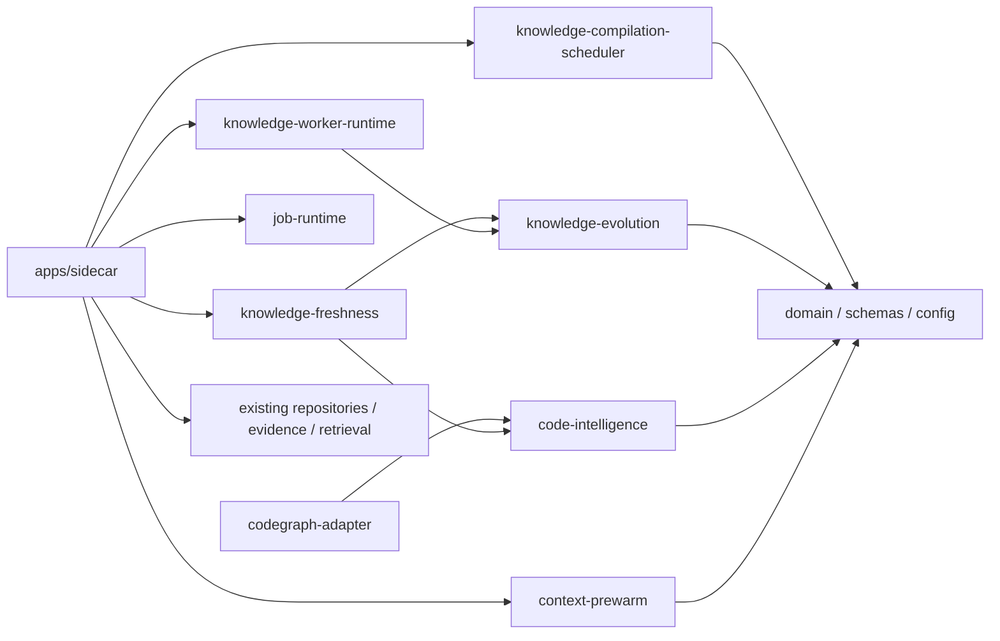
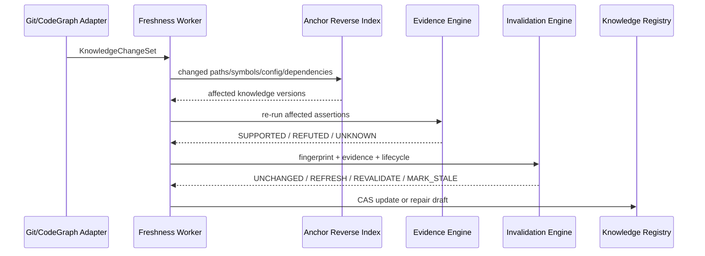
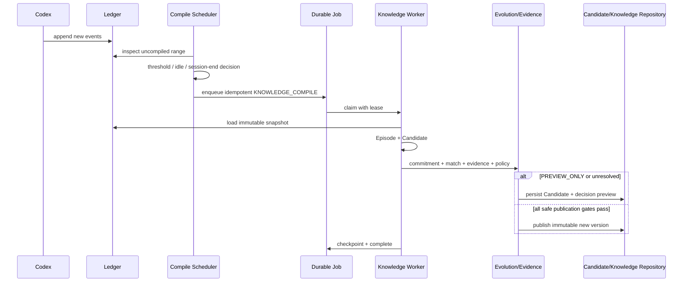
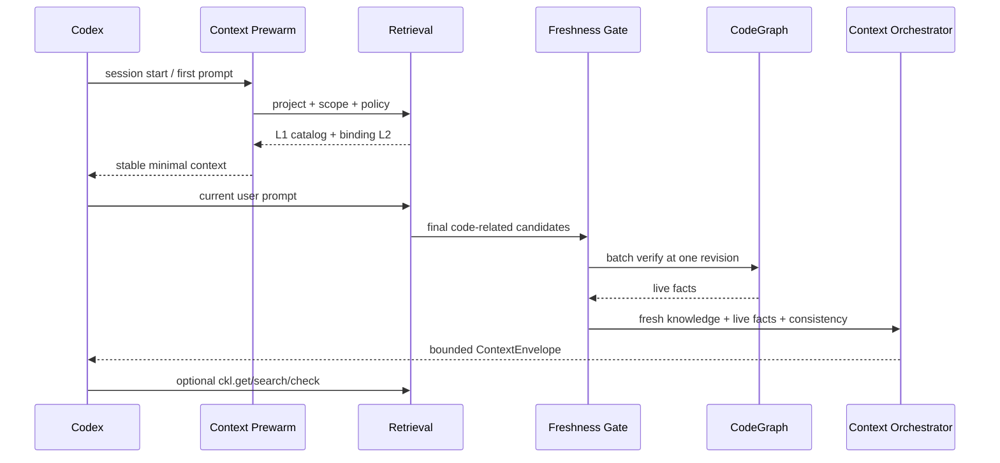
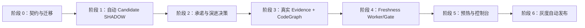

# ZhiLoop 持续知识演进技术方案

**状态**：Proposed  
**版本**：0.1  
**创建日期**：2026-08-14  
**目标读者**：ZhiLoop 实现者、维护者和技术评审者  
**后续动作**：评审通过后再拆分 OpenSpec，不在本文阶段直接实现

**关联文档**：

- [ZhiLoop 总体技术设计](./codex-knowledge-layer-tdd.md)
- [可控复杂度知识注入与有限闭环验证](../adr/0004-context-orchestration-and-closure.md)
- [CodeGraph 作为实时代码事实层](../adr/0005-codegraph-as-live-code-fact-layer.md)
- [CodeGraph 集成与知识保鲜技术设计](./codegraph-integration-and-knowledge-freshness-tdd.md)
- [ZhiLoop 实施计划](../implementation/implementation-plan.md)

## 1. 摘要

ZhiLoop 已经具备 Codex 会话采集、Ledger、手动知识提取、候选与正式知识存储、混合召回、渐进式披露、运行中知识查询、闭环验证和控制台。当前缺口不在“再造一套知识库”，而在于把已有模块组成以下可持续运行的生产闭环：

```text
会话自动增量采集
  → 自动生成知识候选
  → 冲突、用户承诺和代码证据判断
  → 安全发布或保持待定
  → 代码变化后精准复验
  → 新会话按需召回和注入
  → 使用反馈反哺后续版本
```

本文吸收 TencentDB Agent Memory 中成熟的工程模式，包括阈值与空闲触发、异步任务、候选冲突决策、会话预热、分层按需读取、CodeGraph 增量同步和阶段级可观测性，但保留 ZhiLoop 的核心差异：

1. 不把模型提取结果直接视为正式知识。
2. 不把可从当前代码重建的结构事实复制为长期知识正文。
3. 使用不可变 Ledger、知识版本、来源关系和证据门禁保持可追溯。
4. 代码相关知识在注入前必须经过当前代码事实复验。
5. 自动化失败时保持 Candidate/Pending，禁止默认写入正式知识。

## 2. 当前状态与问题

### 2.1 已有可复用能力

| 能力 | 当前模块 | 复用决定 |
|---|---|---|
| Codex 会话发现和增量采集 | `automatic-ingestion`、`codex-session-capture` | 直接复用，不新增采集协议 |
| 不可变事件来源 | `conversation-ledger` | 继续作为唯一对话事实源 |
| 快照、预览和显式提交 | `session-extraction` | 保留手动链路，并与自动链路共用快照语义 |
| Episode 和候选提取 | `episode-builder`、`knowledge-compiler` | 扩展生产编排，不重写提取器 |
| 持久任务、租约和重试 | `job-runtime` | 自动编译和保鲜任务统一复用 |
| 分阶段知识 Worker | `knowledge-worker-runtime` | 增加执行模式和阶段门禁 |
| Candidate 持久化 | `candidate-repository` | 作为未发布知识和冲突预览来源 |
| 证据与策略 | `evidence-engine`、`evidence-policy` | 接入真实代码、配置和测试探针 |
| 知识版本与索引 | `markdown-repository`、`knowledge-registry`、`knowledge-indexer` | 继续使用不可变版本和可重建投影 |
| 检索和注入 | `retrieval-engine`、`retrieval-query-service`、`context-orchestrator`、`active-knowledge-runtime` | 增加预热缓存和 Freshness Gate |
| 失效决策 | `invalidation-engine` | 作为知识保鲜的纯决策内核 |
| 控制台 | `console-gateway`、`console-web`、`operational-read-model` | 增加自动编译、演进和保鲜视图 |

### 2.2 核心缺口

1. 自动采集到 Ledger 后，不会自动进入知识编译；生产能力仍声明为手动提取。
2. 用户承诺检测器存在，但尚未接入生产编译主链路。
3. 当前生产 Evidence Adapter 对多数代码、配置、依赖和测试断言返回 `UNKNOWN`。
4. 相似候选没有形成稳定的 `STORE/SUPPLEMENT/SUPERSEDE/CONTRADICT/SKIP` 演进决策。
5. `invalidation-engine` 尚未由代码变化 Worker 和召回前门禁调用。
6. CodeGraph Adapter、CodeAnchor 反向索引和 Freshness Gate 尚未实现。
7. 每轮召回缺少会话级预热缓存，控制台也无法完整解释缓存命中和失效。

## 3. 目标与非目标

### 3.1 目标

1. 对符合条件的会话自动创建不可重复的知识编译任务。
2. 首阶段自动运行到 Candidate Preview，默认不自动发布。
3. 对候选执行用户承诺、冲突演进、Scope 和 Evidence 判定。
4. 低风险且证据完备的候选可以通过配置逐步启用自动发布。
5. 使用 CodeGraph 作为当前代码事实来源，并在代码变化后精准定位受影响知识。
6. 最终准备注入的代码相关知识必须经过 Freshness Gate。
7. 会话开始时预热稳定的知识目录，正文和实时代码事实仍按需读取。
8. 所有自动决策、失败、重试、版本关系和注入原因可在控制台追溯。

### 3.2 非目标

- 不把全部内容限制为 Skill，也不把知识类型替换为 L0/L1/L2/L3。
- 不在 ZhiLoop 内重新实现代码图谱。
- 不默认代理或篡改所有 LLM 网络请求；Codex 仍通过现有 Hook/App Server/MCP 接入。
- 不在自动编译任务中擅自执行任意测试或命令。
- 不因代码变化覆盖或删除旧知识正文。
- 不在当前阶段建设团队中心化同步和跨设备共享。
- 不把相似度、模型置信度或“Codex 给出的结论”单独作为发布依据。

## 4. 设计原则

1. **先留候选，再决定生效**：自动化提升覆盖率，门禁保证正确性。
2. **确定性优先**：用户明确表态、当前代码、配置和测试优先于模型判断。
3. **失败关闭知识发布，失败开放 Codex 主流程**：知识任务失败保持 Pending；Codex 对话不能被后台故障阻塞。
4. **语义与代码事实分离**：ZhiLoop 保存原因、边界和经验，CodeGraph 提供当前结构事实。
5. **版本演进，不原地改写**：语义变化创建新版本并保留关系。
6. **稳定内容预热，动态事实现查**：会话缓存只保存可复用目录和边界，不缓存为长期权威代码事实。
7. **一个任务运行时**：采集、编译、保鲜任务复用现有 Durable Job 能力。
8. **模块端口化**：调度策略、模型、CodeGraph、证据探针、缓存和控制台均通过显式接口解耦。

## 5. 总体架构

### 5.1 容器视图



### 5.2 模块依赖方向



领域包不得依赖 Sidecar、控制台、CodeGraph SDK 或 SQLite 实现。Sidecar 只负责组合和生命周期管理，不承载演进规则。

## 6. 模块方案

### 6.1 M1：自动知识编译调度

**建议模块**：新增 `packages/knowledge-compilation-scheduler`。

**职责**：

- 读取 Ledger/session 活动投影，判断某个会话何时需要编译。
- 为一次确定的 Ledger 快照生成稳定触发记录。
- 向现有 `SqliteDurableJobStore` 投递知识编译任务。
- 不读取对话正文、不调用模型、不发布知识。

**触发条件**：

| 条件 | 默认值 | 说明 |
|---|---:|---|
| 新增有效 Turn 数 | 3 | 只统计自上次成功快照后的用户/助手有效 Turn |
| 空闲时间 | 120 秒 | 处理低频但已经结束一段的会话 |
| 会话结束 | 开启 | `session.ended` 可立即触发 |
| 最长等待 | 30 分钟 | 避免持续活跃会话永不编译 |
| 最小新增事件 | 2 | 防止只有状态事件时调用模型 |

触发器采用 OR 关系，但必须同时满足“存在未编译有效事件”和“没有相同快照任务”。

**编译检查点**：

```ts
interface KnowledgeCompilationCheckpoint {
  schemaVersion: 1;
  sessionId: string;
  revision: number;
  lastObservedLedgerSequence: number;
  lastCompiledLedgerSequence: number;
  pendingSnapshotId?: string;
  effectiveTurnCount: number;
  lastActivityAt: string;
  nextEligibleAt?: string;
  status:
    | "OBSERVING"
    | "WAITING_IDLE"
    | "QUEUED"
    | "RUNNING"
    | "RETRY_WAIT"
    | "CURRENT"
    | "FAILED";
  lastReasonCode: string;
  updatedAt: string;
}
```

检查点使用 Compare-And-Swap，避免调度扫描、手动提取和会话追加并发覆盖。

**幂等键**：

```text
knowledge-compile:v1:
  sessionId:
  snapshotIdentityHash:
  compilerVersion:
  promptVersion:
  policyHash:
  executionMode
```

同一快照重复触发只能返回已有任务。新事件到达后形成新快照和新任务，不修改正在运行任务的输入。

### 6.2 M2：可靠任务运行与执行模式

**复用模块**：`packages/job-runtime`、`packages/knowledge-worker-runtime`。

不新增第二套队列。`job-runtime` 已具备状态、租约、心跳、fencing token、checkpoint、重试、取消和人工 Retry，自动编译只需新增标准 Job Type：

```text
KNOWLEDGE_COMPILE
KNOWLEDGE_REVALIDATE
KNOWLEDGE_REPAIR_DRAFT
```

知识 Worker 增加执行模式：

```ts
type KnowledgeExecutionMode =
  | "PREVIEW_ONLY"
  | "POLICY_EVALUATION"
  | "SAFE_AUTO_PUBLICATION";
```

| 模式 | 允许阶段 | 默认用途 |
|---|---|---|
| `PREVIEW_ONLY` | 快照、Episode、Candidate、证据预览 | 默认 SHADOW 自动编译 |
| `POLICY_EVALUATION` | 上述阶段 + 演进/策略建议 | 控制台评估，不发布 |
| `SAFE_AUTO_PUBLICATION` | 通过全部门禁后发布 | 后续按知识类型灰度开启 |

Worker 必须继续使用当前分阶段 checkpoint。新增阶段建议为：

```text
SNAPSHOT
EPISODE_BUILD
CANDIDATE_EXTRACTION
USER_COMMITMENT
EVOLUTION_MATCH
EVIDENCE_VERIFICATION
POLICY_DECISION
PUBLICATION
INDEX_PROJECTION
```

已成功阶段重放时不得再次调用模型或重复写入。任何不可重试错误保留阶段输入摘要、reason code 和 operator next action。

### 6.3 M3：用户承诺与知识候选编译

**复用模块**：`episode-builder`、`knowledge-compiler`、`candidate-repository`。  
**生产修正**：将现有 `detectUserCommitments` 和 `applyUserCommitments` 接入 Worker 的 `USER_COMMITMENT` 阶段。

处理顺序固定为：

```text
Episode
  → 模型生成 PROPOSED Candidate
  → Grounding/Schema 校验
  → 用户承诺与纠正检测
  → Scope 收敛
  → 演进匹配
  → Evidence/Policy
```

约束：

- 模型只能创建 `PROPOSED` Candidate。
- 用户明确接受最多提升至 `ACCEPTED`，不能直接得到 `IMPLEMENTED/VERIFIED`。
- 用户明确否定必须保留原内容和否定来源，不物理删除。
- 用户纠正产生新版本草稿，并关联 `SUPERSEDES` 或 `CONTRADICTS`。
- 只引用当前快照中允许的 eventId、turnId 和 sourceEpisode。
- Candidate 必须保存 `compilerVersion + promptVersion + inputHash + policyHash`。

### 6.4 M4：知识演进与冲突决策

**建议模块**：新增 `packages/knowledge-evolution`。

该模块解决“新候选与已有知识是什么关系”，不负责发布和索引。

```ts
type EvolutionAction =
  | "STORE"
  | "SUPPLEMENT"
  | "SUPERSEDE"
  | "CONTRADICT"
  | "SCOPE_SPLIT"
  | "SKIP";

interface EvolutionDecision {
  schemaVersion: 1;
  candidateId: string;
  action: EvolutionAction;
  targetKnowledgeVersions: Array<{ id: string; version: number }>;
  proposedScope: KnowledgeScope;
  deterministicReasons: string[];
  semanticReason?: string;
  confidence: number;
  requiresConfirmation: boolean;
}
```

**匹配顺序**：

1. 相同 `id`。
2. 相同 `subjectKey + kind + scope identity`。
3. aliases、symbols、relation 的确定性重叠。
4. FTS/向量只生成最多 5 个可能目标。
5. 必要时调用一次语义裁决模型。
6. 最终结果由确定性规则和 Evidence Policy 限制。

**决策规则**：

| 场景 | Action | 是否可自动发布 |
|---|---|---|
| 新主题，无冲突 | `STORE` | 取决于 Evidence |
| 同一结论增加适用边界、失败路径或证据 | `SUPPLEMENT` | 低风险且证据完备时允许 |
| 新明确承诺或实现替代旧结论 | `SUPERSEDE` | 需要满足旧知识权威门禁 |
| 两条当前有效知识结论互斥 | `CONTRADICT` | 否，保持 Pending |
| 内容相似但项目/用户/全局范围不同 | `SCOPE_SPLIT` | 仅发布更窄 Scope |
| 纯重复、无新增信息 | `SKIP` | 不发布，记录命中目标 |

相似度服务或语义裁决失败时，不得默认 `STORE`；结果为 `PENDING_EVOLUTION`，由重试或控制台处理。

### 6.5 M5：证据与真实 CodeGraph 适配

**建议模块**：

- 新增 `packages/code-intelligence`：领域端口、规范化 DTO 和能力协商。
- 新增 `packages/codegraph-adapter`：CodeGraph SDK/ToolHandler 适配。
- 扩展 `evidence-engine`：注册真实探针。

`CodeIntelligencePort` 沿用现有 CodeGraph TDD 的接口，不暴露 CodeGraph 节点 ID 或数据库 Schema。首版 Adapter 采用懒加载 SDK，验证支持版本，并把结果转换为 ZhiLoop DTO。

**首版 Evidence Probe**：

| Probe | 来源 | 超时 | 状态上限 |
|---|---|---:|---|
| `SYMBOL_EXISTS` | CodeGraph definition/query | 150 ms | `IMPLEMENTED` |
| `CALL_PATH_EXISTS` | CodeGraph trace | 250 ms | `IMPLEMENTED` |
| `IMPACT_CONTAINS` | CodeGraph impact | 250 ms | `IMPLEMENTED` |
| `FILE_CONTAINS` | 本地只读文件 Adapter | 100 ms | `IMPLEMENTED` |
| `DEPENDENCY_PRESENT` | manifest parser | 100 ms | `IMPLEMENTED` |
| `CONFIG_EQUALS` | 配置 parser | 100 ms | `IMPLEMENTED` |
| `TEST_PASSED` | 当前会话已有命令证据 | 不重新执行 | `VERIFIED` |
| `COMMAND_SUCCEEDED` | 当前会话已有工具证据 | 不重新执行 | 辅助证据 |

默认不允许后台任务自主执行测试。需要主动执行时，后续单独设计命令白名单和授权边界。

**CodeGraph 初始化策略**：

- 已存在且健康：直接使用。
- 未初始化：能力报告 `NOT_CONFIGURED`，控制台提供显式初始化操作。
- 自动编译不得擅自在未知仓库写入 `.codegraph/`。
- 初始化、同步、失败和版本必须进入 Job/Capability/Read Model。
- CodeGraph 故障时降级 Git/path/config 探针；无法确认的代码断言保持 `UNKNOWN`。

### 6.6 M6：代码变化与知识保鲜

**建议模块**：新增 `packages/knowledge-freshness`，内部包含 ChangeSet Worker 和 Freshness Gate 两个应用组件。

该模块复用：

- `invalidation-engine` 作为纯决策函数。
- `knowledge-registry` 和 `markdown-repository` 保存状态与新版本。
- `code-intelligence` 获取当前结构事实。
- Git Adapter 获取 HEAD、dirty digest、rename 和 changed paths。

**变化来源**：

```text
Codex file.changed
Git commit / merge / pull / checkout / rebase
worktree watcher debounce
低频兜底扫描
召回前候选校验
```

**保鲜状态不与知识生命周期混为一体**：

```ts
type FreshnessStatus =
  | "FRESH"
  | "REVALIDATE"
  | "CONFLICT"
  | "UNKNOWN";
```

知识仍使用 `ACCEPTED/IMPLEMENTED/VERIFIED/STALE/SUPERSEDED`。例如历史决策可以保持 `ACCEPTED`，但其“当前实现一致性”为 `CONFLICT`。

**变化驱动流程**：



**召回前 Freshness Gate**：

- 只验证最终准备进入 Context Envelope 的代码相关候选。
- 一批候选必须绑定同一 `codeRevision + graphRevision`。
- `FRESH/CONSISTENT` 才能作为当前代码事实注入。
- `CONFLICT` 排除并创建修复任务。
- `UNKNOWN` 不阻塞 Codex，但不得把历史代码结论标记为当前事实。
- 历史需求、原因和决策可以带警告作为背景继续展示。

### 6.7 M7：渐进式披露与会话预热

**建议模块**：新增 `packages/context-prewarm`，由 `active-knowledge-runtime` 消费。

ZhiLoop 保留现有 L1 Pointer → L2 Compact → L3 Evidenced → L4 Episode，不改成固定 L0–L3 记忆模型。新增会话级预热只优化稳定内容：

```text
可预热：
  - 项目/用户/全局可用知识目录
  - Binding Rule 摘要
  - 知识 ID、简介、权威级别和展开动作
  - Skill/能力目录

禁止作为稳定缓存：
  - 当前调用链全文
  - 当前符号位置和影响集合
  - 未通过 Freshness Gate 的实现结论
  - L4 原始 Episode
```

**缓存键**：

```text
sessionId + projectId + worktree + branch +
knowledgeRegistryRevision + retrievalPolicyHash + injectionPolicyHash + scopeHash
```

`codeRevision` 不进入稳定目录缓存键；代码相关候选在实际注入前统一经过 Freshness Gate。这样可以保持稳定 Prompt，又不把旧代码事实缓存为权威内容。

**失效条件**：

- 新知识版本发布或状态变化。
- Scope、Agent/项目绑定或分支变化。
- Retrieval/Injection Policy 生效版本变化。
- 用户点击“刷新本会话知识”。
- 手动 suppress/pin/remove。

缓存缺失或失效时允许在 Hook deadline 内实时召回；超时返回 L0/空注入，并记录 next action，不阻塞 Codex。

运行中展开继续使用 `ckl.search/get/related/check`。控制面新增语义一致的 `context.refresh(sessionId)`，不通过拦截普通用户 Prompt 实现控制命令。

### 6.8 M8：存储、版本与来源关系

权威数据继续分层：

```text
Ledger                不可变对话事实
Candidate Repository  未发布候选、演进建议和失败
Markdown Repository   正式知识不可变版本
SQLite Registry       可重建查询投影
Runtime Audit Store   召回、注入、保鲜和任务审计
```

建议新增或扩展以下逻辑表：

| 表 | 用途 |
|---|---|
| `knowledge_compilation_checkpoints` | 自动编译会话游标与触发状态 |
| `knowledge_evolution_decisions` | Candidate 到现有知识的演进建议 |
| `code_anchors` | 已在 P8 规划，保存知识版本反向锚点 |
| `verification_recipes` | 可执行断言组合 |
| `code_verification_runs` | revision、结果和有界审计摘要 |
| `knowledge_freshness_projection` | 当前 freshness 状态与原因 |
| `context_prewarm_entries` | 会话稳定目录缓存和依赖 revision |

版本关系统一使用：

```text
DERIVED_FROM
SUPPLEMENTS
SUPERSEDES
CONTRADICTS
IMPLEMENTS
VERIFIED_BY
INVALIDATED_BY
```

正文、Scope、Authority、Anchor 或 Verification Recipe 的语义变化必须创建新版本。只更新 digest、`verifiedAt` 或观察 revision 时，不创建正文版本。

### 6.9 M9：控制台和可观测性

控制台按现有信息架构扩展，不新建独立管理应用。

**运行总览**：

- 自动编译是否启用、当前模式和最后扫描时间。
- 待编译会话、队列深度、运行中、重试和失败数量。
- CodeGraph 健康、索引 revision 和待保鲜数量。
- 最近告警与建议操作。

**会话详情**：

- 自动/手动提取来源、触发原因和 Ledger 快照范围。
- 每阶段状态、耗时、重试次数和失败原因。
- Candidate 正文、用户承诺、演进目标和策略建议。
- 从 Candidate 跳转来源 Event/Turn/Episode/正式知识。

**知识详情**：

- 当前版本、历史版本和演进关系图。
- CodeAnchor、Verification Recipe、最后复验时间和 revision。
- 当前 Freshness、一致性结果和失败原因。
- 手动修改、移除、Suppress、重新验证和生成修复预览。

**注入详情**：

- 预热缓存命中/缺失/失效原因。
- 每个知识项的召回通道、排名、权威、深度和注入原因。
- `KNOWLEDGE/LIVE_CODE_FACT/CONSISTENCY_RESULT` 分区展示。
- 被排除项及 `STALE/UNKNOWN/BUDGET/SCOPE` 原因。

**日志约束**：

- 默认只记录 ID、类型、计数、耗时、reason code 和最多 200 字符脱敏预览。
- 不记录完整对话、知识正文、API Key、命令环境变量或完整 CodeGraph 查询输出。
- 所有阶段共享 `correlationId + jobId + sessionId + snapshotId`。

### 6.10 M10：配置与灰度

当前根配置是严格 `version: 1`。新增顶层模块时升级为 `version: 2`，提供确定性的 v1 → v2 迁移；旧版本程序遇到 v2 必须拒绝启动而不是忽略未知字段。

建议配置：

```yaml
version: 2

compilation:
  enabled: true
  mode: PREVIEW_ONLY
  triggers:
    minNewTurns: 3
    idleMs: 120000
    onSessionEnd: true
    maxWaitMs: 1800000
    minNewEvents: 2
  worker:
    pollIntervalMs: 1000
    concurrency: 1
    retry:
      maxAttempts: 5
      baseDelayMs: 1000
      maximumDelayMs: 60000
      jitterRatio: 0.2
  publication:
    enabled: false
    allowedKinds: []
    requireFreshCodeEvidence: true

evolution:
  maxMatchCandidates: 5
  semanticJudgeEnabled: true
  failClosed: true

codeIntelligence:
  provider: codegraph
  initializeAutomatically: false
  queryTimeoutMs: 250
  circuitBreakerFailures: 3
  circuitBreakerResetMs: 30000

freshness:
  enabled: true
  changeDebounceMs: 1000
  fallbackScanIntervalMs: 3600000
  preInjectionGate: true
  gateTimeoutMs: 200
  maxAffectedPerJob: 500

prewarm:
  enabled: true
  onSessionStart: true
  ttlMs: 1800000
  maxItems: 8
  maxTokens: 800

alerts:
  enabled: false
  onPermanentJobFailure: true
  onCodeGraphUnavailable: false
  onStaleKnowledgeDetected: false
```

安全默认值是：自动生成 Candidate、禁止自动发布、CodeGraph 初始化需要显式操作、后台不主动执行测试、故障不阻塞 Codex。

## 7. 关键链路

### 7.1 自动沉淀链路



### 7.2 新会话召回链路



## 8. 自动发布门禁

首个可交付版本的 `publication.enabled` 必须保持 `false`。后续启用时，单条 Candidate 必须同时满足：

1. Schema、Grounding 和来源完整。
2. Scope 可确定且不发生隐式全局晋升。
3. Evolution Action 不是 `CONTRADICT` 或未决 `SUPERSEDE`。
4. 用户承诺状态与目标生命周期一致。
5. 该知识类型要求的 Evidence 全部满足。
6. 代码相关知识的 Freshness 为 `FRESH`。
7. 不覆盖 `RULE`、高权威 `DECISION` 或人工编辑的新版本。
8. 任务输入、策略和知识目标的 expectedVersion 未变化。

任何条件不满足时保留 Candidate，并显示单一主 reason code 和补充 diagnostics。禁止“部分字段合格就发布部分正文”。

## 9. 故障与降级

| 场景 | 知识链路行为 | Codex 行为 |
|---|---|---|
| 模型超时或格式错误 | Job 重试；耗尽后 Candidate 编译失败 | 不受影响 |
| 演进相似度服务不可用 | 确定性匹配；无法判断则 Pending | 不受影响 |
| Evidence Probe 不可用 | `UNKNOWN`，禁止自动发布 | 可继续，代码事实不注入 |
| CodeGraph 未初始化 | 提示显式初始化；Git/path 降级 | 可继续 |
| CodeGraph 超时 | 断路器；Freshness `UNKNOWN` | 主流程开放失败 |
| Snapshot 在重放时变化 | 非重试失败并报警，禁止混用输入 | 不受影响 |
| Job Worker 崩溃 | 租约超时后其他 Worker 认领 | 不受影响 |
| 发布时 expectedVersion 冲突 | 重新读取并重新做 Evolution | 不覆盖人工版本 |
| 缓存失效 | deadline 内实时召回或空注入 | 可继续 |
| 大规模代码重构 | ChangeSet 合并、分片、限流 | 最终候选仍做门禁 |

## 10. 安全与隐私

- 所有状态默认写入用户本地 ZhiLoop 状态目录，文件权限保持 `0600`。
- CodeGraph Adapter 只读取显式绑定的项目根目录，禁止接受任意绝对路径穿越。
- 项目身份、worktree 和 branch 必须进入所有代码查询及缓存键。
- 外部仓库拉取不是本方案首版职责；本地项目不得被后台 `reset/clean`。
- 模型输入使用最小 Episode 投影，禁止传入无关会话和隐藏推理。
- 运行日志只保存脱敏预览；控制台正文接口沿用 CSRF、本地绑定和权限检查。
- MCP Pull、控制台和自动任务必须共用 Scope/Eligibility Policy，不能绕过状态过滤。

## 11. 替代方案

### 11.1 方案 A：只接通现有自动 Worker，不增加演进和保鲜

**优点**：实现最快，能够马上自动生成或发布知识。  
**缺点**：冲突处理不完整，真实 Evidence 缺失，代码变化后仍可能注入旧结论。  
**决定**：拒绝作为生产方案；可作为 `PREVIEW_ONLY` 的第一实施阶段。

### 11.2 方案 B：完整采用 TencentDB Agent Memory 的 L0–L3 和透明 Proxy

**优点**：通用 Agent 接入、分层记忆和团队资产治理较完整。  
**缺点**：会替换 ZhiLoop 已有领域模型；Persona/Scenario 不适合作为编码知识唯一分类；Proxy 增加网络接入和凭证边界；缺少知识到代码 Anchor 的自动失效闭环。  
**决定**：不采用整体架构，只吸收调度、预热、冲突决策和 CodeGraph 工程模式。

### 11.3 方案 C：所有知识都由用户确认后生效

**优点**：发布责任清晰。  
**缺点**：确认积压不可持续，用户会遗漏或偷懒，最终覆盖率不可控。  
**决定**：拒绝作为主链路；只保留高影响冲突的一次聚焦确认。

### 11.4 方案 D：自动候选 + 确定性门禁 + CodeGraph 保鲜 + 渐进式注入

**优点**：复用现有模块，兼顾自动化、正确性、可追溯和上下文成本。  
**缺点**：模块间契约和评估数据集较多，必须分阶段灰度。  
**决定**：采用。

## 12. 风险与缓解

| 风险 | 严重度 | 可能性 | 缓解措施 |
|---|---:|---:|---|
| 自动提取产生大量低价值 Candidate | 中 | 高 | 最小新增事件、阈值/空闲触发、主题合并、Candidate 保留策略 |
| 模型误判冲突后覆盖正确知识 | 高 | 中 | expectedVersion、强权威门禁、失败 Pending、不可变旧版本 |
| 用户承诺被误识别为接受 | 高 | 中 | 保存原话引用、显式模式 Fixture、状态上限为 ACCEPTED |
| 真实 Evidence 探针覆盖不足 | 高 | 中 | UNKNOWN 不发布；按 Assertion 类型逐步开放 |
| CodeGraph 静态结果与运行行为不一致 | 高 | 中 | CodeGraph 只作结构证据，测试/配置证据独立 |
| Freshness Gate 增加 Hook 延迟 | 高 | 中 | 只验证最终候选、批量查询、revision cache、200 ms 硬预算 |
| 大规模重构产生任务风暴 | 中 | 中 | ChangeSet 去抖合并、反向索引、任务分片、队列上限 |
| 预热缓存返回过期知识 | 高 | 低 | 缓存只存目录；状态 revision 校验；代码候选注入前复验 |
| 配置升级破坏现有安装 | 高 | 低 | v1→v2 自动迁移、备份、严格拒绝未知高版本 |
| 自动任务占用过多 Codex 模型资源 | 中 | 中 | 并发 1、空闲触发、批量上限、成本指标和停用开关 |
| 控制台状态与真实任务不一致 | 中 | 中 | Job/Checkpoint 为权威，Read Model 可重建并带 revision |

## 13. 成功指标

| 指标 | 当前 | 目标 | 测量方式 |
|---|---:|---:|---|
| 符合条件会话自动生成 Candidate 的覆盖率 | 0% | >= 95% | Ledger/Compile checkpoint 对账 |
| 同一快照重复编译任务 | 未建立 | 0 | Durable Job 幂等审计 |
| 自动编译触发到 Candidate 可见 P95 | 未建立 | < 3 分钟 | Scheduler/Job Trace |
| Candidate 到 Event/Turn/Episode 可追溯率 | 已有部分链路 | 100% | Registry 一致性检查 |
| Evidence 为 UNKNOWN 时自动发布次数 | 未建立 | 0 | Policy 审计 |
| 冲突检测故障默认新增正式知识次数 | 未建立 | 0 | 故障注入测试 |
| 相关代码变化定位 Recall | 未建立 | >= 95% | ChangeSet Golden Dataset |
| 不相关变化误失效率 | 已有 Fixture | < 1% | 负样本回放 |
| 已知过期代码事实作为当前事实注入 | 未建立 | 0 | Freshness Golden Cases |
| Freshness Gate P95 | 未建立 | < 200 ms | Hook 指标 |
| UserPromptSubmit 总 P95 | 当前目标 < 300 ms | < 300 ms | Active Runtime 指标 |
| 会话预热缓存命中率 | 未建立 | >= 80% | Injection Trace |
| 默认注入大小 P95 | 当前目标 <= 800 tokens | <= 800 tokens | Renderer 指标 |
| 后台故障阻塞 Codex 次数 | 0 | 0 | 故障注入和运行告警 |
| 每 20 Turn 用户知识确认次数 | 当前目标 <= 1 | <= 1 | Interaction 统计 |

## 14. 测试与 Review Gate

每个模块完成后必须独立通过自测和 Review，禁止等到完整链路最后统一补测。

| 模块 | 单元测试 | 契约/集成测试 | Review 重点 |
|---|---|---|---|
| 自动编译调度 | 阈值、空闲、结束、最长等待、CAS | 同一快照并发只入队一次 | timer 泄漏、忙循环、游标越界 |
| Durable Job 扩展 | Job Type、checkpoint、取消、重试 | 崩溃后租约恢复、幂等 effect | 重复副作用、fencing token |
| 用户承诺 | 接受、否定、纠正、模糊表达 | 原话到状态迁移 | 建议误当承诺 |
| 演进引擎 | 六类 Action 决策矩阵 | FTS/向量故障保持 Pending | 错误覆盖、Scope 串用 |
| CodeGraph Adapter | 版本协商、规范化、超时 | 真实小仓库 definition/trace/impact | SDK 泄漏、路径边界 |
| Evidence Probe | 每类 Assertion 支持/反驳/未知 | Candidate 到 Evidence Policy | 静态证据越权提升 |
| Freshness | ChangeSet、Anchor 命中、状态决策 | 改代码后旧知识退出注入 | 分支串扰、假阳性/漏召回 |
| Context Prewarm | 缓存键、失效、预算 | 首次/后续 Prompt 和手动刷新 | 缓存旧事实、重复正文 |
| 控制台 | 中文状态、失败原因、跳转 | Job/知识/注入读模型一致 | 页面刷新循环、CSRF、正文泄漏 |

完整 Gate 至少包括：

1. 全量 TypeScript 编译、Lint 和单元测试。
2. 既有 P0–P7 Gate 不回归。
3. 自动编译真实 Codex 会话回放。
4. CodeGraph 真实仓库变化回放。
5. CodeGraph/模型/向量服务故障注入。
6. 控制台关键链路浏览器测试。
7. 性能基线和 SQLite 数据一致性检查。

## 15. 实施阶段与依赖



### 阶段 0：契约与迁移

- 配置 v2、领域 DTO、reason code 和数据库迁移。
- 冻结 Scheduler、Evolution、CodeIntelligence、Freshness 和 Prewarm 端口。
- 建立 Fixture 与 Golden Dataset 骨架。

### 阶段 1：自动 Candidate SHADOW

- 实现自动编译检查点和触发器。
- 复用 Durable Job 和 Knowledge Worker。
- 自动运行 `PREVIEW_ONLY`，控制台展示 Candidate 和失败原因。
- 不启用自动发布。

### 阶段 2：承诺与演进决策

- 接通生产用户承诺检测。
- 实现 Evolution Engine 和 Candidate 关系预览。
- 完成 fail-closed 决策和 expectedVersion 并发保护。

### 阶段 3：真实 Evidence 与 CodeGraph

- 实现 CodeIntelligencePort、CodeGraph Adapter 和首批 Probe。
- 生成 CodeAnchor/Verification Recipe。
- 仍保持 SHADOW，评估错误状态提升比例。

### 阶段 4：知识保鲜

- 接通 ChangeSet Worker、反向索引和 invalidation-engine。
- 接入召回前 Freshness Gate。
- 迁移旧代码相关知识并生成影响预览。

### 阶段 5：预热和控制台

- 会话稳定目录预热、缓存失效和手动刷新。
- 自动编译、演进、CodeGraph、Freshness 和注入解释视图。
- 完成真实浏览器链路验收。

### 阶段 6：灰度自动发布

- 只选择 Golden Dataset 达标的低风险知识类型。
- 首先按项目、知识类型和用户 opt-in 灰度。
- 任一错误发布指标越界立即退回 `POLICY_EVALUATION`。

### 2026-08-19 实施状态

M1～M10 已按本设计落地并完成模块级测试：自动 Candidate、执行模式、用户承诺、Evolution、CodeGraph、Freshness 投影/复验、预热/注入门禁、控制台可观测性以及配置 v2 均已接通。生产默认仍为 `PREVIEW_ONLY + SHADOW`。

安全自动发布的逐 Candidate 门禁已经实现并测试；当前在线配置 consumer 故意保持 `NOT_CONFIGURED`，所以不能从控制台开启自动提交。只有后续 Golden 指标达标并显式组合发布 consumer 后，才允许按项目和知识类型灰度启用阶段 6，不得仅通过修改布尔配置绕过。

**可并行边界**：阶段 0 接口冻结后，自动调度、Evolution、CodeGraph Adapter 和控制台只读原型可以并行；Freshness Worker 依赖 CodeGraph/Anchor；自动发布必须最后启用。

## 16. 后续 OpenSpec 拆分建议

本文评审通过后，建议拆为以下独立 Change，避免一个 Spec 覆盖过多模块：

1. `enable-automatic-knowledge-compilation`
2. `wire-user-commitment-and-evolution-policy`
3. `integrate-codegraph-evidence-adapter`
4. `implement-knowledge-freshness-gate`
5. `add-session-context-prewarm`
6. `expose-knowledge-evolution-console`
7. `migrate-legacy-code-related-knowledge`

每个 Change 都必须引用本文的模块编号、领域契约、成功指标和测试 Gate，不得自行改变 fail-closed、不可变版本和注入前保鲜边界。架构决策如果在评审中变化，应先更新本文或新增 ADR，再生成 Spec。

## 17. 外部参考及取舍

本文参考 TencentDB Agent Memory 当前默认分支提交 `4dca55c41bf11cb19b49728dbe495c8e05d25abb`：

- [总体分层、资产和按需工具设计](https://github.com/TencentCloud/TencentDB-Agent-Memory/blob/4dca55c41bf11cb19b49728dbe495c8e05d25abb/README_CN.md)
- [阈值与空闲触发的 MemoryPipelineManager](https://github.com/TencentCloud/TencentDB-Agent-Memory/blob/4dca55c41bf11cb19b49728dbe495c8e05d25abb/MemoryCore/src/utils/pipeline-manager.ts)
- [相似记忆召回与 store/update/merge/skip 判断](https://github.com/TencentCloud/TencentDB-Agent-Memory/blob/4dca55c41bf11cb19b49728dbe495c8e05d25abb/MemoryCore/src/core/record/l1-dedup.ts)
- [静态记忆能力目录和按需查询](https://github.com/TencentCloud/TencentDB-Agent-Memory/blob/4dca55c41bf11cb19b49728dbe495c8e05d25abb/MemoryProxy/src/injection/injectors/tdai-tools-injector.ts)
- [CodeGraph Bridge](https://github.com/TencentCloud/TencentDB-Agent-Memory/blob/4dca55c41bf11cb19b49728dbe495c8e05d25abb/MemoryKnowledge/src/engines/code/bridge.ts)
- [CodeGraph 自动同步调度](https://github.com/TencentCloud/TencentDB-Agent-Memory/blob/4dca55c41bf11cb19b49728dbe495c8e05d25abb/MemoryKnowledge/src/store/auto-sync-scheduler.ts)

采用的是工程模式，不采用以下边界：冲突判断失败默认存储、全量 L0–L3 替换 ZhiLoop 知识类型、透明 LLM Proxy 作为唯一接入、周期性重同步全部 ready 仓库，以及 CodeGraph 更新但不联动语义知识失效。

## 18. 评审结论模板

在进入 OpenSpec 前，技术评审至少确认：

- [ ] 模块职责和依赖方向无循环。
- [ ] 自动编译首阶段只生成 Candidate。
- [ ] 生产用户承诺和 Evidence 接线顺序明确。
- [ ] 演进失败不会默认新增正式知识。
- [ ] CodeGraph 不成为业务语义的唯一权威。
- [ ] Freshness 与知识生命周期是两个维度。
- [ ] 会话缓存不保存长期权威代码事实。
- [ ] 配置 v2 有迁移和回滚方案。
- [ ] 每个模块有可测成功指标和独立 Gate。
- [ ] 后续 OpenSpec 边界可以独立实施和回滚。
