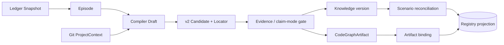
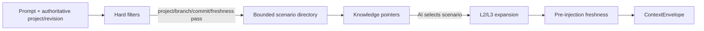

# 场景化知识定位、维护与 CodeGraph 复用技术方案

**状态**：Implemented / accepted  
**日期**：2026-08-20  
**关联变更**：`scenario-aware-knowledge-localization-and-codegraph-reuse`

## 1. 目标

每条项目知识必须能回答：属于哪个项目、在哪个分支/提交上观察、用于什么场景、从哪个入口触发、适用与不适用边界是什么。代码变化后，只维护真正受影响的知识；新任务只看到匹配场景的少量目录，详情按需展开。

## 2. 对腾讯 Agent Memory 的借鉴

[TencentDB-Agent-Memory](https://github.com/TencentCloud/TencentDB-Agent-Memory) 的维护主线是 `L0 Conversation → L1 Atom → L2 Scenario → L3 Persona`：先形成原子记忆，再聚合为场景；新内容按 `add/update/merge/skip` 演进；检索先用高层场景，必要时回退到原子或原始对话。MemoryCore 负责记忆层次、隔离和检索，MemoryKnowledge 负责 Wiki/CodeGraph 同步与查询。

ZhiLoop 采用其中四个原则：

1. 对话不是知识本身，先不可变记录，再提炼原子知识。
2. 场景是可版本化的聚合投影，不是手工目录。
3. 更新优先于重复新增，模糊合并保持 `PENDING`。
4. 场景摘要常驻，正文和代码证据按需展开。

### 2.1 维护动作的落地映射

腾讯方案的关键不只是 L0–L3 分层，而是让新原子记忆先召回相近项，再决定保存、更新、合并或跳过；L2 场景使用可直接检查的 Markdown，检索从高层摘要向底层证据逐级下钻。ZhiLoop 将这套维护思想改造成确定性状态机：

| 腾讯维护动作 | ZhiLoop 动作 | 约束 |
|---|---|---|
| store / add | `CREATE` / `STORE` | 新 subject 或新场景，证据与定位门禁通过后创建 v1 |
| update | `UPDATE_VERSION` / `SUPERSEDE` | 内容变化创建新版本，不覆盖旧正文 |
| merge | `MERGE_VERSION` / `SUPPLEMENT` | 项目、分支、入口及排除边界均兼容时才自动合并 |
| skip | `SKIP` | 重复、瞬时进度或无持久价值内容不进入知识层 |
| 无法安全判断 | `PENDING` / `KEEP_SEPARATE` | 不让模型在场景冲突时强行合并，保留人工或后续证据入口 |

L0 Ledger 和历史知识版本始终保留，因此任何 L2 场景摘要都能下钻到 Knowledge、Episode 和原始对话。与通用记忆方案不同，代码事实还必须绑定 Git/CodeGraph revision；仅语义相似不足以触发更新或合并。

### 2.2 存储与索引边界

- Markdown 保存可读的知识正文和场景卡片，支持人直接检查与版本管理。
- SQLite 保存状态、关系、版本、定位、证据、任务和检索投影；它是运行索引，不是唯一事实副本。
- BM25/关键词负责无向量时的稳定召回，向量或模型重排是可插拔增强；项目、分支、场景和新鲜度始终先做硬过滤。
- CodeGraph 保存/计算代码结构；ZhiLoop 只缓存有界且带 revision 的 Artifact，不复制完整代码图。

ZhiLoop 面向软件工程，额外增加腾讯通用记忆层没有强制解决的门禁：`projectId + branch + commit + dirty` 权威定位、claim mode、Evidence Policy、CodeGraph revision 兼容、旧知识非破坏迁移及注入前 freshness gate。

## 3. 数据分层

| 层 | 内容 | 权威性 | 更新方式 |
|---|---|---|---|
| L0 Ledger | 脱敏会话事件、Turn、工具证据 | 不可变来源 | 只追加 |
| L1 Knowledge | 需求、边界、决策、实现语义、经验 | 版本化知识 | 新版本替代，禁止原地覆盖 |
| L2 Scenario | 意图、入口、适用/排除、知识指针 | 可重建投影 | CREATE / UPDATE / KEEP_SEPARATE / SKIP |
| Live Code Fact | CodeGraph 符号、调用链、影响面 | 当前代码权威 | 实时查询或兼容 artifact 复用 |

`KnowledgeScope` 表示访问/共享边界；`KnowledgeLocator` 表示项目、时间、分支和场景坐标，两者不得混用。

## 4. 模块与职责

| 模块 | 职责 | 关键输出 |
|---|---|---|
| Project Identity | 读取可信 Git branch/commit/dirty | `ProjectContext.revision` |
| Compiler | 模型只产出 claimMode 与 ScenarioHint；系统补权威坐标 | v2 Candidate + Locator |
| Evidence Engine/Policy | 区分当前事实、用户决策、未来需求 | SUPPORTED / UNKNOWN / INVALID_ASSERTION / PENDING_IMPLEMENTATION |
| Scenario Evolution | 确定性去重和版本演进，边界冲突不合并 | ScenarioDecision |
| Registry Projection | 保存场景版本、绑定、关系和人可读 Markdown | Scenario Card |
| Code Intelligence | 规范化并限制 CodeGraph 结果 | CodeGraphArtifact（最多 50 facts） |
| Retrieval Engine | 先硬过滤项目/分支/提交/新鲜度，再选场景 | Scenario Directory + trace |
| Context Orchestrator | 只展开已选场景；L1 指针优先 | 有界 ContextEnvelope |
| Console | 展示定位、场景、artifact、失效原因和来源 | 中文可追溯视图 |

## 5. 写入链路



门禁规则：

- `CURRENT_STATE` 没有可信 branch+commit 时不得发布。
- `USER_DECISION/FUTURE_REQUIREMENT` 中“代码尚未实现”是 `PENDING_IMPLEMENTATION`，不是对需求的反驳。
- 断言结构无效是 `INVALID_ASSERTION`；证据源不可用是 `UNKNOWN`，两者都不能提升知识状态。
- 相同场景 key 生成新版本；入口、分支或排除边界冲突时保持分离或等待确认。

## 6. 召回与注入链路



初始目录最多 20 个场景，默认选取最多 3 个正分场景。未选择的场景最多保留 L1 指针，并记录 `SCENARIO_SELECTION_REQUIRED_FOR_EXPANSION`。硬过滤产生稳定 reason code，例如 `LOCATOR_PROJECT_FILTERED`、`BRANCH_FILTERED`、`COMMIT_FILTERED`、`DIRTY_REVISION_FILTERED`，便于控制台解释“为什么没召回”。

当前 `BRANCH_LINEAGE` MVP 只在同一/base commit 上自动兼容；完整 Git ancestry provider 接入前，无法证明祖先关系时 fail closed。

## 7. CodeGraphArtifact 复用

Artifact 保存查询类型、查询、规范化事实、项目、Git commit、graph revision、来源、观察时间、截断标记和内容 hash。只有项目、代码 revision、graph revision 均兼容，且 changed paths/symbols 未命中依赖时才复用；否则标为 `SUSPECT` 并重新查询。

Artifact 是缓存和审计投影，不是知识正文，也不是代码权威。内容 hash 冲突拒绝覆盖；同一知识版本可绑定多个 artifact。

## 8. 旧知识迁移与回滚

旧 v1 资产继续可读。迁移只生成 `DRAFT` 定位投影，不修改历史 Markdown、Asset 或 Ledger，也不会猜测历史 commit。

```bash
# 只读预览（默认）
npm run migrate:localization -- --registry /path/knowledge-registry.sqlite --project <project-id>

# 明确写入可重建投影
npm run migrate:localization -- --registry /path/knowledge-registry.sqlite --project <project-id> --commit

# 只删除该次派生投影
npm run migrate:localization -- --projection /path/knowledge-registry.sqlite.localization.sqlite --rollback <rebuild-id>
```

迁移草稿固定带 `LEGACY_REVISION_UNKNOWN` 和 `MANUAL_REVALIDATION_REQUIRED`。回滚通过 rebuild ID 精确删除派生行，不触碰原始知识。

## 9. 运维与发布顺序

1. 先部署读兼容 schema 和控制台展示。
2. Shadow 模式生成 v2 Candidate、场景和 artifact，但比较新旧召回结果。
3. 对旧知识运行只读预览，抽样检查项目与场景草稿。
4. 开启定位硬过滤；监控过滤 reason code、误注入和召回下降。
5. 真实会话验收通过后再启用主动注入。

回退时关闭新检索策略即可；v2 数据仍可由旧读取路径忽略，新表均为可重建投影，不需要删除 Ledger 或知识历史。

## 10. 已知边界

- 不自动初始化目标业务仓库的 CodeGraph。
- 不把静态调用关系当作运行行为证据；动态结论仍需测试/配置/运行证据。
- 不自动合并跨项目场景。
- 不在缺少 Git ancestry 证明时扩大分支适用范围。
- 不把旧知识迁移草稿直接提升为当前代码事实。
