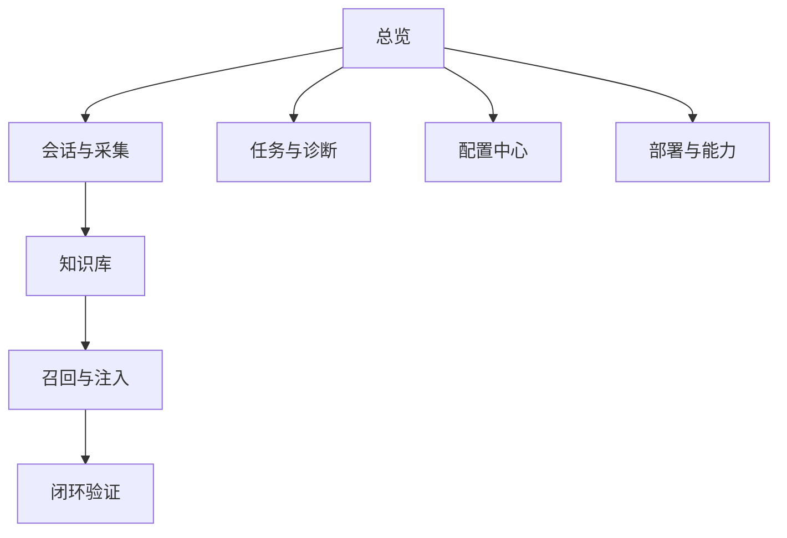
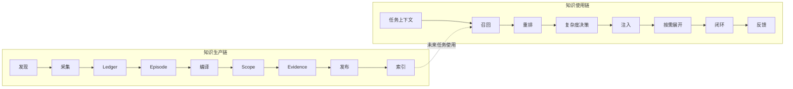
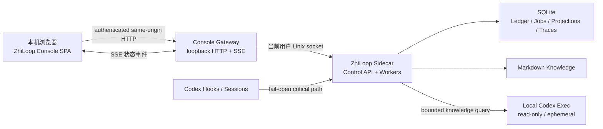
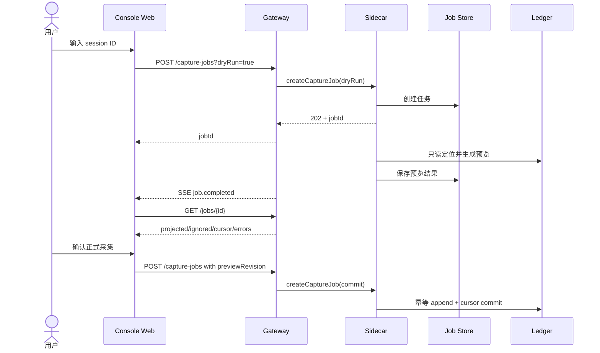
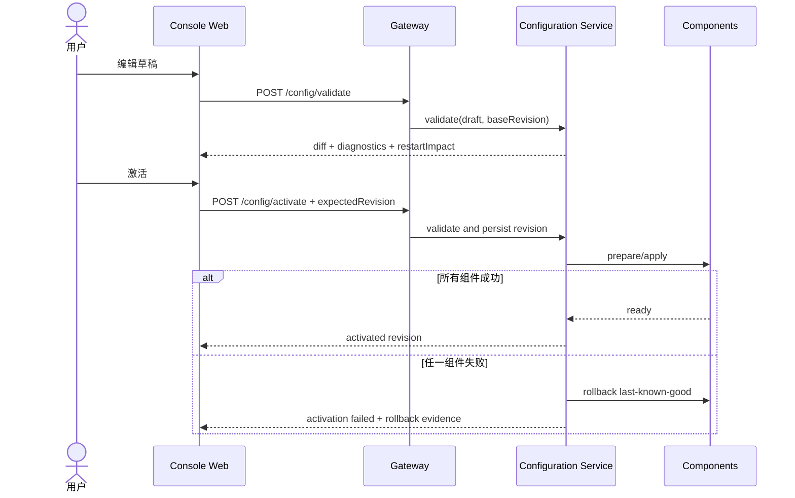

# ZhiLoop Console 本地控制台技术设计

**状态**：Implemented
**版本**：1.0
**创建日期**：2026-08-03  
**最后更新**：2026-08-04
**目标读者**：产品设计者、实现者、维护者、测试与安全评审者  
**关联文档**：

- [ZhiLoop 总体技术设计](./codex-knowledge-layer-tdd.md)
- [本地部署与回滚](../deployment.md)
- [ADR-0001：模块化单体与端口适配器](../adr/0001-modular-monolith.md)
- [ADR-0004：可控复杂度知识注入与闭环验证](../adr/0004-context-orchestration-and-closure.md)
- [OpenSpec：build-zhiloop-console](../../openspec/changes/build-zhiloop-console/design.md)

## 1. 摘要

ZhiLoop Console 是面向本机用户的可交互控制台。它不是 SQLite 浏览器，也不是简单的 daemon health 页面，而是 ZhiLoop 两条核心链路的可视化控制面：

1. **知识生产链**：对话发现 → 采集 → Ledger → Episode → 编译 → Scope → Evidence → 发布 → 索引。
2. **知识使用链**：任务理解 → 召回 → 重排 → 复杂度决策 → 注入 → MCP 按需展开 → 闭环验证 → 反馈。

控制台必须如实展示当前能力。尚未接通的阶段显示为 `DISABLED` 或 `NOT_CONFIGURED`，同时给出原因码和前置条件；禁止用空数据、绿色状态或不可用开关伪装为已完成。

首版采用**独立本地 Console Gateway + 浏览器 SPA**。Gateway 只监听 loopback，通过当前用户 Unix socket 调用 Sidecar 的受控 Control API。Sidecar 仍是 Ledger、流水线状态和配置激活的唯一写入者，浏览器不得直接访问 SQLite、知识目录或用户 Home。

## 2. 背景与问题

当前已部署版本能进行健康检查和指定会话的手动采集，但用户无法直观看到：

- Hook 是否真正捕获了最新 Codex 会话。
- 哪些会话已沉淀、哪些漏采、游标停在哪里。
- `knowledgeCompiled: false` 究竟是失败、跳过还是能力尚未接通。
- 某条知识如何从对话产生、属于项目还是全局、由什么证据确认。
- 某次查询为什么召回某条知识、为什么另一条召回成功但没有注入。
- L1 指针是否被模型通过 MCP 展开，以及实际展开了哪些正文。
- 闭环验证检查了哪些 Gate、为何续跑或请求人工确认。
- Worker、spool、后台任务和配置是否处于健康状态。

只提供 CLI 会使诊断和治理门槛过高；只做通用管理后台又会掩盖知识链路的关键语义。因此控制台需要围绕“链路可解释”和“安全控制”建模。

## 3. 目标与非目标

### 3.1 目标

1. 在一个页面内判断 ZhiLoop 是否运行、运行在哪种模式、哪一段链路未接通。
2. 可查看并主动采集会话，后续支持自动发现、持续跟踪和漏采补偿。
3. 可追踪每条知识的来源会话、Scope、版本、证据、状态和失效原因。
4. 可回放召回、重排、预算裁剪、注入和按需展开决策。
5. 可查看闭环 Gate、纠偏 delta、续跑次数和人工介入原因。
6. 可安全修改基础策略，做到校验、预览、原子激活、审计和回滚。
7. 所有尚未实现的能力都有明确的可见状态，不让用户依赖日志猜测。
8. 控制台故障不得阻塞 Codex Hook，也不得改变 SHADOW 的失败开放语义。

### 3.2 非目标

- 首版不提供多人协作、远程访问和中心化身份系统。
- 首版不允许从浏览器执行任意 shell 命令或编辑任意本地文件。
- 首版不暴露隐藏推理、凭证、完整环境变量和未脱敏 payload。
- 首版不以图形界面替代版本化 Markdown；知识正文仍以 Markdown 为权威源。
- 首版不绕过现有 `SHADOW` 门禁启用 `ACTIVE`。
- 控制台不是生产知识流水线的替代品；页面必须读取真实阶段状态，不能在前端模拟完成。

## 4. 当前基线与能力状态

| 能力 | 源码模块 | 当前部署组合 | 控制台首版表示 |
|---|---|---|---|
| Sidecar 健康与 SHADOW 模式 | 已有 | 已接通 | `READY / SHADOW` |
| 指定会话采集到 Ledger | 已有 | 已接通 | 可操作、可查看报告 |
| Codex 实时 Hook | 已有 | 已安装并有真实链路证据 | `READY`，显示最后 Hook 事件 |
| 自动发现、follow、补采 | 已实现 | durable job 与 scheduler 已接通 | 进度、checkpoint、重试与完整性可见 |
| Episode/编译/Scope/Evidence | 已实现 | Production Worker 已接通 | snapshot、candidate、policy 与 provenance 可见 |
| Markdown 发布和索引 | 已实现 | outbox、Registry 与增量索引已接通 | 版本、Evidence、状态与索引版本可见 |
| 召回、重排、Context Envelope | 已实现 | P3/P4 检索链已接通 | 搜索、问答、Trace 与策略比较可用 |
| MCP 按需展开 | 已实现 | 本地受控 transport 与审计已接通 | L1→L2/L3 展开与实际使用可见 |
| Stop 闭环和反馈 | 已实现 | 有限 continuation、Gate 与反馈已接通 | Closure、纠偏与人工确认可见 |
| ACTIVE 模式 | 已实现 | 默认仍为 SHADOW | 只能经质量证据、灰度和高风险确认切换 |
| 可观测控制面 | 已实现 | Gateway + SPA 已部署 | 本设计交付完成 |
| Linux/Windows、跨机器同步 | 未部署 | 未接通 | “部署与同步”页显示不支持 |

### 4.1 交互需求推演结论

| 需求 | 0.1 设计结论 | 0.2 调整后的结论 | 必须新增的后端契约 |
|---|---|---|---|
| 类似 Codex 的只读会话列表 | 部分支持，只定义了已发现/已采集会话 | 支持；列表覆盖所有可发现 Codex 会话，明确只读 | Session Catalog、稳定排序、增量扫描 |
| 会话注入、手动提取和追溯 | 部分支持，注入在独立 Trace 页面 | 支持；会话详情增加注入和提取页签 | session→turn→run→trace、extraction snapshot |
| 修改或移除不满意知识 | 原则支持，但写操作排在后期 | 支持；基础治理前移到知识生产阶段 | versioned edit、suppress/restore、impact preview |
| 上下文、频率、重试和告警配置 | 只有配置分类，没有字段级契约 | 支持；增加字段、作用域、边界和生效方式 | scheduler/retry/alert schemas |
| 自然语言召回并由本地 Codex 处理 | 只支持确定性 dry-run | 支持；增加“搜索”和“问 ZhiLoop”两种模式 | read-only Codex query adapter、answer citations |

这里的“支持”已经包含当前发行的运行组合；`SHADOWED` 与 `INJECTED` 仍严格按真实投递证据区分。

## 5. 产品信息架构



全局导航固定为：

1. 总览
2. 会话与采集
3. 知识库
4. 召回与注入
5. 闭环验证
6. 任务与诊断
7. 配置中心
8. 部署与能力

顶栏持续显示 Sidecar 状态、版本、模式、当前项目过滤器、数据更新时间和未处理告警数。

## 6. 统一状态模型

### 6.1 能力状态

```text
NOT_IMPLEMENTED  代码尚不存在
DISABLED         代码存在，但当前部署没有组合或策略关闭
NOT_CONFIGURED   已组合，但缺少必要配置或 Provider
NOT_VERIFIED     已安装，但尚无真实链路证据
STARTING         正在启动
READY            正常可用
DEGRADED         可用但存在积压、超时或降级
FAILED           不可用
```

### 6.2 流水线阶段状态

```text
NOT_APPLICABLE   该实体无需经过此阶段
PENDING          等待处理
RUNNING          正在处理
SUCCEEDED        成功且有完成证据
FAILED           执行失败，可查看错误码和重试信息
BLOCKED          被上游、配置或门禁阻塞
SKIPPED          根据策略明确跳过
DISABLED         当前部署没有启用该阶段
```

每个状态响应必须同时包含：

- `status`
- `reasonCode`
- `observedAt`
- `lastTransitionAt`
- `evidenceRefs[]`
- `retryable`
- `nextAction`（可为空）

`knowledgeCompiled: false` 在新模型中不得单独出现，而应表达为：

```json
{
  "stage": "KNOWLEDGE_COMPILE",
  "status": "DISABLED",
  "reasonCode": "KNOWLEDGE_WORKER_NOT_COMPOSED",
  "retryable": false,
  "nextAction": "Enable the production knowledge worker"
}
```

### 6.3 两条链路必须分开展示

会话详情展示知识生产链；一次 Codex 任务或 retrieval run 展示知识使用链。不是每个会话都会在未来被召回，因此“从未被召回”不能标记为会话失败。



## 7. 页面功能设计

### 7.1 总览

目标是让用户在 10 秒内回答“系统是否正常、数据是否在流动、哪里没有接通”。

页面区块：

- **运行卡片**：Sidecar、Console Gateway、Hook、Worker、MCP、索引器、闭环验证器。
- **模式与版本**：当前版本、协议版本、`SHADOW/ACTIVE`、安装渠道、最近升级。
- **实时链路图**：两条链路各阶段状态、最近吞吐、积压和最后成功时间。
- **最近会话**：最后活动、项目、采集方式、事件数、生产链当前阶段。
- **后台任务**：运行中、失败、等待重试、最老积压年龄。
- **知识概览**：候选/已发布/已验证/失效数量，按项目和全局分层。
- **最近使用**：召回次数、实际注入、MCP 展开、闭环纠偏；未接通时显示原因。
- **告警与建议**：例如“Hook 24 小时没有真实事件”“spool 有积压”“编译 Worker 未启用”。

禁止仅用红黄绿图标；颜色旁必须显示状态文本和原因。

### 7.2 会话与采集

#### 会话列表

会话列表采用与 Codex 相似的信息密度、时间分组和最近活动排序，但不复制 Codex 私有 UI，也不承诺依赖其非公开展示字段。数据来自只读 Session Catalog：优先使用稳定 App Server 会话元数据；不可用时扫描 `~/.codex/sessions` 的版本化 transcript adapter。Catalog 与 Ledger 分离，因此未采集的会话同样可见。

控制台对 Codex 会话严格只读：不发送消息、不继续任务、不归档、不重命名、不删除 transcript，也不修改 Codex 的会话状态。ZhiLoop 自己产生的提取、标签和知识治理状态写入 ZhiLoop 存储，不回写 Codex。

字段：

- 会话 ID、标题摘要、来源、项目、cwd
- 首次/最后活动时间
- 发现状态、采集状态、最新游标
- 事件数、Turn 数、忽略记录数、脱敏次数
- 完整性：`LIVE_HOOK / MANUAL_IMPORT / BACKFILL / PARTIAL`
- 知识生产链当前阶段

过滤器：项目、时间、来源、采集状态、阶段状态、是否存在错误、是否漏采。

展示规则：

- 默认按“今天 / 昨天 / 最近 7 天 / 更早”分组，并按 `lastActivityAt DESC, sessionId ASC` 稳定排序。
- 标题优先使用 Codex 可观察元数据；缺失时由首条脱敏用户消息生成本地摘要，不调用模型阻塞列表。
- 区分 `DISCOVERED_NOT_CAPTURED`、`CAPTURED_PARTIAL`、`CAPTURED_CURRENT` 和 `SOURCE_UNAVAILABLE`。
- Catalog 扫描失败只影响列表完整性，不影响已有 Ledger 和 Hook。

操作：

- 按会话 ID 主动采集，默认先 dry-run 并展示影响预览。
- 对已发现会话执行采集或补采。
- 重试失败任务。
- 复制诊断 ID，不复制正文。
- 后续启用 follow/backfill 时，可按项目或时间范围创建任务。

#### 会话详情

- **生产链时间轴**：每阶段开始、结束、处理数量、原因码和关联 job。
- **Turn 时间轴**：用户消息与最终助手结论的脱敏摘要；默认不展示原始 payload。
- **注入记录**：按 Turn 展示 `OFF / SHADOWED / INJECTED / NO_CONTEXT / TIMEOUT / ERROR`，并展示实际或影子 Context Envelope、token、知识版本和未注入原因。
- **按需展开记录**：展示该会话内 MCP search/get/related/check 的知识指针、展开级别和使用关联。
- **事件视图**：事件类型、sequence、source、correlation ID、hash、redaction count。
- **游标与文件身份**：transcript path 的安全别名、锚点、offset、最后扫描时间。
- **提炼结果**：关联 Episode、Candidate、Knowledge Asset；未编译时显示明确原因。
- **覆盖说明**：当前未采集的工具细节、子 Agent 等事件类型必须列出，避免用户误以为完整。

注入可追溯关系固定为：

```text
sessionId -> turnId -> injectionAttempt -> runId -> retrievalTraceId
          -> ContextEnvelope.items[] -> knowledgeId@version
```

`SHADOWED` 只能标记为“计划注入”，`INJECTED` 才能标记为“实际进入模型上下文”。如果 Hook 超时或返回失败，即使检索已完成也不得显示为已注入。

#### 会话级手动提取

会话详情提供“提取当前快照”操作：

1. 先确保 transcript 增量采集到 Ledger。
2. 固定 `sourceSequenceTo`、transcript identity 和 cursor，形成不可变 extraction snapshot。
3. 对该快照执行 normalize → episode → compile → scope → evidence。
4. 先展示 Candidate 预览，不因点击按钮直接发布为可召回知识。
5. 用户选择“按策略提交”后，Evidence Policy 决定发布、保留 PROPOSED 或请求微确认。

正在进行的 Codex 会话允许提取，但结果标记 `PARTIAL_SNAPSHOT`；后续新消息通过新 snapshot 增量提取，不能静默改写旧结果。重复提取同一 snapshot 与 compiler/policy 版本必须幂等。

会话与知识的双向追溯为 P1 数据契约、P2 界面跳转：即使首版尚未实现点击跳转，ID、版本和 source reference 也必须从第一天保存。

#### 自动采集

在能力接通前，该区块以 disabled capability card 展示：

- Codex 会话目录监听状态
- follow 策略
- session close 触发编译策略
- 漏采扫描周期
- 子 Agent 归并策略
- 最近一次完整性扫描及发现差异

### 7.3 知识库

知识页面解决“RAG 内容不可见、关键词相关性和生效依据无法决策”的问题。

#### 知识列表

支持以下维度组合筛选：

- Scope：任务、符号、模块、项目、用户、团队、全局
- 类型：事实、需求、方案、决策、实现、经验、规则、偏好、开放问题
- 状态：PROPOSED、ACCEPTED、IMPLEMENTED、VERIFIED、STALE 等
- 项目、subject key、关键词、符号、更新时间、证据 verdict

列表必须同时显示：标题、摘要、Scope、类型、状态、置信度、证据数量、版本、最后验证时间和是否可参与默认召回。

#### 知识详情

- Markdown 正文及版本 diff
- 来源 Episode → Turn → Event 的追溯链
- Scope 判定及 reason codes
- assertions、evidence、verdict 与验证时间
- applicability / non-applicability
- symbols、aliases、keywords
- relation graph：派生、实现、冲突、替代、重复、相关
- 生命周期历史和失效原因
- 最近被召回、注入、展开和反馈记录

治理操作按风险分级：

- 低风险：添加别名、关键词、适用/不适用条件，走新版本预览。
- 中风险：修改 Scope、状态、关系，必须展示影响范围。
- 高风险：提升为 GLOBAL、压制 Binding Rule、强制发布，必须经过门禁，不能由 UI 绕过策略。

#### 修改、移除与恢复

“移除”必须让用户选择语义，禁止一个含糊的删除按钮：

- **停止召回（默认）**：创建 suppression/tombstone revision，使该知识立即退出默认召回；历史、来源和审计仍保留，可恢复。
- **替代**：新知识版本或另一资产通过 `SUPERSEDES` 关系替代旧知识；旧版本不可参与默认召回。
- **隐私删除**：仅用于敏感正文清除，执行 payload purge 和知识正文清理；必须单独确认并保留无正文 tombstone 审计。

修改知识不会原地覆盖：

1. 基于 `expectedVersion` 创建草稿 revision。
2. 显示正文、Scope、关键词、关系、证据和召回影响 diff。
3. 重新运行 Schema、Scope 和 Evidence 检查。
4. 如果修改使原 Evidence 不再支持结论，状态降为 `PROPOSED` 或 `STALE`。
5. 原子发布新 Markdown 版本并更新投影；失败保持旧 current。

`RULE`、`GLOBAL` 和已实际注入的知识修改必须额外展示 blast radius；UI 不能强制绕过 Binding 和 Global Promotion 门禁。

所有写操作最终写入权威 Markdown/Registry，并产生不可变审计记录；禁止前端直接更新投影表。

### 7.4 召回与注入

这是解释知识相关性和上下文预算决策的核心页面。

#### Retrieval Runs 列表

字段：run/trace ID、任务、项目、prompt fingerprint、召回数、注入数、复杂度、token、耗时、结果和异常。

#### Trace 详情

对每个候选展示：

- Exact / FTS / Vector / Relation 各通道贡献
- RRF 分数、召回 rank、最终 rank
- Scope 与状态过滤结果
- rerank 原因
- 权威等级、证据、来源 Episode
- 是否注入；若未注入，显示具体原因：预算、去重、低权威、Scope、状态、策略或超时

#### 召回实验室

用户输入一段模拟问题并选择项目/路径/符号/风险，执行只读 dry-run：

1. 展示解析出的 QueryContext。
2. 展示各通道候选集合和融合过程。
3. 展示最终 Context Envelope。
4. 展示 L0-L4 复杂度、预计 token、裁剪项和原因。
5. 对比“当前策略”和“草稿策略”，但不得将实验结果写入真实反馈。

#### 自然语言知识查询

召回页面提供两个明确模式：

1. **搜索知识**：不调用模型，直接执行 Exact/FTS/Vector/Relation 混合召回，返回可解释的知识列表。适合查类名、配置、错误码和精确事实。
2. **问 ZhiLoop**：先执行相同的 Scope 受限召回，再调用本地 Codex 对结果进行只读综合，返回答案、引用知识版本和不确定性。适合“结合已有方案告诉我应该怎么做”一类问题。

“问 ZhiLoop”不是新的可写 Codex 对话，也不能执行工具或修改项目。它通过单独的 `CodexKnowledgeQueryModel` 端口调用本地 `codex exec --sandbox read-only --ephemeral`，输入仅包括用户问题、QueryContext 和有界的已召回知识。现有 `CodexExecStructuredGenerationModel` 可以复用进程隔离、输出 Schema、超时和 token 诊断，但需要新增面向问答的 prompt 与响应 Schema，不能复用“知识提取 worker”提示词。

回答结构至少包含：

- `answer`
- `citations[]`：knowledge ID、version、支持的 answer span
- `unknowns[]`
- `conflicts[]`
- `retrievalTraceId`
- `modelRunId`、模型名、耗时和 token usage

本地 Codex 不可用、未登录、超时或限流时降级为“搜索知识”的结果，不阻塞控制台。模型回答不自动成为知识，也不写入 Codex 会话；用户后续若要沉淀，必须通过独立“保存为候选知识”流程。

#### 注入与按需展开

- 展示本轮实际注入的任务契约、边界、门禁、能力和知识指针。
- 显示每项 L1/L2/L3/L4 detail level。
- 显示 MCP `search/get/related/check` 调用、耗时、展开前后 token 和实际使用关联。
- SHADOW 下展示“如果 ACTIVE 会注入什么”的影子结果，但明确标记没有进入模型上下文。

### 7.5 闭环验证

页面以 task/closure run 为中心：

- Task Contract：目标、边界、完成门禁。
- Gate 结果：SATISFIED / UNSATISFIED / UNKNOWN、证据和原因。
- 最终决策：PASS、RETRY_WITH_CONTEXT、RETRY_WITH_CORRECTION、ASK_USER。
- 缺失知识、未满足 Gate、违反边界。
- correction delta，只显示定向补充内容，不重复整个上下文。
- continuation 次数、上限和递归拦截记录。
- 人工问题、回答及安全默认结果。

未接通 Stop Hook 时页面显示 `DISABLED / STOP_VERIFIER_NOT_COMPOSED`，而不是空列表。

### 7.6 任务与诊断

#### 任务队列

统一展示 capture、backfill、normalize、episode、compile、evidence、publish、index、replay 等任务：

- job ID、类型、Scope、状态、进度、创建来源
- 当前 attempt、最大重试、下次重试时间
- lease/worker、开始时间、耗时、checkpoint
- 错误码、是否可重试、关联实体

只允许安全操作：重试失败任务、取消尚未产生副作用的等待任务。正在发布或迁移的任务不能从 UI 强杀。

#### 诊断

- spool 深度、Ledger 最新 sequence、各 consumer cursor 和 lag
- SQLite/WAL、磁盘空间、目录权限、配置版本
- Hook 最近成功/超时/fail-open 数量
- Worker 心跳、最近周期、吞吐、失败率
- 日志元数据流；默认不提供 prompt 搜索
- 一键生成脱敏诊断包的预览，导出必须由用户明确确认

实时更新使用 Server-Sent Events（SSE）；断线后使用 `Last-Event-ID` 恢复，SSE 不可用时回退为有限频率轮询。

### 7.7 配置中心

配置分为“有效配置、草稿、历史版本”三层：

1. 编辑草稿。
2. 服务端按共享 Schema 校验。
3. 展示配置 diff、影响组件、是否需要重启和安全警告。
4. 用户激活后原子替换有效配置。
5. 失败则保持 last-known-good，不允许半激活。
6. 可回滚到历史版本，回滚同样产生新 revision。

页面分组：

- **运行**：SHADOW/ACTIVE（当前只读）、超时、Worker 并发和批量上限。
- **采集**：会话目录、自动发现、follow、补采、事件覆盖、保留策略。
- **知识生产**：编译器 Provider、触发条件、Scope 默认值、Evidence 策略。
- **召回**：各通道 topK、RRF、rerank、eligible statuses。
- **注入**：默认复杂度、token 预算、L1-L3 项数、MCP expansion。
- **闭环**：是否启用、deadline、续跑上限和决策集合。
- **存储与隐私**：正文保留、日志轮转、数据路径只读展示。
- **高级**：原始配置编辑器，仅允许已知 Schema 字段。

首版字段级配置至少包含：

| 配置组 | 配置项 | 约束与生效方式 |
|---|---|---|
| 注入 | 自动注入开关、`defaultMaxTokens`、L1-L3 `maxItems`、Hook deadline、MCP expansion | token 1..4000；ACTIVE 当前不可激活；deadline 不超过 500ms |
| 后台调度 | 会话扫描间隔、follow debounce、Worker poll interval、编译 batch size、空闲后提取延迟 | 使用区间和抖动，禁止 0ms busy loop；支持项目 override |
| 重试 | 按 capture/compile/model/index 分类的 max attempts、base/max backoff、jitter、不可重试错误 | 指数退避；认证和 Schema 错误默认不可重试 |
| 告警 | 总开关、严重度、spool/cursor lag/job failure/Hook silence 阈值、静默时间 | 首版支持控制台内告警；macOS 通知为可选适配器 |
| Codex 查询 | 启用、模型、timeout、最大召回条数、输入/输出 token 预算、并发上限 | read-only/ephemeral；模型名白名单校验 |
| 保留与隐私 | 原始事件天数、日志天数、是否允许显式查看脱敏正文 | 降低保留期需影响预览；不允许保存未脱敏正文 |

配置具有 `GLOBAL_DEFAULT` 和 `PROJECT_OVERRIDE` 两级；会话详情必须展示本轮实际解析出的 effective configuration hash，确保注入和提取结果可以重放。告警的“关闭”只停止通知，不停止记录 `DEGRADED/FAILED` 状态。

配置项必须带来源：`DEFAULT / FILE / ENV / RUNTIME_OVERRIDE`。尚未接通的配置项可编辑为草稿，但不能激活；页面说明阻塞它的 capability。

### 7.8 部署与能力

- 当前发行版本、source commit、Node 版本和文件完整性。
- LaunchAgent、Unix socket、Hook receipt、CCM 保持状态。
- Capability Matrix：源码存在、部署组合、配置、真实验证四个维度。
- 最近安装/升级/回滚事务和 journal 摘要。
- 平台支持：macOS 可用；Linux/Windows 显示未支持。
- 同步和迁移：现有知识迁移、跨机器同步显示未接通。
- `doctor` 检查结果及修复建议。

安装、升级、卸载和 purge 不进入首版 UI 写操作。后续若加入，仍需复用现有 plan/apply、所有权验证和独立 purge 确认，不得重新实现一套弱化流程。

## 8. 页面与未完成能力映射

| 未完成能力 | 主页面 | 必须展示的数据 | 首个可操作入口 |
|---|---|---|---|
| 实时 Hook 真实验证 | 总览、会话、部署 | 最后真实事件、来源、时延、fail-open | 运行合成检查；真实验证只给步骤 |
| 自动发现/follow/补采 | 会话、配置、任务 | watcher、扫描时间、缺口、cursor | 创建 backfill/follow job（能力接通后） |
| 事件覆盖与子 Agent 归并 | 会话详情、配置 | 已支持/忽略事件、parent relation | 覆盖策略草稿 |
| 知识生产流水线 | 总览、会话、知识、任务 | 每阶段状态、输入输出、job、原因 | 重试失败阶段 |
| 可解释召回 | 召回与注入 | channel、score、rank、filter、reason | dry-run/replay |
| MCP 展开 | 召回与注入、部署 | transport、tool call、detail level | SHADOW 模拟；启用受门禁控制 |
| 闭环与反馈 | 闭环、配置、任务 | Gate、decision、delta、counter | 重放验证（只读） |
| ACTIVE 灰度 | 总览、配置、部署 | eligibility、影子质量、回滚状态 | 首版无启用按钮 |
| 多平台、迁移、同步 | 部署与能力 | 支持矩阵、最近迁移、同步状态 | 首版只读 |
| OpenSpec 归档 | 部署与能力 | change 状态 | 不在运行时控制台执行 |

## 9. 系统架构

### 9.1 容器架构



关键隔离：

- Console Gateway 与 Hook critical path 分进程；控制台崩溃不影响 Codex。
- Gateway 不直接写 SQLite/Markdown/config，只调用 Sidecar command/query ports。
- Sidecar 返回分页、脱敏的 View Model，不返回任意文件路径读取能力。
- SPA 是静态构建产物，不从 CDN 加载脚本、字体或分析 SDK。

### 9.2 推荐目录

```text
apps/
├── console-web/                 # React/TypeScript SPA
├── console-gateway/             # loopback HTTP、认证、SSE、静态资源
└── sidecar/                     # 扩展 Control API composition
packages/
├── control-api/                 # 请求/响应 Schema、错误码、版本协商
├── operational-read-model/      # Session/Job/Stage/Capability 查询模型
├── observability/               # 指标、诊断、状态事件，不改变领域状态
├── configuration-service/       # draft/validate/activate/history/rollback
└── domain/                      # 复用 Knowledge/Scope/Context/Closure 类型
```

前端按 feature 分层，禁止以页面为由复制领域状态：

```text
apps/console-web/src/
├── app/
├── features/
│   ├── overview/
│   ├── sessions/
│   ├── knowledge/
│   ├── retrieval/
│   ├── closure/
│   ├── operations/
│   ├── configuration/
│   └── deployment/
├── components/
└── api/
```

### 9.3 关键交互时序

#### 主动采集



#### 配置激活



## 10. Control API 草案

所有 API 使用 `/api/v1`，响应包含 `requestId` 和 `observedAt`。列表使用 cursor pagination；错误只返回稳定 error code 和安全摘要。

### 10.1 查询 API

| Method | Path | 用途 |
|---|---|---|
| GET | `/overview` | 总览聚合 View Model |
| GET | `/capabilities` | 能力矩阵和原因码 |
| GET | `/sessions` | 会话分页列表 |
| GET | `/sessions/{id}` | 会话、游标和生产链 |
| GET | `/sessions/{id}/events` | 脱敏事件元数据分页 |
| GET | `/sessions/{id}/knowledge` | Episode/Candidate/Asset 关联 |
| GET | `/sessions/{id}/injections` | Turn 级实际/影子注入与 MCP 展开 |
| GET | `/knowledge` | Scope/类型/状态组合查询 |
| GET | `/knowledge/{id}` | 当前版本详情 |
| GET | `/knowledge/{id}/versions` | 历史与 diff |
| GET | `/knowledge/{id}/usage` | 召回、注入、展开、反馈 |
| GET | `/retrieval-runs` | Retrieval Trace 列表 |
| GET | `/retrieval-runs/{id}` | 通道、排序、注入和预算解释 |
| GET | `/closure-runs` | 闭环列表 |
| GET | `/closure-runs/{id}` | Gate 与 decision 详情 |
| GET | `/jobs` | 后台任务和 checkpoint |
| GET | `/jobs/{id}` | 任务详情、attempt 和错误 |
| GET | `/diagnostics` | spool/cursor/worker/storage 状态 |
| GET | `/config/effective` | 有效配置和字段来源 |
| GET | `/config/history` | revision 与激活结果 |
| GET | `/events/stream` | SSE 状态变化流 |

### 10.2 命令 API

| Method | Path | 约束 |
|---|---|---|
| POST | `/capture-jobs` | dry-run 优先；正式请求绑定 preview revision |
| POST | `/sessions/{id}/extraction-jobs` | 固定 snapshot；preview 与按策略提交分离 |
| POST | `/jobs/{id}/retry` | 仅 retryable terminal job |
| POST | `/jobs/{id}/cancel` | 仅 cancellable 状态 |
| POST | `/retrieval/simulate` | 只读，不写真实反馈 |
| POST | `/knowledge-queries` | 自然语言问题；search-only 或 Codex-assisted |
| POST | `/retrieval-runs/{id}/replay` | 固定输入，生成新 trace |
| POST | `/knowledge/{id}/revisions` | expected version、影响预览、重新验证 |
| POST | `/knowledge/{id}/suppress` | 默认可恢复停止召回 |
| POST | `/knowledge/{id}/restore` | 恢复前重新检查 current 与 Evidence |
| POST | `/config/validate` | 无副作用 |
| POST | `/config/activate` | expected revision + audit |
| POST | `/config/rollback` | 生成新 revision，不覆盖历史 |

知识治理写 API 在知识生产链稳定后单独设计，不放入控制台第一阶段。

### 10.3 实时事件

SSE 只发布轻量失效通知，不携带知识正文：

```json
{
  "eventId": "evt_...",
  "type": "job.updated",
  "entityId": "job_...",
  "revision": 7,
  "occurredAt": "2026-08-03T10:00:00.000Z"
}
```

前端收到通知后按 revision 拉取对应资源，避免 SSE 成为第二套不一致的数据协议。

## 11. 持久化与读模型

新增运维表仅保存状态和引用，不复制知识正文：

| 表/投影 | 目的 |
|---|---|
| `capability_snapshots` | 记录组件能力、配置和真实验证状态 |
| `session_projections` | 聚合会话计数、完整性和最后活动 |
| `session_catalog` | 只读投影 Codex 可发现会话，不表示已采集 |
| `stage_runs` | 记录实体各阶段状态、原因和证据引用 |
| `jobs` / `job_attempts` | 后台任务、checkpoint、重试和 lease |
| `retrieval_traces` | 保存可解释召回与注入决策 |
| `injection_attempts` | 关联 session/turn/run/trace 和实际投递状态 |
| `knowledge_query_runs` | 保存自然语言查询状态、引用和 Codex 诊断，不复制正文 |
| `closure_traces` | 保存 Gate、decision 和 continuation |
| `configuration_revisions` | 草稿来源、有效配置 hash、激活和回滚结果 |
| `operator_audit` | 记录控制台命令，不保存 prompt/正文 |

约束：

- Ledger 仍然 append-only。
- 读模型可以从 Ledger、Registry 和 Trace 重建。
- 配置 revision 只追加；有效指针原子切换。
- Gateway 不持有业务数据库连接。
- 所有列表查询必须有明确 limit 和稳定排序。

## 12. 安全与隐私

### 12.1 本地访问

- Gateway 仅绑定 `127.0.0.1`，不支持 `0.0.0.0` 和局域网访问。
- `zhiloop ui` 启动或定位 Gateway，并打开带一次性 bootstrap fragment 的本地页面。
- fragment 通过同源 exchange 换取短期 HttpOnly、SameSite=Strict 会话；一次性 secret 不进入 query、Referer 和服务日志。
- 校验 `Host`、`Origin`、CSRF token；不启用 CORS。
- 静态资源使用严格 CSP，禁止远程脚本、内联执行和遥测。
- Gateway 到 Sidecar 继续使用 `0600` Unix socket 和当前用户文件权限。

### 12.2 数据最小化

- 默认只展示事件摘要、hash、类型和 reason code。
- 原始 payload 必须经过现有 redaction，并由用户对单条记录显式展开。
- 诊断日志和 operator audit 不保存正文、凭证和配置秘密。
- 文件路径默认显示项目内相对路径或安全别名；Home 绝对路径只在必要处局部显示。
- 浏览器端不持久化知识正文到 localStorage、IndexedDB 或第三方错误上报。

### 12.3 写操作安全

- 所有命令携带 idempotency key 和 expected revision。
- 配置采用 validate → preview → activate，不允许直接保存即生效。
- ACTIVE、GLOBAL promotion、卸载和 purge 不能由普通布尔开关触发。
- Sidecar 再次执行领域门禁，不能信任前端隐藏按钮。

## 13. 前端交互规范

- 默认中文，状态值保留英文稳定码并提供中文解释。
- 每个空状态区分：没有数据、过滤后为空、能力禁用、查询失败。
- 所有破坏性或高影响操作先展示影响预览；普通查询和 retry 不弹重复确认。
- 支持深链接到 session、knowledge、trace、job，但 URL 不含正文和 secret。
- 桌面宽度优先，最小支持 1024px；不将手机适配作为首版 Gate。
- 键盘可访问，焦点、颜色对比和错误提示满足 WCAG 2.1 AA 的相关桌面要求。

## 14. 方案选择与替代方案

### 方案 A：独立 Gateway + Browser SPA（推荐）

**优点**：与 Hook critical path 隔离；浏览器生态成熟；本地打包简单；后续可复用 Control API。  
**缺点**：需要处理 loopback 认证、CSRF 和两个本地进程。  
**决定**：采用。通过一次性 bootstrap、same-origin、Unix socket 和 Sidecar 唯一写入者控制风险。

### 方案 B：Sidecar 内直接提供 HTTP 和静态页面

**优点**：进程少、部署路径简单。  
**缺点**：UI 慢请求、HTTP 解析或资源泄漏可能影响 Hook；Sidecar 职责膨胀；升级和故障隔离较差。  
**决定**：不采用。Sidecar 只扩展有界 Control API，不承载浏览器连接。

### 方案 C：Tauri/Electron 桌面应用

**优点**：原生窗口、文件权限和通知体验更强。  
**缺点**：安装包、签名、跨平台发布和自动更新成本显著增加；Electron 资源开销高；当前 macOS 本地阶段收益不足。  
**决定**：暂缓。Control API 稳定后可以增加原生壳而不修改领域层。

### 方案 D：终端 TUI

**优点**：开发快、依赖少、适合运维人员。  
**缺点**：关系图、版本 diff、召回解释和配置表单体验不足；不符合低门槛交互目标。  
**决定**：保留 CLI 作为自动化与应急入口，不作为主控制台。

### 前端技术选择

推荐 React + TypeScript + Vite，复用现有 TypeScript 类型并按 feature 拆包；数据获取使用轻量 query cache，实时变化由 SSE 触发失效。首版不引入大型组件库和图表套件，优先使用 CSS variables、原生 SVG 和可访问表格，避免体积与主题绑定。

## 15. 实施拆分

本节的 C0～C5 表示能力成熟度，不再作为实际开发顺序。后续开发、Agent 分工、合并顺序和 Gate 以 OpenSpec `build-zhiloop-console` 的 P0～P4 纵向优先级及 `tasks.md` 为唯一执行计划：

| 开发优先级 | 目标 | 对应能力阶段 |
|---|---|---|
| P0 | 真实状态和只读会话可见 | C0 + C1 只读/capture 子集 |
| P1 | Durable Job、自动采集和基础配置 | C1 其余部分 + C2 采集子集 |
| P2 | snapshot 提取、生产知识链和普通治理 | C2 知识生产 + C4 普通治理子集 |
| P3 | 确定性召回、Trace 和 Codex 辅助问答 | C3 召回/query 子集 |
| P4 | MCP、真实注入、闭环、反馈和 ACTIVE | C3 生效子集 + C4 高风险治理 |

跨平台、迁移和同步仍属于后续独立 change，不进入本次 Console 核心实施任务。

### Phase C0：协议与状态基础

- [ ] `control-api` 版本化 Schema、分页和错误码
- [ ] Capability/Stage/Job 统一状态模型
- [ ] Sidecar 查询端口与分页 View Model
- [ ] 运维读模型、migration 和重建测试
- [ ] SSE 事件序列与恢复协议
- [ ] 安全威胁模型评审

### Phase C1：可观测 MVP

- [ ] Console Gateway、loopback 认证和静态资源托管
- [ ] Web Shell、总览、能力矩阵
- [ ] 只读 Session Catalog、类似 Codex 的会话列表/详情、事件元数据、游标
- [ ] 手动 capture dry-run/commit
- [ ] session→turn→injection trace 数据契约和禁用态展示
- [ ] 任务队列与诊断页
- [ ] 基础配置的有效值、草稿、校验、diff、原子激活、历史和回滚
- [ ] 注入预算、后台调度、分类重试和控制台内告警配置；未接通能力只允许保存草稿
- [ ] 未接通阶段的 disabled capability 展示

完成 C1 后，即使知识流水线尚未组合，用户也能可靠看清当前真实状态。

### Phase C2：自动采集与知识生产

- [ ] 自动发现、follow、补采和完整性扫描
- [ ] 扩展事件覆盖与子 Agent 归并状态
- [ ] 组合 normalize → episode → compile → scope → evidence → publish → index Worker
- [ ] 知识列表、详情、版本、Evidence 和关系
- [ ] 会话级 snapshot 提取、结果预览和双向追溯
- [ ] 知识 versioned edit、suppress/restore 和影响预览
- [ ] 生产链任务 retry 与 checkpoint

### Phase C3：召回、注入与闭环

- [ ] 组合 retrieval/rerank/context orchestration
- [ ] Retrieval Trace 与实验室
- [ ] “搜索知识”和 Codex-assisted“问 ZhiLoop”自然语言查询
- [ ] MCP transport 和按需展开视图
- [ ] Stop closure、continuation 和反馈组合
- [ ] 闭环页、影子注入对比和质量指标

### Phase C4：安全配置与 ACTIVE 灰度

- [ ] 高风险配置的二次门禁和项目级 override 治理
- [ ] SHADOW 质量门禁和 ACTIVE eligibility
- [ ] 灰度范围、自动降级和回滚状态
- [ ] 知识治理写操作与高风险门禁

### Phase C5：部署扩展

- [ ] Linux/Windows 服务与 Console 打包
- [ ] 现有知识迁移可视化
- [ ] 跨机器同步协议与冲突视图
- [ ] 可选原生壳评估

## 16. 模块验收与 Review 要求

每个 Phase 必须独立完成自测和 review，不能以页面截图代替后端正确性。

| 层级 | 必测内容 |
|---|---|
| Schema | 正常、未知字段、未知版本、超限、分页游标篡改 |
| Sidecar | 唯一写入、权限、幂等、并发、重启恢复、失败开放 |
| Gateway | 认证、CSRF、Host/Origin、限流、SSE 断线恢复、响应脱敏 |
| UI | loading/empty/disabled/error、过滤分页、竞态、键盘和可访问性 |
| 配置 | validate-before-swap、expected revision、部分失败回滚 |
| E2E | 新会话出现、手动采集、阶段推进、失败重试、trace 回放 |
| 性能 | 大量会话/事件/知识下的分页、内存和响应时延 |
| 回归 | Console 停止或高负载时 Hook 仍满足 deadline 和 fail-open |

Review 必须检查：

1. 页面状态是否来自真实后端证据。
2. 是否绕过领域策略或 Sidecar 唯一写入边界。
3. 是否泄漏正文、凭证、Home 路径或任意文件读取能力。
4. 是否把 `DISABLED`、`SKIPPED`、`FAILED` 混为一类。
5. 是否存在无分页查询、无限 SSE 缓冲或高频全量刷新。
6. 是否影响 Hook critical path。

## 17. 成功指标

| 指标 | 当前 | 首版目标 | 测量方式 |
|---|---:|---:|---|
| 判断系统核心状态所需时间 | 依赖 CLI/日志 | 用户 10 秒内完成 | 可用性测试 |
| 有原因码的阶段状态比例 | 无统一模型 | 100% | Contract test |
| Overview 本地响应 P95 | 无 | < 300ms | Gateway histogram |
| 状态变化到 UI 可见 P95 | 无 | < 1s | SSE E2E |
| 10 万事件下会话列表 P95 | 无 | < 500ms | 基准测试 |
| 控制台对 Hook P95 增量 | 无 | < 5ms | 开/关控制台对比 |
| 配置失败后的有效配置保持率 | 无 | 100% | 故障注入 |
| 未授权 loopback 写请求拒绝率 | 无 | 100% | 安全测试 |
| 正文/凭证进入日志数量 | 0 目标 | 0 | canary secret 扫描 |
| 召回结果可解释率 | 模块测试存在，未部署 | 100% 注入项可追溯 | Trace audit |
| Session Catalog 可见会话覆盖率 | 仅指定 ID 采集 | ≥99% 可解析本地 Codex 主会话 | fixture + 本机验收 |
| 会话注入归属准确率 | 未部署 | 100% 关联到 session/turn/trace | Contract + E2E |
| 知识 suppress 生效延迟 P95 | 无 | <1s 退出默认召回 | 治理 E2E |
| Codex-assisted 回答引用率 | 无 | 100% 事实段有知识版本引用 | Answer Schema audit |
| 可访问性 | 无 | 关键流程无严重违规 | axe + 键盘测试 |

## 18. 风险与缓解

| 风险 | 严重度 | 可能性 | 缓解措施 |
|---|---|---|---|
| 恶意网页攻击 localhost API | 高 | 中 | bootstrap session、Origin/Host/CSRF、无 CORS、短会话 |
| 控制台拖慢 Hook | 高 | 中 | 独立 Gateway、Sidecar 优先级隔离、有界查询和压测 |
| 页面与真实能力漂移 | 高 | 中 | Capability API 为唯一来源，禁止前端硬编码“已完成” |
| SQLite 大查询或锁竞争 | 高 | 中 | Sidecar 查询端口、WAL、投影、分页、索引和 deadline |
| 配置误操作导致服务不可用 | 高 | 中 | 草稿/校验/diff/原子激活/last-known-good/回滚 |
| 正文或路径泄漏到浏览器和日志 | 高 | 中 | 默认摘要、显式展开、redaction、无第三方遥测 |
| SSE 内存增长或事件丢失 | 中 | 中 | 轻量 invalidation、有限 buffer、Last-Event-ID、轮询兜底 |
| 大量 disabled 页面降低信任 | 中 | 高 | 显示原因、依赖和实施阶段，不展示无效按钮 |
| 控制台先于流水线实现造成重复返工 | 中 | 中 | 先冻结 Control API 和状态模型，页面只依赖版本化 View Model |
| ACTIVE 被误开启 | 高 | 低 | 当前 Schema 拒绝，UI 只读，后端资格门禁和回滚独立实现 |
| Codex transcript/App Server 格式变化导致会话缺失 | 高 | 中 | 版本化 adapter、capability 降级、覆盖率验收、不写源文件 |
| 活跃会话手动提取遗漏后续内容 | 中 | 高 | 固定 snapshot、PARTIAL 标识、增量 snapshot 和幂等键 |
| 用户把“移除”误认为物理删除 | 高 | 中 | 分离 suppress/supersede/privacy purge，展示可恢复性和影响 |
| Codex-assisted 查询生成无依据结论 | 高 | 中 | 先召回后综合、结构化 citations/unknowns、无引用不展示为事实 |
| 后台频率或重试配置造成调用风暴 | 高 | 中 | 最小间隔、指数退避、jitter、并发上限和熔断 |

## 19. 待确认但不阻塞设计的问题

1. 首版是否需要随 Sidecar 常驻启动，还是由 `zhiloop ui` 按需启动。推荐按需启动 Gateway，状态数据由 Sidecar 持久化。
2. 是否允许单条显式查看脱敏后的 prompt/assistant 正文。推荐默认关闭，通过配置开启并保留审计。
3. 知识治理的手工编辑是内嵌 Markdown 编辑器还是跳转本地文件。推荐首版只读 + diff，C4 再加入受控编辑。
4. 是否把安装/升级纳入 UI。推荐首版只展示 plan 和状态，继续由 CLI 执行 apply。

## 20. 完成定义

本设计的首个可交付里程碑是 C1，而不是一次性实现所有页面。C1 完成时必须满足：

- 用户可以打开受认证的本地控制台。
- 总览准确区分 READY、NOT_VERIFIED、DISABLED、FAILED。
- 可以查看会话、游标、事件元数据并执行 dry-run 后的主动采集。
- 会话目录来自只读 Catalog，能区分未采集、部分采集和已追平；不能在控制台对话或修改 Codex 会话。
- 会话详情能展示注入的禁用态或真实 session/turn/trace 关联，不能把 SHADOW 误标为实际注入。
- 可以看到后台任务、spool、Ledger、Worker 和部署诊断。
- 可以安全修改已接通的基础配置；校验或组件应用失败时自动保持 last-known-good。
- 当前所有未接通能力在对应页面有真实 capability 状态和原因。
- Console 停止、刷新、断线和高负载均不影响 Codex Hook。
- 自动化测试、性能 Gate、安全 review 和代码 review 全部通过。
