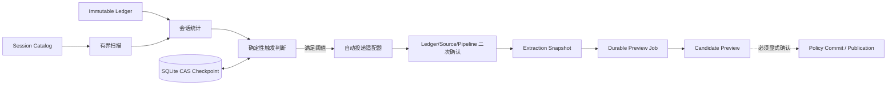

# 自动知识编译（M1）实施说明

## 1. 实施结果

M1 已把“会话已采集，但必须人工点击知识提取”的断点接通。Sidecar 会周期性扫描已采集至最新的 Codex 会话，在满足触发条件时创建不可变 `ExtractionSnapshot`，并把任务可靠投递到现有 Candidate Preview Worker。

该链路的安全边界是 **PREVIEW_ONLY**：自动任务只能生成候选知识，不会执行 Policy Commit，也不会发布到 Markdown、Registry 或检索索引。人工“生成提取预览”的接口行为保持不变。

## 2. 模块边界

| 模块 | 职责 | 不负责 |
|---|---|---|
| `knowledge-compilation-scheduler` | 触发判断、扫描上限、检查点、幂等身份、失败隔离、定时生命周期 | 读取对话正文、调用模型、发布知识 |
| `P2CandidatePreviewCoordinator` | 校验不可变范围、创建 Snapshot、复用/投递 Preview Job | 自动 Commit、知识发布 |
| `P2AutomaticCompilationAdapter` | 把调度请求映射到共享 Coordinator，并在投递前复核 Ledger、源版本和流水线身份 | 改写调度检查点 |
| `P2AutomaticCompilationRuntime` | 组合 Store、Service、Scheduler，提供启动、关闭、触发和热更新 | 决定候选知识内容 |
| Sidecar Application | 生命周期、配置事务、运行状态暴露 | 在 Codex 主链路内等待编译完成 |

## 3. 运行链路

扫描先使用 Catalog 做廉价过滤，真正投递前再以 Ledger revision、源版本和流水线哈希做二次确认。任何竞争变化都会返回 `STALE` 或 `INELIGIBLE`，而不是对变化后的范围继续执行。

## 4. 触发策略

会话必须同时满足：

- 源可用：`sourceStatus = AVAILABLE`；
- 已采集至最新：`captureStatus = CAPTURED_CURRENT`；
- 至少存在 `minimumNewEvents` 个未编译有效事件；
- 再满足新增 Turn 阈值、空闲时长、`session.ended` 或最长等待中的任意一项。

默认参数：

| 参数 | 默认值 | 作用 |
|---|---:|---|
| `enabled` | `true` | 是否启用自动编译 |
| `scanIntervalMs` | `30000` | 每轮完成后的等待时间 |
| `minimumNewTurns` | `3` | Turn 触发阈值 |
| `minimumNewEvents` | `2` | 最少未编译事件数 |
| `idleAfterMs` | `120000` | 空闲触发时间 |
| `maximumWaitMs` | `1800000` | 持续活跃会话的最长等待 |
| `retryDelayMs` | `30000` | 可恢复失败的重试间隔 |
| `pageSize` | `100` | Catalog 单页大小 |
| `maxScanPages` | `50` | 每轮最大扫描页数 |
| `maxSessionsPerRun` | `1000` | 每轮最大处理会话数 |
| `maxDispatchesPerRun` | `25` | 每轮最大 Preview 投递数 |
| `checkpointConflictRetries` | `3` | CAS 冲突重算次数 |

配置位于 Sidecar 配置根节点的 `automaticKnowledgeCompilation`。解析器拒绝未知字段、非整数和越界值；热更新会先构造并验证候选 Runtime，失败时回滚并继续使用旧配置。

## 5. 幂等、恢复与一致性

- 调度幂等键绑定 `sessionId + ledgerSequence + sourceVersion + compilerVersion + promptVersion + policyHash + configurationHash + PREVIEW_ONLY`。
- Coordinator 内部继续使用现有 Snapshot 与 Durable Job 幂等约束，因此手动和自动请求会收敛到同一不可变范围。
- 每个会话的检查点使用 SQLite CAS 更新；并发扫描不能以最后写入覆盖胜者。
- 检查点同时保存每会话 Ledger sequence、有效事件数、Turn 数和流水线哈希。流水线改变时，同一不可变范围允许重新生成候选；全局 Ledger sequence 的空洞不会被误认为该会话新增事件。
- Store 使用 WAL、`synchronous=FULL` 和 `0600` 文件权限；重启后从检查点继续。
- 单会话损坏、源竞争或投递失败只产生有界诊断，不中断其他会话，也不影响 Codex 主流程。

## 6. 状态与排障

P2 状态提供：

- `READY`：已启用且调度器运行；
- `STOPPED`：配置启用但调度器未运行；
- `DEGRADED`：最近扫描或重配置发生故障；
- `DISABLED`：配置关闭。

最近一次运行报告只保存扫描数、候选数、排队数、延迟/重试/失败数、是否触及上限以及有限诊断码，不保存对话正文。需要立即验证时，可以通过 Application 的 `triggerAutomaticCompilation()` 执行一次单飞扫描；并发触发会复用同一个 Promise。

## 7. 性能边界与已接受限制

- 当前使用 Catalog 轮询，没有增量 change feed；代价是重复读取目录，但分页、会话上限、投递上限和完成后计时保证负载有界。
- `stop()` 不强制中断正在进行的 SQLite 事务，而是取消下一轮并允许当前轮排空，避免留下半写状态。
- 配置切换时存在一个极短的 fail-closed 窗口：新 Runtime 完成验证后才替换旧 Runtime；异常不会让旧配置失效。
- M1 只观察 Preview 已可靠投递，不等待模型完成，也不把候选自动发布。任务结果治理由后续 M2/M3 模块负责。

## 8. 验证证据

- 触发决策：覆盖 Turn、空闲、会话结束、最长等待、最少事件、不可用源、未采集至最新、流水线变化和非法时间。
- 检查点：覆盖初始化、CAS 冲突、并发、重启恢复、损坏记录、权限与到期索引。
- 扫描服务：覆盖分页边界、会话/投递上限、重复扫描、手动/自动收敛、revision 竞争、永久/可重试失败和冲突耗尽。
- Coordinator/Adapter：覆盖真实 P2 Worker、当前范围、流水线重编译、伪造幂等键、源变化和 PREVIEW_ONLY 门禁。
- Sidecar：覆盖启用、禁用、降级、重启、关闭排空和非法热更新回滚。
- 全量回归：154 个测试文件、1,329 项测试通过；Statements 90.21%、Branches 85%、Functions 91.84%、Lines 93.76%。

