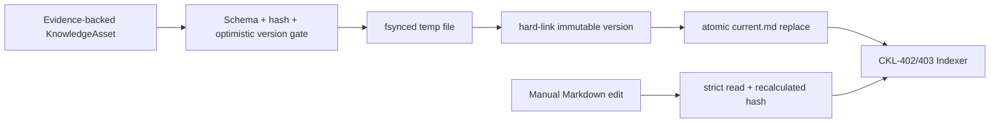

# CKL-401 Markdown Knowledge Repository 技术规格

**状态**：Implemented  
**日期**：2026-08-02  
**依赖**：CKL-003、CKL-304、ADR-0002

## 1. 目标与边界

`@zhiloop/markdown-repository` 保存已发布 `KnowledgeAsset` 的人可读权威版本。它负责严格 Front Matter、确定性 content hash、原子写入、不可变版本、可恢复 tombstone 和旧版本恢复；不建立 SQLite/FTS 投影、不监听文件、不决定 Candidate 是否允许发布，也不修改用户目录或业务仓库。



## 2. 文件布局与格式

```text
<root>/assets/<safe-asset-id>/current.md
<root>/assets/<safe-asset-id>/versions/00000001.md
<root>/assets/<safe-asset-id>/versions/00000002.md
```

Front Matter 使用技术设计中的 snake_case 人类格式，Repository 显式映射到 Domain camelCase。允许字段被固定，未知字段、重复 Key、YAML Alias、不支持版本、非法 Scope/Relation/Evidence 都拒绝。正文是 Front Matter 后的原始 Markdown，不强制标题模板。

`contentHash` 不写入 Front Matter：它是规范化资产元数据（排除 `contentHash`）与正文的 SHA-256。这样手工修改是合法入口，Indexer 能看到新 hash，人无需手算；程序发布时则要求调用方给出的 hash 与计算值一致，防止错误身份落盘。读取结果区分 `COMMITTED` 与 `MANUAL_EDIT`，投影只能接收前者。合法手工内容编辑由 `adoptManualEdit` 固化成下一不可变版本；`version`、Scope、Status、Evidence、confidence、来源和关系等谱系/信任字段不能借手工编辑绕过 Policy，必须走治理接口。

## 3. 一致性与并发

发布先在目标目录创建私有临时文件并 `fsync`，再用不可覆盖 hard link 提交版本文件，最后原子替换 `current.md`，每一步后同步目录。任何进程都不能覆盖已存在版本；`expectedCurrentVersion` 和内容比较提供乐观并发与幂等重试。

若版本文件已提交但 current 替换失败，重试相同内容会复用不可变版本并完成 current；不同内容会冲突。临时文件始终尽力清理。非法手工 current 不会被后台 publish 覆盖，读取结果同时返回诊断和最后一个有效不可变版本。

## 4. Tombstone 与恢复

删除创建 `tombstone: true` 的新版本，保留完整资产快照和 reason；默认读取能识别其不可检索状态，物理清理由 Retention 后续处理。查看旧版直接读取不可变版本。恢复旧版会以当前最高版本加一重新发布，并增加指向被替代 current 的 `SUPERSEDES` 关系，不修改来源旧版。

## 5. 备选方案

### A. 不可变版本 + current 指针（采用）

人类查看直接、恢复简单、并发冲突可诊断；代价是一次发布涉及两个目录项，需要可恢复的提交顺序。

### B. 单文件 Git 历史

文件最少，但默认本地库不保证位于 Git 仓库，后台也不能擅自提交业务仓库，无法满足独立不可变历史，因此不采用。

### C. SQLite 事务后导出 Markdown

事务容易，但会让 SQLite 成为事实权威，删除投影后无法以 Markdown 完整重建，违反 ADR-0002，因此不采用。

## 6. 成功指标

| 指标 | 目标 |
|---|---:|
| 合法资产往返 | 字段与正文 100% 一致 |
| 历史版本覆盖 | 0 次 |
| 故障后半文件 | 0 个 |
| 非法 current 被索引 | 0 个，且返回最后有效版本 |
| Tombstone 默认召回 | 0 个 |
| 100 次发布本地回归 | P95 < 25ms（不作为远程磁盘 SLA） |

## 7. 风险与缓解

| 风险 | 严重度 | 可能性 | 缓解 |
|---|---|---|---|
| 路径穿越或符号链接越界 | 高 | 中 | assetId 单段白名单、目录/文件 `lstat`、读取 `O_NOFOLLOW` |
| 并发覆盖历史 | 高 | 中 | hard-link create-if-absent + optimistic version |
| 崩溃留下 version/current 不一致 | 高 | 低 | 版本先提交、同内容幂等恢复、不同内容冲突 |
| 手工非法 Front Matter 污染投影 | 高 | 中 | 严格 YAML + Schema，返回 lastValid 供 Indexer 保持旧投影 |
| tombstone 被普通解析器当作资产 | 高 | 中 | Repository 先识别 tombstone，CKL-402 默认过滤 |
| 超大 Markdown 消耗内存 | 中 | 中 | 读取和写入字节上限 |

## 8. 验证计划

专项测试覆盖完整往返、手工合法/非法修改、重复 Key/Alias/未知字段、写入两阶段故障、幂等恢复、并发冲突、不可变版本、旧版恢复、tombstone、权限、符号链接、文件大小和路径绑定。完成后执行全仓 dependency/lint/build/typecheck/test、覆盖率和 npm 官方审计。

## 9. 实现与验证结果

实现新增 18th workspace `@zhiloop/markdown-repository`，公开 `publish/readCurrent/readVersion/listAssetIds/tombstone/restoreVersion/adoptManualEdit`，以及确定性序列化、解析和 hash 工具。Repository 根目录必须由装配层显式传入；测试只使用系统临时目录。

Review 发现初版把 version 与 current 作为同一 inode 的两个 hard link，手工编辑 current 会篡改历史；实现已改成独立 fsynced current temp。另一项高风险是合法 YAML 可手工提升 Status/Scope/Evidence；最终读取增加 `historyState`，受保护信任字段无法 adoption，普通 publish 也会与不可变版本冲突。

| 检查项 | 结果 |
|---|---|
| CKL-401 专项 | 16/16 |
| 专项覆盖率 | Statements 94.55%、Branches 85.30%、Functions 100%、Lines 97.41% |
| 全仓模块测试 | 358/358，30 个 Test Files |
| 架构/Gate | 38/38；18 workspaces 依赖与源码 import policy 通过 |
| 整体覆盖率 | Statements 94.75%、Branches 89.91%、Functions 98.55%、Lines 97.02% |
| 原子发布性能 | 100 个独立资产：Median 17.713ms、P95 22.819ms、Max 26.274ms |
| 供应链 | npm 官方 registry：0 vulnerabilities |

性能回归包含每次两个文件和两个目录的持久化同步，主要瓶颈是本地磁盘 `fsync`。25ms 是数量级退化警戒线，不是生产磁盘 SLA；实现不通过去掉 durability 门禁优化测试数字。
