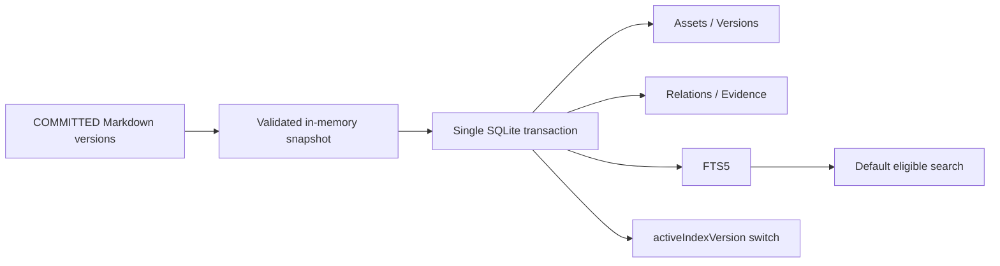

# CKL-402 SQLite Registry Projection / FTS5 技术规格

**状态**：Implemented  
**日期**：2026-08-02  
**依赖**：CKL-401、ADR-0002

## 1. 目标与边界

`@zhiloop/knowledge-registry` 把 COMMITTED Markdown 版本投影为 SQLite 资产、版本、关系、Evidence 和 FTS5。Markdown 始终是权威源；投影数据库可以删除并完整重建。本模块不监听文件、不生成 embedding、不决定知识状态，也不写回 Markdown。

## 2. 一致性模型

增量投影和全量重建都在一个 `BEGIN IMMEDIATE` 事务内更新所有逻辑表，最后才切换 `activeIndexVersion`。全量重建先异步读取所有 Markdown、验证连续不可变版本并形成内存快照；读取阶段失败不会清空旧投影。

`current.md` 为非法时使用 Repository 返回的 last valid immutable version；为合法但 `MANUAL_EDIT` 时使用同版本的 immutable 文件。未 adoption 的手工编辑不会直接进入 SQLite。版本内容冲突、hash 不一致或跳号一律失败关闭。

## 3. 逻辑表

| 表 | 用途 |
|---|---|
| `knowledge_projection_meta` | Migration 与 activeIndexVersion |
| `knowledge_assets` | 当前有效 Markdown 资产完整 payload 与检索列 |
| `knowledge_versions` | 每个不可变版本、hash、tombstone 和文档路径 |
| `knowledge_relations` | 版本化关系 |
| `knowledge_evidence` | 版本化 Evidence 引用 |
| `knowledge_fts` | title、aliases、keywords、body、symbols |

FTS 只保存当前非 tombstone 内容；默认查询再通过 `knowledge_assets.status` 过滤为 ACCEPTED/IMPLEMENTED/VERIFIED。旧版本、STALE、SUPERSEDED 和 tombstone 不会进入默认召回。

## 4. 备选方案

### A. 同库事务化关系投影 + FTS5（采用）

原子性强、Node 24 内置、可解释且无需服务；缺点是单写者和本机文件边界，符合首版模块化单体。

### B. 每张表独立增量更新

实现局部简单，但崩溃会产生资产已更新、FTS/关系仍旧的混合版本，因此不采用。

### C. 外部搜索引擎

扩展能力更强，但增加后台服务、凭证和一致性复杂度，违背本地无感知 MVP，因此不采用。

## 5. 成功指标

| 指标 | 目标 |
|---|---:|
| 删除投影后重建 | 资产/版本/关系/Evidence/FTS 100% 一致 |
| 单次更新跨表原子性 | 100% |
| tombstone 默认搜索命中 | 0 |
| FTS 字段覆盖 | title/aliases/keywords/body/symbols 全部可召回 |
| 100 资产重建 | P95 单批 < 500ms（本地回归警戒线） |

## 6. 风险与缓解

| 风险 | 严重度 | 可能性 | 缓解 |
|---|---|---|---|
| 重建先清库后读 Markdown | 高 | 中 | 先构建完整快照，后单事务替换 |
| MANUAL_EDIT 提升信任进入索引 | 高 | 中 | 只接受 COMMITTED，不一致回退 immutable |
| 资产/FTS/关系跨表版本不一致 | 高 | 中 | 单事务 + activeIndexVersion 最后切换 |
| FTS 查询语法注入/异常 | 中 | 中 | Unicode token 提取与参数绑定 |
| tombstone 被默认召回 | 高 | 低 | 删除 FTS 行并在资产查询双重过滤 |
| 投影 payload 被磁盘篡改 | 高 | 低 | payload SHA-256、Schema、关键列和 canonical contentHash 复核 |
| SQLite 新版本覆盖旧程序 | 中 | 低 | 独立 component Migration，拒绝更高版本 |

## 7. 验证计划

测试覆盖五类 FTS 字段、默认状态/tombstone 过滤、关系/Evidence、版本幂等与冲突、事务回滚、删除后重建、非法 current/手工 trust 编辑回退、断裂历史保护旧投影、Migration、权限、关闭状态和检索输入边界。

## 8. 实现与验证结果

实现新增 19th workspace `@zhiloop/knowledge-registry`。`projectCurrent` 在取得 `BEGIN IMMEDIATE` 写锁后复核幂等、递增 indexVersion 并更新全部表；`rebuildFromMarkdown` 在事务前读取完整快照，保留非投影表，事务内替换所有投影并最后切换 active 版本。

Review 增加了两项关键门禁：第一，合法但未 adoption 的 current 只回退到同版本 immutable；第二，幂等重复投影会重新校验 payload hash/Schema/contentHash、关键列、关系、Evidence 和 FTS，不能用“内容相同”掩盖派生表损坏。

| 检查项 | 结果 |
|---|---|
| CKL-402 专项 | 13/13 |
| 专项覆盖率 | Statements 92.54%、Branches 89.09%、Functions 100%、Lines 94.00% |
| 全仓模块测试 | 371/371，31 个 Test Files |
| 架构/Gate | 38/38；19 workspaces 依赖与源码 import policy 通过 |
| 整体覆盖率 | Statements 94.60%、Branches 89.86%、Functions 98.65%、Lines 96.82% |
| 100 资产重建 | 157.151ms，100 assets / 100 versions / 0 diagnostics |
| 供应链 | npm 官方 registry：0 vulnerabilities |

重建回归的主要成本是读取 200 份 current/version Markdown 并做 YAML、Schema 与 hash 校验；SQLite 使用一个批量事务，当前没有随表间协调放大的瓶颈。CKL-403 将通过 contentHash、去抖和增量路径避免常态全量扫描。
