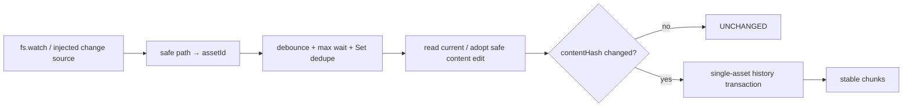

# CKL-403 Incremental Indexer 技术规格

**状态**：Implemented  
**日期**：2026-08-02  
**依赖**：CKL-402

## 1. 目标与边界

`@zhiloop/knowledge-indexer` 把 Markdown 文件变化合并为 assetId，按 canonical contentHash 判断是否需要更新 SQLite，并产生稳定 Markdown chunk。它不生成 embedding、不扩大 Scope、不接受未固化 trust 编辑，也不拥有 SQLite Schema。

## 2. 增量与手工编辑

Projection 当前 version/contentHash/tombstone 与 Markdown 完全一致时不增加 indexVersion，也不调用 chunk sink。若文件事件跨过多个版本或投影被删除，只读取该资产 1..N 的不可变历史并在一个事务中替换该资产。

合法 `MANUAL_EDIT` 先调用 CKL-401 `adoptManualEdit`；它只允许正文和检索描述字段变化，Scope/Status/Evidence 等 trust 字段会失败关闭并保留旧投影。非法 current、物理删除和断裂历史都产生诊断，不清除上一有效索引。

## 3. Chunk 身份

正文按 Markdown heading 和有界字符块切分。`chunkId` 基于 assetId、heading 路径、同路径 occurrence 和 chunk 内容 hash，不包含资产 version；因此未变段落跨版本保持 ID，变更段落生成新 ID。每个 chunk 仍携带当前 assetVersion/contentHash，供 CKL-404 替换旧索引。

## 4. 调度与 SLA

默认 debounce 250ms，max wait 2s。重复路径进入 `Set`，一个 batch 每资产最多同步一次；持续文件风暴不能无限延迟。SQLite 操作为同步短事务，文件读取在事务外完成。

Watcher 启动时先注册原生 watch，再同步扫描既有 canonical `assets/<id>/current.md` 并通知 Scheduler。这样启动窗口内的变化要么被原生事件捕获，要么被启动扫描读到，避免 macOS/FSEvents 在 `start()` 后立即写文件时偶发漏事件。扫描拒绝符号链接 assets 根并限制最多 100,000 个资产。

## 5. 备选方案

### A. Port + Node watcher + 确定性调度器（采用）

测试稳定、运行时轻、可替换；代价是不同 OS 的 watcher 语义由路径去重和定期 doctor 吸收。

### B. 每次事件全库 rebuild

正确但 I/O 随知识总量增长，批量保存会重复工作，不采用。

### C. 仅依赖 fs.watch 且无 max wait

代码少，但事件可能重复/丢失，持续变更可能永不 flush，不采用。

## 6. 成功指标

| 指标 | 目标 |
|---|---:|
| contentHash 不变重处理 | 0 |
| 同 batch 同资产同步 | 最多 1 次 |
| 未变 chunkId | 100% 稳定 |
| Markdown 到可搜索 | P95 < 5s |
| 非法/unsafe current 覆盖旧投影 | 0 |

## 7. 风险

| 风险 | 严重度 | 缓解 |
|---|---|---|
| watcher 重复/乱序 | 中 | Set 去重，最终以当前 Markdown/hash 为准 |
| watcher 启动窗口漏事件 | 高 | 先注册 watch，再扫描并 reconcile 全部既有 current |
| 持续事件饿死 flush | 高 | maxWait 定时器独立于 debounce |
| 路径穿越映射错误资产 | 高 | root-relative 结构和 safe assetId 双校验 |
| 手工 trust 提升自动 adoption | 高 | CKL-401 protected field gate，失败保留旧投影 |
| 跨多版本逐次暴露中间索引 | 中 | 单资产完整历史一次事务替换 |
| chunk 边界变化导致向量抖动 | 中 | heading/content hash 稳定 ID、有界段落切分 |

## 8. 实现与验证结果

实现新增 20th workspace `@zhiloop/knowledge-indexer`，包含确定性 chunker、增量同步器、去抖/max-wait 调度器、路径映射和 Node recursive watcher。CKL-402 同步补充 `replaceAssetHistory`，将事件合并期间跨过的多个版本在一次事务中替换，不暴露中间投影。

Chunk sink 与 SQLite 分离失败：SQLite/FTS 继续可用，sink contentHash 不推进；下一次相同文件事件只重试 chunks，不增加 indexVersion。单资产异常在 `syncMany` 内隔离，后续资产继续处理。Watcher 保留 lastError 并支持回调，调度器关闭会等待在途 batch。最终干净安装验收曾复现一次 `start` 后立即写入超时；加入启动 reconciliation 后，同一真实 watcher 专项连续 5 轮全部通过。

| 检查项 | 结果 |
|---|---|
| CKL-403 专项 | 12/12；另有 Registry 单资产历史测试 1 条 |
| Indexer 专项覆盖率 | Statements 95.33%、Branches 92.85%、Functions 94.44%、Lines 97.98% |
| Registry 扩展覆盖率 | Statements 93.17%、Branches 89.83%、Functions 100%、Lines 94.52% |
| 全仓模块测试 | 384/384，32 个 Test Files |
| 架构/Gate | 38/38；20 workspaces 依赖与源码 import policy 通过 |
| 100×重复事件延迟 | 10 次变更，每次 100 个通知：Median 286.239ms、P95/Max 295.755ms |
| 真实 watcher | current.md 修改、自动 adoption、FTS 可搜索集成测试通过（2s 硬上限） |
| 供应链 | npm 官方 registry：0 vulnerabilities |

P95 主要由默认 250ms debounce 和 CKL-401 durable adoption 写入构成，仍远低于 5s SLA。每 100 个重复通知只产生一次同步，10 次内容变化最终 indexVersion=11（初始投影 + 10 次真实变化）。
