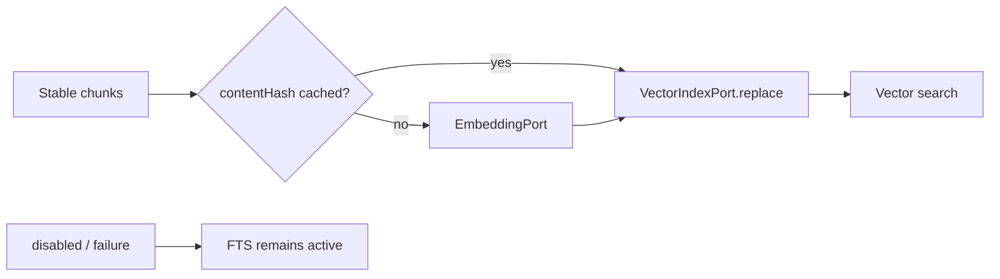

# CKL-404 VectorIndexPort 技术规格

**状态**：Implemented  
**日期**：2026-08-02

## 1. 设计

向量是可关闭、可丢弃的派生通道。`VectorKnowledgeChunkSink` 接收 CKL-403 稳定 chunks，以 contentHash 缓存 embedding，再把完整资产批次交给 `VectorIndexPort` 原子替换。

## 2. 备选方案

- 采用 Port + 内存实现：无外部服务、可测试，后续可替换 sqlite-vec/HNSW。
- 在 Registry 事务内调用 embedding：网络/模型失败会阻断 FTS，因此拒绝。
- 每版本追加不删除：会召回旧 chunk，因此拒绝。

## 3. 成功指标

| 指标 | 目标 |
|---|---:|
| disabled 时 embedding 调用 | 0 |
| 相同 contentHash 重复 embedding | 0 |
| replace/remove 后旧 chunk 命中 | 0 |
| 非法向量导致部分替换 | 0 |
| 向量失败影响 FTS | 0 |

## 4. 风险

| 风险 | 严重度 | 缓解 |
|---|---|---|
| 维度/NaN 污染索引 | 高 | 批次全量校验后才替换 |
| embedding 缓存无界 | 中 | 有界 LRU |
| 旧版本 chunk 残留 | 高 | assetId 原子 replace/remove |
| 向量分数量纲混入 FTS | 中 | Port 只返回通道内 cosine，CKL-502 用 RRF 融合 |

## 5. 验证

测试 disabled、缓存命中/淘汰、批量 embedding、cosine 排序、维度/数量/NaN、原子替换、remove、limit 和 Indexer 失败降级。

## 6. 结果

实现 `EmbeddingPort`、`VectorIndexPort`、disabled/内存实现与 `VectorKnowledgeChunkSink`。embeddingVersion 同时绑定缓存和索引，禁止模型版本混用；缓存为有界 LRU，即使 batch 大于缓存也通过 batch-local vectors 完整替换。

| 检查项 | 结果 |
|---|---|
| 专项 | 6/6；Statements 97.63%、Branches 91.30%、Functions 95.23%、Lines 98.92% |
| 全仓 | 390/390 模块；38/38 架构/Gate；21 workspaces |
| 整体覆盖率 | Lines 96.97%、Branches 90.08% |
| 供应链 | 0 vulnerabilities |

向量关闭时 embedding/index 调用为 0；相同 contentHash 跨版本只 embedding 一次。replace、remove、维度/NaN、embedding 数量和版本冲突测试证明旧 chunk 不参与召回且失败前不修改已存记录。
