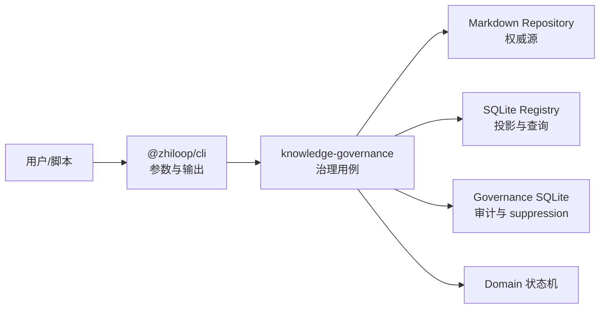

# CKL-405 知识治理 CLI 设计

**状态**：Implemented  
**任务**：CKL-405  
**最后更新**：2026-08-02

## 1. 目标与边界

本模块提供 `list/show/diff/trace/mark-stale/suppress/rebuild/doctor` 八个治理命令。CLI 只负责参数、帮助、输出和退出码；治理语义放在 `@zhiloop/knowledge-governance`，以便后续复用于 MCP、插件和 App Server。

不在本任务内实现召回阶段的 suppress 排名效果（归属 CKL-605），但会持久化可按 Scope 查询的 suppression 事实。CLI 不启动 daemon、不修改 Codex/CCM 配置。

## 2. 方案选择

| 方案 | 优点 | 缺点 | 决策 |
|---|---|---|---|
| 业务逻辑直接写在 CLI | 文件少 | 无法复用于 MCP；测试依赖进程输出 | 拒绝 |
| 在 Registry 内加入治理和审计 | 事务集中 | 投影层承担领域变更，职责混乱 | 拒绝 |
| 独立 Governance 服务 + 薄 CLI | 可复用、依赖方向清晰、易注入测试 | 多一个 workspace | 采用 |

## 3. 组件与数据流

读取命令不写审计。`mark-stale` 和 `rebuild` 先写 `STARTED`，完成后更新为 `SUCCEEDED/FAILED`；进程崩溃会留下 `STARTED`，而不是丢失操作痕迹。`suppress` 的事实与成功审计在同一 SQLite 事务提交。

Markdown 是权威源，Registry 是可删除投影。`doctor` 同时遍历两侧并报告缺失、无效 current、版本、hash 与 tombstone 差异；它不自动修复。

## 4. 命令契约

| 命令 | 行为 | 失败条件 |
|---|---|---|
| `list [--all]` | 列出当前投影，默认隐藏 tombstone | 参数非法、投影损坏 |
| `show <id>` | 显示当前资产 | 不存在 |
| `diff <id> <from> <to>` | 输出字段级差异 | 版本不存在或相同 |
| `trace <id> [version]` | 输出来源 Episode、Evidence、Relation | 版本不存在 |
| `mark-stale <id> --reason` | 通过状态机发布下一 Markdown 版本并投影 | 非 IMPLEMENTED/VERIFIED、并发版本冲突 |
| `suppress <id> --reason [--scope]` | 记录 Scope 化 suppression | 资产不存在、原因空 |
| `rebuild` | 从 Markdown 全量重建投影 | 历史不连续或文档非法 |
| `doctor` | 只读一致性诊断 | 发现任何 ERROR 时退出非零 |

所有命令支持 `--help`，结构化输出支持 `--json`。用法错误退出 2，执行/健康检查失败退出 1，成功退出 0。

## 5. 安全与一致性

- `mark-stale` 使用领域状态机，不允许 CLI 绕过状态门禁。
- 发布使用 `expectedCurrentVersion` 乐观并发控制，并重新计算 canonical content hash。
- 审计包含 operation、target、actor、correlationId、时间、状态和脱敏错误摘要；不存正文。
- SQLite 文件权限在非 Windows 平台收紧为 `0600`，所有写入使用参数绑定。
- 实际 CLI 要求显式提供三个存储路径或对应环境变量，不猜测用户目录。

## 6. 性能指标与容量

- `list` 上限 1,000 条，避免无界内存和终端输出。
- `doctor` 为 O(M+R)，其中 M/R 是 Markdown/Registry 当前资产数；预期 10,000 资产内可作为人工治理命令运行。
- diff 仅比较两个结构化资产版本，不读取完整历史。
- 审计和 suppression 使用索引：`created_at`、`(asset_id, scope_key)`。

## 7. 可观测性与故障恢复

- 每个变更命令返回 auditId/correlationId。
- `STARTED` 长时间未结束表示中断操作；`doctor` 用于判断是否已造成双源不一致。
- `rebuild` 是显式修复入口；失败时 Registry 原事务回滚。
- CLI stderr 只输出错误类型与消息，不输出资产正文。

## 8. 测试与 Gate

- 服务单测覆盖八种用例、非法状态、投影中断、hash 不一致和审计结果。
- CLI 契约测试覆盖每个命令帮助文本、退出码、JSON/文本输出和未知参数。
- 模块完成后执行全仓 lint/build/typecheck/test、依赖边界检查和供应链审计。

## 9. 已知风险

- Markdown 与 Registry 不支持跨介质原子事务；通过审计状态和 doctor/rebuild 收敛。
- suppression 在 CKL-605 前仅是治理事实，不影响检索排序，避免提前耦合 P5 算法。
- 大规模 doctor 当前顺序读取 Markdown；若超过 10,000 资产再引入受控并发，避免文件描述符峰值。

## 10. 实施结果

- 八个命令及全局/分命令帮助已实现；帮助无需打开任何存储。
- `doctor` 使用 1,000 条分页遍历全部投影，覆盖 invalid current、缺失、孤儿、版本、hash 和 tombstone 差异。
- Governance SQLite 使用版本化 migration、前向版本拒绝、`0600` 权限和 suppression/audit 同事务。
- 专项：33/33 tests；Lines 96.05%、Branches 90.48%（Governance/CLI/Registry）。
- 全仓：409/409 module tests、38/38 architecture/Gate tests；Lines 97.00%、Branches 90.14%。
- 22 workspaces 依赖/import policy 通过；npm audit 为 0 vulnerabilities。
