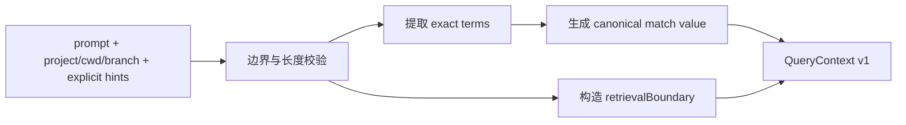

# CKL-501 Query Context Resolver 设计

**状态**：Implemented  
**任务**：CKL-501  
**最后更新**：2026-08-02

## 1. 目标

把本轮 prompt 与可信运行上下文解析为稳定的 `QueryContext`，供 Exact/FTS/Vector/Scope 通道共同消费。解析器保留 path、symbol、error code、config key 的原始精确值，同时提供仅用于匹配的 canonical 值。

缺少 project/cwd/branch 时不得猜测身份或扩大 Scope；结果仍可用于无知识注入的安全降级。

## 2. 方案选择

| 方案 | 优点 | 风险 | 决策 |
|---|---|---|---|
| 让模型从 prompt 重写检索词 | 语义丰富 | 精确 token 丢失、不可复现 | 拒绝 |
| 只传原始 prompt | 无损 | 各召回通道重复解析 | 拒绝 |
| 显式 hints 优先 + 保守词法抽取 + 保留 exact/canonical | 确定、可解释、可测试 | 语义召回留给后续通道 | 采用 |

## 3. 输出契约

`QueryContext` 包含：

- 原始 prompt（不改写）；
- 可信 project/cwd/branch/task；
- paths、symbols、errorCodes、configKeys，每项包含 `exact`、`canonical`、`source`；
- `retrievalBoundary`：是否允许项目知识、固定 projectId、是否允许 GLOBAL；
- reasonCodes：缺失、冲突、无效 hint 与降级原因。

没有可信 project 时 `allowProjectKnowledge=false` 且 `allowGlobalKnowledge=false`。GLOBAL 不是缺失项目身份的兜底。

## 4. 解析规则

- explicit hints 先于 prompt 抽取，去重采用 `type + canonical`，保留第一个 exact。
- path 接受 canonical 相对路径；绝对路径只有位于可信 repositoryRoot 下才转换 canonical relative path。
- `..`、NUL、反斜线逃逸和仓库外绝对路径被忽略并记录 reason code。
- symbol 仅接受标识符/限定名，可去除末尾 `()` 作为 canonical，但 exact 保留。
- error code 支持 `ERR_*`、`TS1234`、`EACCES`、`ABC-123` 等确定模式，不改大小写。
- config key 支持点分/短横线/下划线键，canonical 仅做 Unicode NFKC，不做语义同义改写。
- project.branch 与独立 branch 冲突时，以 ProjectContext 为准并记录冲突。

## 5. 安全与容量

- prompt 最大 100,000 字符；单 hint 最大 1,000 字符；每类最多 100 个。
- 控制字符、空值和超限 hint 被忽略；prompt 本身非法则拒绝请求。
- 解析器不访问文件系统、不执行 Git、不调用模型。
- 输出深冻结，避免召回阶段修改边界。

## 6. 性能与验证

- 算法复杂度 O(prompt length + hints)，正则均为有界、无回溯嵌套模式。
- 性能基线：10,000 字符 prompt P95 < 10 ms（本地固定环境）。
- 单测覆盖显式/抽取去重、精确值保留、路径逃逸、branch 冲突、无 project 降级、输入上限和对象不可变性。

## 7. 后续边界

CKL-501 不做检索、Scope eligibility、RRF 或注入。CKL-502 必须消费 `retrievalBoundary`，不得自行从缺失字段推断更宽项目身份。

## 8. 实施结果

- 专项 10/10；Lines 100%、Branches 93.00%、Functions 100%。
- 10,000 字符 prompt（200 次）：P50 0.080 ms、P95 0.100 ms、max 1.151 ms。
- 全仓 419/419 module tests、40/40 architecture/Gate tests；23 workspaces。
- 全仓 Lines 97.09%、Branches 90.26%；npm audit 0 vulnerabilities。
