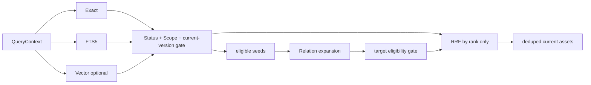

# CKL-502 多路召回与 RRF 设计

**状态**：Implemented  
**任务**：CKL-502  
**最后更新**：2026-08-02

## 1. 目标与边界

实现 Exact、FTS、Vector、Scope、Relation 五类信号的安全召回与 Reciprocal Rank Fusion。Scope 是所有内容通道之前的资格门禁，不是可被分数抵消的加权通道。

本任务输出待重排候选；CKL-503 才负责 Rerank，CKL-504 才决定注入复杂度。

## 2. 方案选择

| 方案 | 风险 | 决策 |
|---|---|---|
| BM25 + cosine + exact 原始分数直接相加 | 量纲不同，调参不可解释 | 拒绝 |
| 模型统一打分 | 慢、不可离线、失败面大 | 拒绝 |
| 各通道独立排序，资格过滤后使用 RRF | 稳定、可解释、通道可关闭 | 采用 |

## 3. 数据流



## 4. 通道契约

- Exact：匹配 id、subjectKey、aliases、keywords、symbols、applicability 的精确 canonical token。
- FTS：使用 Registry FTS；多个 query 独立取 rank 后形成单一通道顺序。
- Vector：仅在配置和 index 同时启用、embeddingVersion 一致时工作；query embedding 或索引失败时开放失败。
- Scope：必须先满足 QueryContext `retrievalBoundary`。PROJECT/MODULE/SYMBOL 需要同 projectId；TASK 还需同 taskId；USER/TEAM 因当前无可信身份默认拒绝；GLOBAL 需 allowGlobalKnowledge。
- Relation：只从已合格 seed 出发，目标再次走 status/scope/current 门禁；支持出边和入边。

## 5. RRF 与去重

每个通道内先按自身 rank 排序并按 assetId 去重。融合分数：

```text
score(asset) = Σ enabled channels 1 / (rrfK + channelRank)
```

原始 BM25/cosine/exact match count 只用于各自通道排序，不跨通道相加。最终按 score 降序、assetId 升序稳定排序。每项保留 channel、rank、RRF contribution。

Registry 当前版本是唯一资产来源；Vector chunk 的 assetVersion 与 current 不一致时丢弃。`STALE`、`SUPERSEDED`、`REJECTED`、`PROPOSED` 默认排除，tombstone 永远排除。

## 6. 配置与失败语义

- 复用 `RetrievalPolicy.topK`、`rrfK`、`rerank.candidates`、`eligibility.default`。
- 四个内容通道可独立关闭；Scope 门禁不可关闭。
- 单通道异常记录诊断并继续其他通道；QueryContext boundary 无项目权限时项目知识通道结果为 0。
- Relation topK 为 0 时不扩展。

## 7. 性能与容量

- 每通道最大 100；融合候选最大 `rerank.candidates <= 100`。
- Exact/Relation 的 MVP SQLite Adapter 分页扫描 current assets，每页 1,000；后续可用专用 exact/relation 索引替换 Port，不改变引擎。
- 1,000 资产、四通道本地检索目标 P95 < 50 ms（不含远端 embedding）。

## 8. 测试与风险

- 验证通道独立开关、RRF 不使用原始分数量纲、Scope 隔离、状态过滤、当前版本去重。
- 验证 Vector disabled/error 不影响 Exact/FTS，旧 chunk 不召回。
- 验证 Relation 不能跨 Scope 搭桥。
- 输出深冻结，避免 CKL-503 修改通道证据。

## 9. 实施结果

- 专项 12/12；Lines 98.13%、Branches 89.04%、Functions 100%。
- 1,000 current assets、Exact/FTS/Vector/Relation 连续 30 次的 P95 门禁 `< 50 ms`；整项循环约 16 ms。
- 全仓 431/431 module tests、40/40 architecture/Gate tests；24 workspaces。
- 全仓 Lines 97.13%、Branches 90.21%；npm audit 0 vulnerabilities。
