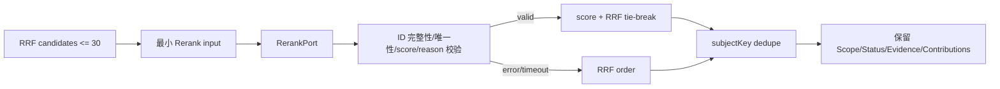

# CKL-503 RerankPort 设计

**状态**：Implemented  
**任务**：CKL-503  
**最后更新**：2026-08-02

## 1. 目标与不变量

对 CKL-502 已通过 Status/Scope 门禁的前 30 个候选进行模型无关重排，并输出可解释结果。

Rerank 只能改变候选顺序，不能新增 ID、修改 Asset、改变 Scope/Status、补造 Evidence 或恢复已过滤内容。Port 不可用、超时、抛错或输出非法时，保留 RRF 相对顺序。

## 2. 方案选择

| 方案 | 风险 | 决策 |
|---|---|---|
| Port 返回完整 KnowledgeAsset | 可篡改信任字段 | 拒绝 |
| Port 返回任意候选子集 | 可静默删除或注入 ID | 拒绝 |
| Port 只返回完整 ID 排列、有限 score、reason codes | 能验证且只控制顺序 | 采用 |

## 3. 数据流

## 4. Port 输入与输出

输入只包含 query prompt（最大 20,000 字符）、精确 terms，以及每个候选的 id/subject/kind/status/scope/title/summary/applicability/symbol/evidence IDs/RRF rank+score/channel contributions。默认超时 1,000 ms。

输出必须：

- `schemaVersion=1`；
- 恰好覆盖全部输入 ID，每个一次；
- score 为 `[-1,1]` finite number；
- reason code 符合 `[A-Z][A-Z0-9_]{0,99}`，每项 1～10 个。

最终按 rerank score 降序；并列使用 original RRF rank，再用 assetId。不同 id 但相同 subjectKey 只保留最终排名更高者。

## 5. 失败与可解释性

- `UNAVAILABLE/TIMEOUT/PORT_ERROR/INVALID_OUTPUT/QUERY_TOO_LARGE` 均回退。
- fallback 不把错误转换成低 score，避免改变 RRF 顺序。
- 每个输出保留 `originalRank`、是否 applied、rerank score/reason，以及原始 channel contributions。
- duplicate subject 产生带 kept/removed ID 的诊断。

## 6. 性能与安全

- 硬限制最多 30 候选；Port 输入不含 body/episode 正文。
- timeout 释放 timer；迟到 Promise 不再影响本次结果。
- error diagnostic 去控制字符并截断 500。
- 结果递归 freeze。

## 7. 测试

覆盖合法重排、score tie、subject 去重、unavailable、异常、超时、非法/缺失/重复/未知 ID、NaN score、非法 reason、超长 query、空候选以及 Asset/解释字段保真。

## 8. 实施结果

- 专项 15/15；Lines/Statements/Functions 100%、Branches 97.29%。
- 全仓 446/446 module tests、40/40 architecture/Gate tests；25 workspaces。
- 全仓 Lines 97.20%、Branches 90.35%；npm audit 0 vulnerabilities。
