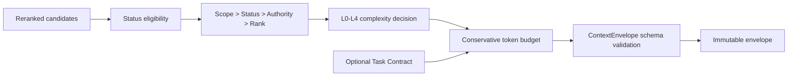

# CKL-504 Context Orchestrator 设计

**状态**：Implemented  
**任务**：CKL-504  
**最后更新**：2026-08-02

## 1. 目标与不变量

将已通过检索与重排门禁的知识转换为版本化 `ContextEnvelope`，在可追溯性、上下文复杂度和 Token Budget 之间建立确定性边界。

Orchestrator 只能从输入候选中选择和降级内容，不能恢复被检索层过滤的知识、改变 Scope/Status/Evidence，也不能把参考知识伪装成规则。Task Contract 是独立可选区块，不替代动态知识。

## 2. 方案与备选

| 方案 | 优点 | 风险 | 决策 |
|---|---|---|---|
| 总是注入完整正文 | 实现简单 | 上下文膨胀、权威边界模糊 | 拒绝 |
| 仅返回 ID，由模型自行查询 | Token 最小 | 常规任务缺少必要边界，工具往返增加 | 拒绝 |
| L0～L4 分层、默认 L2、按信号升级 | 复杂度可控且可审计 | 需要维护层级契约 | 采用 |
| Task Contract 覆盖动态知识 | 门禁突出 | 会丢失项目事实和决策 | 拒绝 |

## 3. 数据流

## 4. 复杂度契约

- `L0_NONE`：没有可注入知识，Envelope 仍保留运行与预算元数据。
- `L1_POINTER`：ID、版本、类型、状态、Scope、Authority、标题和一句话摘要。
- `L2_COMPACT`：默认层；增加适用边界、失败路径、符号和 Evidence 指针，不含正文。
- `L3_EVIDENCED`：高风险、歧义或冲突时使用；增加正文与 Evidence 摘要。
- `L4_EPISODE`：仅在非自动模式且显式请求时允许，增加源 Episode ID。

Authority 独立编码为 `BINDING_RULE`、`ACCEPTED_DECISION`、`VERIFIED_FACT`、`REFERENCE`，混合 Envelope 使用 `MIXED` 汇总，避免模型根据文字语气猜测权威级别。

## 5. 排序、预算与降级

候选只接受 `ACCEPTED/IMPLEMENTED/VERIFIED`。排序固定为 Scope 接近程度、状态强度、配置的 Authority 顺序、Rerank rank、Asset ID。每层最多注入配置数量，默认总预算 800 tokens，使用 UTF-8 JSON 字节数除以 3 的保守估算。

超预算时先截断低优先级候选；非 L1 层连一个候选也放不下时降为 L1；仍放不下则 L0。Task Contract 只使用剩余预算，不能挤掉已经选择的动态知识。所有选择、升级、降级和截断均写入 reason codes。

## 6. Schema 与配置

`ContextEnvelope` JSON Schema 对嵌套信任字段使用 `additionalProperties: false`，并按 detail level 禁止越层字段；顶层允许前向兼容扩展。`config/injection-policy.yaml` 是可读的部署策略，并通过现有配置加载器与默认值做契约测试。

## 7. 性能指标与风险

目标：默认 Envelope 不超过 800 tokens；单次编排不发起 I/O；候选上限来自检索层 30，输出上限 8。

| 风险 | 缓解 |
|---|---|
| 字符与模型 tokenizer 差异 | 采用偏保守的 3 bytes/token，CKL-505 持续审计真实复杂度 |
| Reason code 本身挤占预算 | 优先省略普通 level reason，保留异常/截断原因和动态知识 |
| L4 泄露过多对话 | 自动路径硬性降为 L3，显式展开才携带 Episode ID |
| 输入候选绕过 Scope | Orchestrator 不扩大 Scope；CKL-502 负责资格门禁，CKL-506/507 再做项目隔离契约测试 |

## 8. 测试与实施结果

- 专项 13/13；Context Orchestrator Lines 93.43%、Branches 88.88%、Functions 100%。
- ContextEnvelope Schema 4/4；配置文件与默认 Injection Policy 契约一致。
- 全仓 461/461 module tests、40/40 architecture/Gate tests；26 workspaces。
- 全仓 Lines 96.82%、Branches 90.05%；npm 官方 registry 审计 0 vulnerabilities。
- Review 发现并修复“全部候选不合格仍保留 L2”以及 `scopeMatched=false` 防御缺口，无遗留 actionable finding。
