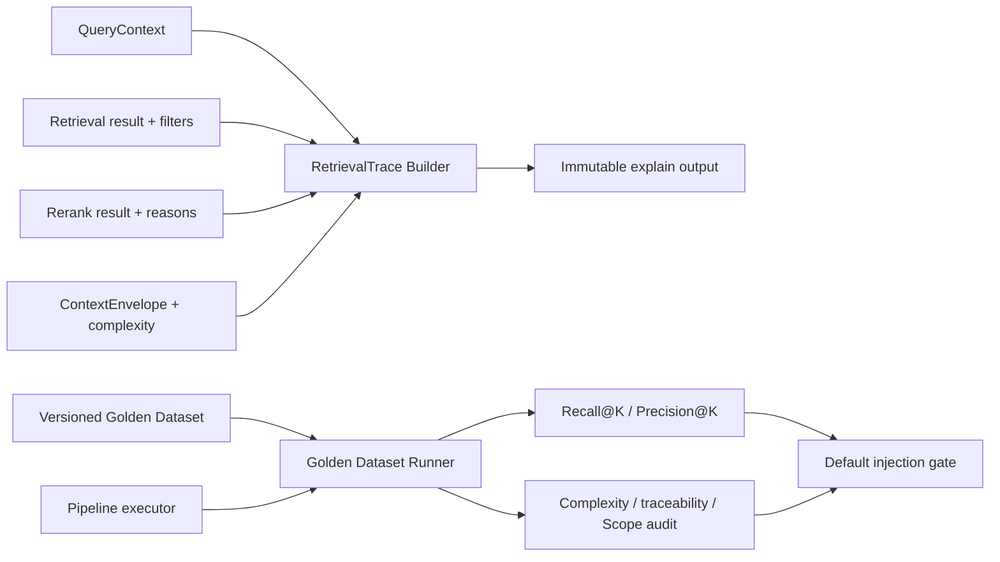

# CKL-505 Retrieval Trace 与评估工具设计

**状态**：Implemented  
**任务**：CKL-505  
**最后更新**：2026-08-02

## 1. 目标与不变量

为每次召回建立可机器审计的 `RetrievalTrace`，并用版本化 Golden Dataset 固定评估 Recall@K、Precision@K、来源可追溯性、Scope 隔离和注入复杂度。

Trace 是观察结果，不参与排序；Runner 是离线评估器，不修改策略或自动开启注入。只有报告达到 Recall@5 90% 和 Precision@5 80% 时，`defaultInjectionAllowed` 才能为 true。

## 2. 方案与备选

| 方案 | 优点 | 风险 | 决策 |
|---|---|---|---|
| 只打印自然语言日志 | 便于临时阅读 | 无稳定字段，无法回归比较 | 拒绝 |
| 让检索引擎直接计算指标 | 调用少 | 在线路径耦合测试数据和门禁 | 拒绝 |
| 独立 Trace Builder + Golden Runner | 在线观察与离线评估解耦 | 需要跨阶段一致性校验 | 采用 |
| 只看总体命中率 | 指标简单 | 无法区分漏召回和噪声 | 拒绝 |

## 3. 数据流



## 4. Trace 契约

每个最终结果包含 Asset ID/版本/subject、Scope、检索排名、最终排名、RRF score、各通道 rank/contribution/reason、Rerank applied/score/reason、Evidence ID、源 Episode、是否注入及 detail level。

过滤诊断和 Rerank 诊断保留为独立列表。复杂度解释合并以下四个固定轴与 CKL-504 原始 reason codes：

- `RISK_*`；
- `AMBIGUITY_PRESENT/ABSENT`；
- `CONFLICT_PRESENT/ABSENT`；
- `BUDGET_TRUNCATED/WITHIN_LIMIT`。

Builder 校验 run/project/task 身份、候选 ID 唯一性、最终 rank、版本和注入子集。Scope、Evidence、来源与通道贡献取自检索结果，避免下游重排污染可信解释。

## 5. Golden Dataset 与指标

Golden Dataset 以 `datasetId + version + caseId` 固定，每个 Case 包含 QueryContext 输入、至少一个 relevant ID 和可选 forbidden IDs。Runner 对调用方传入的算法配置做 canonical JSON + SHA-256，并按稳定 Case 顺序执行；单 Case 异常被记录为 `ERROR`，不会丢失其余评估结果。

指标采用 micro average：

```text
Recall@K    = 所有 Case 的 relevant hits / 所有 expected relevant
Precision@K = 所有 Case 的 relevant hits / 所有 top-K returned
```

空返回的 Precision 为 0。默认 `K=5`、Recall 门槛 0.90、Precision 门槛 0.80。仓库内 `fixtures/p5/v1/retrieval-golden.json` 是首个固定回归集。

## 6. 复杂度与隔离审计

报告输出 L0～L4 分布、平均/P95/最大 tokens、截断次数、超预算次数、自动 L4 次数和缺失解释轴次数。Scope 审计复用 QueryContext 的 project/task/global 边界；USER/TEAM 不属于当前召回边界，出现在注入中按泄漏计数。

完整 Gate 除质量阈值外，还要求：无执行错误和 forbidden 命中、Traceability 100%、Scope 泄漏 0、超预算 0、自动 L4 0、复杂度解释轴完整。`qualityThresholdsMet` 单独表达召回指标是否达标；`defaultInjectionAllowed` 只有完整 Gate 通过时才为 true。

## 7. 性能、风险与缓解

| 风险 | 缓解 |
|---|---|
| Trace 从 Rerank 结果复制被篡改字段 | 信任字段从 Retrieval 原结果取值，跨阶段校验 ID/版本 |
| Case 异常使整份报告消失 | Case 级错误隔离、错误文本去控制字符并限长 |
| Precision 分母定义漂移 | 报告固定 micro top-K 定义并输出原始 totals |
| 假配置指纹导致不可比较 | Runner 自行 canonicalize 并生成 SHA-256；P5 Gate 固定配置与 Dataset 版本 |
| 离线 Runner 影响在线延迟 | 独立包、顺序离线执行，不进入 Hook/UserPrompt 热路径 |

目标规模为 10,000 Cases；Runner 内存主要由 Trace/Case 结果决定。当前顺序执行优先保证复现性，若数据集扩大再增加有序、有界并发，不改变指标定义。

## 8. 测试与实施结果

- 专项 8/8；Retrieval Evaluation Lines 98.01%、Branches 89.89%、Functions 100%。
- 固定 Golden Dataset JSON 解析通过；canonical 配置指纹对键顺序稳定、对配置变化敏感。
- 全仓 471/471 module tests、40/40 architecture/Gate tests；27 workspaces。
- 全仓 Lines 97.06%、Branches 90.27%；npm 官方 registry 审计 0 vulnerabilities。
- Review 修复了错误 Query/重复 Trace ID、伪配置指纹、Rerank 信任字段污染和非完整 Gate 误开默认注入等问题，无遗留 actionable finding。
