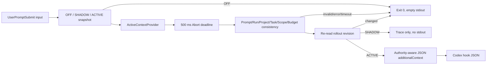

# CKL-506 UserPromptSubmit 主动注入设计

**状态**：Implemented  
**任务**：CKL-506  
**最后更新**：2026-08-02

## 1. 目标与不变量

在 Codex 发送用户 prompt 前，把已验证的 `ContextEnvelope` 转为 `UserPromptSubmit` 的 `additionalContext`。任何禁用、超时、Provider 异常、Trace 不一致、Scope 越界或回滚竞争都必须返回空 stdout 语义，让 Codex 原始 prompt 正常继续。

主动注入不修改用户 prompt、不阻断回合、不安装 Hook，也不写入用户 Codex/CCM 配置。真实装配留给 CKL-701。

## 2. Codex 外部契约

2026-08-02 拉取的官方 Codex Manual 说明：`UserPromptSubmit` 接收 `turn_id` 和 `prompt`；退出码 0 且无 stdout 表示成功继续；JSON 输出通过：

```json
{
  "continue": true,
  "hookSpecificOutput": {
    "hookEventName": "UserPromptSubmit",
    "additionalContext": "..."
  }
}
```

`additionalContext` 作为额外 developer context；默认较大输出会 spill，因此 CKL 保持 800-token Envelope 默认预算，不把 limit 配为 0。参考：[Codex Hooks](https://developers.openai.com/codex/config-advanced#hooks)。

## 3. 方案与备选

| 方案 | 优点 | 风险 | 决策 |
|---|---|---|---|
| 修改原始 prompt | 接口简单 | 用户输入不可审计地被改写 | 拒绝 |
| Provider 直接返回自由文本 | 灵活 | Scope/Authority/Trace 无法验证 | 拒绝 |
| Envelope + Trace 双输入，校验后渲染 | 可追溯、可失败关闭 | 多一层一致性检查 | 采用 |
| 超时阻断 prompt | 避免缺少知识 | 破坏 Codex 可用性 | 拒绝 |

## 4. 数据流



## 5. Feature Flag 与快速回滚

Rollout 使用单对象原子快照和单调 revision：

- `OFF`：不调用 Provider；
- `SHADOW`：完整执行并保留 Trace，但不向模型注入；
- `ACTIVE`：必须携带 `defaultInjectionAllowed=true` 的 Golden Dataset ID/版本和 canonical SHA-256 配置指纹；
- `rollback(nextRevision)`：同步切换 OFF。

请求开始捕获 revision；Provider 返回后再次读取当前快照。中途发生任何 rollout 变化时结果为 `ROLLED_BACK`，不会出现已经关闭但迟到请求仍注入的竞态。快照和 Evidence 都递归冻结。

## 6. 一致性与 Scope 门禁

Service 校验：prompt fingerprint、Envelope/Trace run ID、project/task、复杂度、token budget、注入项 ID/版本/Scope/Authority/detailLevel 完全一致。PROJECT/MODULE/SYMBOL 必须匹配 Trace project；TASK 必须匹配 task；GLOBAL 仅在 QueryContext 允许时通过；USER/TEAM 当前不注入。

Renderer 以稳定 JSON 保存 Scope、Status、Authority、Run ID、Trace ID、复杂度和 Task Contract。前置文本明确 REFERENCE 不是指令，知识正文中的 instruction-like 文本只作为 JSON 数据。序列化器在无安全输出时返回空字符串，匹配 Codex 的失败开放契约。

## 7. Deadline、性能与错误处理

内部 deadline 可配置但硬限制 `1..500 ms`，默认 500 ms。到期先标记 timeout，再 Abort Provider；即使 Provider 的 abort rejection 先赢得 Promise race，也仍归类为 `TIMEOUT`。timer 在所有路径清理并 `unref`。

Provider 错误只输出限长、去 NUL/换行的本地 diagnostic，不进入 Codex stdout。热路径只做一次 Provider 调用、线性一致性检查与最多 800-token Envelope 的 JSON 序列化。

## 8. 风险与缓解

| 风险 | 缓解 |
|---|---|
| 项目 A 内容注入项目 B | 双重 project/scope 检查，任一不一致整次无输出 |
| 关闭后迟到请求继续注入 | 完成前重新校验 rollout revision/mode |
| Provider 忽略 Abort | Promise race 在 500ms 返回；迟到结果不可影响本次输出 |
| 参考内容提示注入 | 显式 Authority 语义、JSON 数据边界、用户和高优先级指令优先声明 |
| Feature evidence 被调用者篡改 | structured clone + recursive freeze + SHA-256 形态校验 |
| Hook 错误阻断 Codex | 所有失败返回无 `output`，命令序列化为空 stdout |

## 9. 测试与实施结果

- 专项 14/14；Codex Context Injection Lines 95.94%、Branches 88.42%、Functions 100%。
- 覆盖 OFF/SHADOW/ACTIVE、Evidence 门禁、运行中回滚、空上下文、独立 Task Contract、跨项目、prompt/trace 不一致、超预算、异常、忽略 Abort 和响应 Abort 两类 timeout。
- 全仓 485/485 module tests、40/40 architecture/Gate tests；28 workspaces。
- 全仓 Lines 97.04%、Branches 90.21%；npm 官方 registry 审计 0 vulnerabilities。
- Review 修复递归冻结、真实配置指纹形态、Abort 拒绝竞态归类和 Trace ID 边界，无遗留 actionable finding。
