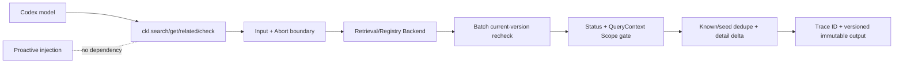

# CKL-507 运行中知识 MCP 设计

**状态**：Implemented  
**任务**：CKL-507  
**最后更新**：2026-08-03

## 1. 目标与不变量

提供 `ckl.search`、`ckl.get`、`ckl.related`、`ckl.check` 四个运行中知识能力，让模型在默认 L1/L2 上下文不足时定向拉取，而不是提高所有任务的默认注入复杂度。

MCP 只返回当前 QueryContext Scope 内、状态为 `ACCEPTED/IMPLEMENTED/VERIFIED` 的当前版本。它是主动注入的并行能力，不是前置依赖；MCP Backend 不可用只影响当前工具调用。

## 2. 方案与备选

| 方案 | 优点 | 风险 | 决策 |
|---|---|---|---|
| MCP 直接暴露 Registry CRUD | 通用 | 模型可越过 Scope/生命周期门禁 | 拒绝 |
| 每次 `get` 返回完整 Envelope | 实现简单 | 重复已有 L1/L2，膨胀上下文 | 拒绝 |
| 四个窄工具 + 服务层复核 | 权限、增量和解释明确 | Backend 多一次 current 查询 | 采用 |
| 主动注入调用 MCP | 复用接口 | MCP 故障会破坏回合前注入 | 拒绝 |

## 3. 架构与数据流

Backend 是组合端口：生产装配可复用 CKL-502 Retrieval Engine 和 Registry；MCP 服务本身不重新实现搜索算法，只负责工具契约、current/Scope 防御和增量投影。

## 4. 工具契约

### `ckl.search`

接收 query、1～8 limit 和最多 100 个已知 `id/version/detailLevel`。返回 L1 Pointer：ID、版本、Scope、Status、Authority、标题和简介；不含边界、正文或 Evidence。命中必须用批量 `current` 结果替换后再输出。

### `ckl.get`

接受目标 `id/version`、`fromDetailLevel=L1|L2` 和可选 `targetDetailLevel=L2|L3`。L1→L2 返回边界、symbols 与 Evidence pointers；L1→L3 同时补齐这些边界和正文证据；L2→L3 只返回正文与 Evidence Summary。缺省 target 保持兼容并返回 L3。目标不存在、版本变化或不合格时返回空 items 和诊断。

### `ckl.related`

先确认所有 seed 当前且在 Scope 内，再调用 Relation Backend。结果排除 seed 与已知 `id@version`，返回可继续选择的 L1 Pointer。

### `ckl.check`

一次检查最多 100 个 ID，输出 requested/current version、eligible 和 `CURRENT_VERSION/VERSION_MISMATCH`、`STATUS_*`、`SCOPE_*` 或 `NOT_FOUND` reason codes，不返回正文。

所有工具结果包含合法 Retrieval Trace ID；所有知识条目或检查都包含版本。

## 5. Scope、版本与信任边界

- GLOBAL 仅在 QueryContext 允许时；PROJECT/MODULE/SYMBOL 的 projectId 必须相同；TASK 必须匹配 taskId；USER/TEAM 当前拒绝。
- Search/Related 命中对象不可信：用 `id` 批量读取 current，对比 version/contentHash，并使用 current 对象的 Scope、Status、正文和 Evidence。
- 同 ID 的 current 结果若版本或 contentHash 冲突，整个工具调用失败，避免随机选择。
- `knownItems` 按 `id@version` 去重；旧版本已知不会阻止新 current 版本返回。
- 入口收到已 Abort signal 时在调用 Backend 前失败。

## 6. 部署与故障隔离

本包只依赖 Domain 和 QueryContext，不依赖 `codex-context-injection`；主动注入包也不依赖本包。架构测试双向验证这一点。CKL-701 再把服务方法映射到真实 MCP transport 和 sidecar 生命周期。

Backend error 作为当前 MCP tool error 返回，不触发注入降级或修改 rollout。输出递归冻结，调用者不能改变缓存结果。

## 7. 性能与风险

Search/Related 输出最多 8 项；current 验证使用单次批量调用，复杂度 O(hits)。Check 最多 100 ID。Get 只读取一个当前 Asset。服务不持有跨请求缓存，避免 Scope 混用。

| 风险 | 缓解 |
|---|---|
| Search 命中伪造 Scope/Status | 以 current Backend 对象为唯一输出来源 |
| 已知 Envelope 被整段重复 | search/related 按 id@version 排除；get 只返回目标 L2/L3 差量 |
| Relation seed 越界扩大 Scope | 所有 seed 先 current + eligibility 校验 |
| 旧版本展开 | get 强制请求版本等于 current 版本 |
| MCP 故障影响主动注入 | 包和运行链路完全解耦，架构测试固化 |
| 大查询/批量耗尽资源 | query 20k、limit 8、seed 20、check/known 100 硬限制 |

## 8. 测试与实施结果

- 专项 6/6；Knowledge MCP Lines 97.16%、Branches 88.18%、Functions 100%。
- 独立架构测试证明 MCP 与主动注入双向无依赖；入口 Abort 在 Backend 调用前停止。
- 全仓 491/491 module tests、41/41 architecture/Gate tests；29 workspaces。
- 全仓 Lines 97.04%、Branches 90.16%；npm 官方 registry 审计 0 vulnerabilities。
- Review 覆盖 current 对象替换、冲突 current、旧版本、越 Scope seed、已知增量、L3 delta、批量上限和 Trace ID，无遗留 actionable finding。
