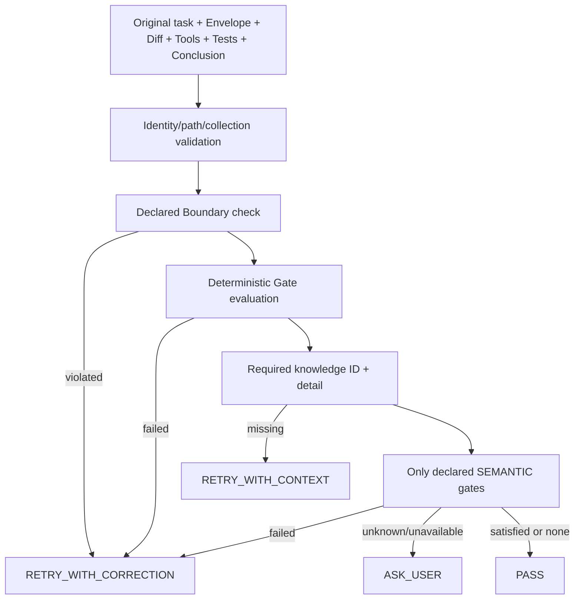

# CKL-601 Closure Verifier 设计

**状态**：Implemented  
**任务**：CKL-601  
**最后更新**：2026-08-02

## 1. 目标与不变量

验证一次任务是否真正闭环，并结构化输出 `PASS`、`RETRY_WITH_CONTEXT`、`RETRY_WITH_CORRECTION` 或 `ASK_USER`。验证器只能核对原始任务声明的 Gate、Boundary 和 Knowledge Requirement，不能创建新需求。

输入严格限定为原始目标、Context Envelope、Diff、工具结果、测试结果和最终结论。Boundary 与确定性 Gate 永远先于语义判断；未通过时不调用语义端口。

## 2. 方案与备选

| 方案 | 优点 | 风险 | 决策 |
|---|---|---|---|
| 让模型阅读完整对话自由判断 | 理解灵活 | 新增需求、遗漏确定性失败、不可复现 | 拒绝 |
| 只检查测试是否通过 | 确定性强 | 无法覆盖 Artifact、Boundary、Scope 和意图 | 拒绝 |
| 结构化 Gate 优先 + 受限 Semantic Gate | 可解释且保留必要语义能力 | 需要显式任务契约 | 采用 |

## 3. 数据流与优先级

边界错误不会被“语义上看起来正确”覆盖；测试/Artifact/Path/Tool/Open Issues 等确定性 Gate 失败也不会调用模型。

## 4. 任务契约与结果

确定性 Gate 类型：`TEST_PASSED`、`ARTIFACT_PRESENT`、`PATH_CHANGED`、`TOOL_SUCCEEDED`、`NO_OPEN_ISSUES`；只有显式 `SEMANTIC` Gate 进入 Port。Boundary 当前为仓库相对路径前缀禁止项。

`ClosureVerificationResult` 包含：

- 原 verification/task ID 与决策；
- `missingKnowledgeIds`，只来自原始 requiredKnowledge；
- `unmetGateIds`，只来自原始 gates；
- `violatedBoundaryIds`，只来自原始 boundaries；
- 每个 Gate 的 SATISFIED/UNSATISFIED/UNKNOWN、reason codes 与 Evidence refs。

版本化 JSON Schema 对 Gate Result 嵌套结构拒绝未知字段，顶层允许前向扩展。`config/closure-policy.yaml` 与代码默认策略做契约测试。

## 5. Semantic Port 边界

Port 只收到 objective、已声明 Semantic Gate ID/description、Context Envelope、Diff、工具结果、测试和最终结论。输出必须恰好覆盖全部 Semantic Gate ID，每个一次；缺失、重复或未知 ID 视为 requirement expansion/非法输出，结果为 `ASK_USER`，新 ID 不进入最终结果。

语义超时使用 AbortController，默认策略硬上限 3 秒；无 Port、未知结果、超时或错误均不会伪造 PASS。CKL-602 再施加 Stop Hook 外层 deadline 与失败开放。

## 6. 安全与一致性

- Envelope taskId 必须等于原始 taskId，防止跨任务上下文闭环。
- Diff、Gate Path 和 Boundary Prefix 必须是归一化仓库相对路径，拒绝绝对路径、反斜杠、空段、`.` 和 `..`。
- Gate/Boundary/Knowledge ID 唯一且受限；Tool/Test evidence ID 不允许重复。
- Final conclusion 未声称完成时不能 PASS。
- 结果 schema parse 后 clone + recursive freeze。

## 7. 性能与风险

Gate/Boundary/Knowledge 各最多 100；Diff/Tool/Test 各最多 10,000。确定性阶段只进行有界数组扫描，不进行 I/O 或模型调用。

| 风险 | 缓解 |
|---|---|
| 模型新增验收项 | Semantic ID 必须与声明集合完全相等 |
| 模型覆盖测试/边界失败 | 确定性失败在 Port 调用前返回 |
| 信息不足反复泛化检索 | 精确返回缺失 Knowledge ID 和所需 detail |
| 跨任务 Envelope 满足 Gate | taskId 强一致 |
| `../` 绕过 Boundary | 强制 canonical relative path |
| Abort-aware Port 把超时误报普通错误 | 同时检查 error 与 signal.reason 的 Timeout 类型 |

## 8. 测试与实施结果

- 专项 8/8；Closure Verifier Lines 100%、Branches 89.83%、Functions 100%。
- Closure Result Schema、closure-policy.yaml 契约、确定性 PASS/Correction、精确 Context Retry、Semantic PASS/Fail/Unknown/Unavailable/Expansion/Timeout 全覆盖。
- 全仓 499/499 module tests、43/43 architecture/Gate tests；30 workspaces。
- 全仓 Lines 97.06%、Branches 90.15%；npm 官方 registry 审计 0 vulnerabilities。
- Review 修复 violatedBoundaryIds、跨 task Envelope、非 canonical path 和 abort-aware timeout 归类，无遗留 actionable finding。
