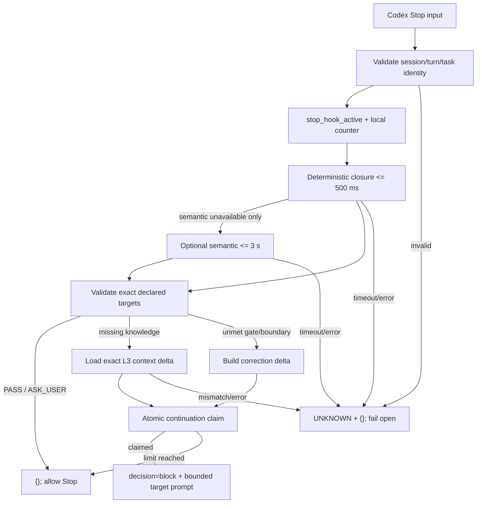

# CKL-602 Stop Hook 有限续跑设计

**状态**：Implemented  
**任务**：CKL-602  
**最后更新**：2026-08-02

## 1. 目标与不变量

把 CKL-601 的结构化闭环结果转换为 Codex Stop Hook 的有限 continuation。适配器只允许继续原任务中已经声明的 Knowledge、Gate 或 Boundary，不把验证器文本直接作为新需求，也不读取完整历史对话。

核心不变量：正常结束输出 `{}`；只有合法且仍有续跑额度的 context/correction 决策输出 `{"decision":"block","reason":"..."}`；任何输入、Port、目标集合或 deadline 异常都失败开放为 `UNKNOWN`，不阻塞 Codex。

## 2. Codex 契约与方案选择

实现遵循当前 Codex Hooks 契约：Stop 输入使用 `session_id`、`turn_id`、`stop_hook_active` 和 `last_assistant_message`；`decision=block` 的 `reason` 成为 continuation prompt；无动作时使用空 JSON 对象。

| 方案 | 优点 | 风险 | 决策 |
|---|---|---|---|
| 让模型自由改写 continuation | 灵活 | 扩大 Scope、重复工作、不可复现 | 拒绝 |
| Stop 失败时阻塞等待人工 | 不会静默遗漏 | Hook 故障影响 Codex 主流程 | 拒绝 |
| 结构化目标白名单 + 有限计数 + 失败开放 | 可控、可解释、无死循环 | 需要维护严格 Port 契约 | 采用 |

## 3. 处理流程

外层 Hook deadline 从进入 `handle` 时开始计算。每个下游 Port 都通过 AbortSignal 和剩余时间执行；确定性阶段取策略 500 ms 与外层剩余时间的较小值，可选语义阶段取策略 3 秒与剩余时间的较小值。

## 4. 精确 Delta 与防扩张

Verifier 输出必须保持 verification/task identity，Gate Result 必须恰好覆盖原 Gate 集合；missing Knowledge、unmet Gate、violated Boundary 必须是原声明集合的不重复子集。决策形状也必须一致：

- `PASS` 不得携带缺失/失败目标，且全部 Gate 为 `SATISFIED`；
- `RETRY_WITH_CONTEXT` 必须至少有一个缺失 Knowledge，不能同时存在 correction target；
- `RETRY_WITH_CORRECTION` 必须至少有一个真实 `UNSATISFIED` Gate 或 Boundary，不能携带 Knowledge target；
- `ASK_USER` 正常结束当前 Turn，由 CKL-603 决定是否生成微确认。

Context Port 必须一次且仅一次返回全部请求 ID，trace ID 合法；少项、多项、重复项均为 `UNKNOWN`。Correction prompt 只序列化原 Gate 描述和 Boundary path prefix，不包含完整 objective、历史对话或额外模型解释。

## 5. 有限续跑与并发

计数键使用 `[session_id, turn_id]` 的 JSON 编码，避免字符串拼接碰撞。默认策略最多一次，高风险最多两次。进入验证前先快速检查额度，生成 delta 后再使用同步原子 `claim`，因此同一进程中的并发 Stop 最多只有一个请求获得最后额度。

`InMemoryContinuationCounter` 是运行时最小实现和测试实现；`ContinuationCounterStore` 保留持久化/Daemon 实现端口。插件采用短进程执行时必须由后续装配提供跨进程 Store，不能把进程内 Map 当成持久保证。

## 6. 与 CKL-601 的闭环修正

联合 review 修复了两个语义漏洞：`UNKNOWN` Gate 不再被标记为 unmet；若所有 Gate 已满足但最终结论仍声明未完成，CKL-601 返回 `ASK_USER`，不再生成无 correction target 的重试。这样 Stop continuation 永远具有可执行、已声明的修正目标。

## 7. 风险与缓解

| 风险 | 缓解 |
|---|---|
| `stop_hook_active` 递归续跑 | 活跃时验证器都不调用，直接允许 Stop |
| 并发请求同时看到剩余额度 | 最终输出前原子 claim |
| `session:turn` 拼接键碰撞 | JSON tuple key |
| Semantic 偷增 Gate | 所有目标与完整 Gate 集合二次验证 |
| Port 返回矛盾 decision | 决策形状与 Gate status 交叉校验 |
| Context 重复/夹带知识 | 精确集合和唯一性校验 |
| 下游不响应 | Abort + 分层 deadline + 外层剩余时间 |
| Hook 自身故障拖垮 Codex | `UNKNOWN` 序列化为 `{}`，失败开放 |
| 短进程丢失计数 | Store 端口化；生产装配必须选择持久实现 |

## 8. 测试与实施结果

- Stop 专项 9/9，覆盖 PASS、context/correction、默认/高风险上限、并发 claim、active guard、Semantic 条件调用、三层 timeout、非法/重复/扩张 target 与序列化。
- Closure + Stop 联合回归 18/18；Lines 98.92%、Branches 90.69%、Functions 100%。
- 当前模块独立覆盖率 Lines 97.64%、Branches 90.52%、Functions 100%。
- 全仓 Gate 结果在提交前记录到 `progress.md`；未安装 Hook、未启动 Daemon、未修改用户 Codex/CCM 配置。
