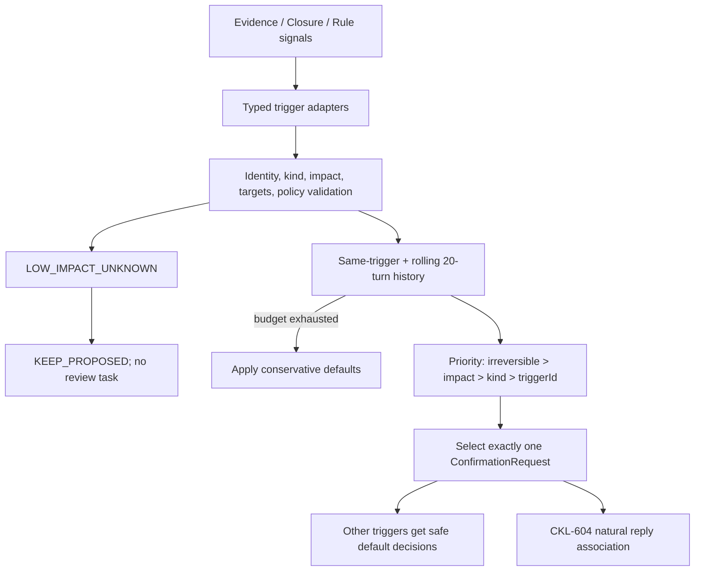

# CKL-603 Interaction Policy 设计

**状态**：Implemented  
**任务**：CKL-603  
**最后更新**：2026-08-02

## 1. 目标与边界

Interaction Policy 把知识冲突、Scope 晋升、规则覆盖和 Closure `ASK_USER` 收敛为低频、单问题、可回写的微确认。它不创建审核队列，不直接改变知识状态、Scope 或规则，也不解释完整对话；实际回写由 CKL-604 根据版本化 `ConfirmationRequest` 完成。

核心安全默认值是：用户不回答等同于不扩大 Scope、不覆盖规则、不执行不可逆操作；低影响未知继续保持 `PROPOSED`。

## 2. 方案与备选

| 方案 | 优点 | 风险 | 决策 |
|---|---|---|---|
| 每个冲突都立即提问 | 信息及时 | 打扰失控，用户最终忽略 | 拒绝 |
| 全部进入人工审核队列 | 过程可见 | 形成持续人工债务，与无感运行冲突 | 拒绝 |
| 模型自由合并多个问题 | 文案灵活 | target/选项漂移，难以可靠回写 | 拒绝 |
| 类型化触发器 + 固定选项 + 低频优先级 | 可解释、可审计、可安全默认 | 需要明确冷却和 defer 语义 | 采用 |

## 3. 上游信号适配

`@zhiloop/interaction-policy` 提供三个受限 Adapter：

- `evidencePolicyTriggers`：把 Evidence Policy 的冲突、GLOBAL fallback 和 PROPOSED/UNKNOWN 分别映射为 `KNOWLEDGE_CONFLICT`、`SCOPE_PROMOTION`、`LOW_IMPACT_UNKNOWN`；
- `closureInteractionTrigger`：只把 Closure 的 `ASK_USER` 映射为 `CLOSURE_ASK_USER`，PASS/Retry 不产生问题；
- `ruleOverrideTrigger`：由规则执行层显式提交 `RULE_OVERRIDE`，默认视为不可逆高影响。

Trigger ID 根据来源、类型和目标集合确定性生成；展示摘要不参与 ID，避免模型改写文案绕过“同一 Trigger 不重复询问”的门禁。

## 4. 决策流程

同一决策最多包含一个 `request`。最近连续 20 Turn 只要已经提问一次，本 Turn 不再提问；同一 trigger 即使超过窗口也不重复询问。这个限制比“每 Turn 一个”更严格，直接覆盖 P6 Gate 的每 20 Turn 不超过一次。

## 5. ConfirmationRequest 契约

版本化 Schema `confirmation-request/v1` 包含 session/turn/ordinal、trigger、kind、精确 subject IDs、问题、类型固定的语义选项、安全默认项和创建时间。顶层允许未来扩展，嵌套 option 严格拒绝未知字段。

| Kind | 无回答默认 effect | 显式可选 effect |
|---|---|---|
| `KNOWLEDGE_CONFLICT` | `KEEP_PROPOSED` | `REJECT_CANDIDATE` / `ACCEPT_CANDIDATE` |
| `SCOPE_PROMOTION` | `KEEP_PROJECT` | `PROMOTE_GLOBAL` |
| `RULE_OVERRIDE` | `KEEP_RULE` | `APPLY_OVERRIDE` |
| `CLOSURE_ASK_USER` | `STOP_WITHOUT_EXPANSION` | `CONTINUE_ORIGINAL_SCOPE` |

Domain 同时定义每类完整 effect 集合与 safe effect。Schema Parser 不仅检查默认 option ID 存在，还要求全部 effect 与 kind 的允许集合精确一致，防止把 Scope 问题伪造成规则覆盖。

## 6. Defer 与无人回答

`InteractionPolicyDecision.defaults` 为每个未提问 trigger 给出精确 subject IDs、effect 和原因。低影响未知、20 Turn 预算耗尽、较低优先级以及历史已询问分别可诊断；`reviewTasksCreated` 固定为 0。

被选中的 Request 自带 `safeDefaultOptionId`。CKL-604 若在关联窗口内未识别到明确选择，只能落这个默认项；不能根据沉默推断同意，不能批量修改其他 Candidate，也不能把 PROJECT 静默提升到 GLOBAL。

## 7. 配置与防削弱

Verification Policy 的 interaction 配置固定为：

- `maxQuestionsPerTurn: 1`；
- `questionWindowTurns: 20`；
- `defaultScope: PROJECT`；
- `unansweredBehavior: SAFE_DEFAULT`；
- `createReviewTasks: false`。

这些字段使用 literal Schema，配置不能降低冷却窗口、打开审核队列或把无人回答改成继续执行；Evidence Policy 也会复核完整安全配置，防止跨模块配置快照漂移。

## 8. 风险与缓解

| 风险 | 缓解 |
|---|---|
| 多个上游各自解释 reason code | 统一 Evidence/Closure/Rule Adapter |
| 同 Turn 生成多个问题 | 决策只允许一个 optional Request |
| 长期频繁打扰 | 滚动 20 Turn 单问题窗口 |
| 改写摘要绕过重复检测 | Trigger ID 不含展示摘要 |
| 用户沉默被当成批准 | 每类固定保守 safe effect |
| 低影响未知形成审核债务 | KEEP_PROPOSED，reviewTasksCreated 固定 0 |
| 本机排序差异改变选择 | 明确优先级与 code-point trigger ID 排序 |
| subject 顺序改变幂等 ID | 排序后哈希并规范化输出 |
| 外部绕过 TypeScript 注入未知 kind/impact | 运行时枚举、ID、集合和 identity 校验 |
| Schema 默认安全但另一选项越权 | kind 对应 effect 集合精确校验 |

## 9. 测试与实施结果

- Interaction Policy/Adapter 专项 13/13：单问题、四类 safe default、优先级、滚动窗口边界、同 trigger 去重、低影响未知、非法输入、稳定 ID 和上游映射。
- Confirmation Schema、Config 和 Evidence Policy 联合回归 78/78。
- Interaction 专项 Lines 98.76%、Branches 88.61%、Functions 96.87%；核心 Policy Lines 98.46%。
- 全仓 Gate、整体覆盖率和供应链审计结果在提交前记录到 `progress.md`。
