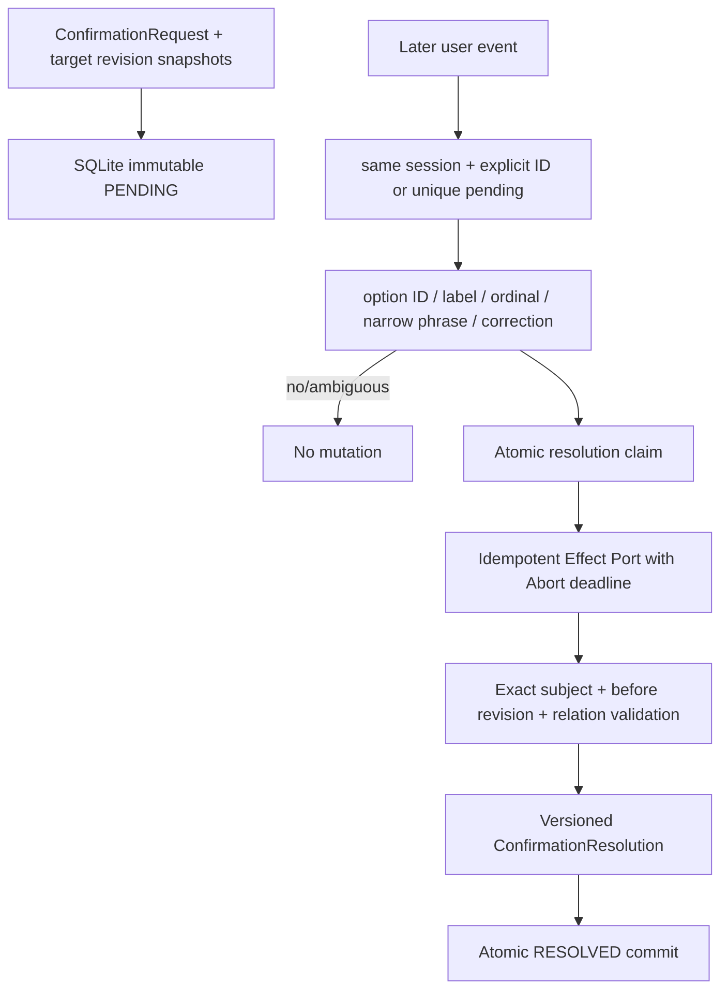

# CKL-604 自然对话确认回写设计

**状态**：Implemented  
**任务**：CKL-604  
**最后更新**：2026-08-02

## 1. 目标与不变量

把后续用户回复与唯一 Pending `ConfirmationRequest` 关联，并通过幂等 Effect Port 回写精确 subject。系统只接受明确选项、严格短语或明确纠正，不把“好的”“可以讨论”等普通对话推断成批准。

不变量：回复必须来自同 session 的后续 Turn；没有显式 confirmation ID 时必须恰好只有一个 Pending；写回 subject 与 Request 完全相等；写回必须基于 Request 创建时的 revision snapshot；否定、确认和纠正均保留 before/after relation。

## 2. 方案与备选

| 方案 | 优点 | 风险 | 决策 |
|---|---|---|---|
| 用模型阅读后续完整对话自由关联 | 表达覆盖广 | 误关联、越 target、不可复现 | 拒绝 |
| 只支持 UI option ID | 最确定 | 自然对话不可用 | 拒绝 |
| 窄自然语言匹配 + 显式 target/revision fencing | 兼顾自然交互和确定性 | 未覆盖表达会安全 NO_MATCH | 采用 |

## 3. 数据流

SQLite 状态为 `PENDING → CLAIMED → RESOLVED`。Claim 绑定 resolution ID、response event ID 和 response hash；同一回复可重试，其他回复冲突。Effect 在 commit 前执行，因此 Port 必须以 resolution ID 幂等，并遵守 AbortSignal。若进程在 Effect 后、commit 前退出，同一事件重放会复用 claim 和 resolution ID，而不是重复语义操作。

## 4. 关联与自然语言门禁

关联要求：

- `sessionId` 一致；显式 ID 也不能跨 session 读取 Resolution；
- response Turn ordinal 更大、Turn ID 不同、occurredAt 晚于 Request；
- 无显式 ID 时，Pending 数量必须恰好为 1；多个 Pending 返回 `AMBIGUOUS_PENDING`；
- option ID、完整 label、序号或受限锚定短语才能选择；普通确认和包含讨论性文字的句子返回 `NO_EXPLICIT_CHOICE`。

纠正只对 `KNOWLEDGE_CONFLICT` 开启，并要求“不是/不对”后继续出现“应该/改为”等纠正标记，或直接以“纠正为/改成/应该是”开头。“不是很确定”不会误判；“不是这个意思”作为显式拒绝，而非纠正。

## 5. 沉默、拒绝与纠正分离

CKL-603 的 `KEEP_PROPOSED` 只表示无人回答时不动作。CKL-604 新增显式 `REJECT_CANDIDATE`：

- 沉默：没有 Resolution，不改变 Candidate；
- 明确拒绝：effect 为 `REJECT_CANDIDATE`，relation 为 `REJECTS`；
- 明确采用：effect 为 `ACCEPT_CANDIDATE`，relation 为 `CONFIRMS`；
- 明确纠正：effect 仍拒绝原候选，responseKind 为 `CORRECTION`，relation 为 `CORRECTS`，`correctionStatementRef` 精确指向本次用户事件。

纠正正文不复制进 Resolution；Effect Port 在本次调用中消费正文生成下一 revision，持久化结果只保留 event ref、文本 SHA-256 和完整版本关系。

## 6. Revision 与关系契约

每个 Pending Request 保存 `{subjectId, expectedRevision}` 快照。Effect 返回的 relation 必须一一覆盖 target：`beforeRevision` 必须等于快照；CONFIRMS/REJECTS/CORRECTS/PROMOTES/OVERRIDES 必须产生不同的 after revision；RETAINS/CONTINUES 可保持原 revision。

`ConfirmationResolution/v1` 记录 request/response Turn、response event/hash、selected option/effect、精确 subject IDs 和版本关系。Domain 唯一定义 effect→relation 映射，Schema Parser 同时验证：subject 完整覆盖、relation 语义、纠正 effect、correction ref 与 response event 一致，以及 request/response Turn 不同。

## 7. 持久化与安全

- Request、target snapshot 和 Resolution 使用 canonical JSON + SHA-256，读取时复验；同 ID 不同内容报冲突。
- SQLite 使用 foreign keys、busy timeout、WAL、NORMAL synchronous；文件权限设置为 `0600`。
- 索引按 session/status/turn ordinal 查找，查询硬限制 100 条；超过一个 Pending 不猜测。
- Repository 支持关闭、重开和未来 migration 拒绝。
- 用户正文不入本模块数据库；Port 异常消息不透传，只返回固定类型诊断。

## 8. 风险与缓解

| 风险 | 缓解 |
|---|---|
| 普通“好的”被当批准 | 窄匹配，未命中不改变状态 |
| 回复绑定错误 Candidate | 唯一 Pending/显式 ID + 精确 subject 集合 |
| 跨 session 猜中 confirmation ID | Resolution 返回前复核 session |
| 新版本已产生仍写旧选择 | expectedRevision fencing |
| 并发不同回复都生效 | SQLite `BEGIN IMMEDIATE` 原子 claim |
| crash 后 Effect 重复 | resolutionId 幂等 Port + 同 claim 重试 |
| Port 夹带其他 target | relation 集合必须精确覆盖快照 |
| 否定与沉默混为一谈 | `KEEP_PROPOSED` 与 `REJECT_CANDIDATE` 分离 |
| 纠正丢失前后关系 | CORRECTS + before/after revision + statement ref |
| 模糊否定误判纠正 | correction 组合标记门禁 |
| 回复正文长期扩散 | DB 只保存 hash/ref，错误诊断不透传 Port message |
| Port 超时后仍后台写入 | Abort + 强制 resolutionId 幂等；违规 Port 不能用于生产装配 |

## 9. 测试与实施结果

- CKL-604 专项 23/23，覆盖 option/label/ordinal/自然短语、普通对话、拒绝/纠正、唯一 Pending、显式 ID、同 Turn/时间门禁、幂等/冲突、timeout、target/revision/relation 扩张、SQLite reopen/migration 和故障恢复。
- 专项 Statements 94.53%、Branches 88.93%、Functions 96%、Lines 97.58%。
- Confirmation Schema 联合回归覆盖 safe option、effect 集合、correction ref、relation 语义和 subject coverage。
- 全仓 Gate 和供应链结果在提交前记录到 `progress.md`。
