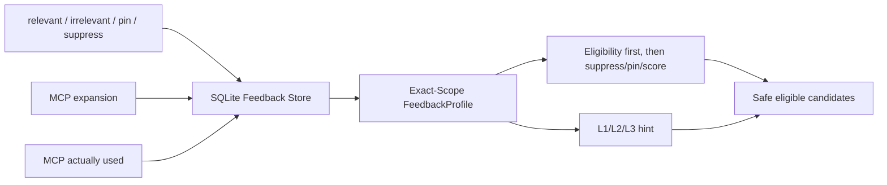

# CKL-605 召回与注入反馈设计

**状态**：Implemented  
**任务**：CKL-605  
**最后更新**：2026-08-02

## 1. 目标与边界

沉淀 `relevant`、`irrelevant`、`pin`、`suppress` 和 MCP 展开后实际使用信号，让后续同 Scope 的召回顺序与注入深度可调整。反馈不是权限：它只能作用于已经通过 current version、Status 和 Scope 门禁的候选，不能使 PROPOSED、STALE、tombstone 或跨项目知识重新出现。

## 2. 持久化模型

`@zhiloop/feedback-engine` 使用三个 SQLite 表：不可变 Knowledge Feedback Event、MCP Expansion、MCP Usage。Event/Expansion/Usage ID 都幂等，同 ID 不同内容报冲突；Usage 必须引用真实 Expansion 且 trace ID 一致，一个 Expansion 最多一个“实际使用”事件。

反馈按调用时的精确 `scopeKey` 隔离。相同资产在 Project A suppress 不影响 Project B；后续显式 pin 可以反转同 Scope 的 suppress，反之亦然，最后一个控制信号生效。

## 3. Profile 与集成顺序

Retrieval Engine 先完成 current/Status/Scope/tombstone 过滤和 RRF，再应用 feedback：suppress 删除现有 eligible item；pin、relevance score 只重排现有 eligible item。Profile 必须匹配 QueryContext 推导出的 TASK/PROJECT/GLOBAL scope key，且 `score = relevant - irrelevant`、pin/suppress 不能同时为 true。

## 4. 复杂度学习

默认仍为 `L2_COMPACT`：

- 同 Scope 至少 2 次 irrelevant 且多于 relevant，建议 `L1_POINTER`；
- 至少 3 次 relevant、至少 2 次 MCP expansion，且实际使用率至少 50%，建议 `L3_EVIDENCED`；
- 其他情况保持 L2；永不建议 L4。

Context Orchestrator 复核 scope、样本数和固定 reason code。显式 requestedLevel 优先于反馈；HIGH risk、冲突或歧义仍可强制提升 L3，因此反馈不能削弱安全门禁。Token budget 仍可把内容降级或截断。

## 5. MCP 使用闭环

Expansion 只说明用户/模型拉取过 L3，不等于实际用于结论。调用方需在后续工具/引用证据确认知识被消费时写入 Usage；Store 通过 expansion ID + trace ID 关联。Profile 独立报告 `mcpExpanded` 与 `mcpUsed`，深度提升同时依赖 relevant 和 usage，避免“频繁展开但从未使用”造成上下文膨胀。

## 6. 风险与缓解

| 风险 | 缓解 |
|---|---|
| suppress 跨项目污染 | 精确 scopeKey 分区 |
| pin 绕过 Status/Scope | 只在 Retrieval eligibility 后应用 |
| 伪造 score | relevant/irrelevant/score 交叉验证 |
| 反馈同时 pin+suppress | Profile 拒绝矛盾输入；Store 最后控制信号唯一 |
| 单次误点改变深度 | L1 至少 2 个负样本，L3 至少 3 个正样本 + MCP usage |
| feedback 降低高风险证据 | risk gate 在 feedback 选择后强制 L3 |
| feedback 自动开启 L4 | 类型和运行时都只允许 L1-L3 |
| Expansion 被误当实际使用 | Usage 独立事件且必须关联真实 trace |
| 重复事件放大权重 | ID 幂等，内容冲突拒绝 |
| 大量 profile 拖慢召回 | 复合索引、单 Scope 聚合、输入集合硬上限 |

## 7. 测试与实施结果

- Feedback Store 专项 6/6；Statements 93.87%、Branches 91.46%、Lines 98.64%。
- Feedback + Retrieval + Context 联合 31/31，覆盖 Scope 隔离、suppress/pin、PROPOSED 不可复活、深度升降、显式/高风险优先和 MCP 使用关联。
- 全仓 Gate 和供应链结果在提交前记录到 `progress.md`。
