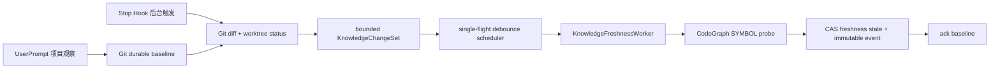

# M10 配置 v2、代码变化调度与安全灰度

## 1. 交付结论

M10 把此前分散的自动编译、知识演进、CodeGraph、Freshness、Prewarm 和告警参数收敛为严格配置，并把会影响后台行为的字段接到实际运行时。默认值仍满足：自动生成 Candidate、只停留在 Preview、禁止自动发布、禁止自动初始化 CodeGraph、禁止后台主动执行测试、知识链路失败不阻塞 Codex。

## 2. 配置与迁移

核心 `@zhiloop/config` 使用 `version: 2`。Loader 对输入先判定版本：

- 未声明版本或 `version: 1`：用原 v1 严格 Schema 补齐原默认值，再确定性迁移到 v2。
- `version: 2`：直接使用 v2 严格 Schema；未知字段拒绝。
- 未来版本：返回 `UNSUPPORTED_CONFIG_VERSION`，不尝试猜测或降级。

迁移不修改调用方对象。若旧版注入预算低于新版预热默认值，迁移会把 Prewarm 的 items/token 上限收窄到旧版 L1/注入预算，避免升级后配置突然失效。

控制台配置同步升级到 `schemaVersion: 2`。Configuration Service 读取历史 v1 revision/draft 时按同一默认值补齐新模块；激活仍使用 draft → validate → prepare → apply → rollback closure 的 revision/CAS 流程。

## 3. 运行时接线

| 配置模块 | 实际消费者 | 生效方式 |
|---|---|---|
| `compilation` | `P2AutomaticCompilationRuntime` | 在线重建 completion-based Scheduler，可回滚 |
| `evolution.maxMatchCandidates` | Knowledge Worker | 新任务读取；修改标记需重启 |
| `codeIntelligence` | CodeGraph Freshness Verifier | 启动时构造；修改标记需重启 |
| `freshness` | `KnowledgeFreshnessScheduler` | 在线更新去抖、兜底扫描和单任务上限，可回滚 |
| `prewarm` | `P4ActiveSidecarRuntime` | 每次会话预热动态读取，无需重启 |
| `evolutionAlerts` | 运行日志/后续通知适配器 | 当前只提供策略字段；默认不通知外部系统 |

`compilation.mode` 和 publication 字段在控制台可见，但当前生产 consumer 报告 `NOT_CONFIGURED`，因此不能被在线激活为自动发布。这不是静默忽略：页面会收到 `CONSUMER_DISABLED`。首个交付版本仍严格保持 Preview-only。

## 4. 代码变化到知识保鲜

Git Adapter 首次只建立 baseline。之后合并 commit diff、当前工作区状态和上一次未提交路径，最多输出 10,000 个仓库相对路径。UserPrompt 用于登记项目和建立 baseline；Stop Hook 只发起后台扫描，不占用闭环关键路径；另外保留有界兜底扫描。

Baseline 只有在 Worker 完成全部批次后才 ACK。若受影响知识超过单任务上限，Scheduler 会保留同一 ChangeSet 并逐批排除已经写入相同 code revision 的资产，最后一批完成后才推进 Git 游标。进程若在扫描与复验之间退出，旧 baseline 仍在，下次启动会重新产生同一 ChangeSet；Freshness CAS 保证重复复验幂等。若历史重写导致旧 commit 不可达，Adapter 会回退到全部 tracked files，而不是永久卡在无法执行的 diff。CodeGraph 未安装、未初始化、版本不兼容或超时时返回 UNKNOWN/REVALIDATE，不把旧知识继续当成 FRESH，也不阻塞 Codex。

当前 CodeGraph 负责 `SYMBOL_EXISTS`；其他 Assertion 仍由注册的确定性 Verifier 返回 SUPPORTED/REFUTED/UNKNOWN。Git 路径本身也参与 Anchor 反向索引，因此文件、配置和依赖变化无需模型即可定位候选。

## 5. 自动发布门禁

`@zhiloop/knowledge-publication-rollout` 对单条完整 Candidate 做纯函数授权。只有以下条件全部满足才返回 `SAFE_AUTO_PUBLICATION`：

1. 显式启用 publication 且执行模式为安全自动发布。
2. 项目与知识类型都在 allowlist。
3. 来源、Grounding、Scope 和 expectedVersion 完整且稳定。
4. Evolution 不是冲突或未决。
5. Implementation 的 Freshness 为 FRESH。
6. 不覆盖受保护的规则、决策或人工新版本。
7. Golden dataset ID/version/config fingerprint 与配置完全一致。

任一条件失败，整条 Candidate 保留为 Preview，并返回唯一主 reason code；禁止部分字段发布。该门禁已经有直接测试，但生产自动提交 consumer 仍关闭，符合首版灰度顺序。

## 6. 回滚与故障边界

- 在线编译与 Freshness 配置应用失败时，Configuration Service 倒序执行已应用组件的 rollback closure。
- CodeGraph 不自动执行 `init`，不会改业务仓库索引状态。
- 后台不会执行测试命令；`TEST_PASSED` 只能消费已有可信证据。
- Git/CodeGraph 输出有大小、路径、超时和项目身份限制，日志只记录 reason/count，不记录源码或完整对话。
- Prewarm 和 Freshness 失败均开放 Codex 主流程；代码相关知识在缺少 FRESH 投影时退出注入。

## 7. 自测与 Review

M10 完成了配置迁移、控制台激活、Git/CodeGraph 适配、Freshness 调度和发布门禁的直接测试，并通过仓库完整 Gate。代码 Review 从新增、变更和配置三个维度识别并修复了 3 个高风险与 3 个中风险问题：多批任务过早 ACK、初始关闭后在线开启不启动、授权边界只依赖 TypeScript 类型、Git 历史重写无法恢复、健康状态成功后仍永久降级，以及 ChangeSet 合并静默截断。最终无未关闭的高/中风险问题。

最终结果：66 个 Workspace 依赖边界通过，56 项架构/Gate 测试与 1,426 项 Vitest 测试通过；Statements 90.13%、Branches 85.06%、Functions 91.70%、Lines 93.72%。OpenSpec 严格校验通过。
