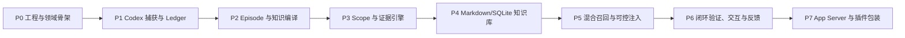

# ZhiLoop 实施计划

**状态**：In Progress（P0～P3 已完成，进入 P4）  
**版本**：0.3  
**创建日期**：2026-08-01  
**最近更新**：2026-08-02  
**依据**：[ZhiLoop（Codex Knowledge Layer）技术设计](../design/codex-knowledge-layer-tdd.md)

## 1. 实施约束

1. 首版采用 TypeScript/Node 的模块化单体。
2. 当前阶段不得修改 `~/.codex`、`~/.ccm` 或任何业务仓库。
3. 所有外部系统通过 Port 接入，测试中必须可替换为内存实现。
4. 每个任务必须同时提交实现、单元测试、契约测试或 Fixture，以及必要文档。
5. Phase 1 和 Phase 2 默认运行 Shadow Mode，不向 Codex 注入知识。
6. 未达到前一 Gate 时，不得启用下一阶段的用户可见能力。
7. 所有任务 ID、依赖和验收条件是实施时的唯一任务边界。

## 2. 里程碑依赖



P0-P4 构成“知识沉淀 MVP”；P5 构成“知识召回与注入 MVP”；P6 完成“有限闭环 MVP”；P7 是接入形态演进阶段。

## 3. P0：工程与领域骨架（已完成）

### CKL-001：初始化工程（已完成）

**依赖**：无  
**交付物**：Workspace、TypeScript 配置、lint、test、build、package scripts。  
**边界**：只创建工程骨架，不实现业务逻辑。

**验收条件**：

- `install`、`build`、`test`、`lint` 可在干净环境执行。
- `apps/*` 和 `packages/*` 能独立构建。
- CI 或本地等价命令会检查循环依赖。
- Node 版本和包管理器版本被固定并记录。

### CKL-002：定义 Domain 包（已完成）

**依赖**：CKL-001  
**交付物**：Event、Episode、Candidate、Asset、Scope、Evidence、Assertion、Relation、状态机类型。  
**禁止项**：Domain 不得导入 Node 文件系统、SQLite、Codex 或模型 SDK。

**验收条件**：

- 技术设计中的核心类型均有 TypeScript 定义。
- 所有状态迁移使用纯函数并覆盖允许/拒绝路径。
- `GLOBAL` 晋升不变量有单元测试。
- Domain 包在无 Node API 的测试环境可加载。

### CKL-003：定义 JSON Schema 和版本规则（已完成）

**依赖**：CKL-002  
**交付物**：`EventEnvelope`、`KnowledgeCandidate`、`KnowledgeAsset` 基础 Schema，以及后续 Schema 的版本与兼容规则。  
**验收条件**：

- TypeScript 类型和 Schema 有一致性测试。
- 未知字段策略明确：输入允许保留扩展字段，领域对象只读取已知字段。
- `schemaVersion` 不支持时产生可诊断错误，不静默解析。

### CKL-004：配置系统（已完成）

**依赖**：CKL-001、CKL-003  
**交付物**：Verification、Retrieval、Injection、Closure、Scope、Retention 配置加载器。  
**验收条件**：

- 缺少配置时加载安全默认值。
- 非法配置拒绝激活并保留上一有效版本。
- 修改配置不需要修改业务代码。
- 禁止通过配置绕过 Domain 不变量。

### P0 Gate（已通过）

- 架构依赖检查通过。
- Domain 覆盖率不低于 90%。
- 所有 Schema Fixture 通过。

具体提交、测试、覆盖率、安全审计和 Review 证据见[实施进度与验证记录](progress.md)。

## 4. P1：Codex 捕获与事件账本

### CKL-101：Codex Hook 输入适配器（已完成）

**依赖**：CKL-003  
**交付物**：`UserPromptSubmit`、`PostToolUse`、`Stop`、`SessionEnd` 到标准事件的转换。  
**验收条件**：

- 每个 Hook 类型至少有一个脱敏 Fixture。
- 未知 Hook 字段不导致转换失败。
- 缺少可选 `turn_id` 或 `transcript_path` 时仍可入队。
- 同一输入生成相同 `eventId`。

### CKL-102：版本化 Transcript Adapter（已完成）

**依赖**：CKL-101  
**交付物**：增量读取、游标、内容 hash、版本检测和未知版本降级。  
**验收条件**：

- 重复读取同一 transcript 不产生新事件。
- transcript 追加内容只产生增量事件。
- 文件截断、替换和格式错误能产生诊断事件。
- Transcript 原始结构不得暴露到 `ingestion-codex` 之外。

### CKL-103：SQLite Event Ledger（已完成）

**依赖**：CKL-002、CKL-003  
**交付物**：Migration、幂等追加、批量读取、游标提交、保留策略接口。  
**验收条件**：

- 重复 `eventId` 写入返回 duplicate，不创建第二行。
- Worker 在游标提交前崩溃，重启后可安全重放。
- 1000 条批量事件写入和读取测试通过。
- 事件正文和日志经过脱敏测试。

### CKL-104：Hook Handler 与本地 Spool（已完成）

**依赖**：CKL-101、CKL-103  
**交付物**：轻量 Hook 入口、严格超时、Ledger 不可用时的本地 Spool。  
**验收条件**：

- 捕获入队路径 P95 小于 100 ms。
- Daemon/SQLite 不可用时 Hook 仍以成功退出，不阻塞 Codex。
- Spool 恢复后事件按幂等规则补录。
- Hook 不调用模型、不扫描代码、不重建索引。

### CKL-105：Session/Turn 归一化（已完成）

**依赖**：CKL-102、CKL-103  
**交付物**：Session、Turn 边界和事件顺序规则。  
**验收条件**：

- 多次 Stop 不会生成重复 Turn。
- SessionEnd 缺失时可根据后续 Session 或超时关闭。
- 乱序工具事件按 source timestamp 和 source order 稳定排序。

### P1 Gate（已通过）

- 录制 Fixture 重放三次后 Ledger 行数不变。
- Hook 失败不会影响模拟 Codex 流程。
- 原始事件均可追踪到 session/turn/source。

## 5. P2：Episode 与知识编译

### CKL-201：Episode Builder

**依赖**：CKL-105  
**状态**：已完成  
**交付物**：目标、纠正、动作、产物、结果和证据引用聚合。  
**验收条件**：

- 单 Session 多 Turn 能合并为一个 Episode。
- 用户改变目标时创建新 Episode 或显式子目标。
- 用户纠正必须保留“被纠正内容”和“新内容”。
- Episode 可从 Ledger 完全重建。

### CKL-202：Knowledge Extraction Port

**依赖**：CKL-003、CKL-201  
**状态**：已完成  
**交付物**：模型无关提取接口、结构化输出 Schema、超时和重试策略。  
**验收条件**：

- 输入只包含 Episode 的必要字段。
- 输出不符合 Schema 时不产生部分 Candidate。
- 模型不可用时 Episode 保留待重试，不影响其他流程。
- 同一 Episode 可记录 compiler version 和 prompt version。

### CKL-203：MVP Knowledge Compiler

**依赖**：CKL-202  
**状态**：已完成  
**交付物**：支持 `REQUIREMENT`、`DESIGN`、`DECISION`、`IMPLEMENTATION`、`EXPERIENCE`。  
**验收条件**：

- 一个 Episode 可以输出多个不同类型 Candidate。
- 建议只能输出为 `PROPOSED`。
- Candidate 必须包含 `subjectKey`、Scope hint、来源 Episode 和至少一个 Evidence/Assertion hint。
- 不保存隐藏推理内容。

### CKL-204：用户承诺与纠正检测

**依赖**：CKL-201、CKL-203  
**状态**：已完成  
**交付物**：`USER_ACCEPTED`、`USER_REJECTED`、`CORRECTION` 证据。  
**验收条件**：

- “按这个做”和后续直接实施能关联到目标方案。
- “不是这个意思”“不要使用 X”会否定正确目标。
- 无明确指代时不得自动确认多个候选。
- 检测结果保留原始 Turn 引用。

### CKL-205：Candidate Repository

**依赖**：CKL-103、CKL-203  
**状态**：已完成  
**交付物**：候选持久化、版本、编译幂等和重试状态。  
**验收条件**：

- 相同 Episode/compilerVersion 不重复编译。
- 更换 compilerVersion 可生成新候选批次且保留旧批次。
- Candidate 默认不参与正式召回。

### P2 Gate

**状态**：通过  

- 端到端 Fixture 能从对话生成五种 MVP 知识。
- 所有 Candidate 可追溯至 Episode 和 Turn。
- 模型失败不丢事件且可重试。

## 6. P3：Scope 与证据引擎

### CKL-301：Project Identity Resolver

**依赖**：CKL-002  
**状态**：已完成  
**交付物**：Git Remote、Repo Root、无 Remote 降级和 worktree 归一化。  
**验收条件**：

- 同仓库不同 worktree 得到相同 portable Project ID。
- 两个不同 remote 不会得到相同 Project ID。
- 无 Git 场景生成稳定本地 ID，并标记不可移植。

### CKL-302：Scope Resolver

**依赖**：CKL-301、CKL-203  
**状态**：已完成  
**交付物**：TASK/SYMBOL/MODULE/PROJECT/USER/TEAM/GLOBAL 解析。  
**验收条件**：

- 默认使用最小可证明 Scope。
- 含项目路径、业务名或 symbol 的知识不能自动 GLOBAL。
- Scope 解析结果包含理由和置信度。
- Scope 不确定时降级 PROJECT，不向上扩大。

### CKL-303：Verifier Registry 和 MVP Verifiers

**依赖**：CKL-002、CKL-204、CKL-301  
**状态**：已完成  
**交付物**：User、Symbol、File、Dependency、Config、Command、Test Verifier。  
**验收条件**：

- 每个 Verifier 只接受对应 Assertion。
- 结果只能是 `SUPPORTED`、`REFUTED`、`UNKNOWN`、`ERROR`。
- `ERROR` 不得被当成 `REFUTED` 或 `SUPPORTED`。
- 所有证据包含观察时间、目标和 source event。

### CKL-304：Evidence Policy Engine

**依赖**：CKL-004、CKL-302、CKL-303  
**状态**：已完成  
**交付物**：状态迁移、自动发布、全局晋升和询问决策。  
**验收条件**：

- 仅模型输出永远不能超过 `PROPOSED`。
- 代码证据最多自动达到 `IMPLEMENTED`。
- 相关测试证据可达到 `VERIFIED`。
- 全局晋升满足设计文档门槛。
- 决策必须输出 machine-readable reason codes。

### CKL-305：代码指纹与失效检测

**依赖**：CKL-303、CKL-304  
**状态**：已完成  
**交付物**：path/symbol/config/dependency 指纹和 `STALE` 迁移。  
**验收条件**：

- 不相关文件变化不会使知识失效。
- 关联 symbol 或配置变化会进入重新验证。
- 无法重新验证时标记 `STALE`，不删除正文。

### P3 Gate

**状态**：通过  

- 代码存在但无测试的 Fixture 达到 `IMPLEMENTED`。
- 代码和关联测试均成立的 Fixture 达到 `VERIFIED`。
- 两项目隔离测试和 Global 晋升测试通过。

设计、Golden Fixture、测试与风险证据见 [P3 Gate 验证报告](p3-gate-report.md)。

## 7. P4：Markdown/SQLite 知识库

### CKL-401：Markdown Knowledge Repository

**依赖**：CKL-003、CKL-304  
**状态**：已完成  
**交付物**：Front Matter 校验、原子写入、版本文件、tombstone。  
**验收条件**：

- Markdown 可完整往返为 `KnowledgeAsset`。
- 手工修改非法 Front Matter 时拒绝索引并保留上一有效版本。
- 写入失败不产生半文件。
- 旧版本可查看和恢复。

### CKL-402：SQLite Registry Projection 和 FTS5

**依赖**：CKL-401  
**状态**：已完成  
**交付物**：资产、版本、关系、证据、FTS 和 indexVersion。  
**验收条件**：

- 删除 SQLite 投影后可从 Markdown 完整重建。
- 标题、别名、关键词、正文和 symbol 可通过 FTS 检索。
- 投影更新在一个事务内完成。
- tombstone 资产不参与默认检索。

### CKL-403：增量 Indexer

**依赖**：CKL-402  
**交付物**：文件监控、contentHash、稳定 chunkId、增量重建。  
**验收条件**：

- 只重新处理 contentHash 变化的资产。
- Markdown 修改后 P95 5 秒内可检索。
- 文件批量变动可合并去抖，不重复索引。

### CKL-404：VectorIndexPort

**依赖**：CKL-403  
**交付物**：可关闭的向量接口、简单本地实现或测试实现、失败降级。  
**验收条件**：

- 向量索引关闭时 FTS 功能不受影响。
- contentHash 不变时不重新生成 embedding。
- 删除或 supersede 后旧 chunk 不参与召回。

### CKL-405：知识治理 CLI

**依赖**：CKL-401、CKL-402  
**交付物**：list/show/diff/trace/mark-stale/suppress/rebuild/doctor。  
**验收条件**：

- 每个命令有帮助文本和非零失败退出码。
- `doctor` 能检测 Markdown/SQLite hash 不一致。
- 所有变更命令保留审计记录。

### P4 Gate

- 模拟对话可生成、验证并发布人可读 Markdown。
- 删除投影数据库后重建结果一致。
- Shadow Mode 报告错误自动确认率低于 1%，否则不得进入 P5。

## 8. P5：混合召回、上下文编排与 Codex 注入

### CKL-501：Query Context Resolver

**依赖**：CKL-301、CKL-402  
**交付物**：prompt、project、cwd、branch、path、symbol、错误码解析。  
**验收条件**：

- Context 缺失时安全降级，不扩大 Scope。
- 精确 symbol、错误码和配置键不被语义改写丢失。

### CKL-502：多路召回和 RRF

**依赖**：CKL-404、CKL-501  
**交付物**：Exact、FTS、Vector、Scope、Relation 召回与融合。  
**验收条件**：

- 各通道可独立开关。
- 不直接相加不同量纲原始分数。
- 同一 subject 的旧版本被去重。
- `STALE/SUPERSEDED` 默认排除。

### CKL-503：RerankPort

**依赖**：CKL-502  
**交付物**：前 30 候选重排、去重复和可解释排名。  
**验收条件**：

- Rerank 不可用时保留 RRF 排序。
- 同一 subject 只输出一个有效版本。
- 排名结果保留 Scope、状态、证据和通道贡献。

### CKL-504：Context Orchestrator 与复杂度策略

**依赖**：CKL-502、CKL-503  
**交付物**：`ContextEnvelope` 类型与 JSON Schema、L0-L4、Breadth/Depth/Authority/Evidence、Token Budget 和 `injection-policy.yaml`。  
**验收条件**：

- 默认使用 `L2_COMPACT`，不默认注入完整正文。
- `L1_POINTER` 只包含 ID、一句话摘要和最小元数据。
- `L3_EVIDENCED` 包含适用边界、失败路径和证据摘要。
- `L4_EPISODE` 禁止自动触发。
- Context Envelope 明确区分 REFERENCE、ACCEPTED_DECISION 和 BINDING_RULE。
- 超出 Token Budget 时优先保留 Scope 更近、状态更强、Authority 更高的内容。
- Task Contract 作为 Context Envelope 可选区块存在，不替代动态知识。

### CKL-505：Retrieval Trace 与评估工具

**依赖**：CKL-502、CKL-503、CKL-504  
**交付物**：Explain 输出、Golden Dataset Runner、Recall@K/Precision@K、注入复杂度审计。  
**验收条件**：

- 每个最终结果都有通道排名、过滤、融合和重排原因。
- 每次复杂度选择都有风险、歧义、冲突和预算 reason codes。
- 每次算法配置变化可运行固定回归集。
- 未达到 Recall@5 90% 和 Precision@5 80% 不得默认开启注入。

### CKL-506：UserPromptSubmit 主动注入

**依赖**：CKL-104、CKL-504、CKL-505  
**交付物**：`ContextEnvelope -> additionalContext` Adapter、超时和失败开放。  
**验收条件**：

- 检索超时或异常时 Codex 正常收到原始 prompt。
- 每次注入可通过 Retrieval Run ID 追溯。
- 项目 A 知识不会注入项目 B。
- 默认 Context Envelope P95 不超过 800 tokens。
- `UserPromptSubmit` 的 CKL 内部 deadline 为 500 ms；超时返回无注入结果并开放失败。
- 注入格式保留 Scope、Status 和 Authority，不把参考知识伪装成指令。
- 首次启用支持 feature flag 和快速回滚。

### CKL-507：运行中知识 MCP

**依赖**：CKL-402、CKL-504、CKL-505  
**交付物**：`ckl.search`、`ckl.get`、`ckl.related`、`ckl.check`。  
**验收条件**：

- 所有工具只返回当前 QueryContext Scope 内有资格的知识。
- `ckl.get` 支持从 POINTER/COMPACT 定向展开到 EVIDENCED。
- 运行中展开只返回目标知识增量，不重复已有 Context Envelope。
- 每次工具结果包含 Retrieval Trace ID 和知识版本。
- MCP 不可用时不影响回合前主动注入。

### P5 Gate

- Golden Dataset 达标。
- 注入失败不影响 Codex。
- 100% 注入知识可解释且有来源。
- L1/L2/L3 定向展开契约测试通过，L4 自动注入次数为 0。
- 主动注入和 MCP 按需拉取均满足项目 Scope 隔离。

## 9. P6：闭环验证、交互与反馈

### CKL-601：Closure Verifier

**依赖**：CKL-304、CKL-504、CKL-506  
**交付物**：`ClosureVerificationResult` 类型、`closure-verification-result.schema.json`、`closure-policy.yaml`，以及 `PASS`、`RETRY_WITH_CONTEXT`、`RETRY_WITH_CORRECTION`、`ASK_USER` 结构化决策。  
**验收条件**：

- 确定性边界和门禁优先于模型语义判断。
- 验证输入只包含原始目标、Context Envelope、Diff、工具结果、测试和最终结论。
- 信息不足返回 `RETRY_WITH_CONTEXT` 和精确知识 ID。
- 执行偏离返回 `RETRY_WITH_CORRECTION` 和未满足门禁。
- 验证器不得生成原始任务之外的新需求。

### CKL-602：Stop Hook 有限续跑

**依赖**：CKL-104、CKL-507、CKL-601  
**交付物**：Stop Adapter、context delta、correction delta、continuation counter。  
**验收条件**：

- `PASS` 正常结束 Turn。
- `RETRY_WITH_CONTEXT` 只续入目标知识增量。
- `RETRY_WITH_CORRECTION` 只续入未满足门禁。
- 默认最多续跑一次，高风险策略最多两次。
- `stop_hook_active` 或本地 counter 已达到上限时不再续跑。
- Hook 超时失败开放并记录 `UNKNOWN`，不阻塞 Codex。
- 确定性验证内部 deadline 为 500 ms；可选语义验证硬超时为 3 秒，且不得超过外层 Hook timeout。

### CKL-603：Interaction Policy

**依赖**：CKL-304、CKL-601、CKL-602  
**交付物**：冲突、Scope 晋升、规则覆盖和 `ASK_USER` 的微确认策略。  
**验收条件**：

- 每 Turn 最多一个确认问题。
- 用户不回答时不扩大 Scope、不进行不可逆操作。
- 低影响未知保持 `PROPOSED`，不创建审核任务。

### CKL-604：自然对话确认回写

**依赖**：CKL-204、CKL-603  
**交付物**：后续用户回复与 ConfirmationRequest 的关联。  
**验收条件**：

- 明确选择能改变对应资产，不误改其他候选。
- 否定和纠正保留完整版本关系。

### CKL-605：召回与注入反馈

**依赖**：CKL-505、CKL-507  
**交付物**：relevant/irrelevant/pin/suppress、复杂度反馈和按 Scope 反馈。  
**验收条件**：

- suppress 后相同 Scope 默认不再出现。
- 反馈可以降低/提升后续注入深度，但不能绕过状态和 Scope 安全过滤。
- 记录 MCP 展开后知识是否实际被使用。

### P6 Gate

- 每 20 Turn 确认次数不超过 1。
- 无人工处理比例不低于 90%。
- 用户 suppress 后重复出现率低于 2%。
- 闭环死循环数量为 0。
- 自动续跑平均次数不超过 0.2/Turn。
- 违反已声明门禁后仍返回成功的比例低于 1%。

## 10. P7：App Server、历史回填和插件包装

### CKL-701：App Server Event Adapter

**依赖**：CKL-101、CKL-105  
**交付物**：thread/turn/item/diff 到标准事件的映射。  
**验收条件**：

- `item/completed` 作为 Item 最终权威状态。
- Hooks 和 App Server 对等 Fixture 产生语义一致事件。
- 同一来源事件重复连接不会重复入库。

### CKL-702：历史线程回填

**依赖**：CKL-701、CKL-205  
**交付物**：thread list/read 分页、断点续传、dry-run。  
**验收条件**：

- 默认 dry-run 显示线程数、预计数据量和 Scope。
- 回填可中断和恢复。
- 短会话、敏感会话和已处理会话可按策略跳过。

### CKL-703：Codex/CCM 插件包装

**依赖**：P5 Gate、CKL-701  
**交付物**：安装、卸载、Hook 合并、健康检查和版本兼容声明。  
**验收条件**：

- 不覆盖用户或 CCM 已有 Hook。
- 卸载后恢复原配置。
- Plugin 仅包装 Adapter 和启动方式，不复制领域实现。

## 11. 横切任务

### CKL-X01：安全和脱敏

从 P1 开始持续执行：凭证模式、路径、日志正文、原始事件保留和隐私测试。

### CKL-X02：Fixture 资产库

每发现一个 Codex 格式变体、解析错误、误确认或误召回，都必须先增加 Fixture，再修复实现。

### CKL-X03：性能基线

每个 Phase 记录 Hook 时延、队列吞吐、编译时延、索引时延和检索时延，避免最后集中优化。

### CKL-X04：版本兼容矩阵

记录 CKL、Codex、Hook Schema、App Server Schema、Markdown Schema 和 DB Migration 版本。

## 12. 实施顺序和可并行边界

在不破坏依赖关系时，可并行的任务：

- CKL-101 与 CKL-103 在 CKL-003 后并行。
- CKL-201 与 CKL-202 的接口设计可并行，实现以 CKL-201 为准。
- CKL-301 与 CKL-303 可并行。
- CKL-401 与 CKL-402 的 Schema 设计可并行，实现以 CKL-401 为权威。
- CKL-501 与 CKL-505 的评估框架可提前并行。

不得并行导致接口漂移的组合：

- Compiler 与 Candidate Schema 未冻结前，不实现多个模型适配器。
- Markdown Schema 未冻结前，不实现完整 Indexer。
- Retrieval Trace 未定义前，不开启 Codex 注入。
- Context Envelope Schema 和复杂度策略未冻结前，不实现多个注入 Adapter。
- Closure Verification Result 未冻结前，不启用 Stop 自动续跑。
- Shadow Mode 未达标前，不实现自动全局晋升。

## 13. 实施默认值

为避免实施前反复确认，以下值作为默认决定；只有用户明确改变方向时才调整：

1. 使用 Node.js >= 24.18、TypeScript 和 npm workspaces。仓库锁定 Node 24.18.0 LTS 并提交 lockfile；该下限用于保证内置 `node:sqlite` API 一致。
2. 默认 Knowledge Extraction Adapter 使用 `codex exec` 非交互模式，配合 `--output-schema` 和只读沙箱生成结构化 Candidate；Adapter 同时保留 JSONL 运行事件用于诊断。领域层不依赖该实现，P7 可切换 App Server。
3. P0-P4 不要求生产向量服务，使用 Exact、FTS5、Scope 和 Relation 完成闭环；P4 完成 `VectorIndexPort` 和确定性测试实现。P5 是否启用具体 Embedding Provider 由 Golden Dataset 结果决定，不影响其他模块交付。
4. 所有知识默认保存在 `~/.ckl`，项目仓库 Publisher 默认关闭。
5. 自动验证默认只消费当前 Codex 会话已经发生的代码、命令和测试证据，不额外后台执行命令。

实施过程中不得因适配器或模型选择重新设计领域对象；不满足默认实现条件时，应新增 Adapter，而不是修改模块边界。

## 14. MVP 最终验收场景

```text
Given 用户在 Codex 中提出一个技术方案
And Codex 修改了项目代码
And 当前会话中的关联测试通过
When Session 被后台编译
Then 系统生成 DESIGN、DECISION、IMPLEMENTATION 和 EXPERIENCE 候选
And IMPLEMENTATION/EXPERIENCE 根据代码和测试达到 VERIFIED
And 已发布知识以 Markdown 可读
And SQLite/FTS 可检索该知识
And 在同项目后续相关问题中召回
And 在其他项目中不默认召回
And 默认只注入 L2_COMPACT Context Envelope
And Codex 可以通过 ckl.get 定向展开目标知识
And 参考知识、已接受决策和强制规则被明确区分
And Stop 阶段检测到缺少门禁证据时只续跑一次
And Stop 续跑只包含知识增量或纠偏增量
And retrieval explain 展示完整原因
And 全流程不要求用户进入审核队列
```
