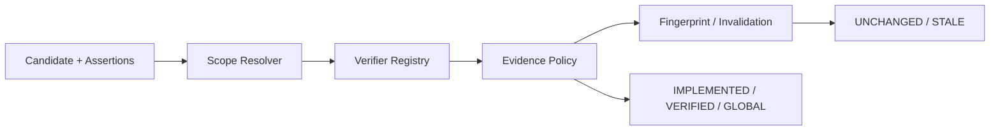

# P3 Gate 技术规格

**状态**：Approved  
**日期**：2026-08-02  
**范围**：CKL-301～CKL-305 的里程碑验收

## 1. 问题与目标

P3 各模块的单元测试不能证明跨模块装配仍保持生命周期、Scope 和 Evidence 不变量。Gate 必须以固定输入验证：代码证据只到 IMPLEMENTED、关联测试到 VERIFIED、项目隔离、GLOBAL 晋升门槛，以及相关变化导致 STALE 且正文保留。

## 2. 方案

使用一个版本化 Golden Fixture 描述期望状态，并由 Node Gate 串联真实模块、内存 typed Probe 和确定性 ProjectContext：

Probe 只返回 Fixture 中声明的观察事实，不读取本机源码。Gate 对最终 status、transitionPath、effectiveScope、Evidence source、项目隔离和 preserveBody 做精确断言。

## 3. 备选方案

### A. 单一跨模块 Golden（采用）

优点：覆盖装配边界、结果可审计、执行稳定。缺点：Fixture 更新需要理解完整链路。

### B. 每模块独立 Gate

优点：定位简单。缺点：与现有单元测试重复，无法发现 Project/Scope/Evidence 之间的错绑，因此不采用。

### C. 扫描当前真实仓库

优点：更接近生产 Adapter。缺点：受工作区变更和工具版本影响，不能作为确定性 CI Gate；留给后续 Adapter 集成测试。

## 4. 成功指标

| 指标 | 目标 | 测量方式 |
|---|---:|---|
| 生命周期场景 | 5/5 精确通过 | Golden expected JSON |
| 项目串用 | 0 | cross-project 负向断言 |
| ERROR 误晋升 | 0 | failing Probe 场景 |
| 正文保留 | 100% | STALE 前后 body 比较 |
| 全仓回归 | 100% | `npm run check` |
| 供应链高风险 | 0 | npm 官方 audit |

## 5. 风险与缓解

| 风险 | 严重度 | 可能性 | 缓解 |
|---|---|---|---|
| Fixture 自己构造无效 Evidence | 高 | 中 | 所有 Evidence 必须经过 Registry 生成 |
| GLOBAL 项目计数无来源 | 高 | 中 | 使用 VerifiedProjectEvidenceRef，包含 source/time |
| Gate 依赖本机仓库状态 | 中 | 中 | ProjectContext 和 Probe 固定，不扫描代码 |
| 只测正向路径 | 高 | 中 | 增加跨项目、ERROR、GLOBAL 不足和不相关变化负向断言 |
| Gate 演变为重复单元测试 | 中 | 低 | 只断言跨模块最终行为与追溯链 |
