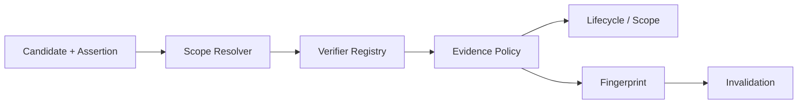

# P3 Gate 验证报告

**状态**：Passed  
**日期**：2026-08-02  
**设计依据**：[P3 Gate 技术规格](p3-gate-design.md)

## 1. Gate 范围

P3 Gate 验证 CKL-301 至 CKL-305 的跨模块不变量：Project Identity、最小 Scope、typed Verifier、Evidence Policy 和指纹失效必须在同一条链路中保持一致。它不重复单模块测试，也不把 Fixture 里的模型结论当成 Evidence。

## 2. 验证方案与取舍

Gate 采用版本化 Golden Fixture 和确定性 typed Probe，真实串联五个 P3 模块。相比“每模块各自再测一次”，该方案能发现 Scope/Evidence/Project 错绑；相比扫描当前工作区，它不受本机代码变化和工具版本影响。真实代码扫描留给后续 Adapter 集成测试。

Fixture 位于 `fixtures/p3/v1/expected.json`，Gate 位于 `scripts/p3-gate.test.mjs`。所有正向 Evidence 都由 Verifier Registry 产生，不允许测试直接构造一个伪造的 SUPPORTS Evidence。

## 3. 生命周期与 Evidence 结果

| 场景 | 期望 | 实际 |
|---|---|---|
| IMPLEMENTATION + SYMBOL_EXISTS | 最高到 IMPLEMENTED | IMPLEMENTED，迁移路径为 `[IMPLEMENTED]` |
| EXPERIENCE + SYMBOL_EXISTS + TEST_PASSED | 可到 VERIFIED | VERIFIED，迁移路径为 `[IMPLEMENTED, VERIFIED]` |
| Probe 抛错 | 不得视为反证或支持 | ERROR 被隔离，保持 PROPOSED，不发布 |
| 不足两个项目的 GLOBAL 请求 | 降级并询问 | PROJECT + ASK_USER |
| 两个项目的结构化验证引用 | 可晋升 GLOBAL | GLOBAL，并纳入跨项目 Evidence ID |
| 相关目标发生变化且无法复验 | STALE 且保留正文 | STALE，`preserveBody=true` |
| 不相关文件变化 | 不失效 | UNCHANGED |

## 4. 项目隔离

Gate 对两类串用分别做负向断言：Candidate 的 Project hint 与当前 ProjectContext 冲突时，Scope Resolver 直接拒绝；Project A 的 Scope/Evidence 被拿到 Project B 执行策略时，Evidence Policy 失败关闭为 PROJECT、不发布，并输出 `INVALID_EVIDENCE_POLICY_INPUT`。

GLOBAL 晋升不接收裸项目 ID。Fixture 使用带 `subjectKey`、`evidenceId`、`sourceRef` 和 `observedAt` 的 `VerifiedProjectEvidenceRef`，确保“在哪两个项目验证过”可以回溯到具体观察事实。

## 5. 失效闭环

Gate 从 FILE_CONTAINS Assertion 创建目标级 Fingerprint。变化 `src/unrelated.ts` 时保持 UNCHANGED；变化目标 `src/order.ts` 且没有有效复验结果时，从 VERIFIED 合法迁移到 STALE。Candidate body 在失效前后逐字一致，证明失效操作只降级可信状态，不销毁人可读知识。

## 6. 验证结果

| 指标 | 目标 | 结果 |
|---|---:|---:|
| Golden Gate | 全部通过 | 3/3 测试，覆盖 7 个组合场景 |
| ERROR 误晋升 | 0 | 0 |
| 项目串用成功 | 0 | 0 |
| STALE 正文保留 | 100% | 100% |
| 模块测试 | 100% | 342/342，29 个 Test Files |
| 架构/Gate 测试 | 100% | 38/38 |
| 整体覆盖率 | 不回退 | Lines 96.97%、Branches 90.36% |
| 供应链高风险 | 0 | npm 官方 registry：0 vulnerabilities |

专项测试在本机单独执行约 10ms；全仓并行执行时各测试约 16ms、2ms、3ms。该数据仅用于发现确定性策略数量级退化，不代表真实 Git/测试 Adapter 延迟。

## 7. 风险与后续边界

| 风险 | 严重度 | 缓解与剩余边界 |
|---|---|---|
| Adapter 观察事实不可靠 | 高 | Registry 保证结构和绑定；真实 Adapter 准确率需单独集成测试 |
| GLOBAL 证据跨主题复用 | 高 | `subjectKey` 绑定；后续持久层继续建立唯一约束 |
| 工作区变化导致知识大面积 STALE | 中 | 当前为目标级精确变化；CKL-403 批处理需保持相同语义 |
| Markdown 手工修改绕过状态机 | 高 | P4 Repository 必须 Schema 校验、保留上一有效版本并审计恢复 |
| Shadow Mode 自动确认质量未知 | 高 | P4 Gate 建立错误自动确认率评估，未低于 1% 不进入 P5 |

## 8. 结论

P3 Gate 通过。代码/测试 Evidence 的状态上限、最小 Scope、项目隔离、GLOBAL 晋升和 STALE 正文保留已经形成确定性闭环，可以进入 P4 Markdown/SQLite 知识库；仍未安装 Hook、启动 Daemon 或修改 `~/.ckl`、`~/.codex`、`~/.ccm`。
