# P4 Gate 设计：知识沉淀 MVP

**状态**：Implemented  
**最后更新**：2026-08-02

## 1. Gate 目标

P4 Gate 不新增生产能力，只验证 P0～P4 已交付模块能形成以下闭环：

```mermaid
flowchart LR
    Conversation["模拟 Codex 对话"] --> Episode["Episode"]
    Episode --> Candidate["Knowledge Candidate"]
    Candidate --> Scope["Scope Resolver"]
    Scope --> Evidence["Verifier Registry"]
    Evidence --> Policy["Evidence Policy"]
    Policy --> Markdown["人可读 Markdown 权威源"]
    Markdown --> SQLite["SQLite/FTS 投影"]
    SQLite --> Rebuild["删除后从 Markdown 重建"]
```



Gate 回答三个问题：可发布知识是否真的来自对话且经过代码证据门禁；SQLite 是否可以无损删除重建；Shadow Mode 的错误自动确认率是否低于 1%。

## 2. 方案与替代项

| 方案 | 问题 | 决策 |
|---|---|---|
| 只分别运行各模块单测 | 无法发现跨模块字段/状态不兼容 | 拒绝 |
| 直接构造最终 KnowledgeAsset | 绕过对话、编译和证据链 | 拒绝 |
| 真实调用远端模型 | 不确定、慢、不可离线复现 | 拒绝 |
| 固定对话 + 确定性模型 Port + 真实领域/存储模块 | 可复现且覆盖完整边界 | 采用 |

模型 Port 只替代外部生成服务，其输出仍必须通过真实 Extraction Schema、Candidate materialization、Scope、Verifier、Policy、Markdown 和 Registry。

## 3. Shadow Dataset

`fixtures/p4/v1/shadow-dataset.json` 固定 500 个用例：200 个有充分代码/测试证据的正例，以及 UNKNOWN、REFUTED、ERROR 各 100 个负例。每例都运行真实 Verifier 与 Evidence Policy。

定义：

```text
incorrect_auto_confirmation_rate =
  shouldPublish=true 且 expectedShouldPublish=false 的数量 / 所有 expectedShouldPublish=false 的数量
```

Gate 要求负例至少 300、总数至少 500、错误自动确认率 `< 1%`。Shadow Runner 不调用 Publisher，因此可见写入必须为 0；`shouldPublish` 只用于离线评估策略若启用后的行为。

## 4. 等价重建判定

删除 Registry 数据库前后比较规范化快照：

- 当前 KnowledgeAsset、tombstone 状态；
- 每个 immutable version 的资产内容；
- Relation 与 Evidence 边；
- FTS 对固定关键词的召回 ID。

`indexVersion` 是投影运行序号，不属于业务等价性比较。

## 5. 风险与门禁

- Fixture 不能只断言数量，必须断言对话来源 Episode、证据 ID、状态和可读 Markdown 内容。
- Shadow 正例与负例都必须存在，防止“全部不发布”伪造低误确认率。
- ERROR 不能被当作 UNKNOWN 的支持证据。
- 测试只写系统临时目录，并在结束时删除；不修改 `~/.ckl`、Codex、CCM 或业务仓库。
- 若任一 Gate 失败，P5 保持未开始。

## 6. 性能与可观测指标

- 固定报告总样本、正负例、false positive、false negative、错误自动确认率和 Shadow 写入数。
- 记录完整测试数量、覆盖率、Workspace 边界和供应链审计。
- 500 例为正确性回归集，不作为吞吐 benchmark；后续算法变化必须复跑同一版本 Fixture。
