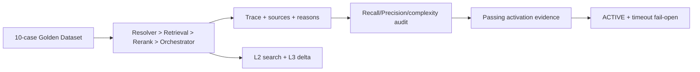

# P5 Gate 验收报告

**状态**：Passed  
**里程碑**：P5 混合召回与可控注入  
**验收日期**：2026-08-02

## 1. 验收范围

使用 `fixtures/p5/v1/retrieval-golden.json` 的 10 个固定 Case，执行 QueryContext → FTS/RRF → Rerank fallback → L2 Context Orchestrator → Retrieval Trace → Golden Dataset Runner。随后以报告生成的配置 SHA-256 激活测试内 Rollout，验证 UserPrompt 注入/timeout；并验证 MCP L1/L2→L3 增量与项目隔离。

## 2. Gate 结果

| Gate | 结果 | 结论 |
|---|---:|---|
| Recall@5 | 100% | ≥90%，通过 |
| Precision@5 | 100% | ≥80%，通过 |
| Traceability | 100% | 每个最终结果含通道贡献、Rerank 原因、Evidence 与 Episode 来源 |
| Scope leak | 0 | 项目 B 资产未进入主动注入或 MCP 输出 |
| Forbidden hits | 0 | 通过 |
| Envelope P95 | ≤800 tokens | 默认预算内，通过 |
| Over-budget | 0 | 通过 |
| 自动 L4 | 0 | 通过 |
| 缺失复杂度解释轴 | 0 | risk/ambiguity/conflict/budget 完整 |
| UserPrompt timeout | 空 stdout | 原 prompt 继续，失败开放 |
| MCP L1/L2→L3 | 通过 | Get 只返回 content/evidence 增量，不重复 L2 |
| MCP 与主动注入故障隔离 | 通过 | 双向无包依赖 |

## 3. 运行证据

- P5 Gate 专项：2/2。
- 全仓：491/491 module tests、43/43 architecture/Gate tests。
- Workspace/import policy：29 workspaces 通过。
- 整体覆盖率：Lines 97.04%、Branches 90.16%、Functions 98.77%。
- npm 官方 registry：0 vulnerabilities。

## 4. Review 与边界

Gate 激活 Evidence 来自同一次报告的 dataset ID/version/config SHA-256；未通过完整 Gate 无法进入 ACTIVE。测试同时覆盖 ACTIVE JSON 契约、500ms 内部 deadline 的 timeout 空输出、MCP project Scope 和 L1/L2 两种起点的 L3 增量。

当前 Golden Source 是仓库内确定性 Fixture，用于证明算法契约、门禁和可复现回归，不代表真实团队知识分布的生产质量。P5 Gate 授权进入 P6 实现闭环验证，但不授权修改 `~/.codex`/`~/.ccm`、安装 Hook、启动 daemon 或将真实 rollout 切到 ACTIVE；部署前仍需在目标项目 Shadow Dataset 上重新生成 Evidence。

## 5. 结论

P5 五项 Gate 全部满足，可以进入 P6。主动注入和 MCP 按需展开已经形成两条相互独立、Scope 受控且可追溯的知识输入路径。
