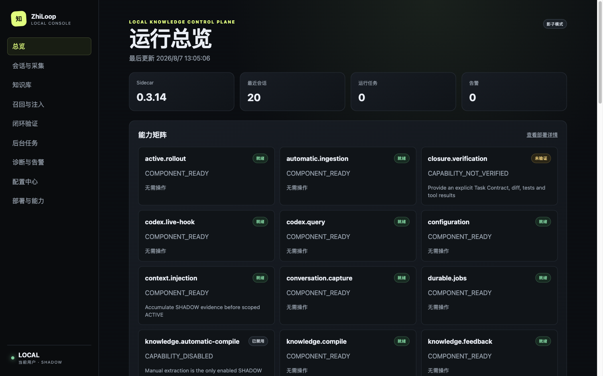
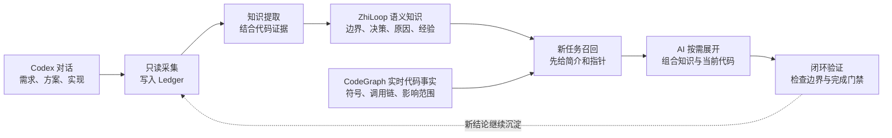
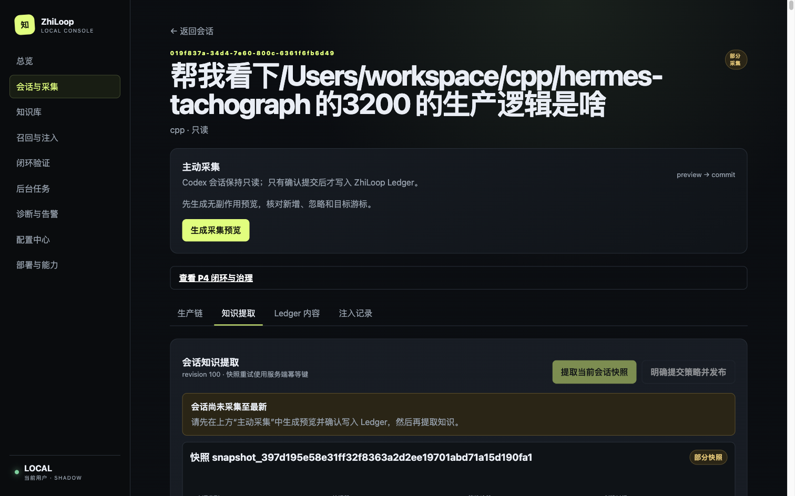
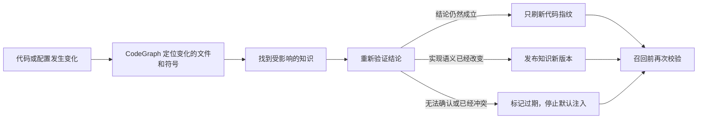
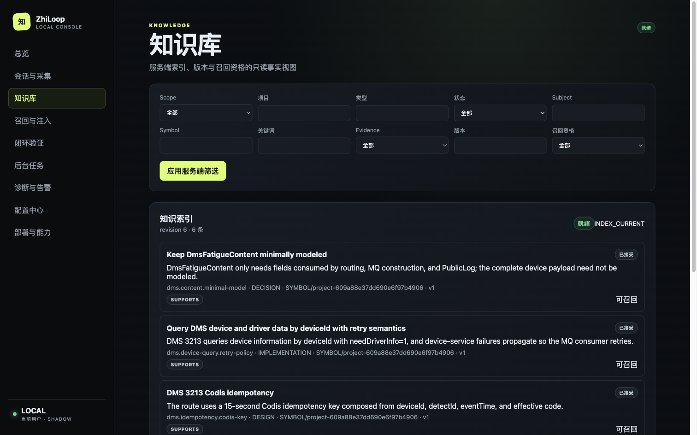
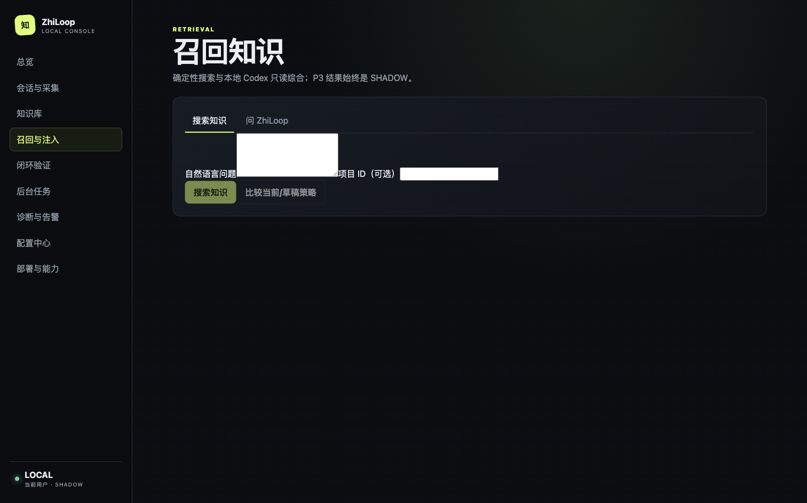

# ZhiLoop（知环）：让对话沉淀为知识，让知识回到任务

> 一份面向首次接触者的产品介绍。先理解它解决什么问题、怎样工作，以及当前能做什么。

## 为什么需要 ZhiLoop

我们与 Codex 讨论代码时，不只是产生聊天记录，还会产生很多有长期价值的内容：

- 需求边界：什么必须做，什么明确不做；
- 技术方案：为什么选择某种实现，替代方案有什么问题；
- 实现语义：已经具备什么能力、为什么这样实现；
- 实践经验：踩过什么坑，下一次怎样更快完成。

这些结论通常散落在历史会话里。新任务开始后，AI 不知道它们曾经存在，人也很难记住在哪段对话中，于是同一个问题被反复解释、同一个决策被重复推演。

**ZhiLoop 是位于 Codex 与本地知识之间的一层“知识循环系统”**：它在后台沉淀对话，把有效结论整理成可追溯知识；新任务需要时，先提供少量知识线索，再由 AI 按需展开详情。

*运行总览集中展示版本、工作模式、会话、后台任务、告警和各项能力是否可用。*

## 一条完整链路

这条链路包含五项核心能力：

| 能力 | 它做什么 | 用户能看到什么 |
|---|---|---|
| 对话采集 | 只读读取 Codex 会话，脱敏后记录事件 | 会话列表、采集预览、Ledger 正文和游标 |
| 知识提取 | 从对话中识别需求、设计、决策、实现和经验 | 提取阶段、候选知识、失败原因和来源证据 |
| 分层治理 | 按任务、符号、模块、项目、全局等范围保存和版本化 | 状态、适用范围、版本、来源与修改记录 |
| 召回与注入 | 召回语义知识，并按需结合 CodeGraph 当前代码事实 | 召回结果、事实来源、注入内容与审计轨迹 |
| 闭环验证 | 任务结束前核对边界、门禁和实现证据 | 验证结论、未完成项和后续处理记录 |

## 从一次会话到可复用知识

ZhiLoop 不会把“Codex 的每一句回复”直接当成知识。会话原始事件先进入不可变的 **Ledger**，之后才经过快照固化、候选生成、策略确认和知识发布。只有通过策略与证据门禁的候选，才会成为可召回知识。

*在会话详情中，可以预览即将写入 Ledger 的脱敏内容，也可以查看知识提取的阶段、候选结果及来源。*

ZhiLoop 不把符号位置、方法签名和调用链等可从代码重新计算的内容复制成长期知识。它主要保存业务边界、决策原因、兼容策略和实践经验，并用 CodeAnchor（代码查询指针）指向相关代码。知识采用两种互补的存储方式：

- **Markdown** 保存人能直接阅读和修改的知识正文；
- **SQLite 与检索索引** 保存元数据、范围、版本、状态、来源关系和召回所需索引。

因此，每条知识既便于人查看和治理，也能被机器稳定召回。知识与原始会话、Turn、事件、代码证据之间保留来源关系，出现疑问时可以一路追溯。

### ZhiLoop 与 CodeGraph 的分工

CodeGraph 更擅长回答“代码现在是什么”：方法在哪里、谁调用它、修改后影响什么。ZhiLoop 更擅长回答“为什么这样做”：用户确认了什么边界、为什么选择这个方案、哪些兼容条件不能破坏，以及这些结论来自哪次对话。

因此，目标架构不会再建设一套代码图谱，也不会长期保存 CodeGraph 查询结果。新任务需要代码细节时，ZhiLoop 提供历史语义和 CodeGraph 查询指针，再实时取得当前代码事实：

| 内容 | 由谁负责 |
|---|---|
| 符号、签名、调用链、影响范围 | CodeGraph 实时查询 |
| 需求、业务边界、决策原因、经验 | ZhiLoop 沉淀和版本治理 |
| 历史结论是否仍符合当前代码 | ZhiLoop 结合 CodeGraph 与测试验证 |
| 哪些内容应进入 Codex 上下文 | ZhiLoop 按任务和预算编排 |

### 代码修改后，知识怎样保持新鲜

代码改变不代表所有知识都要重新生成。ZhiLoop 会根据 CodeAnchor 找出真正受影响的知识，只复验相关结论：

| 变化情况 | ZhiLoop 的处理 |
|---|---|
| 只修改日志、格式或局部变量，原结论仍成立 | 不调用模型，只刷新代码指纹和验证时间 |
| 方法重命名，但可以确定是同一能力 | 更新代码指针并保留重命名证据 |
| 同步实现改成异步，原知识正文已经不准确 | 生成并验证新版本，旧版本标记为“已替代” |
| 方法被删除、断言被否定或无法确认 | 标记为“已过期/待复验”，立即退出默认代码事实注入 |

后台变化检测之外，知识准备注入 Codex 前还会再检查一次当前 CodeGraph revision。即使文件监听漏掉了一次变化，也不会把已知的旧代码事实当成当前事实使用。

非代码知识不会使用统一的过期时间：用户需求在出现新表态时产生新版本；配置和依赖跟随对应文件变化；外部时效信息到期后必须重新获取；实践经验则根据后续任务反馈调整适用范围。

这项 CodeGraph 联邦检索与知识保鲜能力已经完成架构设计，当前版本尚未接入生产运行时；现有代码指纹、失效状态和版本治理是其实施基础。

*知识库支持按关键词、项目、范围、类型和状态筛选；不满意的知识可以修改、停用或移除。*

## 新任务怎样使用这些知识

新任务出现后，ZhiLoop 会根据当前问题、项目和代码上下文搜索相关知识。它不会一开始就把所有正文塞进上下文，而是采用渐进式方式：

1. 先提供少量边界、门禁、已有能力和知识简介；
2. AI 判断某条知识确实相关后，再展开正文、证据和版本信息；
3. 涉及代码时，再实时查询 CodeGraph，并明确区分“历史决策”“当前代码事实”和“二者是否一致”。

这样既能降低遗漏，也能避免上下文随着知识库增长而无限膨胀。用户还可以在“召回与注入”页面直接用自然语言搜索知识，或让本地 Codex 对召回结果进行只读综合。

*召回页支持限定项目，并可比较当前策略与草稿策略；当前结果保持 SHADOW，不会在未授权时自动影响 Codex。*

## 一个真实例子

在真实验收会话 `019f837a-34d4-7e60-800c-6361f6fb6d49` 中，ZhiLoop 完成了：

- 沉淀 98 条会话事件、49 个 Turn；
- 从对话中生成 8 条候选知识；
- 经策略与证据检查后，发布 6 条可召回知识；
- 使用关键词搜索和本地 Codex 问答成功找回相关结论；
- 保留从召回结果到知识版本、提取快照和原始会话的追溯关系。

下一次遇到相似任务时，AI 可以先知道“已有相关能力和边界”，需要时再读取具体方案与证据，不必让人重新讲一遍背景。

## 为什么不只用一种更简单的方式

| 方式 | 优点 | 单独使用时的问题 |
|---|---|---|
| 全量注入历史对话 | 实现直接 | 噪声多、成本高，上下文会持续膨胀 |
| 只做向量 RAG | 召回速度快 | 人难以直观看懂相关性，版本与治理能力不足 |
| 只维护 Markdown | 清晰可读 | 依赖人工整理，容易遗漏、过期，召回不稳定 |
| 只使用 CodeGraph | 当前代码结构准确 | 无法保存需求边界、决策原因、对话承诺和历史版本 |
| ZhiLoop 的组合方式 | 可读、可治理、可追溯，并支持按需展开 | 系统稍复杂，但能形成自动沉淀与使用闭环 |

ZhiLoop 选择 **Ledger + Markdown + SQLite + CodeGraph 实时代码事实 + 渐进式注入**，不是为了保存更多内容，而是为了让少量、正确、可验证的内容在合适的时候出现。

代码知识现在采用双保险：UserPrompt 建立 Git baseline，Stop 后由后台生成 ChangeSet 并用 CodeGraph 复验受影响断言；真正注入前再检查对应知识版本的 Freshness。代码变化但结论仍成立时只更新验证状态，结论冲突或无法确认时旧正文保留用于追溯，但退出当前代码事实注入。

## 当前安全边界

- Codex 会话保持只读，采集遵循“预览 → 确认写入”；
- 默认运行在 **SHADOW（影子模式）**，召回和注入决策可观察，但不会未经授权改变 Codex 上下文；
- 实际注入必须同时满足 ACTIVE 资格和灰度门禁；
- 后台失败不会阻塞 Codex 的正常使用，并会展示阶段和失败原因；
- 配置已升级为可迁移的 v2；自动发布默认关闭，CodeGraph 不会被后台自动初始化；
- 每次提取、发布、召回、修改和闭环验证都保留审计信息。

## 怎样判断它真正有用

我们重点观察四件事：重复背景是否减少、知识是否能在正确项目中召回、答案能否追溯到原始证据、后台运行是否不干扰 Codex。`0.4.15` 已通过 60 个脚本级 Gate 与 1,711 项 Vitest 回归，本机仍以 READY/SHADOW、Candidate Preview 优先的安全模式运行。

**一句话总结：ZhiLoop 不是替人保存聊天记录，而是让 AI 从已经完成的工作中持续积累、在下一次任务中准确复用，并对结果进行闭环验证。**

> 分享提示：本文截图来自本机真实验收环境。若用于外部公开材料，请先替换其中可能涉及具体项目的示例内容。
