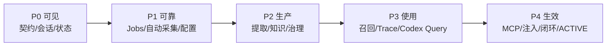
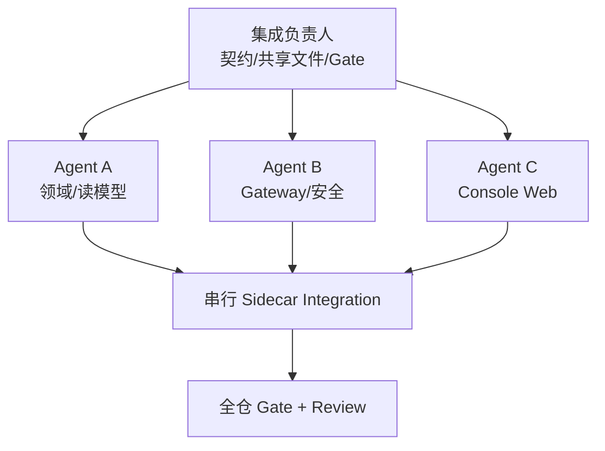

## Context

ZhiLoop 当前本地发行由 macOS 当前用户 Sidecar、Unix socket、Codex Hook、SQLite Ledger 和 CLI 组成，部署模式固定为 SHADOW。领域包已经覆盖知识编译、Scope、Evidence、Registry、召回、注入、MCP 和闭环，但部署 composition 只接通 Hook spool、Ledger 和指定会话 capture。

Console 需要同时面对三个约束：

1. 用户价值必须逐步可交付，不能等全部知识和 ACTIVE 链路完成后才看到界面。
2. Hook 是时延敏感且失败开放的关键路径，Console、查询和配置故障不得传导到 Hook。
3. 多 Agent 开发必须以稳定契约和目录所有权为边界，避免同时修改 Sidecar composition、数据库 migration、共享 Schema 和前端基础设施。

完整页面与安全设计见 `docs/design/zhiloop-console-tdd.md`。本设计重点定义实施优先级、依赖、并行边界和 Gate。

## Goals / Non-Goals

**Goals:**

- 按用户价值和硬依赖将工作排序为 P0～P4，P0 最高。
- 每个优先级形成可独立验收的纵向链，而不是只交付孤立后端或静态页面。
- 先冻结 Control API、状态、ID、分页、错误和安全契约，再允许 Gateway、Web 和领域模块并行。
- 明确单一 Owner 文件和阶段合并顺序，使最多三个实现 Agent 与一个集成负责人可以安全协作。
- 每个阶段执行 Contract、Module、Integration、Release 四层 Review 和自动 Gate。
- 保持 Sidecar 唯一写入者、SHADOW、fail-open、CCM 保留和不可变历史边界。

**Non-Goals:**

- 本 change 不在规划阶段直接开启 ACTIVE。
- 不提供远程访问、多人权限、中心同步或跨平台发行。
- 不保证 Console 视觉像素级复制 Codex，只保证相似的只读会话信息结构。
- 不把前端 disabled 状态当成后端能力实现。
- 不允许多个 Agent 并行修改 Sidecar composition、migration registry、共享配置 Schema 或根 lockfile。

## Decisions

### 1. 使用纵向优先级而不是按页面章节开发

优先级从高到低：

| 优先级 | 纵向结果 | 主要交付 | 硬依赖 |
|---|---|---|---|
| P0 | 真实状态和会话可见 | 契约、只读 Catalog、Gateway、Shell、总览、会话、诊断、capture 页面 | 无 |
| P1 | 无人值守采集和安全配置 | Durable Job、scan/follow/backfill、重试、SSE、基础配置激活和告警 | P0 |
| P2 | 会话能够变成可治理知识 | production worker、snapshot 提取、知识浏览、edit/suppress/restore、发布索引一致性 | P1 |
| P3 | 知识能够被自然语言检索和解释 | 混合召回、Trace、搜索、SHADOW Envelope、Codex 辅助问答 | P2 索引 |
| P4 | 知识真正参与 Codex 并形成闭环 | MCP、真实注入、Stop closure、feedback、ACTIVE eligibility/灰度/回滚 | P3 质量门禁 |

选择该方案是因为每一级都能产生用户可验证价值，并且与真实数据依赖一致。

**替代方案：**按总览、会话、知识、召回等页面逐页开发。拒绝，因为页面会依赖尚不存在的状态、任务或 Trace，容易产生假数据和重复 API。另一个替代方案是先组合全部后端再统一开发 UI；拒绝，因为交付周期过长，也失去通过 UI 验证中间链路的机会。

### 2. P0 先冻结版本化契约

`packages/control-api` 独占定义：

- Capability/Stage/Job/Injection 状态和稳定 reason code。
- session/turn/source sequence/snapshot/run/trace/knowledge version ID 关系。
- `/api/v1` 请求响应 Schema、cursor pagination、expected revision、idempotency key。
- SSE invalidation event，而不是复制业务正文的第二套事件协议。
- 脱敏 contract fixture 和版本兼容行为。

Gateway 和 Web 只消费该包，不自行复制 DTO。契约变更必须先通过 Contract Review。

**替代方案：**各 feature 自定义 API 后期统一。拒绝，因为多 Agent 会制造状态码、分页和错误语义分叉。

### 3. P0 拆成只读优先的 C1a/C1b

P0 内部合并顺序：

1. `P0a`：Control API、状态模型、Session Catalog、运维读模型。
2. `P0b`：Gateway 认证、Web Shell、总览、会话、任务/诊断的只读视图。
3. `P0c`：将现有 capture dry-run/commit 作为第一个受控写命令接入页面。

基础配置在 P0 先展示 effective value 和来源；真正激活移到 P1，避免配置消费者尚不存在时出现无效设置。

### 4. Session Catalog 与 Ledger 分离

Session Catalog 表示“Codex 来源中可发现”，Ledger 表示“ZhiLoop 已采集”。来源优先级为稳定 App Server 元数据（可用时）→ 版本化 transcript adapter fallback。Catalog 只读，不修改 Codex transcript、标题、归档或任务状态。

列表可使用有界轮询先交付；P1 再增加 SSE、增量 watcher 和断线恢复。这样实时基础设施不会阻塞 P0 会话可见性。

### 5. P1 建立 Durable Job 后再自动化

capture、scan、follow、backfill、extract、compile、index 和 replay 共用 durable job 语义：状态机、attempt、lease、checkpoint、幂等键、重启恢复、retryable 分类和有界取消。

Sidecar 是 job 和业务存储的唯一写入者。配置激活使用 prepare → apply → last-known-good rollback；只有已有消费者的字段可以激活，未来能力字段只保存草稿。

### 6. P2 先交付手动 snapshot，再接自动编译

一个会话的 snapshot 固定 transcript identity、source sequence、cursor、compiler version 和 policy hash。手动链路先完成：capture → snapshot → normalize → episode → compile → scope → evidence → candidate preview → policy commit → publish → index。

自动编译触发在该纵向链稳定后接入。此顺序比先实现复杂 watcher 更容易定位问题，也不要求工具事件和子 Agent 归并全部完成。

知识普通治理在 P2 开启：versioned edit、suppress、restore、supersede。GLOBAL、RULE、Binding 和 privacy purge 保留到 P4。

### 7. 发布、投影和索引使用一致性记录

Markdown 仍是已发布知识权威源。Registry current pointer、FTS/vector projection 和治理操作通过一个可恢复的 outbox/stage record 协调；任何阶段失败必须可重放，不能出现 UI 显示新版本而默认召回仍使用旧版本且无诊断的状态。

### 8. P3 先确定性召回，再调用本地 Codex

“搜索知识”先完成 Exact/FTS/Vector/Relation、Scope/Status 过滤、RRF/rerank 和 Retrieval Trace。Codex-assisted“问 ZhiLoop”只消费有界召回结果，以 read-only/ephemeral 进程返回结构化 answer/citations/unknowns/conflicts。

仅设置 `--sandbox read-only` 不足以构成完整隔离。实现还必须固定安全 cwd、最小环境、MCP/用户配置策略、超时、输出上限、并发和取消。Codex 不可用时降级为 search-only，回答不得自动写为知识。

### 9. P4 是唯一允许进入真实生效面的阶段

P4 串行组合 Injection/MCP、Closure/Feedback 和 ACTIVE rollout。SHADOW Trace 必须先达到质量门禁，ACTIVE eligibility 绑定 dataset、config fingerprint 和版本。单个布尔值不能开启 ACTIVE，灰度外任务绝不注入，回滚保持 effective revision 一致。

### 10. 多 Agent 使用包级独占和 Wave 合并

每轮最多三个实现 Agent，加一个集成负责人。

单一 Owner：根 workspace/lockfile、Control API、migration registry、Sidecar `application/transport/config`、配置 activation、Gateway auth、Web router/API client/global style、Markdown publish current pointer、ACTIVE rollout。

领域包、Gateway 和 Web feature 可以并行；Sidecar composition 与最终依赖更新必须串行。

## Priority Workstreams

### P0 Workstreams

- **Contract Owner**：`packages/control-api`、contract fixtures、协议 Gate。
- **Session Agent**：`packages/session-catalog` 和只读 transcript/App Server adapter。
- **Operational Agent**：`packages/operational-read-model`、`packages/observability`。
- **Gateway Agent**：`apps/console-gateway`，认证和只读 API。
- **Web Agent**：`apps/console-web` Shell、总览、会话、任务/诊断、部署能力。
- **Integration Owner**：Sidecar Control API、capture command、workspace/lockfile 和发布打包。

Contract 必须先合并。Session/Operational 可并行；随后 Gateway/Web 基于冻结 fixture 并行；最后串行 Sidecar 集成。

### P1 Workstreams

- Job/runtime：durable jobs、scheduler、checkpoint、retry。
- Ingestion：scan/follow/backfill、完整性检查、真实 Hook 验证。
- Configuration：revision、validate/diff/activate/history/rollback、alerts。
- Web：operations/configuration 页面和 SSE。

Job 状态机和配置 Schema 各由单一 Owner；Sidecar 最终组合串行。

### P2 Workstreams

- Knowledge Worker：组合现有 production packages，不直接修改 Sidecar。
- Governance：revision/suppress/restore/outbox 和 Registry 原子边界。
- Web：session extraction 与 knowledge features。

snapshot/ID 契约先冻结；publish/current/index 事务由单一 Owner。

### P3 Workstreams

- Retrieval/Trace。
- Codex Knowledge Query Adapter。
- Retrieval Web。

三者基于冻结的 Query/Answer Schema 并行，Sidecar 查询 composition 串行。

### P4 Workstreams

- Injection/MCP。
- Closure/Feedback。
- Shadow Evaluation/UI。

ACTIVE eligibility、Hook composition 和 rollback 必须由一个 Owner 串行完成。

## Gates and Success Metrics

每个优先级均执行：Contract Review → Module Review → Integration Review → Release Review。

| Gate | 目标 |
|---|---|
| P0 | 可发现主会话覆盖率 ≥99%；10 万事件列表 P95 <500ms；Overview P95 <300ms；Console 对 Hook P95 增量 <5ms；未授权/错误 Host/Origin/CSRF 100% 拒绝 |
| P1 | 重启无 job 丢失或重复副作用；配置失败 100% 保持 last-known-good；0ms busy loop 和无限重试不可配置；状态到 UI P95 <1s |
| P2 | snapshot 幂等；知识 100% 可反查 session/turn/event；suppress P95 <1s 退出默认召回；发布/索引故障可恢复 |
| P3 | Traceability 100%；Scope leak/forbidden hit 为 0；自动 L4 为 0；Codex 回答事实段 100% 带 knowledge version 引用 |
| P4 | 错误自动确认率 <1%；无需人工比例 ≥90%；递归 continuation 为 0；灰度外注入为 0；回滚 revision 一致 |

测试基础设施必须先把新增 workspace 纳入 coverage 白名单，禁止 `passWithNoTests` 掩盖新模块；增加 Console boundary、浏览器 E2E、可访问性、安全和串行性能 Gate。

## Risks / Trade-offs

- [P0 范围仍偏大] → 使用 P0a/P0b/P0c 独立合并和验收，先只读后写。
- [Codex transcript/App Server 变化导致目录不全] → 版本化 adapter、source capability、fallback 和覆盖率 Gate。
- [多 Agent 修改共享文件产生冲突] → 包级独占、共享文件单一 Owner、Wave 合并后统一 lockfile。
- [数据库查询锁竞争影响 Hook] → Sidecar 有界查询、投影、WAL、deadline，Console 高负载回归。
- [配置消费者不存在却激活] → capability-aware activation；可保存草稿但拒绝激活。
- [手动提取活跃会话遗漏后续内容] → 不可变 PARTIAL snapshot 和增量 snapshot。
- [Markdown/current/index 不一致] → outbox/stage record、幂等重放和显式 DEGRADED 状态。
- [Codex Query 被恶意知识提示注入] → 数据与指令分隔、结构化 Schema、安全 cwd/环境、禁写、引用验证。
- [页面状态领先于真实实现] → Capability API 为唯一来源；disabled 状态必须带 reason code。
- [新增 Web 工具链扩大依赖面] → 最小依赖、锁定版本、本地静态资源、统一依赖安装和审计。

## Migration Plan

1. P0 以新 Control API 版本和全新 Console 目录增量加入，不改变现有 Hook/capture transport 行为。
2. 每个优先级先在临时 Home 和 SHADOW 下运行，旧 CLI 保留为回滚与诊断入口。
3. 数据表只做向前兼容 migration；读模型和索引均可重建。migration 失败时 Sidecar 不切换新版本。
4. Console Gateway 先按需由 `zhiloop ui` 启动；稳定后再评估常驻。
5. P1/P2 组件通过 capability 和配置逐项启用，不做一次性大开关。
6. P4 ACTIVE 只在质量证据满足后灰度；失败自动恢复 SHADOW 和上一 effective revision。

回滚时停止 Gateway 不影响 Sidecar；Sidecar 升级失败继续使用现有不可变 release 和 manifest journal 回滚。知识 revision 不删除，suppress/restore 和配置 rollback 通过新 revision 表达。

## Open Questions

1. App Server 是否能提供稳定完整的本地会话目录；在验证前 transcript adapter 是必备 fallback。
2. P0 Web 是否使用 React/Vite 的最终依赖集合；在 Contract 冻结前不影响后端工作。
3. macOS 告警适配器是否进入 P1 首版；默认先实现控制台内告警。
4. 人工修改 Markdown 与 Console expected version 冲突时的交互细节；默认拒绝覆盖并要求刷新 diff。

