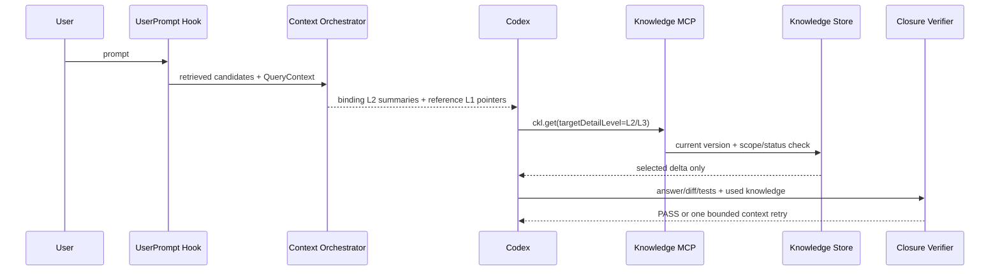

## Context

ZhiLoop 已有 L1-L4 Context Envelope、UserPrompt Hook、`ckl.search/get/related/check` 和闭环验证，但默认 Push 为统一的 L2，MCP 搜索也返回 L2，`ckl.get` 只能直接展开到 L3。真实链路模拟表明：候选已经召回时，统一 L2 会在 800-token 预算内牺牲知识广度；高风险统一 L3 会进一步放大这个问题。

本变更把 Skills 的渐进披露思想应用到动态知识召回：不是向模型展示全局静态目录，而是先检索出与当前任务相关的小型目录。强制门禁仍主动注入，参考知识由模型按需展开。

## Goals / Non-Goals

**Goals:**

- 首次 Push 优先覆盖知识广度，不批量携带参考正文或证据。
- `BINDING_RULE` 始终以至少 L2 摘要进入首次上下文，且不被普通参考项挤出。
- Codex 可以把单条知识从 L1 展开到 L2 或 L3，并通过关系继续探索。
- Push、Pull 和闭环使用相同的状态、Scope、版本和权限校验。
- 所有展开行为可追踪、可去重、可评估。

**Non-Goals:**

- 不自动注入 L4 原始会话。
- 不让模型自行改变知识 Authority、Scope 或状态。
- 不把全部知识资产注册成静态 Skill。
- 本变更不引入新的向量数据库或外部依赖。

## Decisions

### 1. 使用混合级别的首次 Envelope

默认自动编排以 L1 为基线：`RULE`、`REQUIREMENT` 映射为 `BINDING_RULE` 并提升到 L2；其他知识保持 L1。Envelope 的总体复杂度记录其所含条目的最高级别，每一项继续记录自己的 `detailLevel`。

候选顺序先比较 Scope，再比较 Authority，再比较状态和检索排名。选择阶段为最高优先级的 Binding Rule 保留槽位，确保它不会因参考实现的状态更高而被预算挤出。

**替代方案 A：全部 L1。** Token 最少，但模型可能未展开硬性需求；拒绝。

**替代方案 B：保持全部 L2/L3。** 初始信息更完整，但继续发生召回成功、预算裁剪；拒绝。

### 2. Pull 接口按目标深度返回差量

`ckl.search` 和 `ckl.related` 返回 L1 Pointer。`ckl.get` 增加 `targetDetailLevel`：

- L1 -> L2：返回适用边界、失败路径、符号和证据指针，不返回正文。
- L1/L2 -> L3：返回正文和证据摘要；从 L1 展开时同时补齐 L2 字段，使结果可独立理解。

结果必须包含 `id/version/fromDetailLevel/toDetailLevel`。版本不一致、状态不合格或 Scope 不匹配时返回空结果和诊断。

**替代方案：每次 `ckl.get` 固定返回 L3。** 接口简单，但只想确认边界时仍会加载正文；拒绝。

### 3. 注入中显式声明展开协议

`additionalContext` 增加稳定的 `progressiveDisclosure` 指令，说明何时使用四个 MCP 工具，并要求模型不得从简介推断未提供的实现细节。工具不可用时，Binding Rule 的 L2 摘要仍可保障最低门禁；参考详情按 fail-open 处理，不阻断原任务。

### 4. 风险不再自动把全部候选升级到 L3

高风险、歧义或冲突只强化 Binding Rule 的主动摘要，并在指令中要求模型在修改或下结论前定向展开相关知识。闭环验证可以对声明为 required 的知识触发一次有界 L3 增量，不重复整个 Envelope。

### 5. 兼容与迁移

`targetDetailLevel` 初期允许缺省；缺省保持旧行为 L3，避免现有调用方静默降低信息量。新注入提示和 ZhiLoop Skill 使用显式目标等级。完成一个兼容周期后再评估是否把缺省值改为 L2。

## Risks / Trade-offs

- [模型未展开相关参考知识] → 首次强制注入 Binding Rule；渲染明确展开条件；闭环根据 required knowledge 做一次定向补充。
- [简介数量仍超过预算] → 限制动态候选数量、按 Authority 保留门禁、允许后续 `ckl.search` 继续发现。
- [混合等级使复杂度含义模糊] → Envelope 总体等级定义为条目最高等级，真实深度以 item `detailLevel` 为准。
- [工具调用增加延迟] → 只获取被选择的 ID，支持 current/version 校验与 knownItems 去重；不增加 Hook 的 500ms deadline。
- [旧调用方不传目标等级] → 缺省 L3 保持兼容，文档和新调用显式传值。
- [Pull 绕过资格过滤] → Service 在每次 search/related/get 时重新读取 current 并复用 Scope/Status eligibility。

## Migration Plan

1. 先扩展 MCP 类型和 Service，保持 `ckl.get` 缺省 L3 兼容。
2. 更新 Orchestrator 为混合 L1/L2，并补齐 Authority 保留测试。
3. 更新 additionalContext 渲染协议和 ZhiLoop Skill。
4. 更新默认策略、ADR/TDD 与真实链路模拟。
5. 全量测试通过后发布；可通过配置把 defaultLevel 回滚到 L2，MCP 新参数保持向后兼容。

## Success Metrics

| 指标 | 目标 | 测量方式 |
|---|---:|---|
| 首次知识注入 P95 | 不超过 500 tokens | Retrieval Trace budget |
| Binding Rule 首次注入覆盖率 | 100% | 离线数据集断言 |
| 自动 L3 正文注入率 | 0% | Injection Trace |
| `ckl.get` 展开结果实际使用率 | 不低于 70% | Feedback/closure trace |
| 未展开导致的闭环重试率 | 低于 5% | Stop continuation metrics |
| Push/Pull Scope 违规 | 0 | 安全测试与诊断 |

## Open Questions

- 初始 Pointer 最大条数和 token 目标需要基于真实任务 Trace 调优；本次先沿用 800-token 硬上限并提高 Pointer 条目上限。
- 后续是否让 `ckl.get` 缺省目标从 L3 改为 L2，需要兼容周期数据后决定。
