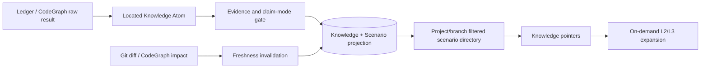

## Context

ZhiLoop 已有不可变 Ledger、Episode、Candidate、Scope/Evidence Policy、知识 Registry、Evolution、CodeGraph adapter、Freshness revalidation 和 L1-L3 渐进披露。当前断点是这些能力之间没有统一的定位契约：`ProjectContext` 虽包含 branch，但 Candidate/Asset 不保留权威分支与 commit；`applicability` 是自由文本；CodeGraph 只生成一次性 Evidence sourceRef，未保存可复用查询结果。

腾讯 Agent Memory 的 L0 Conversation → L1 Atom → L2 Scenario → L3 Persona、`store/update/merge/skip` 和“场景摘要常驻、详情按需读取”值得复用。ZhiLoop 面向代码事实，必须额外保证仓库/分支/提交隔离、代码证据新鲜度和不可变版本演进。

## Goals / Non-Goals

**Goals:**

- 每条新项目知识能回答“哪个项目、哪个分支/版本、哪个场景、哪个入口和哪些符号适用”。
- 场景具有稳定身份、版本和关系，可自动去重/更新，并对模糊合并 fail closed。
- CodeGraph 调用链、符号和影响结果成为可追溯、可复验、可复用的 artifact。
- 召回先执行确定性项目/分支门禁，再展示小型场景目录并按需展开。
- 旧知识可读、可迁移，但不会在定位未知时作为当前代码事实跨分支注入。

**Non-Goals:**

- 不替代 CodeGraph 的实时代码事实查询能力。
- 不把完整 CodeGraph 输出或完整场景文档默认注入每轮上下文。
- 不允许模型声明 repository、commit、CodeGraph revision 等权威坐标。
- 不自动合并语义相似但入口、分支或适用条件不同的场景。
- 不改写 Ledger 原始事件或历史知识版本。

## Decisions

### 1. Scope 继续表示权限边界，Locator 表示适用坐标

新增 `KnowledgeLocator`，包含项目坐标、观察版本、分支策略、`scenarioId/scenarioKey`、模块、符号、入口点、任务意图和正反适用条件。`KnowledgeScope` 继续负责 TASK/SYMBOL/MODULE/PROJECT/USER/TEAM/GLOBAL 的访问边界，避免把生命周期、版本和场景塞入 Scope union。

项目、remote、branch、commit 和 dirty 状态由 Git-backed `ProjectContext` 确定性补齐。模型仅输出 `ScenarioHint`，其中的场景 key、标题、入口和意图都属于候选数据；`scenarioId` 由 `projectId + scenarioKey` 确定性派生。

**替代方案 A：扩展 KnowledgeScope。** 会把访问边界与时间/适用性混合，影响所有 Scope 校验；拒绝。

**替代方案 B：只增加字符串标签。** 兼容简单，但无法执行分支门禁或稳定场景演进；拒绝。

### 2. 新项目知识要求 Locator，旧 schema 通过派生迁移

Candidate/Asset schema 升级但解析器继续接受 v1。新的项目级 Candidate 必须有可解析项目和场景；缺分支或 commit 时可以保存为 PROPOSED，但不得自动成为 `CURRENT_STATE` 代码事实。旧资产通过 scope、symbols、source episode 和当前项目身份生成迁移草稿，未经验证不直接补写权威坐标。

**替代方案：启动时批量猜测并覆盖旧知识。** 容易把当前 checkout 错当成历史采集版本；拒绝。

### 3. 场景是 Registry 内的版本化派生实体

在 Knowledge Registry SQLite projection 中增加 `scenarios`、`scenario_versions`、`knowledge_scenario_bindings` 和 `scenario_relations`。场景内容来源于已提交知识，不成为新的独立权威源；Ledger、Knowledge version 和 Evidence 仍是事实来源。场景 Markdown/卡片是可重建投影。

维护动作采用 `CREATE / UPDATE_VERSION / MERGE_VERSION / KEEP_SEPARATE / SUPERSEDE / CONTRADICT / SKIP`。相同稳定 key 或相同入口集合可确定性更新；相似度只产生候选关系，模型合并必须引用限定候选且任何边界冲突都保持分离或 PENDING。

**替代方案 A：每条知识内嵌场景文本。** 无法跨知识维护同一场景；拒绝。

**替代方案 B：独立外部场景服务。** 初期增加部署和事务复杂度；当前使用同一 SQLite 投影。

### 4. 召回采用硬定位过滤加渐进披露

QueryContext 增加 authoritative commit。检索先过滤 projectId、branch policy、commit compatibility、status 和 freshness；再按场景标题/意图/入口/符号与 prompt 计算场景候选；初始 Envelope 按场景分组展示卡片和知识 Pointer。只有 `ckl.get` 或闭环明确需要时才展开 L2/L3。

优先级为 `项目+兼容提交+场景+符号 > 项目+场景 > 项目 > 全局`。分支兼容无法判定时，当前代码事实 fail closed；规则/决策可按其显式策略处理。

**替代方案：对所有知识直接 BM25/向量检索。** 可获得召回率但无法保证适用边界；拒绝。

### 5. CodeGraph artifact 与知识摘要分层保存

新增 `CodeGraphArtifact`：操作类型、受限查询、规范化事实、project fingerprint、Git commit、index revision、source event、content hash 和观察时间。Evidence 引用 artifact ID；Knowledge body 保存面向模型的结论，不复制完整工具输出。

同一查询仅在项目指纹、commit、index revision 和依赖指纹兼容时复用。Git diff/CodeGraph impact 命中依赖后标记 artifact/knowledge 为 SUSPECT 并重新执行原查询；结果相同只刷新证明，结果变化产生 Knowledge 新版本并 SUPERSEDE 旧版。

**替代方案 A：只缓存自然语言结论。** 无法确定重用是否仍正确；拒绝。

**替代方案 B：每次都重新运行 CodeGraph。** 正确但重复成本高，也无法复用已确认的业务解释；拒绝。

### 6. Claim mode 决定证据语义

Candidate 新增 `claimMode`：`CURRENT_STATE`、`USER_DECISION`、`FUTURE_REQUIREMENT`。当前代码断言只验证 CURRENT_STATE；USER_DECISION 以可信的 USER_ACCEPTED 为主要证据；FUTURE_REQUIREMENT 中“当前代码尚未包含目标实现”映射为 `PENDING_IMPLEMENTATION`，而不是 REFUTED。无效或当前能力不支持的断言标记 `INVALID_ASSERTION`/`UNKNOWN`，不能降低为已反驳事实。

**替代方案：所有 Candidate 共用同一断言矩阵。** 已在 extra 方案中把未来决策误判为当前事实错误；拒绝。

### 7. 人可读场景卡片与数据库索引并存

SQLite 保存规范化数据和检索索引；Markdown 保存场景摘要、适用边界、演进关系和知识链接，便于人工审查。两者均从同一 outbox/知识版本重建，Markdown 不直接作为写入入口。

## Risks / Trade-offs

- [模型生成错误场景 key 或入口] → 权威项目坐标由系统补齐；key 规范化；入口必须由 Evidence/CodeGraph 或用户来源覆盖，否则保持 PROPOSED。
- [分支名称被删除或 rebase] → 同时记录 commit 和分支策略；以 commit ancestry/代码指纹为准，分支名仅用于解释。
- [场景数量继续增长] → 每项目/分支目录有上限，默认 UPDATE；重叠只建立关系，确定性相同才自动合并。
- [场景合并丢失边界] → 合并生成新版本并保留 `mergedFrom`；旧版本不可变且可回滚。
- [CodeGraph index 与 Git 不一致] → artifact 同时记录 Git commit 和 graph revision；任一缺失不作为新鲜当前事实发布。
- [旧知识召回下降] → 旧知识仍可手动搜索和查看；仅自动代码注入 fail closed，并提供定位补全任务。
- [Projection 迁移失败] → 新表为可重建派生数据；保留旧表和 Markdown，升级前备份，失败可回滚 runtime feature flag。
- [额外过滤降低召回率] → Trace 展示每个硬过滤原因，场景目录支持按需扩大到项目级搜索。

## Migration Plan

1. 先发布 schema/domain 和读兼容，默认只记录 locator，不改变召回选择。
2. 扩展 Git project identity、Compiler 和 Worker checkpoint，生成 v2 Candidate。
3. 增加场景/CodeGraph artifact projection，重放现有 Registry 构建场景迁移草稿。
4. 在 Shadow 模式启用定位过滤与场景目录，比较现有和新召回结果。
5. 使用真实会话重新提取，检查五条候选的项目、分支、场景、claim mode 和证据结果。
6. 通过回归和误注入指标后启用主动注入；可通过 feature flag 回退到旧检索，但不删除新数据。

## Success Metrics

| 指标 | 目标 | 测量方式 |
|---|---:|---|
| 新项目候选包含 project/scenario/claimMode | 100% | Compiler contract tests |
| 当前代码事实包含 branch+commit | 100% | Publication gate audit |
| 跨项目或不兼容分支自动注入 | 0 | Retrieval integration tests/trace |
| CodeGraph 结果在未变化版本的重复查询 | 降低 80% | Artifact reuse counter |
| 受影响代码知识进入复验 | 100% | Git diff/impact fixture |
| 无场景定位的代码事实自动发布 | 0 | Evidence policy tests |
| 初始场景目录超配置预算 | 0 | Renderer budget tests |
| 真实会话候选可从知识回溯到 turn/artifact | 100% | End-to-end report |

## Open Questions

- 第一版只实现 `EXACT_BRANCH`、`BRANCH_LINEAGE` 和 `ALL_BRANCHES`；`COMMIT_RANGE` 在出现真实需求后扩展。
- 跨仓库共享场景暂不自动合并，先通过 RELATED_TO 和全局规则表达。
- 语义场景仲裁继续使用可插拔端口；生产默认只有确定性动作自动执行。
